# Meta《数据库工程师（Python／数据库客户端／高阶数据建模／毕业项目／面试）｜Meta Database Engineer》中英字幕 - P46：45_抽象类和方法.zh_en - GPT中英字幕课程资源 - BV1pZ421a749

In this video， you'll learn about abstract classes and methods。If you have an abstract class。

 you can ensure the functionality of every class that is derived from it。For example。

 a vehicle could be an abstract class you can't create a vehicle， but you can derive a car。

 a tractor or a boat from a vehicle。😊，The methods we put in the abstract class are guaranteed to be present in the derived class because they must be implemented。

If a vehicle has a turn on engine method， then we assure that any method calls to a derived class that is looking for turn on engine will find it。

😊，This could be for reasons of interoperability， consistency。

 and avoiding code duplication in general。😊。

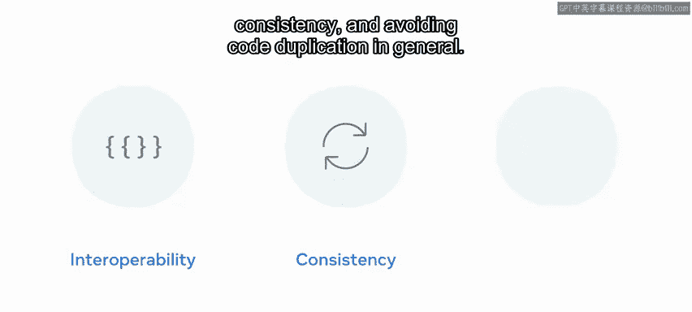

In object oriented programming， the abstract class is a type of class for which you cannot create an instance。

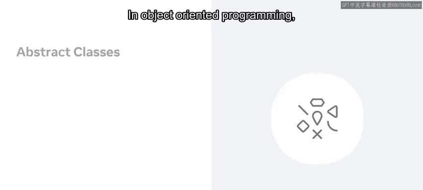

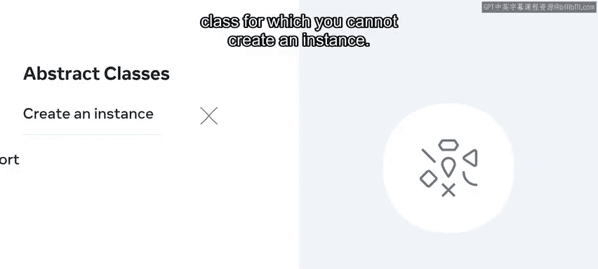

Python also does not support abstraction directly， so you need to import a module just to define an abstract class。

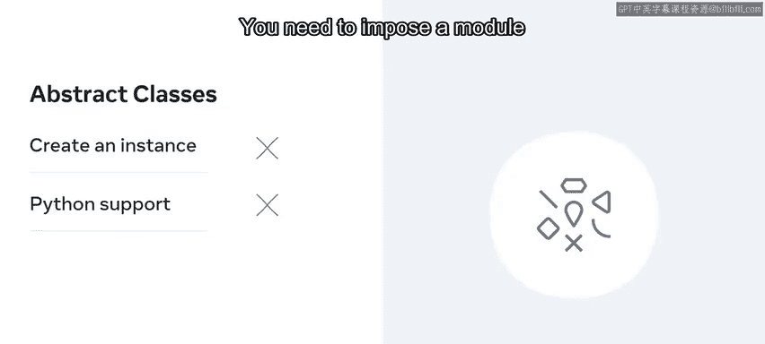

Furthermore， methods in an abstract class need to be defined before they can be implemented。😊。

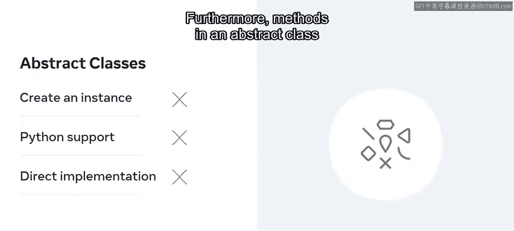

With all these limitations， one might wonder why you would use abstract classes at all。😡。

One of their key advantages is the ability to hide the details of implementation without sacrificing functionality。

😊。

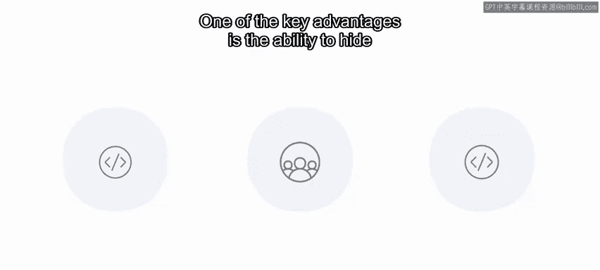

Implementation in abstract classes can be done in two ways One is that as base abstract classes lack implementation of their own。

 their methods must be implemented by the derived class。

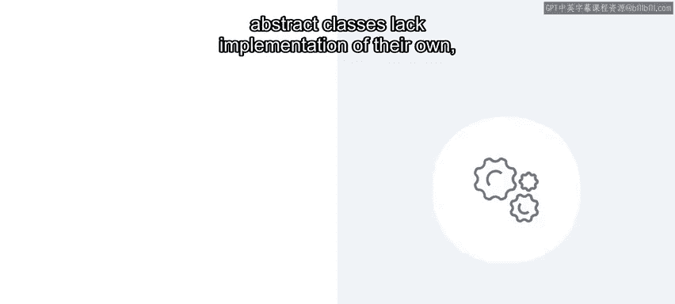

Another possibility is that the super function can be used， but that's a topic for another time。

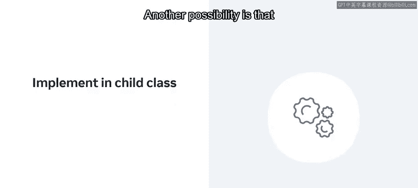

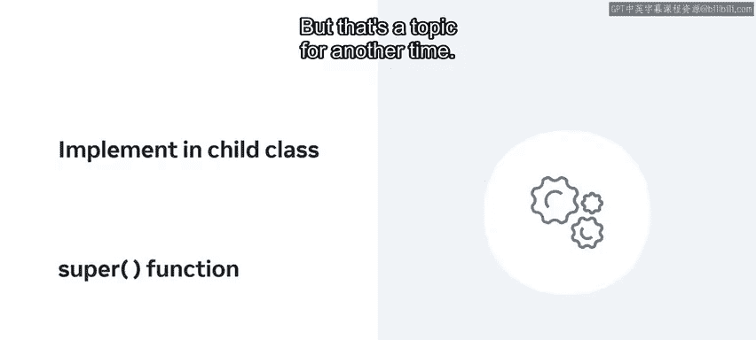

For now， let's focus on the module for defining an abstract class。

You may not be familiar with modules right now， but they will be covered in more detail later。

For now it's okay just to follow along。😊，The module is known as the abstract base class or ABC and needs to be imported with some code。

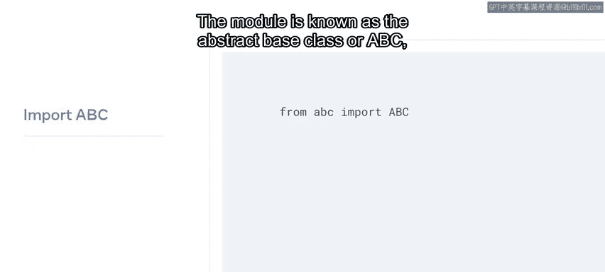

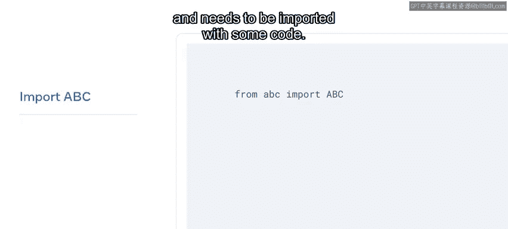

After that， you can create a class called some abstract class and pass in the ABC module so that it inherits that class。

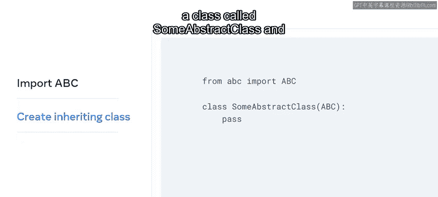

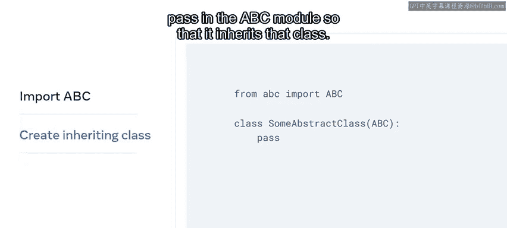

The next step is to import the abstract method decorator inside the same module。

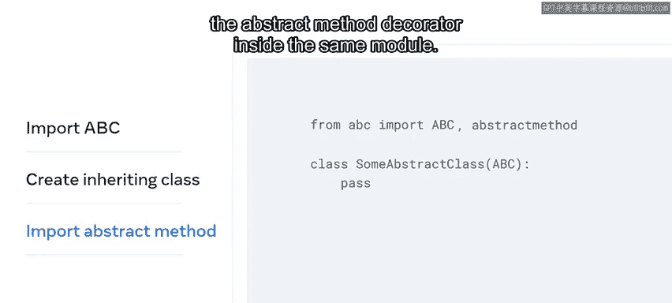

A decorator is a function that takes another function as its argument and gives a new function as its output。

😊，It's denoted by the at sign。😡，You may not be familiar with decorators。

 but for now it's enough to know that decorators are like helper functions that add functionality to an already existing function。

Finally， here you'll define an abstract method which cannot be called on an object of this class。

You will be able to call this method over objects of classes that inherit from this class。Similarly。

 we can define abstract methods with the help of what we call an abstract method decorator present inside the same module。

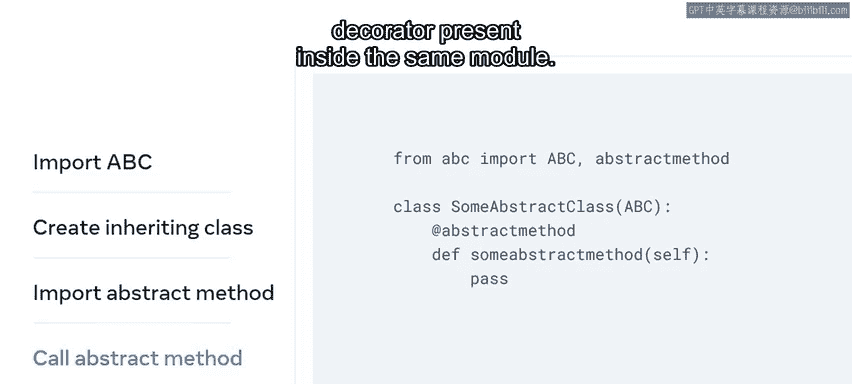

Any given abstract class can consist of one or more abstract methods。

However， a class that has abstract class as its parent cannot be instantiated unless you override all the abstract methods present in it first。

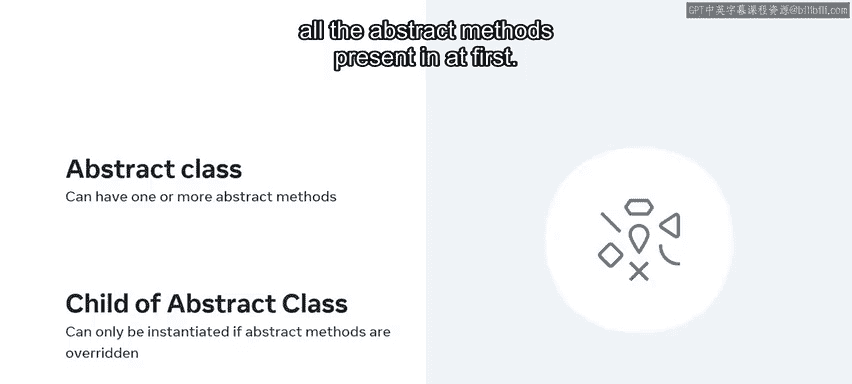

With that in mind， imagine a scenario in which an employer wants to collect donations from employees for a charitable cause。

With your newfound knowledge， let's write some code to make that possible。

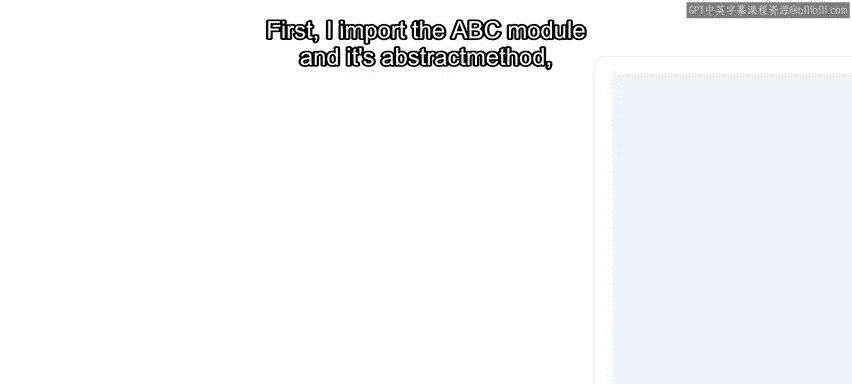

First， I import the ABC module and its abstract methods。

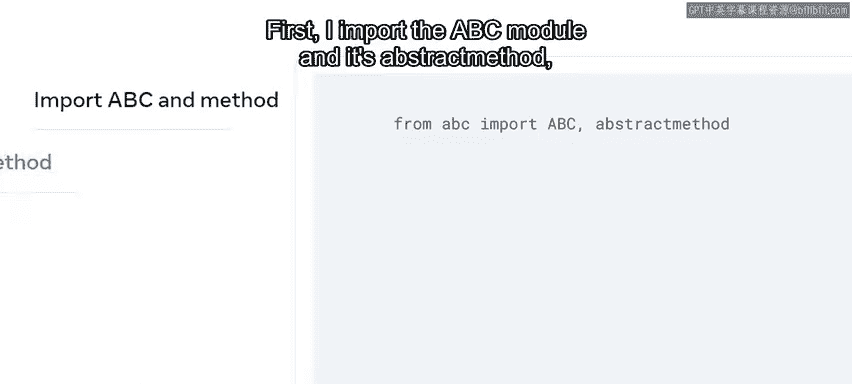

Then I create the employee abstract class that calls abstract method to define a method called Donate。

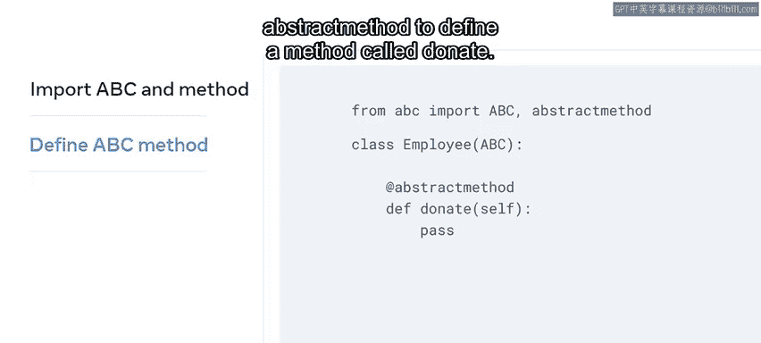

Knowe that there's no implementation for this method here。😊。

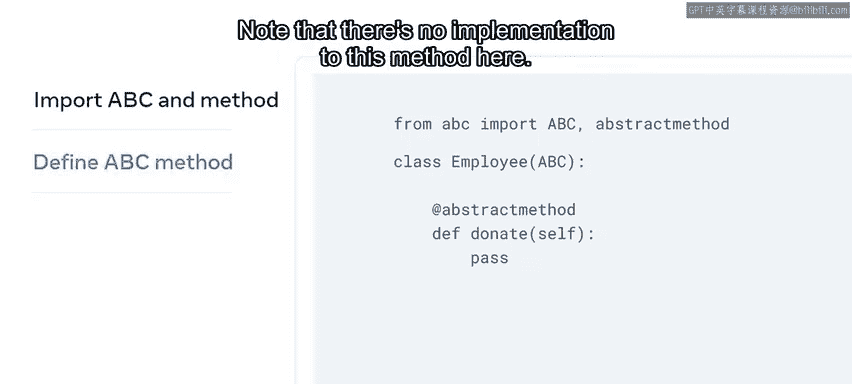

After that， I create the class donation which derive from the abstract class。

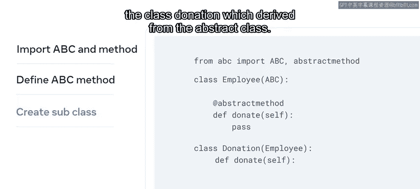

Note that this class also overrides the abstract method。

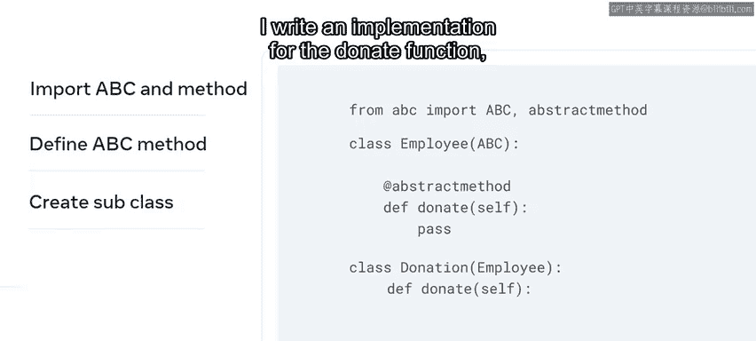

I write an implementation for the donate function， which takes a user input。

 stores it in variable A and returns it next I create two employee instances called John and Peter and call the function over each of them。

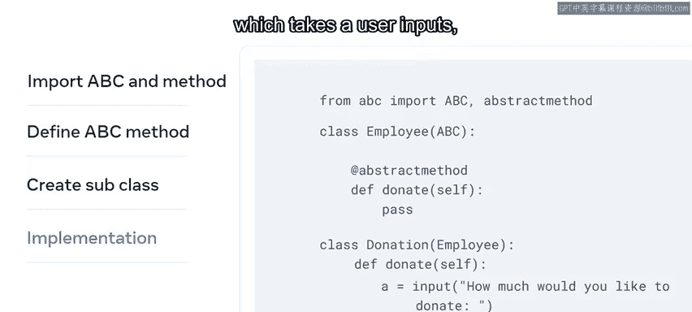

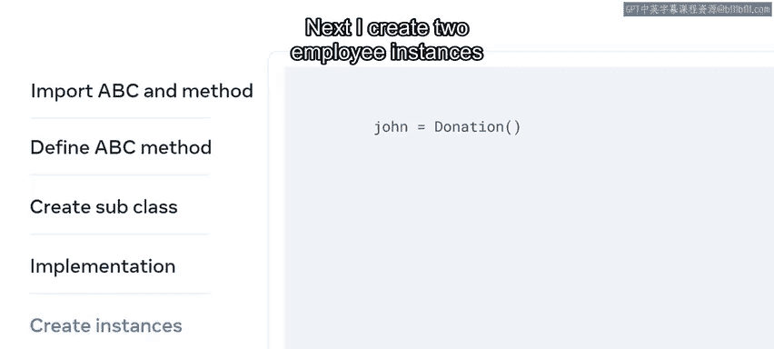

I also create a list amounts to which the returned values will be appended。

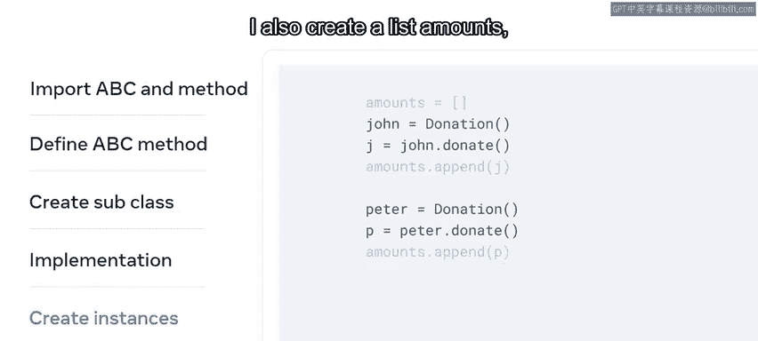

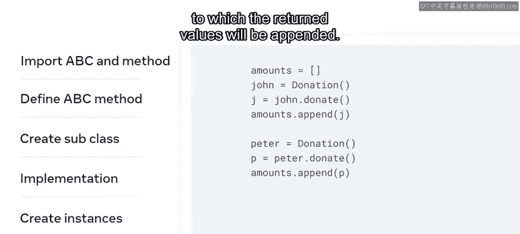

Finally， I have a print statement for amount which will give the value of the total donations from both employees。

In this video， you learned about abstract classes and methods and how to implement them in your code。

