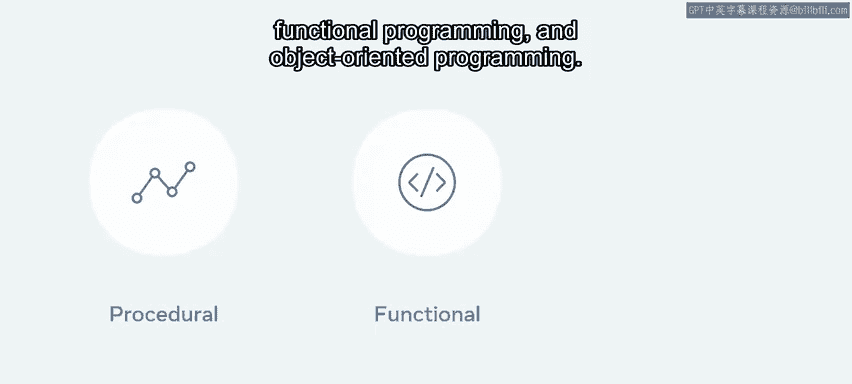
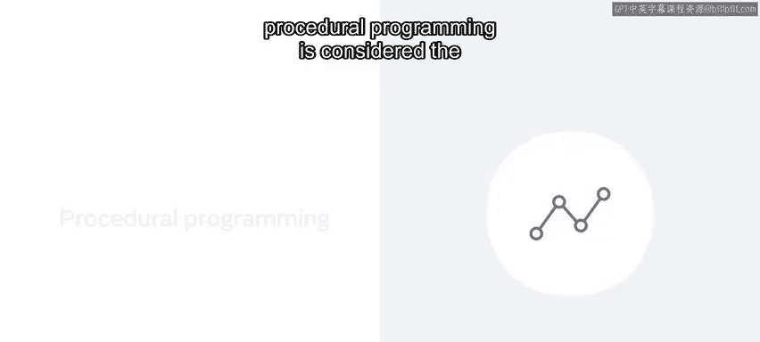
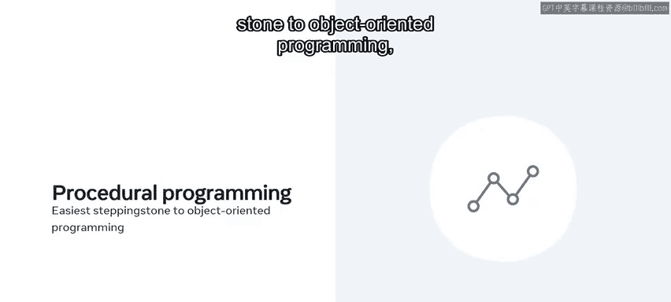
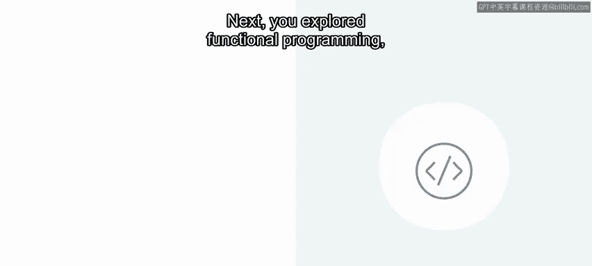
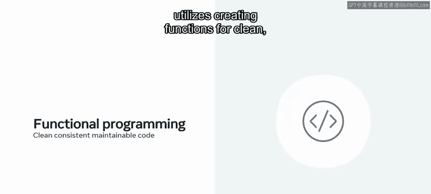
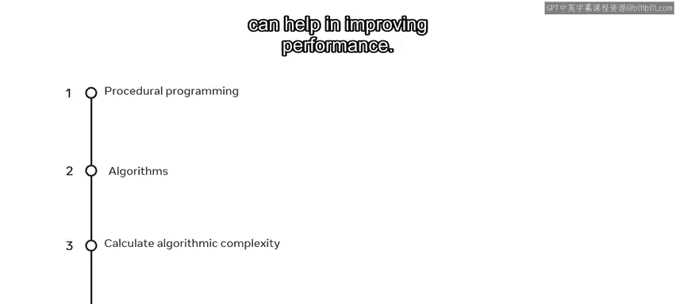
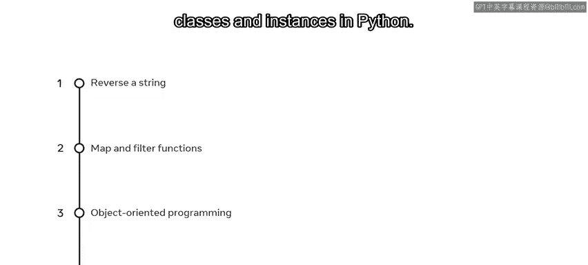
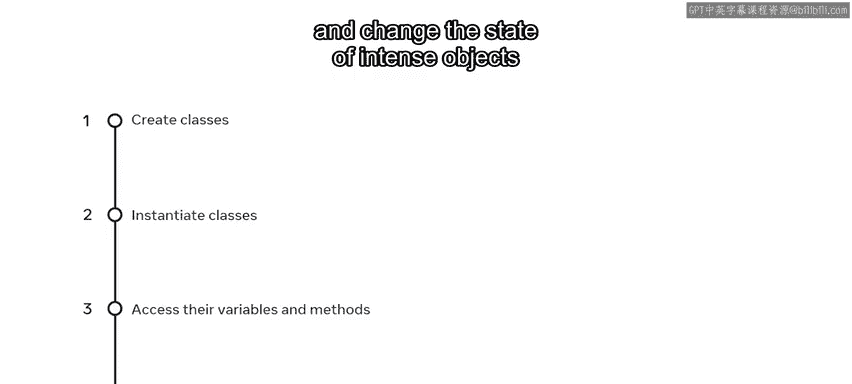

# 数据库工程师：P48：模块小结 编程范式

在本节课中，我们将对“编程范式”这一模块进行回顾与总结。我们将梳理已学习的核心概念，并明确你应掌握的关键技能。

## 模块回顾

上一节我们介绍了面向对象编程的核心概念，本节中我们来对整个模块进行总结。

本模块探讨了三种主要的编程范式：过程式编程、函数式编程和面向对象编程。

我们首先指出，**过程式编程**被认为是最简单、最基础的编程范式，是迈向面向对象编程的基石，也是新开发者的首选入门方式。

接下来，你探索了**函数式编程**。其本质是一种通过创建函数来编写**清晰、一致且可维护**代码的编程范式。

最后，你学习了**面向对象编程**。它围绕着创建**对象**展开，这些对象同时包含**数据**和**方法**。

现在，你应该对这些概念有了清晰的理解。是时候回顾你学到的关键课程和掌握的技能了。

## 关键知识点总结

基于以上内容，我们来总结你在本模块中学到的要点。

你现在应该能够：

*   描述过程式编程的概念。
*   描述**算法**是什么，以及如何用它来解决问题。
*   识别如何计算**算法复杂度**。
*   认识到算法复杂度如何帮助提升性能。

你还应该能够：

*   描述 **大O表示法**。
*   解释什么是函数式编程。
*   解释**纯函数**在函数式编程中的运用。
*   解释**递归**及其如何用于解决问题。

然而，你的学习并未止步于此。因此，你还应该能够：

*   在Python中使用不同的方法**反转字符串**。
*   解释 **`map`** 和 **`filter`** 函数的区别。
*   解释面向对象编程及其构建的**四个核心概念**（封装、抽象、继承、多态）。
*   描述Python中**类**与**实例**之间的关系。

最后，在学习了本模块剩余的关键点后，你现在应该能够：

*   创建类。
*   实例化类。
*   访问类的变量和方法。
*   通过使用**实例变量**和**方法**来改变对象的**状态**。

## 课程总结

本节课中，我们一起学习了Python中不同编程范式的全面介绍。这些是至关重要的知识，为你未来编写更优秀的程序代码做好了准备。