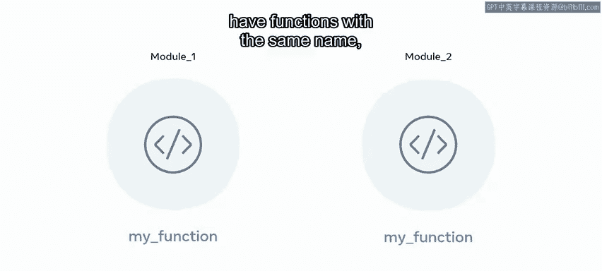
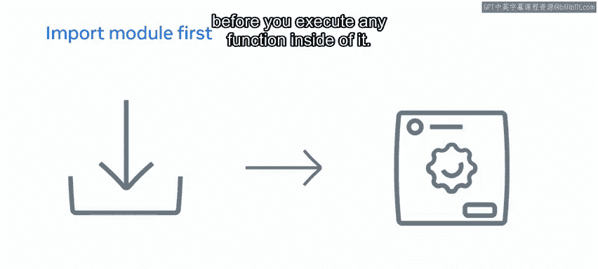

# Python数据库工程师：P49：Python中的模块是什么

## 概述
在本节课中，我们将要学习Python中的模块。模块是Python语言的重要组成部分，它们为代码添加功能，避免重复劳动，并提升开发效率。我们将探讨模块的定义、价值、优势、类型以及如何导入和使用它们。

---

## 模块是什么？🚗

汽车是我们生活的重要组成部分，它让出行变得更加便捷。但是，如果你需要汽车具备更多功能，例如在雪地中行驶或运输大件物品，你可以通过添加冬季轮胎或挂接拖车来改装它。

类似地，Python是一种强大的语言，允许开发者构建出色的应用。通过使用模块，Python可以获得更多功能。模块就像是制作馅饼的说明书：与其自己摸索每一步，不如直接遵循说明。模块以相同的方式工作，它们是向代码添加功能的构建块，因此你无需不断重复编写所有内容。

一个Python模块包含语句和定义。例如，一个名为 `sample.py` 的文件可以是一个名为 `sample` 的模块，并且可以被导入。Python模块可以同时包含可执行语句和函数。

---

## 模块的价值与优势 🧱

在探索如何使用模块之前，理解它们的价值、目的和优势非常重要。

模块源于模块化编程。这意味着代码的功能被分解成部分或代码块。这些部分或代码块具有巨大的优势，即：**作用域**、**可重用性**和**简洁性**。

让我们深入探讨这些优势。

### 作用域
Python中的一切都是对象，因此你为函数、变量等使用的名称变得很重要。作用域意味着模块创建了一个独立的命名空间。因此，两个不同的模块可以拥有同名函数。导入一个模块会使其成为正在执行的代码全局空间的一部分。

### 可重用性
可重用性是模块化最重要的优势。当你编写一段代码时，模块帮助你避免编写所有可能需要的功能。代码重复会浪费你的精力，占用更多计算机内存，并且效率低下。

例如，假设你想导入一个数学包，你会自动获得大量功能，如阶乘、最大公约数（GCD）等，这些功能无需定义即可重用。

**代码示例：导入数学模块**
```python
import math
# 使用模块中的功能，无需自己实现
result = math.factorial(5)  # 计算5的阶乘
gcd_value = math.gcd(48, 18)  # 计算48和18的最大公约数
```



### 简洁性
使用模块带来的一个特性是简洁性。当模块之间相互依赖较少时，有助于实现简洁性。因此，每个模块的构建都着眼于一个简单的目的。模块由其用途定义，例如，你也可以使用正则表达式或 `re` 模块来管理正则表达式。

简洁性也有助于避免这些模块之间的相互依赖。因此，如果你正在进行数据可视化，导入像 `Matplotlib` 这样的单个模块就足以可视化你的数据。


---

## Python中的模块类型 📦

Python中存在不同类型的模块。这些模块之间的主要区别在于访问模块的方式。

以下是主要的模块类型：

### 内置模块
有些模块已经内置在标准的Python库中。当你在Python代码中使用类似 `import math` 的语句时，解释器首先会尝试查找内置模块。

### 第三方模块
这些是由Python社区开发并可通过包管理器（如 `pip`）安装的模块。它们极大地扩展了Python的功能。

### 自定义模块
这些是你自己创建的 `.py` 文件，可以在其他项目中导入和使用。

---

## 如何导入和执行模块 🔧

现在，我们来看看如何导入和执行模块。首先需要知道的重要一点是，模块在执行期间只导入一次。

例如，如果你导入一个包含 `print()` 语句的模块，你可以验证它只在你第一次导入模块时执行，即使该模块被多次导入。

由于模块是为了帮助你而构建的，独立模块包含所有函数，但很可能不包含无需调用即可执行的函数。只有当用户执行该模块内的不同函数时，他们才会发现这些函数在代码中的效用。

模块通常在代码开头定义，但你也可以在代码的任何点定义它。由于Python中的代码执行是顺序的，你必须先导入模块，然后才能执行其中的任何函数。

**代码示例：模块导入位置**
```python
# 模块通常在开头导入
import math

def calculate_circle_area(radius):
    # 也可以在函数内部导入（局部作用域）
    import math
    return math.pi * radius ** 2

area = calculate_circle_area(5)
```

模块也可以从函数内部执行。这意味着该模块内的代码只有在函数执行后才能使用。



---

## 总结

本节课中，我们一起学习了Python中的模块。我们了解了模块就像预制的功能包，能够通过提供独立的作用域、卓越的代码可重用性和结构上的简洁性，来提升开发效率。我们探讨了内置模块、第三方模块和自定义模块等不同类型，并掌握了如何正确地导入和使用它们。记住，合理使用模块是编写高效、可维护Python代码的关键。