# 数据库工程师：P4：为什么选择Python 🐍

在本节课中，我们将探讨Python编程语言的核心优势及其适用场景。我们将了解Python为何在众多领域广受欢迎，以及它如何帮助开发者高效地完成任务。

你是否希望能够在不同平台（例如Windows、Mac和Linux）上，使用一种语法类似英语的简易语言进行编程？那么Python是你的解决方案。它是一种高级编程语言，可在多种不同平台上运行。通过本视频的学习，你将了解学习Python的好处，并理解Python的用武之地。

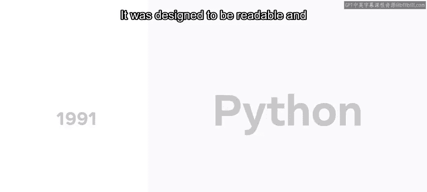

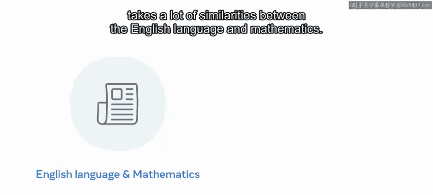

Python由Guido Van Rossum创建，并于1991年发布。它的设计目标是易于阅读，并且在英语语言和数学之间借鉴了许多相似之处。

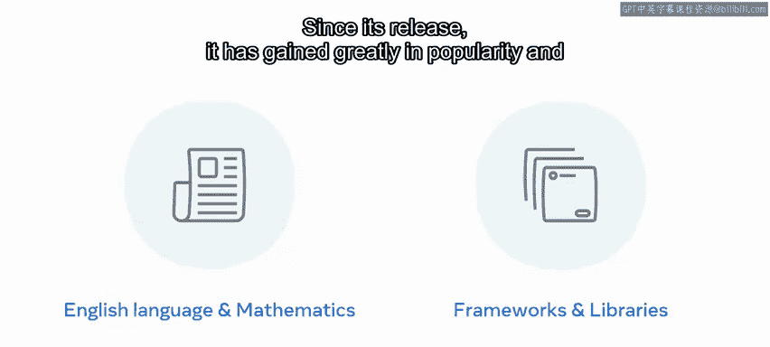

自发布以来，Python的受欢迎程度大幅提升，并支持丰富的框架和库选择。目前，它是当今最受欢迎的编程语言之一。

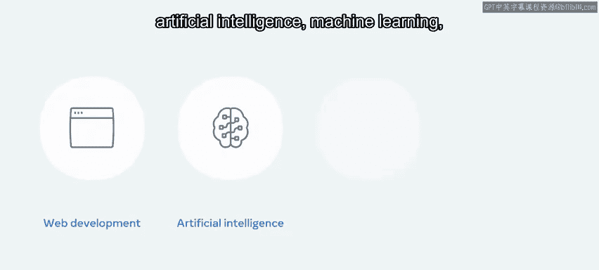

Python广泛应用于商业的各个领域，例如Web开发、人工智能、机器学习、数据分析和各种不同的编程应用。

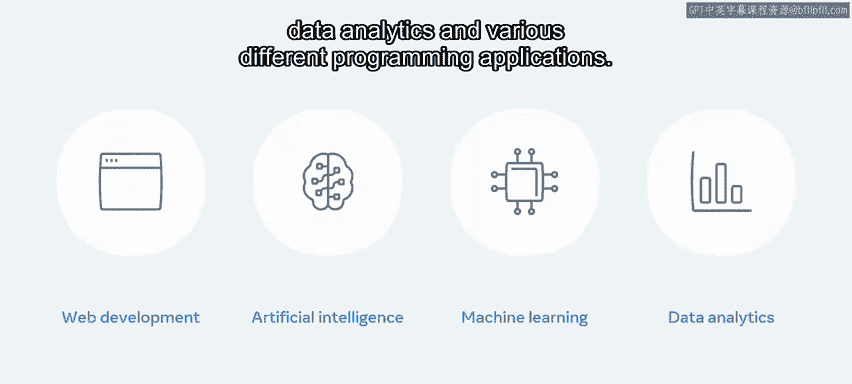

Python也非常易于学习和入门。鉴于其语法类似于英语，这使得它更易于阅读和理解。

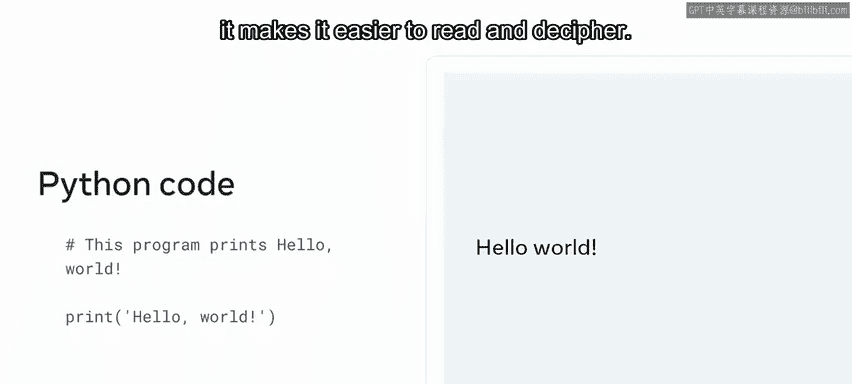

与C或Java等编程语言相比，用Python编写的程序通常需要更少的代码。Python的一个关键优势是它使开发人员效率非常高，并允许项目更快地完成。

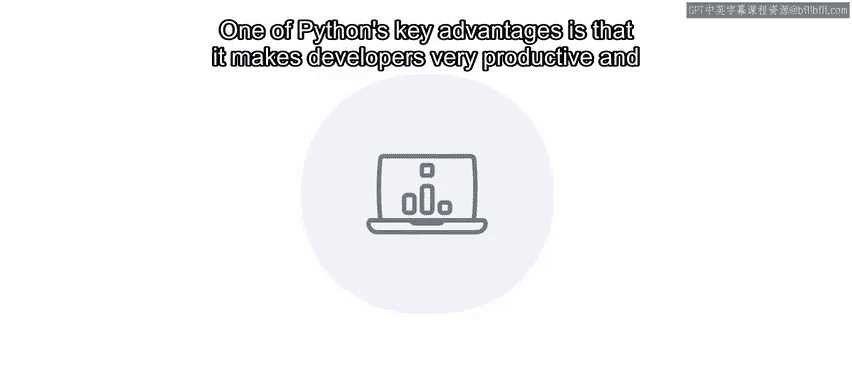

创建被许多人使用的好软件是困难且非常耗时的。Python的简洁性为开发者抽象掉了大量复杂性，使他们能够专注于手头的任务。鉴于该语言相当容易理解和掌握，对于刚开始编程的新手来说，它可以成为一条更快捷的途径，让他们在更短的时间内产出成果。

与其他一些语言相比，Python的学习曲线要平缓得多。它很好地契合了“写更少的代码，做更多的事”的理念。

既然你已经了解了学习Python的好处以及它的应用领域，那么知道Python开发人员需求旺盛也是有益的。成为一名Python开发者是一个不错的职业选择。

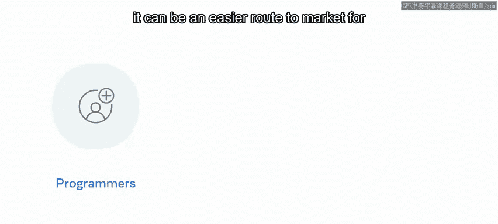

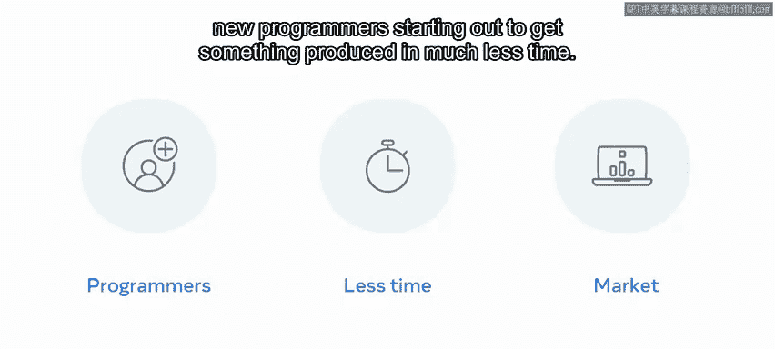

---

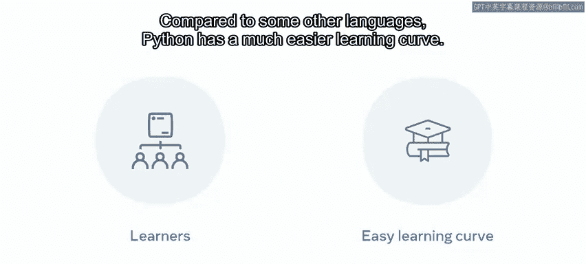

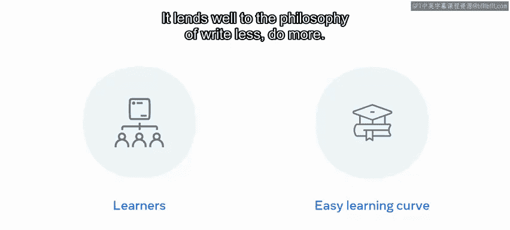

**总结**

本节课我们一起学习了Python的核心优势。我们了解到Python是一种语法类似英语、跨平台的高级编程语言，以其易读性和简洁性著称。它在Web开发、人工智能、数据分析等多个领域应用广泛，并且因其“写更少，做更多”的高效特性，成为初学者入门和开发者提高生产力的优秀选择。掌握Python技能在当前的就业市场上也极具竞争力。