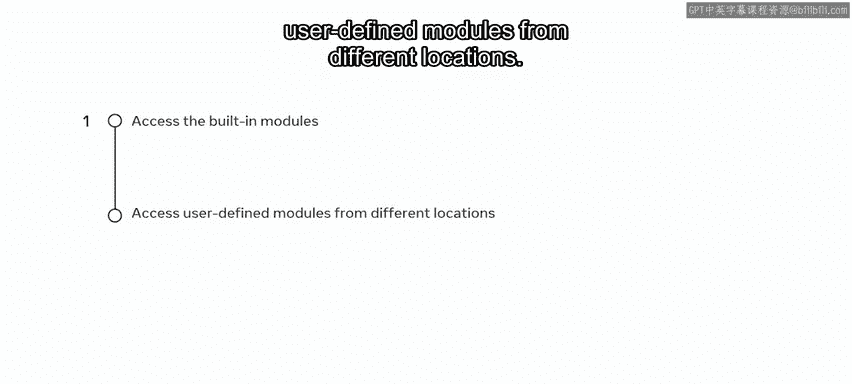
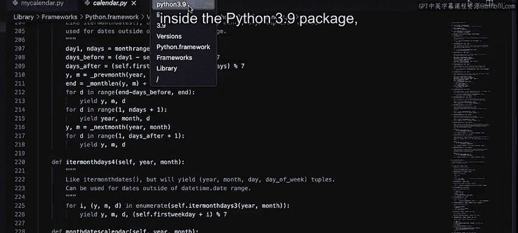

# Meta《数据库工程师（Python／数据库客户端／高阶数据建模／毕业项目／面试）｜Meta Database Engineer》中英字幕 - P50：49_访问模块.zh_en - GPT中英字幕课程资源 - BV1pZ421a749

In Python you can access different types of modules such as built in modules and user defined modules from different locations。

Think of the built in modules as a house that you want to build using pre builtil and packaged floors。

 walls and a roof that you can just assemble。This means you don't have to try and find hammers。

 bricks， plaster and tiles to build walls and floors。

 saving you time and making your work more efficient。

 accessing built in and user defined modules in Python works in the same way and helps to save time and build efficiency while you're coding。

Remember that any Python file can be a module。The modules are searched by the interpreter in the following sequence。

 First， the current directory path， second， the built in module directory， third， the Python path。

 an environment variable with a list of directories。And finally。

 it investigates the installation dependent default directory。😊，Let's explore this in greater detail。

In this video， I'll demonstrate how to access different types of modules such as the built in modules and user defined modules from different locations。

😊。

Let's write some code and learn how to access some built in modules I begin by creating a new file called My calendarendar in Viual code。

I then use the Cs dots path function and return the value that I get from it in a variable called locations。

I finally print the values using the print function。I now try running this code。Unfortunately。

 this does not work as Python has no idea what Sis is to resolve this。

 I'm going to try and import the built in cis function。I'm going to run the code again。

The print function returns all the possible locations that the interpreter is going to look for when searching for modules。

 including the current working directory。But this doesn't look very clean。

 I know that I have a list of values， So I'll run a full loop that loops through every location in turn。

This returns a much cleaner result by printing each location on its own line in the terminal。

 Now it's always good practice to import all the required modules right at the beginning。

 but I can do this in a different way。I'll import a module here in the middle of the code。

I'll import another built in module called Cal。I'll now use a couple of functions that the calendar has。

 I'll now use a function called leap days， which has two inputs， year 1 and year 2。

 and it will be returning another integer value。 So what I'm going to do is write the leap days function。

 write two input years and return the value in a variable called leap days。

 I'm going to print the value of a variable。I get a return value of 13。

 which means there are 13 leap days in between 2000 and 2050。Now I'll use another function。

 this function is called IL。😡，It takes one of the years as an input and returns a Boolean value It tells you if a given year is a leap year。

 so let's try 2036 and return the value in another variable called iss it leap。

This time I get the value of true because 2036 is a leap year if you decide to explore a little bit。

 you can hover over calendar if you use a MacBook， press the command key， or if using Windows。

 press the control key which will take you to the calendar file by clicking on it。

Note how the calendar module itself has imported a few other modules。

 and other than that it contains all the functionalities。

I now find the location of calendar inside the Python 3。9 package。

 which is one of the locations listed in the terminal by the print locations loop I ran earlier。

You just learned how to access built in modules and user defined modules from different locations。

 I encourage you to start using modules in your code to make your work more efficient。

