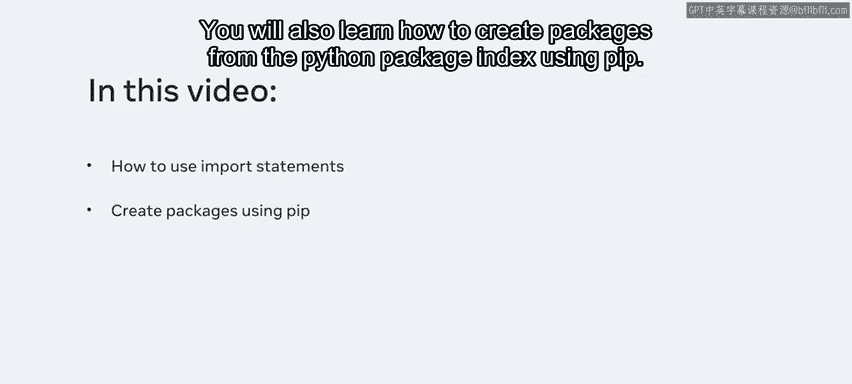
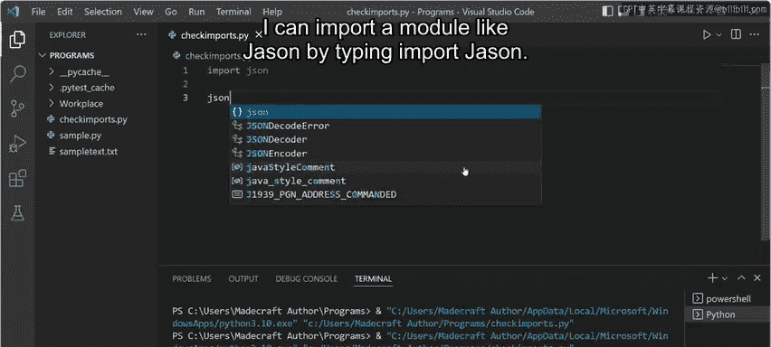
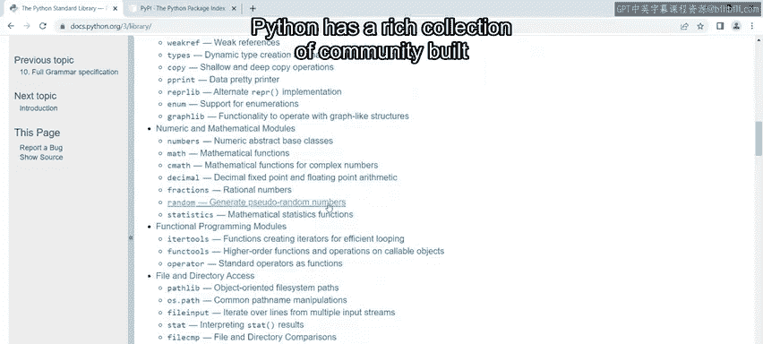
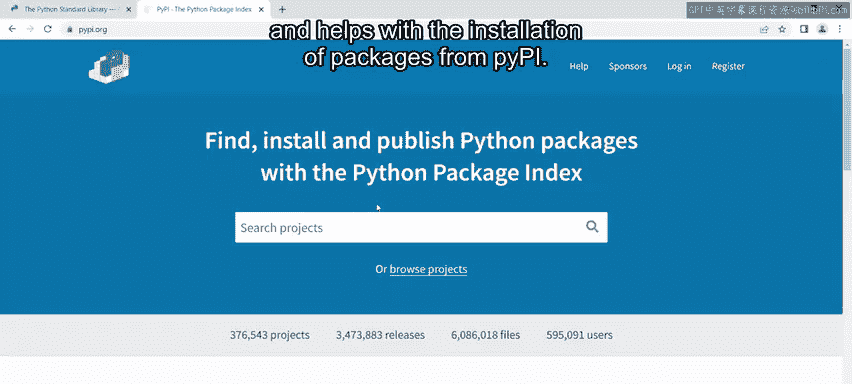
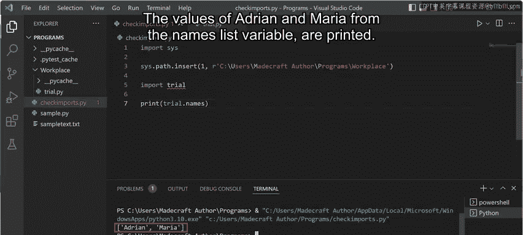
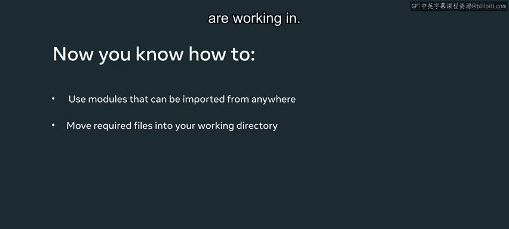

# Meta《数据库工程师（Python／数据库客户端／高阶数据建模／毕业项目／面试）｜Meta Database Engineer》中英字幕 - P51：50_导入语句.zh_en - GPT中英字幕课程资源 - BV1pZ421a749

In this video， you will learn how to use import statements for accessing modules from different directories。

 You will also learn how to create packages from the Python package index using Pip。

 Every Python file， which means any file with a dot Py extension containing a script is effectively a module。

 The check imports file I am currently creating is therefore a module for some of the files。

 The code that you are working with is generally called the main module。 In this case。

 check imports is the main module present in the current working directory also called the scope of the project。

 You can import any python file that is present in the current scope。 For example。

 I can import the sample dot py file by typing import followed by the file name without the extension。

 I then click on run in the top menu。 The system returns a message in the terminal pane that the import was successful。

 If I try to import a file with a dot T X T extension。 The import will not。

Be successful。For example， if I type import followed by sample text and click on run。

 the system will return an error message in the terminal pane as it is not a Python file。

 Python has a library of standard modules called built in modules。

 These modules are directly built into the Python interpreter and don't have to be installed separately。

 I can import a module like JSO by typing importm JSO。

Once I execute the command， I can start using its functions directly。

The list of built in modules can be found in the Python Standard Library。

 You can think of packages as the structuring of Python modules as a collection。

Special files called Enit。 Pi files are required for Python to treat directories containing the file as packages。

Python has a rich collection of community built packages that I could find on the Python Pack In or PI PI。

PIip or PIP 3 is the default package installer for Python and helps with the installation of packages from P PI。

Since I have already installed nuumpPI， I can import it directly in Python。

I do this by typing import numpy， clearing my terminal and clicking run。

 If I try to import a package that is not installed， I will get an error message。 For instance。

 if I type import Cborn and click run the message module not found error is returned If the package Cborn were installed。

 I could run the command again in Python without any error messages to do this。

 I would run Pip install Cborn in the terminal to download the package from the P P index。

I can also import files I have created in one of the folders within the current working directory。

 I have a folder called Workplace containing a file called trial dot Pi。

 The file consists of a list with a variable names and two entries inside it。

 I am going to import this file and access its contents。

I start by importing the cis module Next I use a path function in cis by typing cis。path。insert。

Now I must enter the path name to my workplace package in the first index location。To do this。

 right click on the Workplace directory and selectCopy path I enter this path name as the first index location。

When passing the path is an argument， I must use single quotes and type the letterR in front of the path string。

The Ss Pa list now has a new directory where it will look for modules Now I must import my trial file here by typingIm trial and pressing En。

A squiggly line appears below the word trial， this is because the IDE does not know about the path I've added inside Ss dot path。

However， I can still proceed as the interpreter will know about this path。To print the output。

 I type print， followed by trial dot names and click the run button to execute the values of Adrian and Maria from the names list variable are printed。

 In this video， you learned how modules can be imported from anywhere within your system。

 inserting the path name can， however， be very specific and often tricky and confusing。

 Don't worry about this too much for now。 It is more important to focus on importing files from your current directory。

 It is nice to know that importing modules from other directories as an option if you need it。

 It is good practice， though， to move the required files into the directory that you are working in。

