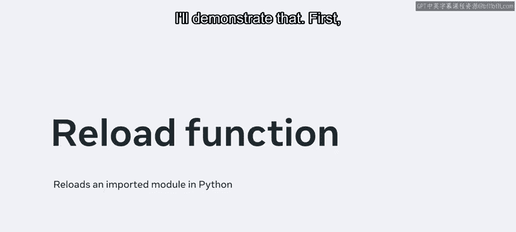
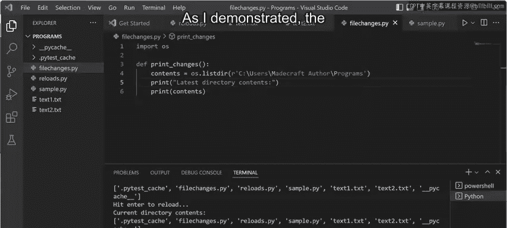

# Meta《数据库工程师（Python／数据库客户端／高阶数据建模／毕业项目／面试）｜Meta Database Engineer》中英字幕 - P54：53_reload函数.zh_en - GPT中英字幕课程资源 - BV1pZ421a749

In this video， I'll cover the reload function that's used with import statements。

The reload function reloads an imported module in Python。

The only precondition is that the argument passed to it must be a module that has already been successfully imported within the program。

Previous， you learned how the import statement is only loaded once by the Python interpreter。

 but the reload function lets you imports and reload it multiple times。 I'll demonstrate that。 First。

 I create a new file， sample dot P Y。

And I add a simple print statement namedHello World。

Remember that any file in Python can be used as a module。

I'm going to use this file inside another new file， and the new file is named using reloads。pyy。

Now I import the sample dot PY module。I can add the import statement multiple times。

 but the interpreter only loads it once。If it had been reloaded。

 we would have seenHello World several times。However。

 I can change this with the help of the reload function。

Let me remove this code and add the Im Lib module where the reload function sits。

Then I pass the module name as an argument to this function。

 note that the sample module has been imported more than once。

And I could do it as many times as I want。Now to better demonstrate how the reload function can be used。

 I'm creating another file called filechans。pyy This file is going to list the content of a particular directory。

In the following code， I will be updating the contents of the directory and be able to monitor the changes using a file that I will import since the interpreter loads the file only once。

 the reload function will allow us to reload that import and effectively update the changes every time without stopping the execution of running code I begin by importing the built in OS module。

 and I use a function called OS do lister inside it。Next。

 I pass the current path as an argument by right clicking the files tab at the top and selectingCopy path。

I paste this as an argument to the lister function and add an R before the path。

Because I'm looking for a directory and not a file， I remove Fchanges。pyY from here。

I'll save the output from the Ler function into a variable called Conents。On the next line。

 I'll add a print function for the contents variable。Before running our program。

 I'll clear the terminal to make things clear。 The return value should list the files that are present in the given directory。

You'll notice that it indeed lists all the files present in this directory once printed。

I now go back to the reloads。 Py file and I clear the file。

 Then I once again import the import Lib module。 After this。

 I import file changes and create a function called Change。As good practice。

 I had a try block and use the reload function to pass file changes as an argument。

Let me go back to the filechanges。pyy file and create a function that will print the contents variable。

This is now complete， but Ill add another print statement for clarity。

I save this file and then I go back to using reloads。pi。

I call this function that I just created inside the file Change module。

 and because I want to make a try block work， I add the accept and just pass for now。After this。

 I execute the code using a for loop。Because I want to do it more than once。

 I use the range function and call the function that I just wrote。

To take some control of the program， I'll add an input statement here。

Now the program will execute five times， and every time it will load the file changes module and list the contents of the directory To make it more interesting。

 I'm creating a few text files inside the directory。Now I've returned to using the reloads。

t Pi file to run this code。Note that the content of the current directory is listed here。

 but I'll now remove the text file called textex3。text。When I execute the code again by hitting En。

 you'll notice that the particular text file has been removed。Now， without changing anything else。

 I'll execute the rest of the code。If I also change the content of filechans。pyy， for example。

 changing the print statement before the file names。

 I could see the code reflected after I press enter again。

As I demonstrated， the reload function can be used for making dynamic changes within your code with the help of import statements。

