# 数据库工程师（Python／数据库客户端／高阶数据建模／毕业项目／面试）：P56：数据分析包 📊

在本节课中，我们将要学习数据分析领域中一些最常用的Python库。这些库是数据科学项目的基石，能够高效地处理、分析和可视化数据。

过去十年，数据科学领域经历了指数级增长。随着开发者需要在代码中融入科学计算和数据分析，对数据分析师和数据科学家的需求持续增加。Python已成为数据科学家中最受欢迎的语言之一。其流行的一个主要原因是拥有大量不同的开源软件包。

这些软件包由成千上万的贡献者协作开发，提供了免费可用的资源。许多软件包因其高效性和出色的功能而获得高度评价。

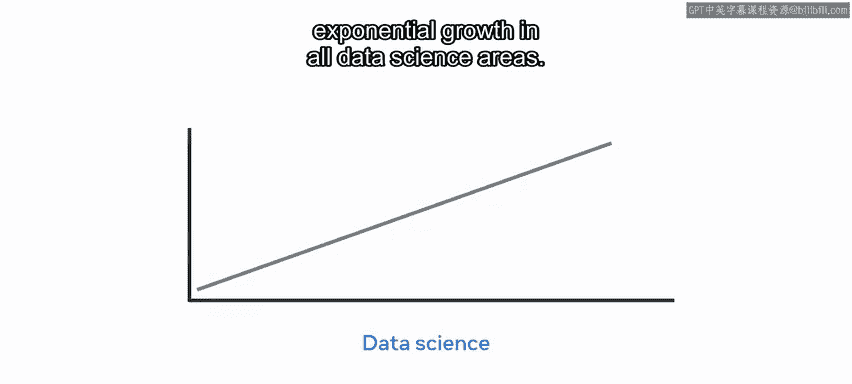

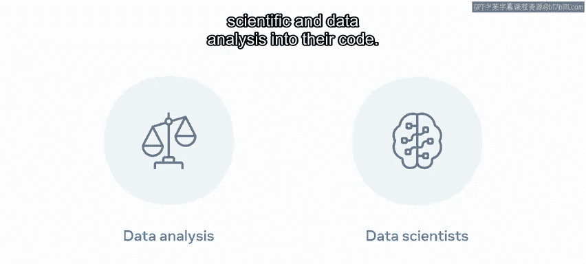

以下是几个核心的数据分析包，排名不分先后：**NumPy**、**SciPy**、**Matplotlib** 和 **scikit-learn**。

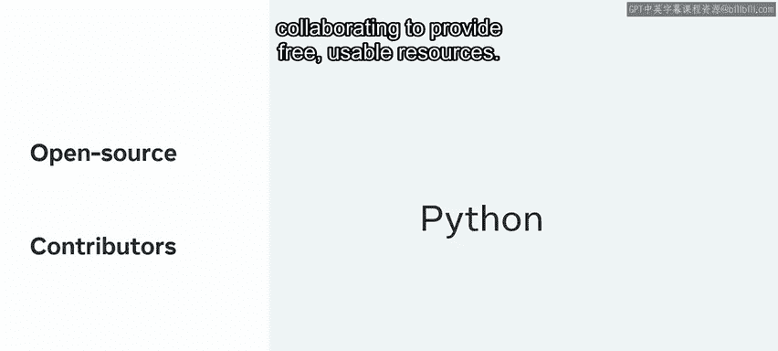

## 核心数据分析库介绍

上一节我们概述了Python在数据科学中的重要性，本节中我们来看看这些核心库的具体功能和用途。

### scikit-learn：机器学习库


作为一个例子，**scikit-learn** 用于预测性学习，它构建在其他流行包之上。该库主要由各种监督和非监督的机器学习算法组成，用于**分类**、**回归**和支持向量机（SVM）。

该库的主要焦点是数据建模，它提供了流行的模型，例如：
*   **聚类**
*   **特征提取与选择**
*   **验证**
*   **降维**

### Pandas：数据分析与处理工具

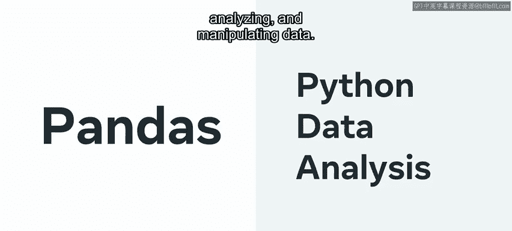

**Pandas** 是 “Python Data Analysis” 的缩写，它是一个数据分析和操作工具。它主要用于处理数据集，并提供数据清洗、分析和操作的功能。

使用Pandas，我可以比较不同的列，并找到算术平均值、最大值和最小值。

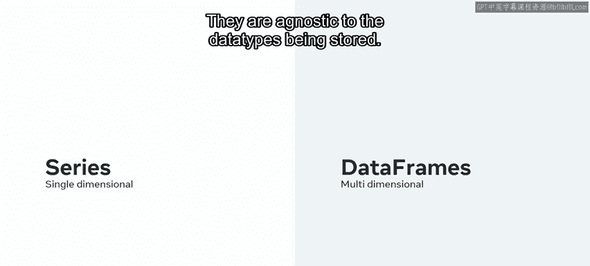

Pandas中使用的主要数据结构是 **Series** 和 **DataFrame**。Series是单维的，可以比作表格中的一列；而DataFrame是多维的，可以高效地存储表格。它们对存储的数据类型是无关的。

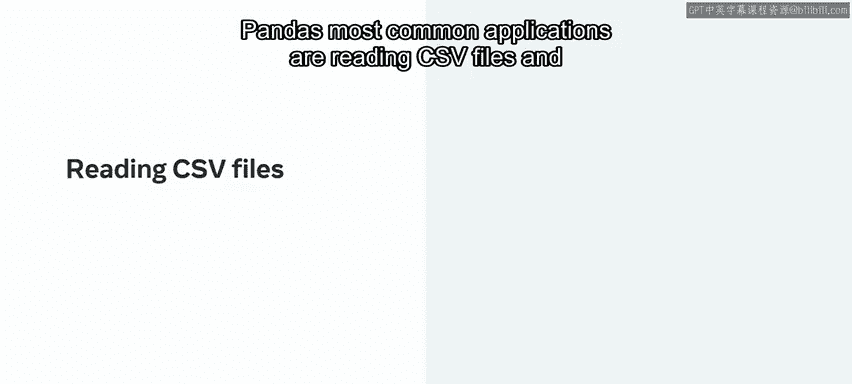

Pandas最常见的应用是读取CSV文件和JSON对象，并在Python代码中使用它们以实现更快的数据检索。Pandas以为数据分析带来速度和灵活性而闻名。


Pandas库通常通过以下代码导入：
```python
import pandas as pd
```

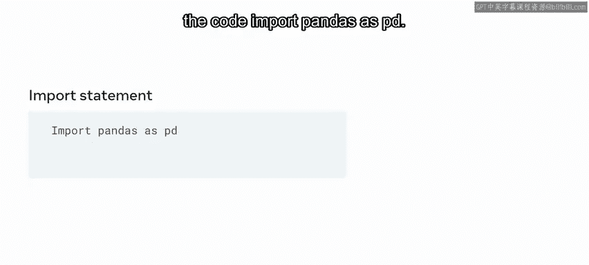

### NumPy：数值计算基础库


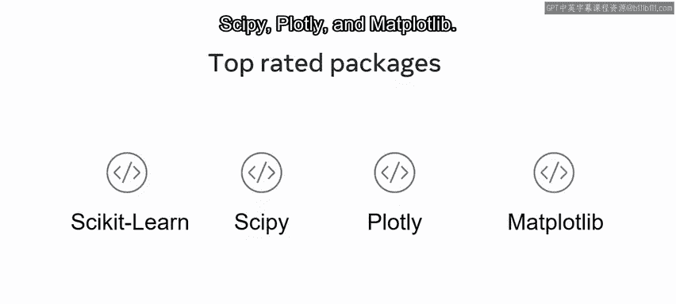

**NumPy** 代表 “Numerical Python”，它是一个强大的库，构成了诸如scikit-learn、SciPy和Matplotlib等库的基础。

数据科学家，尤其是在信号处理、图像处理、统计计算和量子计算等科学领域工作时，会使用NumPy的能力。NumPy执行代数领域所需的计算，例如傅里叶变换和矩阵运算。

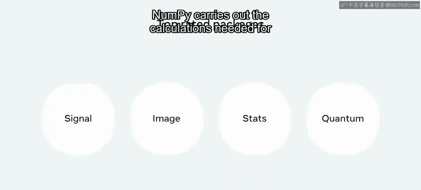


NumPy中的核心数据结构称为 **ndarray** 或N维数组，它替代了Python中传统的列表（list）使用，是比列表快得多的解决方案。NumPy中的维度称为轴（axes），轴的数量称为秩（rank）。

通常，NumPy通过以下方式导入：
```python
import numpy as np
```


### Matplotlib：数据可视化库

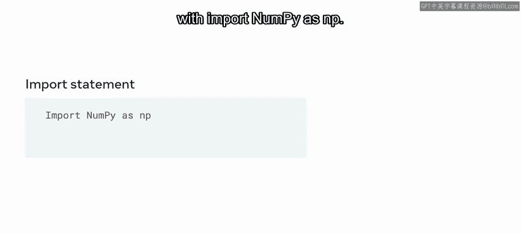

**Matplotlib** 是Python中使用的可视化库。它可以用来创建静态、交互式和动画式的可视化。

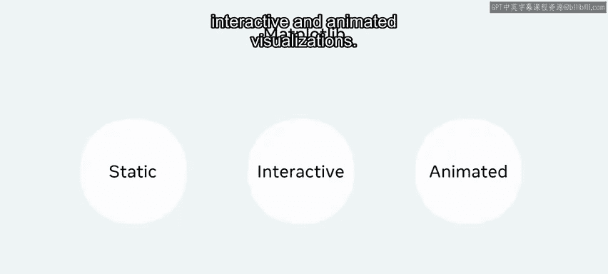

许多第三方工具，如ggplot和Seaborn，扩展了Matplotlib的功能。这些功能位于 `pyplot` 子包中。


Matplotlib通过以下方式导入：
```python
import matplotlib.pyplot as plt
```

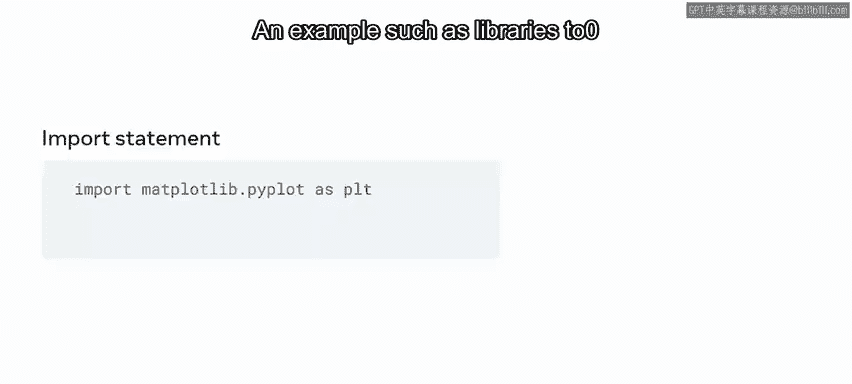

一个例子是，使用Matplotlib和NumPy库可以显示一个班级学生的图形化表示或他们分数的分布情况。

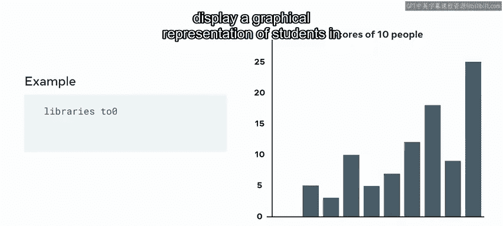

## 总结

本节课中我们一起学习了Python数据分析中最常用的几个核心库。我们了解了**scikit-learn**用于机器学习建模，**Pandas**用于高效的数据处理与分析，**NumPy**作为高性能数值计算的基础，以及**Matplotlib**用于创建各种数据可视化图表。掌握这些工具是进行数据科学和数据分析项目的重要第一步。