**数据库工程师（Python／数据库客户端／高阶数据建模／毕业项目／面试）：P58：Python Web框架** 🕸️

在本节课中，我们将要学习什么是Web框架，了解它们的作用和优势，并重点介绍Python中几种主要的Web框架类型及其代表。

---

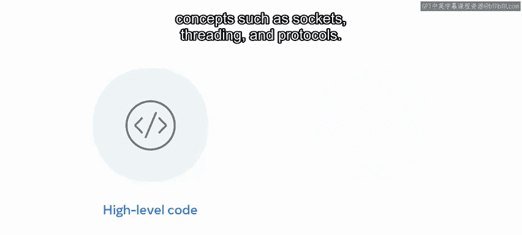

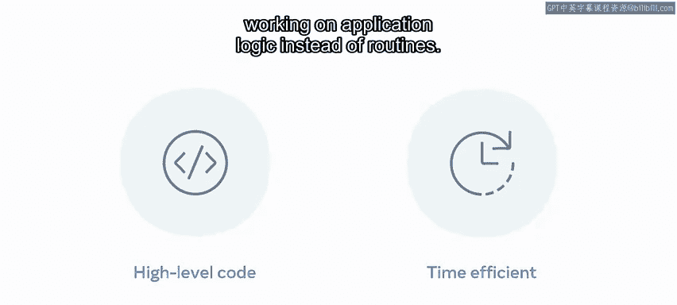

Web框架是设计用来为我们提供构建、部署和支持Web应用程序的标准方式的软件应用。它们通过自动化重复性任务来帮助开发者专注于应用逻辑和常规工作，这有助于缩短开发时间。它们还提供了可靠、稳定且易于维护的简易结构和默认模型，从而节省时间和精力。

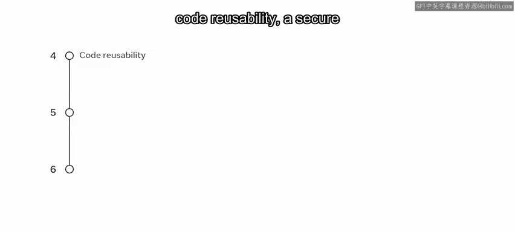

Web框架主要用高级代码编写，这消除了理解套接字、线程和协议等概念所需的开销。因此，开发者可以更好地将时间花在应用逻辑上，而不是常规任务上。

Python因其良好的文档、丰富的库和包、易于实现、代码可重用性、安全的框架以及易于集成等特性，成为Web开发中一个流行的框架选择。Python中的不同框架高效且易于处理表单处理、路由请求、数据库连接和用户认证等任务。它们还提供调试和测试工具来处理性能分析、测试覆盖率和测试自动化等。

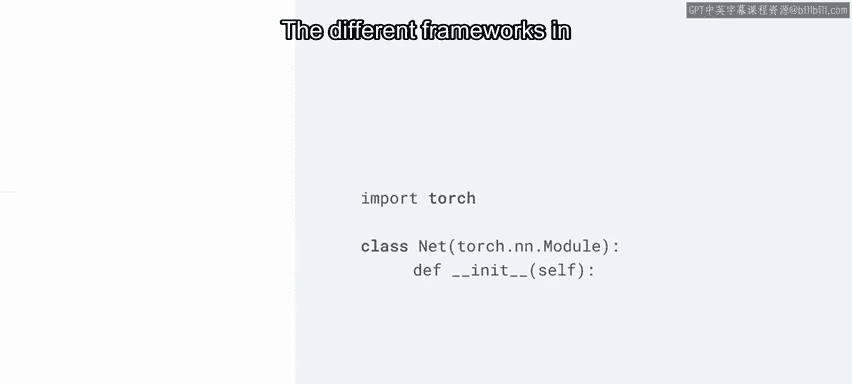

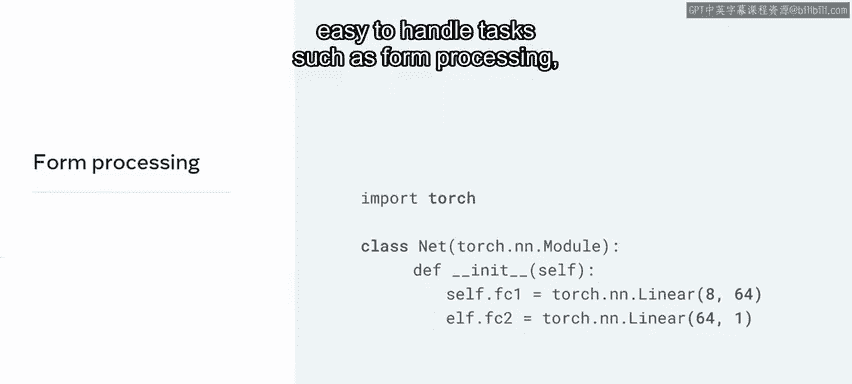

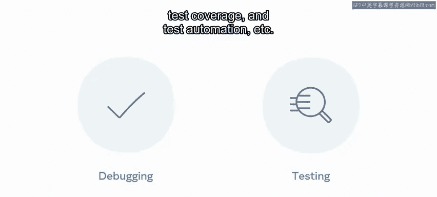

---

上一节我们介绍了Web框架的基本概念和Python的优势，本节中我们来看看Python Web框架的主要分类。

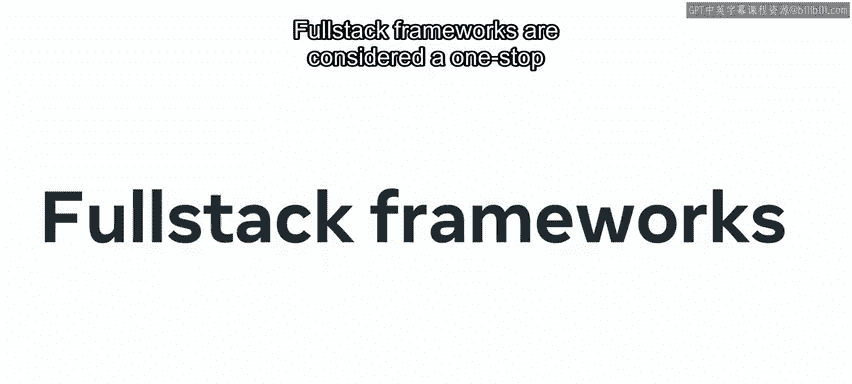

Python中的Web框架主要有三种类型：全栈框架、微框架和异步框架。现在让我们简要探讨每一种。

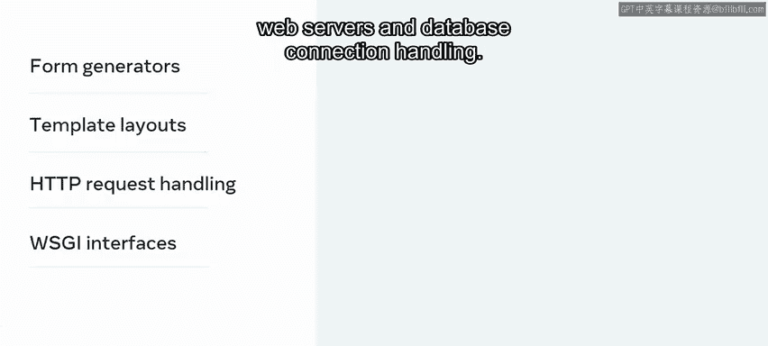

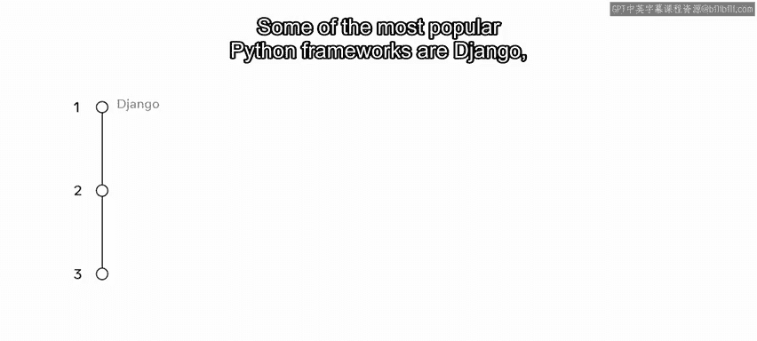

以下是三种主要类型的简要说明：

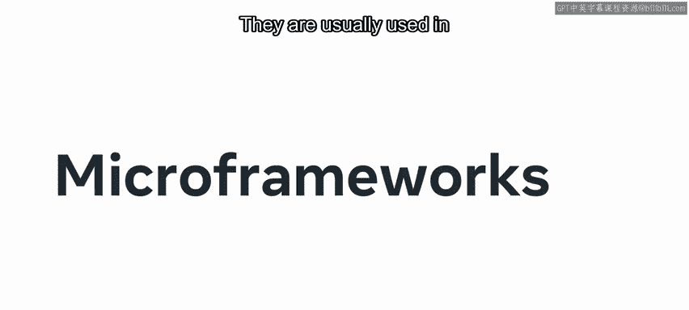

*   **全栈框架**：被视为一站式解决方案，通常包含所有必需的功能。这可能包括表单生成和验证器、模板布局、HTTP请求处理、用于连接Web服务器的WSGI接口以及数据库连接处理。一些最流行的Python全栈框架是Django、Web2py和Pyramid。
*   **微框架**：是全栈框架的轻量级版本，不提供那么多模式和功能。它们通常用于较小的Web项目和构建API。Flask、Bottle、Dash和CherryPy是一些流行的微框架。
*   **异步框架**：顾名思义，异步框架类型用于处理大量并发连接。它们主要使用异步网络库构建，Sanic、AIOHTTP和Tornado是您会遇到的一些名字。

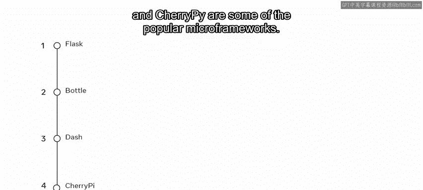

---

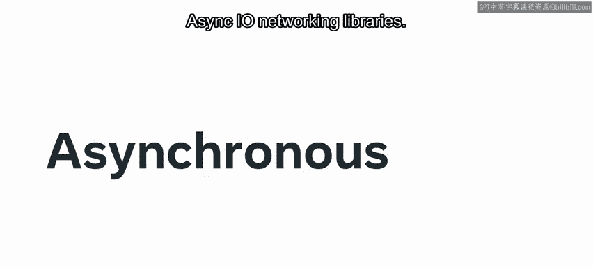

了解了框架的分类后，我们来看看如何选择以及两个最广泛使用的框架。

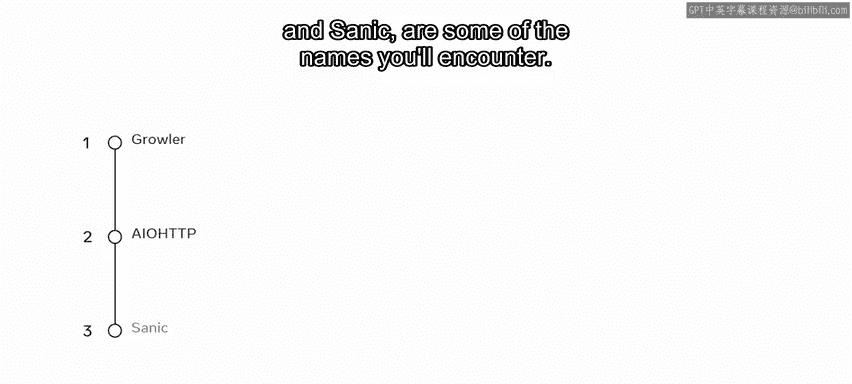

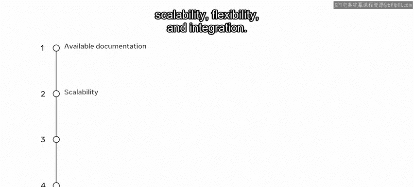

选择框架可能取决于许多因素。这可以包括可用文档、可扩展性、灵活性和集成性等。虽然这种分类相当宽泛，但重要的是要记住，Python中的每个框架都有其独特的功能集。这可能使某些框架比其他框架更适合特定的项目。

两个最广泛使用的是Flask和Django。现在让我们简要探讨每一个。

以下是两个流行框架的对比：

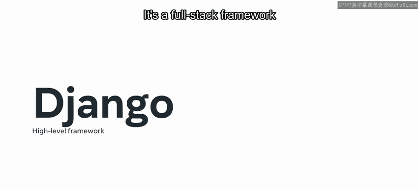

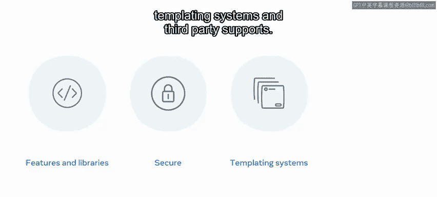

*   **Django**：是一个鼓励简洁设计和快速开发的高级框架。它是一个功能丰富、库齐全的全栈框架。它安全，并拥有模板系统和第三方支持。它主要因其快速的部署速度而广受欢迎。您无需具备广泛的底层编程知识即可快速构建可扩展的应用程序。
*   **Flask**：是一个微框架，更适合较小的项目。它易于学习，使用简单，并且拥有庞大的扩展库。

---

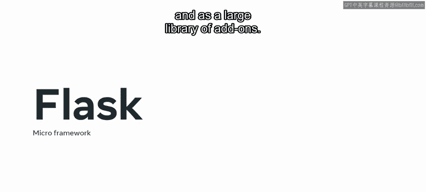

本节课中我们一起学习了Web框架的概念及其优势，探讨了Python中全栈、微框架和异步框架三种主要类型，并简要介绍了两个最流行的框架Django和Flask的特点与适用场景。