# 数据库工程师：P59：什么是测试 🔍

在本节课中，我们将要学习软件测试的基本概念、重要性及其在软件开发周期中的角色。我们将探讨测试的定义、目的、发展历程以及一些核心的最佳实践。

## 概述

测试是质量保证的重要组成部分，它能确保我们的软件、应用程序和网站按预期工作。例如，假设你建立了一个网站，每天有几百名访客。某天，你发布的一篇文章突然爆火，导致上百万人同时访问你的网站，网站因此崩溃。另一个场景是在线表单。我们都遇到过填写表单时，系统提示我们输入有误的情况。例如，在信用卡号码栏位中误输入了字母，或者在密码中缺少特殊字符。这类数据验证在银行和金融等领域尤为关键。

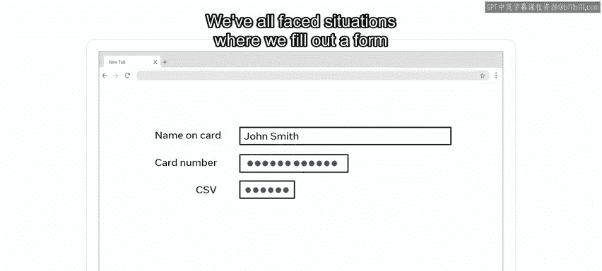

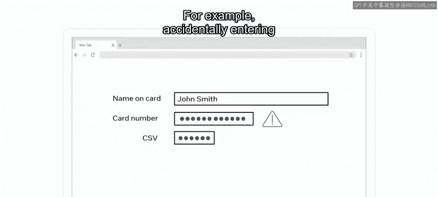

## 什么是软件测试？

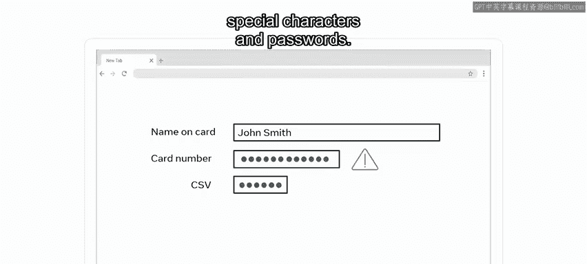

上一节我们介绍了测试的重要性，本节中我们来看看测试的具体定义。

软件测试是一个评估和验证各种软件应用程序及产品的过程，主要关注其性能、正确性和完整性。

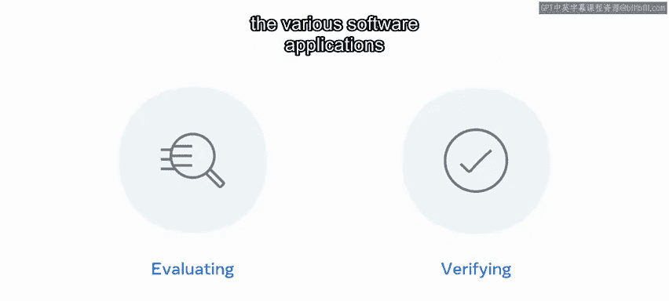

它有助于识别产品中的缺陷、漏洞、错误以及与预期要求不符之处。

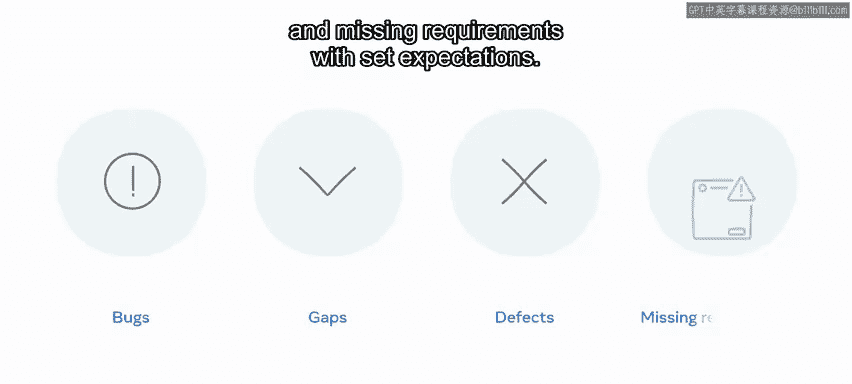

## 测试的发展历程

在计算机发展的早期，软件开发者严重依赖调试来发现和消除潜在错误。20世纪80年代后，随着软件规模的增长，根据不同的需求，也并行发展出了多种不同的测试类型和产品。

测试最初主要在软件生命周期的后期阶段进行，现在已发展为在早期阶段也进行集成。

## 测试的效率与理想场景

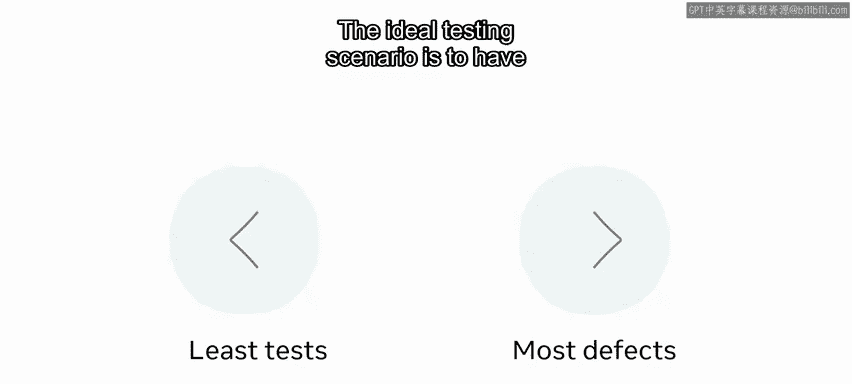

任何测试类型的效率都取决于其设计的好坏。

理想的测试场景是：**编写最少的测试用例，发现最多的缺陷**。

## 测试的重要性与作用

虽然软件测试在任何场景下都很重要，但产品的真正考验在于其投放市场后，由利益相关者和用户进行评判。我们身处互联网时代，存在缺陷的产品，尤其是在早期阶段，会使用户迅速失去兴趣，因为市场上存在许多替代品。

以下是测试发挥重要作用的几个原因：

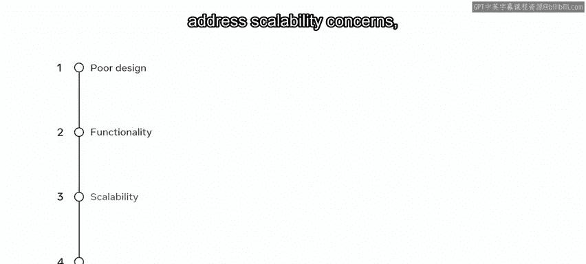

*   **检测问题**：帮助发现不良设计、低效流程或功能、可扩展性问题以及安全漏洞。
*   **优化与保障**：提供A/B测试以找到最佳方案，解决与平台和设备的兼容性问题，为利益相关者提供保证，并为最终用户带来更好的体验。

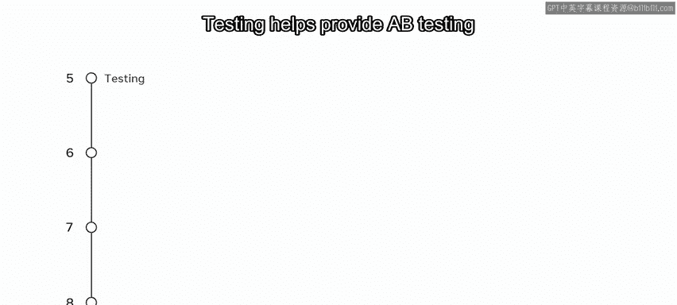

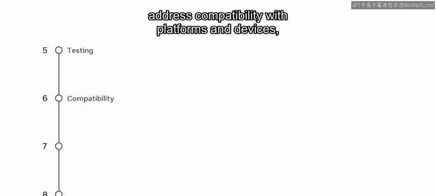

## 测试的最佳实践

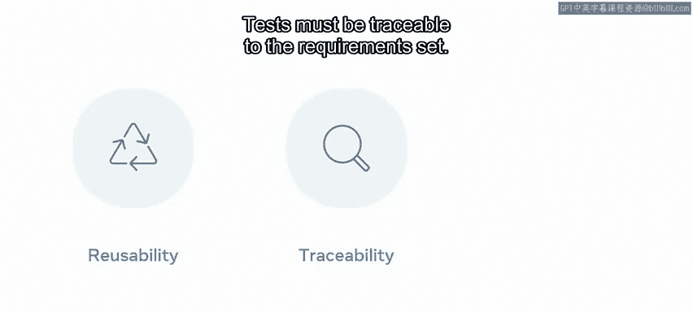

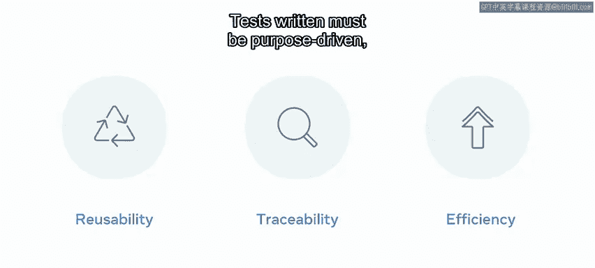

为了达到最佳效果，测试中必须遵循一些良好的实践：

以下是必须遵循的几项核心实践：

*   **测试代码化**：允许测试用例的复用。
*   **可追溯性**：测试必须能够追溯到设定的需求。
*   **目的明确**：编写的测试必须目的明确、高效且可重复执行。

这些测试技术随后可以根据所使用的测试类型，遵循程序化的方法进行。

## 测试生命周期与测试用例

测试生命周期通常可以概括为：**规划、准备、执行和报告**。

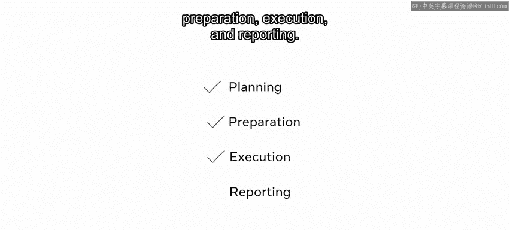

实现这一过程的步骤包括：编写脚本和测试用例、编译测试结果、根据结果修正缺陷以及从测试结果中生成报告。

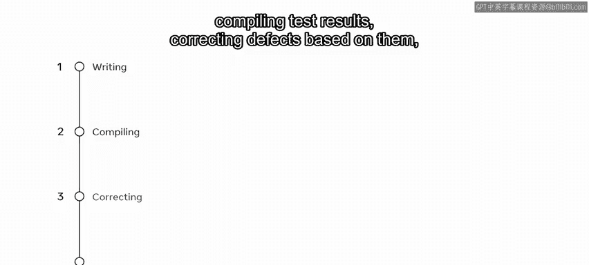

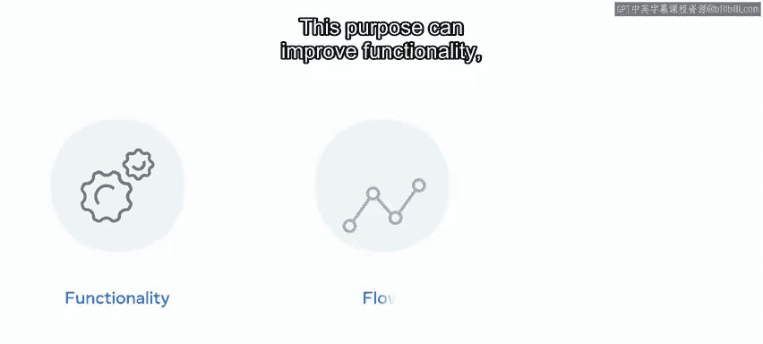

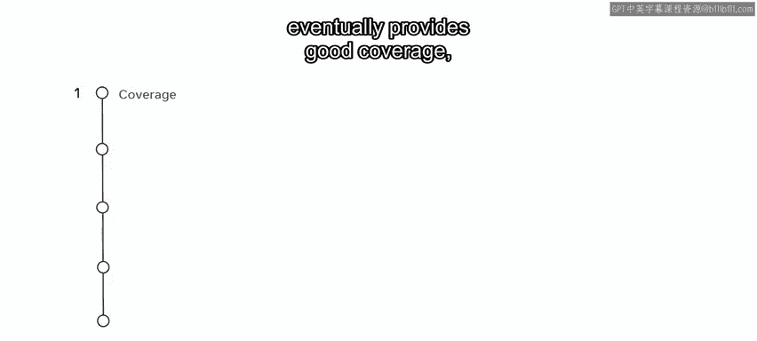

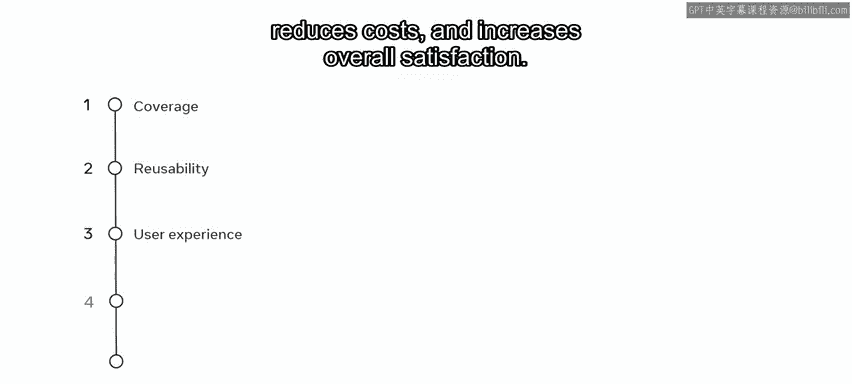

你已经了解了测试用例，它们是为特定目的编写的一套通用操作集合，包含步骤、数据、前置和后置条件。这个目的可以是改进功能、优化流程和发现缺陷。一个编写良好的测试用例最终能提供良好的覆盖率、可复用性、更好的用户体验、降低成本并提高整体满意度。

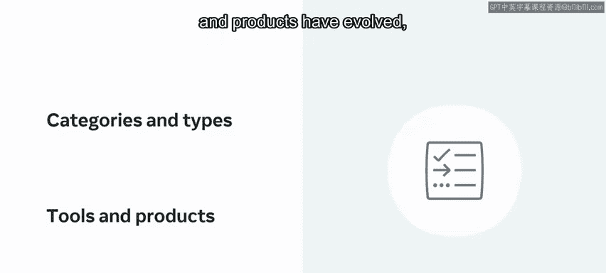

## 测试的分类与多样性

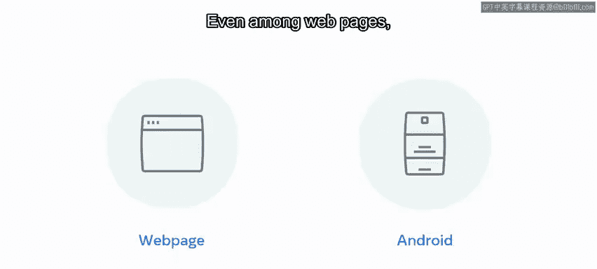

随着科技行业的不断发展，已经演化出多种测试类别、类型、工具和产品，它们都是为了最好地满足特定软件的需求而量身定制的。

例如，一个网页的测试需求与一个基于Android的游戏不同。

即使在网页中，社交媒体页面与财务管理页面也会有所不同。

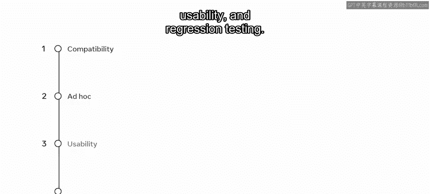

测试可以根据多种不同因素进行分类。例如，根据我们对内部实现的了解程度，可以称之为黑盒测试或白盒测试。实践中还使用许多测试类型，包括兼容性测试、随机测试、可用性测试和回归测试。

目前不必过于担心这些术语，你将在后续课程中了解更多。现在，你只需要知道，在测试产品时，没有一种放之四海而皆准的解决方案。

## 何时停止测试？

理解何时停止测试也很重要，因为没有应用程序会是100%完美的。否则，开发者可能觉得产品已经测试得很好，但一旦发布给最终用户，就会发现它充满了漏洞和缺陷。

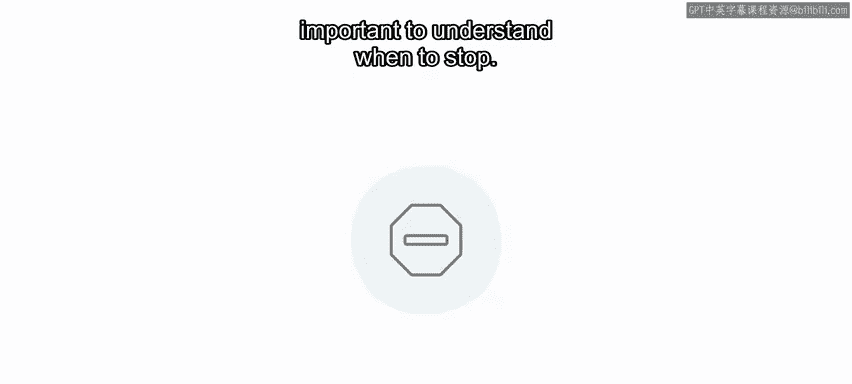

为此可以建立一些度量标准，前提是已有编写良好的测试用例。这些标准包括：通过一定数量的测试周期、测试用例的通过百分比、时间截止日期以及后续测试失败之间的时间间隔。

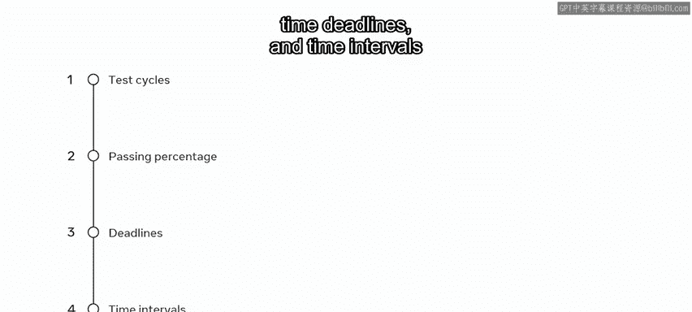

## 总结

本节课中我们一起学习了软件测试。在软件开发中，测试可以被视为船只的锚或车辆的保险。你可以希望一切运行顺利，但情况往往并非如此。虽然你可以追求完美，但人为错误总是存在潜在可能。通过系统化的测试，我们能够最大限度地降低风险，确保软件产品的质量和可靠性。