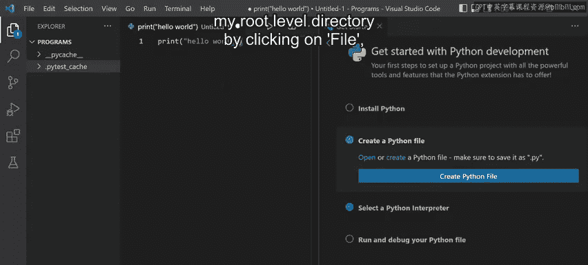
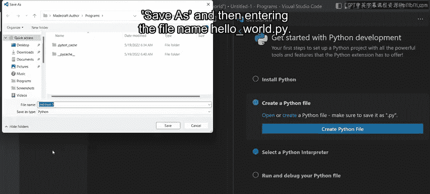
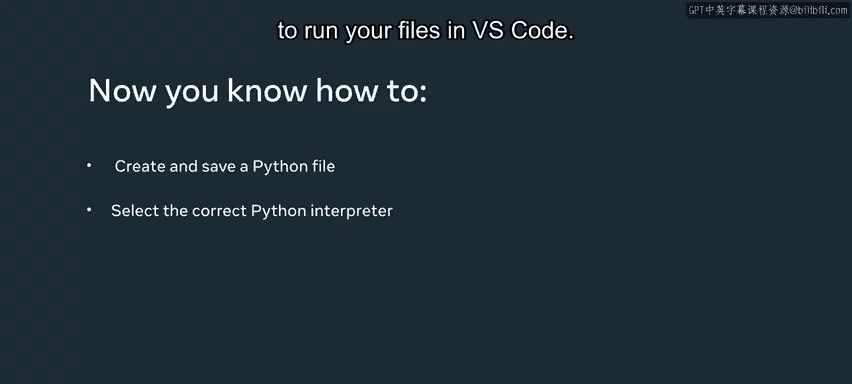

# 数据库工程师：P5：Windows环境检查与Python配置 🖥️

在本节课中，我们将学习如何在Windows操作系统上，为Visual Studio Code（VS Code）集成开发环境配置正确的Python解释器。这是开始Python开发前至关重要的一步，确保你的代码能够被正确执行。

## 概述

开始使用Python时，确保它在你的操作系统和选定的集成开发环境中正常工作非常重要。本教程将演示如何在Windows上设置VS Code，并确保它指向正确的Python解释器。

## 打开Visual Studio Code

首先，我们需要打开VS Code编辑器。点击任务栏上的Windows图标，这会弹出一个菜单。在搜索栏中输入“Visual Studio code”。搜索结果中的最佳匹配是Visual Studio Code应用程序，点击它即可打开。

现在，VS Code已经成功打开。


## 开始Python开发设置

接下来，在VS Code界面中选择“Get Started with Python Development”。这是一个在VS Code IDE上设置Python的有用指南。

## 安装与验证Python

指南的第一步是安装Python。如果你已经安装了Python，可以通过在终端中输入特定命令来验证。要打开终端，请选择顶部菜单栏中的“Terminal”选项卡，然后选择“New Terminal”。

在终端中输入以下命令并按回车键：
```bash
python --version
```
如果终端显示类似“Python 3.10”的版本信息，则说明Python已正确安装。

## 创建Python文件

指南的第二步是创建一个Python文件。点击指南菜单中的“Create a Python file”选项，然后点击出现的“Create Python file”按钮。

现在，输入一个简单的打印语句：
```python
print("Hello world")
```
我们将在后续阶段详细解释`print`函数，目前你只需知道它用于在终端内部打印输出值。

## 保存Python文件





接下来，将这个文件保存为Python文件。点击菜单栏的“File”，然后选择“Save As”。在保存对话框中，输入文件名`helloworld.py`。

`.py`是保存Python文件时必须使用的文件扩展名。

## 选择Python解释器

上一节我们创建了Python文件，本节中我们来看看如何为它选择正确的解释器。指南的下一步是选择Python解释器。点击指南菜单中的这个选项，然后点击出现的“Select Python interpreter”按钮，这会列出你已安装的所有Python版本。

进行此操作是为了确保在运行Python脚本时，VS Code会选择正确的解释器。出现的版本是Python 3.10，我将其设置为解释器，因为它是最新版本。

## 运行与验证配置

为了测试和验证一切是否正常工作，我们需要运行Python文件。在屏幕的右上角，你会注意到一个播放按钮。为了更好地显示，可以关闭指南窗口。

播放按钮有一个下拉菜单，其中包含“运行Python文件”或“在调试中运行”的选项。点击“Run Python file”选项。

请注意，在终端窗口中，它已使用Python 3.10作为解释器运行了该文件，并且我们得到了“Hello World”的输出。

这意味着我现在已经设置好可以直接在IDE中使用Python，从而可以运行和调试我的脚本。

## 总结



本节课中，我们一起学习了在Windows系统上为VS Code配置Python开发环境的核心步骤。你现在已经知道如何创建和保存Python文件，以及如何在VS Code中选择正确的Python解释器来运行你的文件。这是开启Python编程之旅的坚实基础。