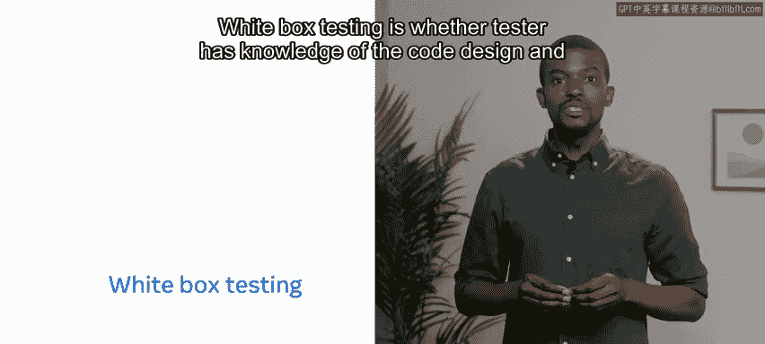
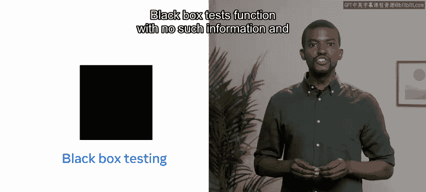
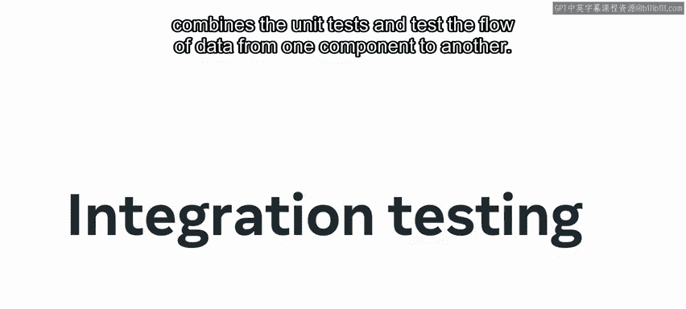
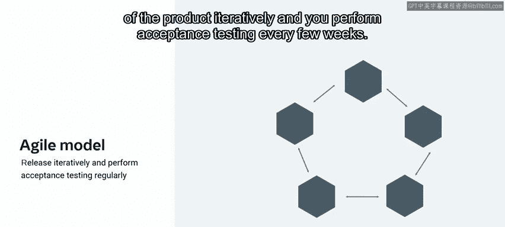

# Meta《数据库工程师（Python／数据库客户端／高阶数据建模／毕业项目／面试）｜Meta Database Engineer》中英字幕 - P60：59_测试类型.zh_en - GPT中英字幕课程资源 - BV1pZ421a749

Quality assurance today has become an important component in the software development lifecycls。

Much of the credit goes to development of testing tools and techniques。😊。

The question is what type of testing should you use in this video you'll learn about the types of testing。

 including the four main levels or categories of testing， which is units， integration。

 system and acceptance testing。😊，There are different ways in which you can categorize the different test types。

 there are white box and black box tests。

White box testing is whether tester has knowledge of the code。

 design and functionalities black box tests function with no such information and the tester has no idea about the internal implementation。

There are also other ways to categorise different tests as functional。

 non functional and maintenance tests let's explore these。😊。

Functional tests are based on the business requirements stated。

 they determine if the features and functionalities are in line with the expectations。😊。

Nonfunction tests are more complex to define and involve metrics such as over performanceform and quality of the product。

Maintenance tests occur when the system in its operational environment is corrected。

 changed or extended， but there are also manual and automated testing methods that are dependent on the scale of the software。

😡，The most broadly accepted categorization is in terms of the levels of testing as you move ahead in the software lifecycle。

 let's delve deeper into these levels of testing。The four main levels of testing are Uni or component testing。

Integration testing， system testing and acceptance testing。

The four types of testing levels build on each other and have a sequential flow Let's explore these now。

😊，In unit or component testing， the program tests specific individual components by isolating them。

 the components are low level， which means that they are closer to the actual written code。😡。

They often involve use of automation for continuous integration given their small sizes。

So you usually write these tests while writing the code， for example， if the code is in Python。

 unit tests can be written with packages such as PT。😊。

Integration testing combines the unit tests and tests the flow of data from one component to another。

😊。

The keyword here is an interface。😊。

This means that you test if the data is correctly fetched from a database within the Python code。

 and if you have sent it to the webage。There are different approaches to it such as top down。

 bottom up and sandwich approaches。😊，Your approach depends on what code level interfaces you attempt first。

 it builds on the unit testing and a tester deals with it。Next is system testing。

 which tests all the software。You test it against the set requirements and expectations to ensure completeness。

This includes measurements of the location of deployed components such as reliability， performance。

 security and load balancing， it also measures operability in the working environment such as the platform and the operating system this is the most important stage handled by team of testers。

It's also the most critical stage as the shipping of software to the stakeholders and end user happened after this phase。

😊，The final type of testing is acceptance testing when the product arrives at this stage。

 it's generally considered to be ready for deployment。😊。

It's expected to be bug free and meet the set standards The stakeholders and the select few end users are involved in acceptance testing。

It normally involves alpha， beta and regression testing。

One way of approaching this is to give prewritten scenarios to the users。

You use the results for improvements and try to find bugs that were missed earlier。

All the different testing levels are designed to optimize software at different stages。

The key to testing is testing early and testing frequently。😊。

While each of the testing phases is important， early detection saves time， effort and money。😊。

As the code gets increasingly complex， mistakes become harder to fix。

 it doesn't necessarily mean that unit testing will happen only at the beginning and acceptance at a later stage there are many testing cycles where these levels are approached iteratively。

A typical example is the Agile model here you release different versions of the product iteratively and you perform acceptance testing every few weeks in this video you learned about some of the types of testing such as unit testing。

 integration testing， system testing and acceptance testing。😊。

It's important to remember that the purpose of these testing methods is to build a systematic approach for testing and identify faults and improvements as early as possible。

😊，This results had improved overall performance and experience， well done。

