**数据库工程师（Python/数据库客户端/高阶数据建模/毕业项目/面试）：P61：测试自动化包** 🧪

在本节课中，我们将学习测试自动化包的概念及其重要性。随着技术发展，代码自动化已成为重要趋势。我们将了解哪些测试适合自动化，并介绍几个主流的Python测试框架。

---

### **概述：自动化测试的重要性**

随着技术进步，代码自动化成为主要驱动力。过去，机器替代人力生产商品，节省了时间和精力。在编程领域，自动化测试同样旨在提升效率。

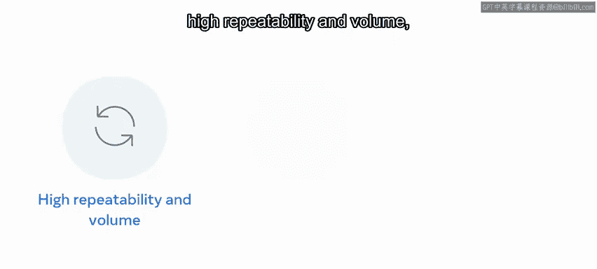

适合自动化的测试通常具有**高重复性、高执行量、可预测的环境与数据以及确定性的结果**。可以自动化的测试类型包括单元测试、回归测试和集成测试。

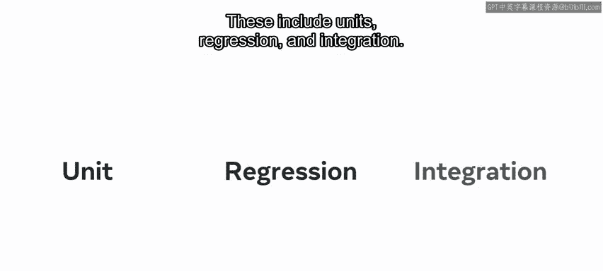

---

### **理想的测试代码与Python的角色**

理想的测试代码应在编程逻辑与测试用例之间架起桥梁。Python以其简洁的编码方式，很好地实现了这一点。此外，Python社区还提供了一些编写精良的测试框架。

自动化测试通常包含三个步骤：
1.  准备测试环境。
2.  运行测试脚本。
3.  分析测试结果。

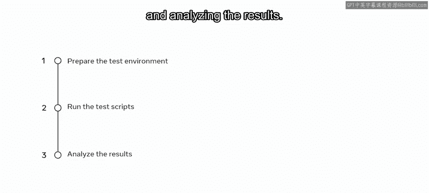

---

### **重要的Python测试框架**

接下来，我们来看看一些多年来广受欢迎的Python测试框架。

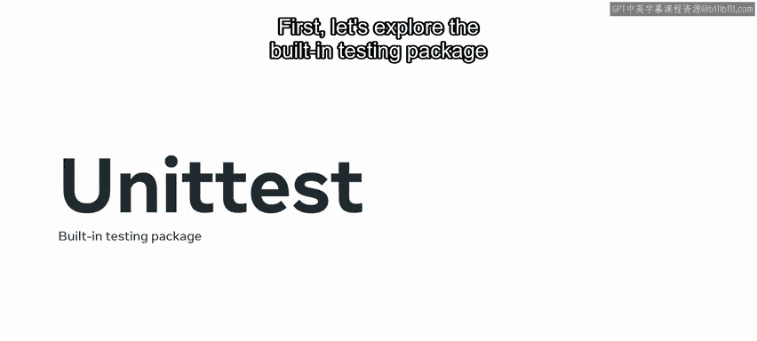

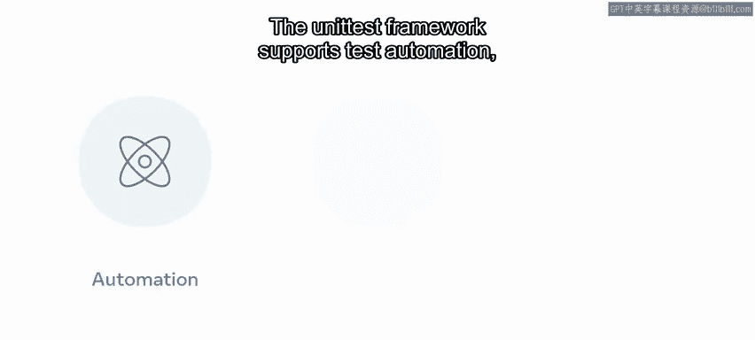

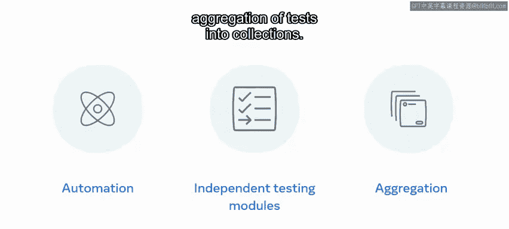

首先，探索Python内置的测试包 **`unittest`**。`unittest`框架支持测试自动化、独立的测试模块以及将测试聚合到测试集合中。

以下是使用`unittest`的一个简单示例：

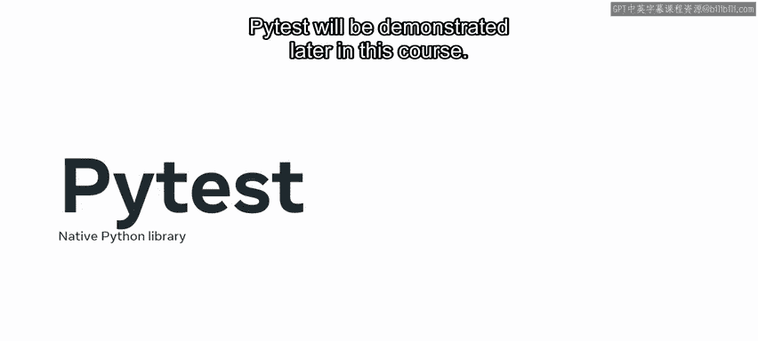

```python
import unittest

def add(a, b):
    return a + b

class TestMathFunctions(unittest.TestCase):
    def test_add(self):
        self.assertEqual(add(2, 3), 5)
        self.assertEqual(add(-1, 1), 0)

if __name__ == '__main__':
    unittest.main()
```

---

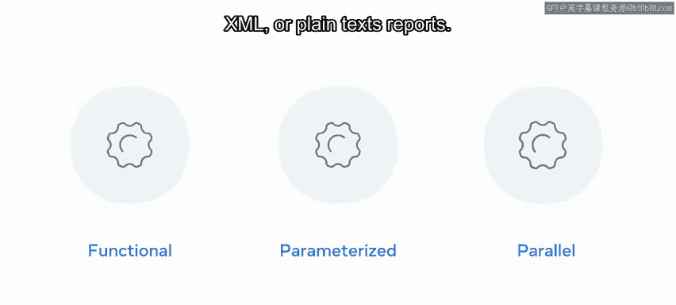

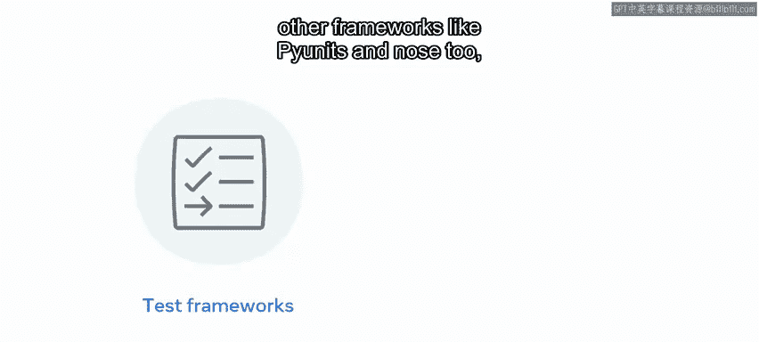

### **PyTest：简单易用的原生库**

第一个要介绍的是 **PyTest**，这是一个原生Python库，以简单、易用和良好的可扩展性著称。PyTest将在本课程后续部分进行演示。

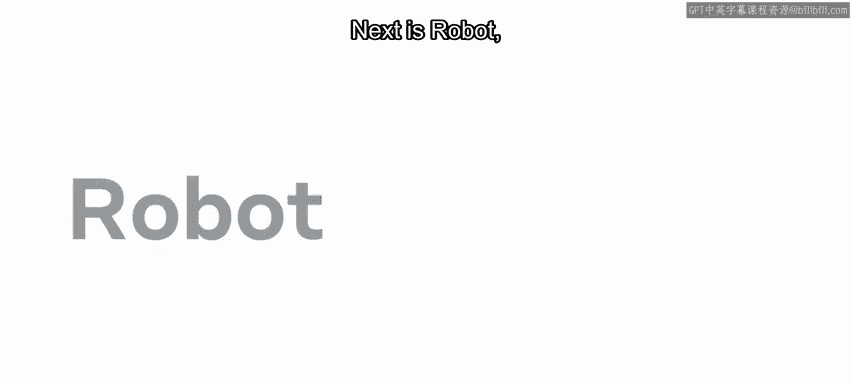

PyTest能处理多种功能测试类型，如单元测试、集成测试和端到端测试。它支持参数化测试，允许我们使用不同的参数多次执行单元测试。PyTest可以并行运行测试，并生成HTML、XML或纯文本报告。它还能与其他框架（如`unittest`和`Nose2`）以及Web框架（如Flask和Django）集成。虽然主要用于测试API，但也广泛应用于UI、数据库连接和其他Web应用程序测试。

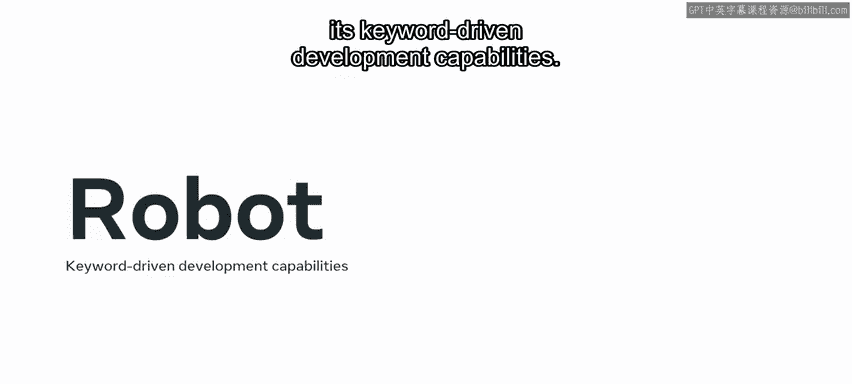

易于创建测试和快速修复错误是PyTest成为最受欢迎的自动化测试框架的原因。

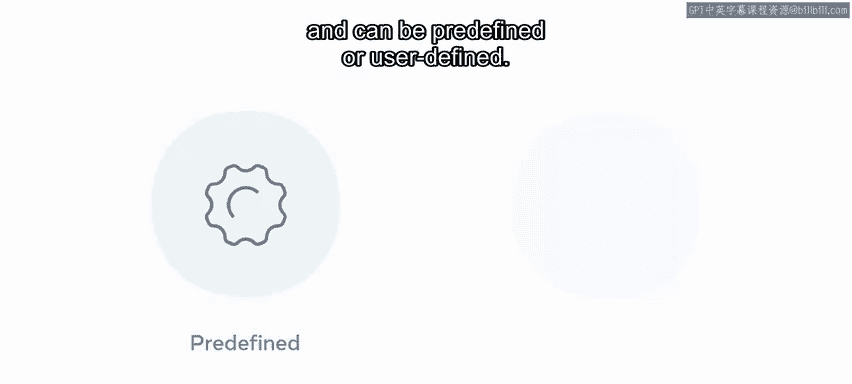

---

### **Robot Framework：关键字驱动的测试**

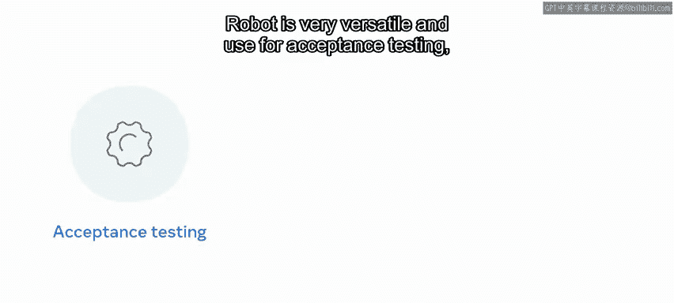

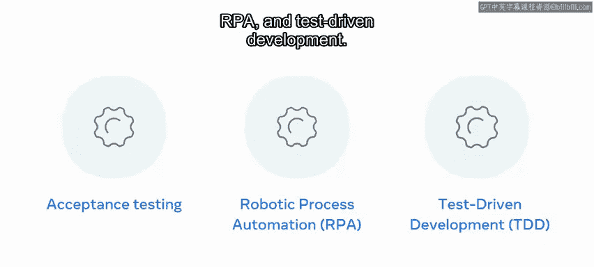

接下来是 **Robot Framework**，它主要因其关键字驱动的开发能力而流行。

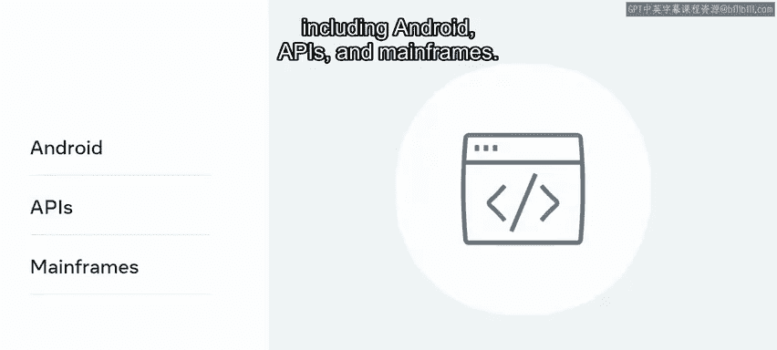

Robot Framework使用关键字来构建测试用例。这些关键字可以是预定义的，也可以是用户自定义的。

Robot Framework非常通用，可用于验收测试、机器人流程自动化（RPA）和测试驱动开发（TDD）。它适用于许多领域，包括Android、API和大型机系统。

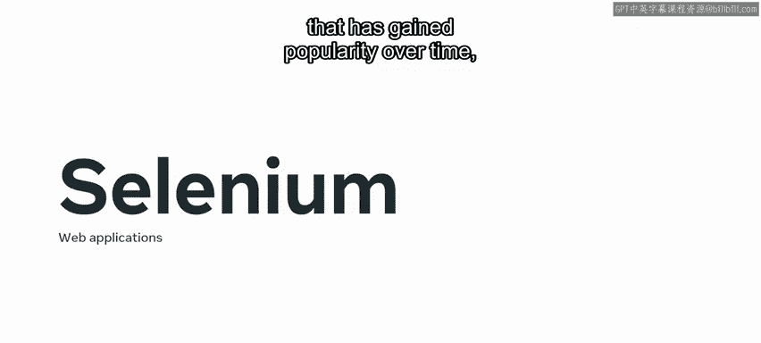

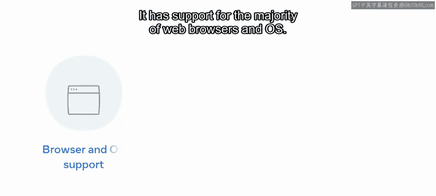

---

### **Selenium：专注于Web应用的测试**

**Selenium** 是另一个随着时间推移而广受欢迎的开源测试框架，主要面向Web应用程序。它支持大多数Web浏览器和操作系统。

Selenium通过特定浏览器的Web驱动程序来实现测试功能，如登录、按钮点击和表单填写。它允许测试人员选择测试执行的速度，并可以选择运行特定的测试或测试套件。

---

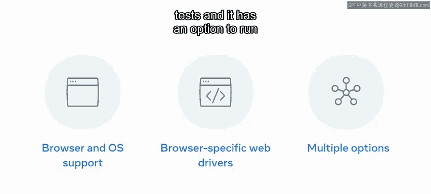

### **框架与工具的协同**

除了流行的PyTest、Robot和Selenium框架，还有许多其他选择。重要的是要知道，许多测试框架经常与其他工具一起使用，例如插件、小部件、扩展、测试运行器和驱动程序。

这些工具有助于集成被测试的软件组件，并增加功能。有时，在被测试的代码上会使用多个框架。

---

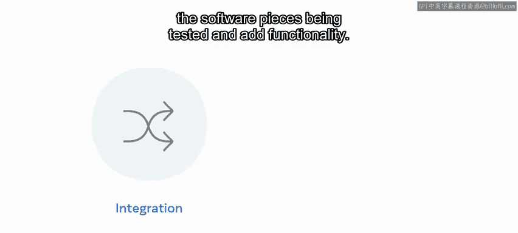

### **总结**

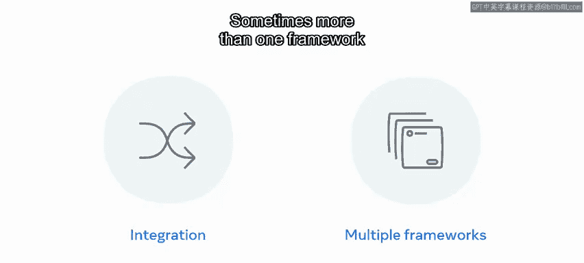

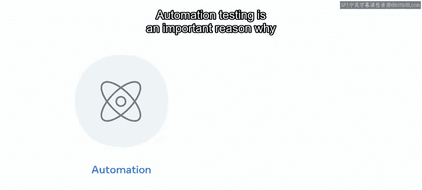

本节课中，我们一起学习了测试自动化包。

让我们快速回顾一下：自动化测试是软件行业能够快速、平稳发展的重要原因。手动测试能提供专注的注意力，并能以更复杂的方式处理细微差别和复杂问题。

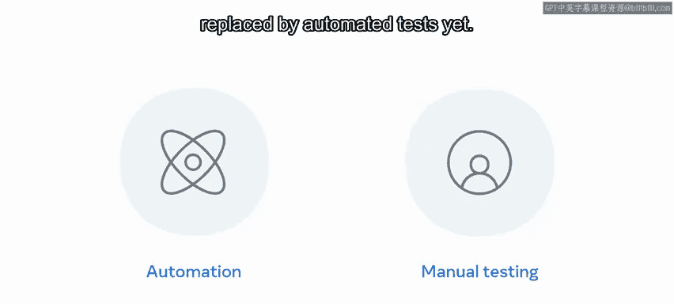

这种测试目前尚无法被自动化测试完全取代，测试场景的完全自动化仍需时日。但所有这些框架的发展，都正朝着这个目标努力。