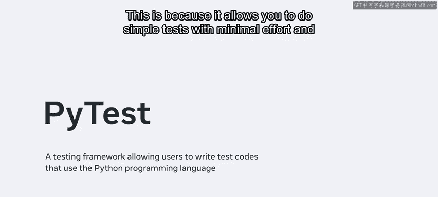
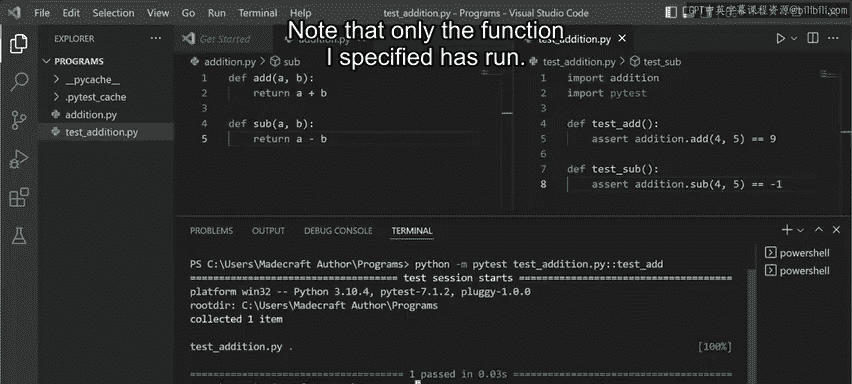
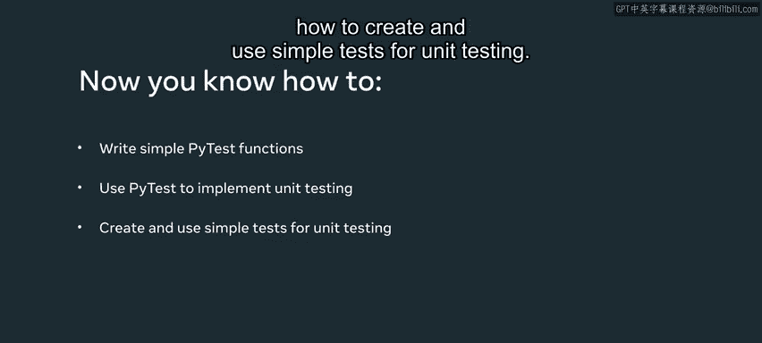

# Meta《数据库工程师（Python／数据库客户端／高阶数据建模／毕业项目／面试）｜Meta Database Engineer》中英字幕 - P62：61_用pytest编写测试.zh_en - GPT中英字幕课程资源 - BV1pZ421a749

In this video I will demonstrate how to use P Test to create simple tests for unit testing PI test is one of the most popular modules for unit testing in Python。

 This is because it allows you to do simple tests with minimal effort and it also has simple clean code with good documentation First I create a file called Ed dot P。

Next， I add a function and pass two variables， A and B inside it。

I'm just going to do a simple calculation that will return the sum of these two variables。Similarly。

 I create another function called sub， which will perform the subtraction between the two variables。

Second， I create another file called Testedition。 Pi in which I'm going to write my test cases。

Now I import the file that consists of the functions that need to be tested Next。

 I'll also import the P test module After that I define a couple of test cases with the addition and subtraction functions。

Each test case should be named Test， underscore， then the name of the function to be tested。

In our case， we'll have Test underscore add and Test underscore sub。

I'll use the assert keyword inside these functions because tests primarily rely on this keyword。

It checks for conditions in your code and expects a boolean value of true or false。

 When the return value is true， the test passes。 when it is false， the test fails。

Let's add assert statements to our tests。In our first test。

 we'll assert that the addition of 4 and 5 is 9。And in the second test we'll assert that the subtraction of 4 and 5 is negative 1。

Next， I make a split screen so that I could see both files。

Now I run P test and I specify the file over which I'm going to do the testing。To do this。

 open a new terminal and enter PythonM P test， and the name of the test file， testedition。 pi。

I ran the code， and both tests passed。This means that both the assert statements have been confirmed to be true。

4 plus 5 is 9， and 4 and-5 is negative 1。These two dots after test addition D pi in the terminal。

 also indicate that both tests passed。 Now， I will intentionally make one of these tests fail。

 I do this by changing the negative1 answer to negative 2。I make sure that I have saved the file。

Clear my terminal， and I'll run the test again。Note that the first test passed。

 but the second one didn't Also note that where there were previously two dots。

 there is now only one dot and an F to indicate that the second test failed。

 the ease's at the start of the lines show where the test failed。

 and it supplies the possible reason as to why it failed。

I can also write these tests without the assert statement and just add pass。This passes the test。

 regardless of any errors。When I run the code again， it indicates that both tests passed。

You should note that I used an a quality operator here， but I could have used less than。

 greater than， or keywords such asI in or not in。All that matters is that the assert statement gets a Boolean value。

 I can also add multiple assert statements in a single function。So if I write assertt true。

That's your return， the result。And when I run the code again， it passes both tests。

 but if I make it false。It will show that one test has failed。

This indicates that all the assert statements within a given function should return a true value for the test to pass。

Note that using the test underscore prefix for both the file name as well as the function name is good practice Now I'll restore my code and save the file。

If I want to run my test over a specific function， I just add a double colon at the end of the file name。

 and then I write the function name。I'll clear my terminal first， then run my code。

Note that only the function I specified has run。

Congratulations， you now know about simple functions。In this video。

 you learned that you could use P Test to implement unit testing and how to create and use simple tests for unit testing。

