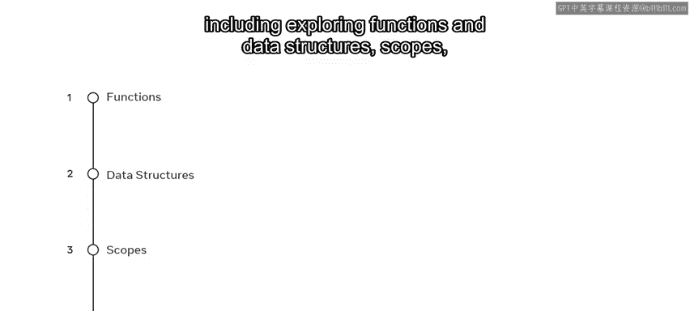
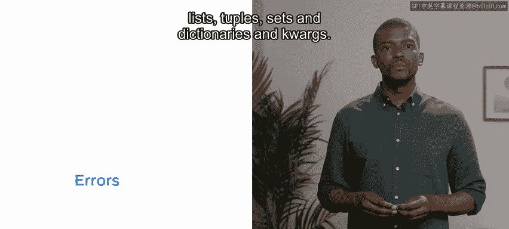
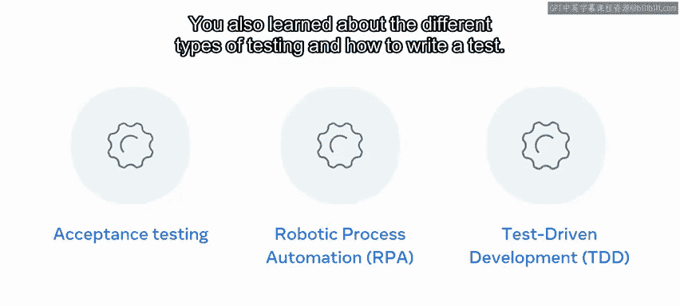

# Python编程课程回顾：P66：课程总结与回顾

在本节课中，我们将对Python编程基础课程的核心内容进行简要回顾。我们将梳理从入门到进阶的关键知识点，为接下来的毕业评估做好准备。

## 概述

本课程介绍了Python开发的基础知识。我们将简要回顾所涵盖的内容。

## 模块一：Python入门 😡

在第一个模块中，你学习了开发者在现实世界中使用Python的不同方式，并了解了Python存在的理由。你通过运行Visual Studio Code和执行操作系统环境检查来确认你的硬件和软件，识别了任何必需的依赖项。你探索了变量和数据类型，并处理了字符串、类型转换和数据文件。这引导你进入了控制流和条件语句部分，在那里你使用了Python运算符，并在代码中构建了循环和流程控制。

## 模块二：核心编程技能

上一节我们介绍了Python的基础语法，本节中我们来看看一些核心的编程技能。

你学习了函数和数据结构、作用域，并深入研究了以下几种核心数据结构：

*   **列表**：有序、可变的元素集合。例如：`my_list = [1, 2, 3]`
*   **元组**：有序、不可变的元素集合。例如：`my_tuple = (1, 2, 3)`
*   **集合**：无序、不重复的元素集合。例如：`my_set = {1, 2, 3}`
*   **字典**：键值对的集合。例如：`my_dict = {"key": "value"}`

在编写了所有这些代码之后，是时候检查错误了。你通过研究错误、异常和文件处理，并思考错误处理的方法，完成了模块二的学习。

## 模块三：编程范式与算法

课程进行到将近一半的模块三时，你全面了解了函数式编程和面向对象编程的范式及其相关的逻辑概念。你还初步认识了算法，以及Python中的类和实例。

以下是本模块涉及的核心概念：
*   **函数式编程**：强调使用纯函数和不可变数据。
*   **面向对象编程**：使用**类**（Class）作为蓝图来创建**对象**（Object/Instance）。例如：`class Dog:` 和 `my_dog = Dog()`。
*   **算法**：解决问题的明确步骤序列。

## 模块四：提升开发环境

在接近课程尾声的模块四中 😡，你学习了如何通过使用Python中的模块、库和工具来提升你的编码环境。你还了解了不同类型的测试以及如何编写一个好的测试。

恭喜你完成了本课程的回顾！

## 总结

本节课中我们一起回顾了Python编程课程的四个核心模块：从环境搭建与基础语法入门，到掌握核心数据结构和错误处理，进而学习高级的编程范式与算法概念，最后了解如何利用丰富的模块和库来提升开发效率并进行测试。

现在，是时候在毕业评估中检验你的知识了。你准备好展示你所有的Python技能了吗？