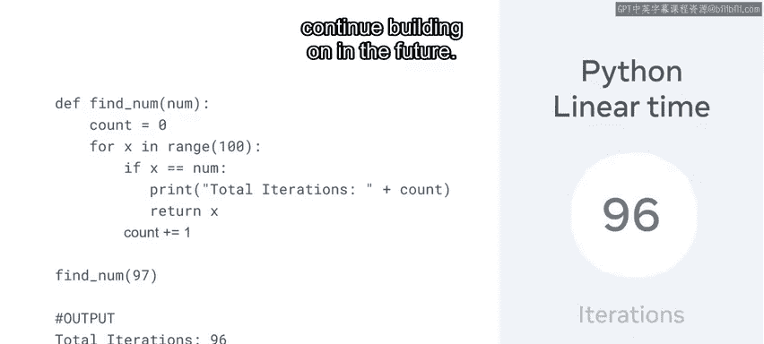
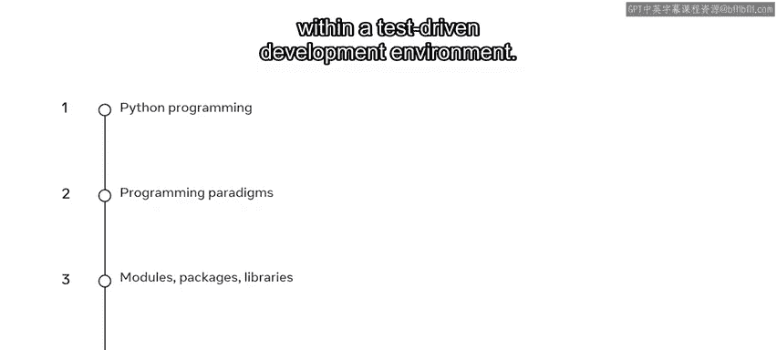
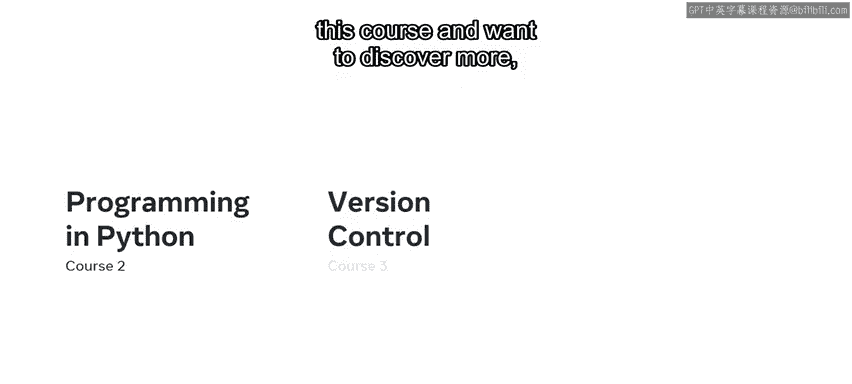
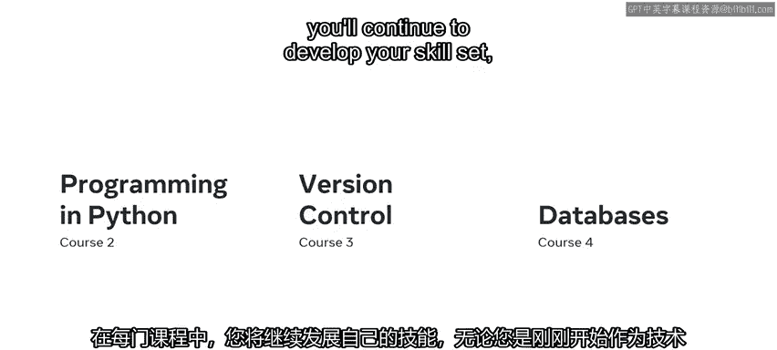
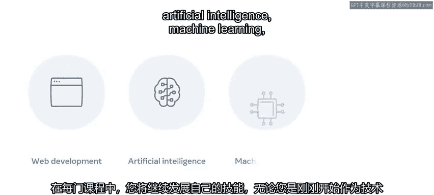
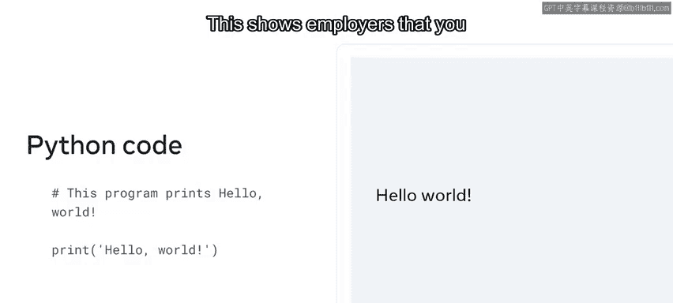
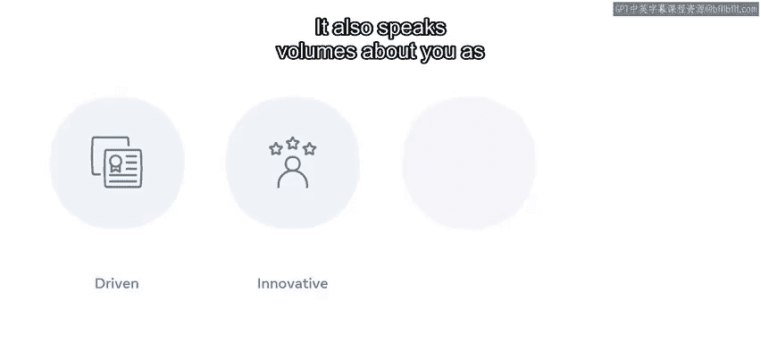

# Meta《数据库工程师（Python／数据库客户端／高阶数据建模／毕业项目／面试）｜Meta Database Engineer》中英字幕 - P67：66_恭喜您完成了Python编程.zh_en - GPT中英字幕课程资源 - BV1pZ421a749

Congratulations on completing the programming and Python course you've worked hard to get here and acquired a lot of important skills during the course You should now have a great foundation of back end web development skills This is the base for you to continue building on in the future。

And you've also demonstrated your skill set in the graded assessment。

Following completion of this first course， you should now be able to complete basic programming with Python。

 distinguish between the programming paradigms of procedural。

 functional and object oriented programming。Demonstrate how to use modules。

 packages and libraries and work within a test driven development environment。

 So what are the next steps Well， this is one course in the back end developer professional certificate While you've established a good foundation so far。

 there's still more for you to learn。

So if you've enjoyed this course and want to discover more。

 why not enroll in the other courses throughout each of these courses you'll continue to develop your skill set。

 whether you're just starting out as a technical professional or student。

 this project will equip you with the knowledge of backend development practices as used in many business areas such as web development。

Artificial intelligence。Machine learning。

Data analytics and many other applications you'll have written a portfolio of Python code that will demonstrate your skills to potential employers。

This shows employees that you are self driven and innovative。

It also speaks volumes about you as an individual and your drive to continue your growth。😡。

Once you've completed all the courses in this certificate。

 you'll receive a Co Serro certification for backend Develop。

These certifications provide globally recognized and industry endorsed evidence of mastering technical skills。

Congratulations once again on reaching the end of this course。

 it's been a pleasure to embark on this voyage of discovery with you。

Best of luck and do continue to follow your learning journey。

