# 数据库工程师：P70：MySQL Python连接 🔗

在本节课中，我们将要学习如何建立Python应用程序与MySQL数据库之间的连接。你将了解连接的基本原理、核心组件以及一个典型的数据查询流程是如何工作的。

---

## 连接的工作原理

许多日常使用的网络应用程序都依赖MySQL数据库来发送和存储数据，而这些应用程序中有许多是用Python开发的。数据库工程师可以使用MySQL Python连接，将基于Python的应用程序中的数据发送并存储到MySQL数据库中。

上一节我们介绍了连接的重要性，本节中我们来看看连接是如何具体工作的。

连接是通过一个称为**应用程序编程接口**（API）的软件组件建立的。API也常被称为**驱动程序**或**客户端**。API是一组编写的程序或软件，它充当了前端Python应用程序和后端MySQL数据库之间的桥梁。

可以使用不同的API来创建这种连接，例如：
*   **SQLAlchemy**
*   **MySQLclient**
*   **MySQL Connector/Python**

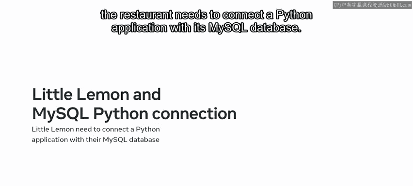

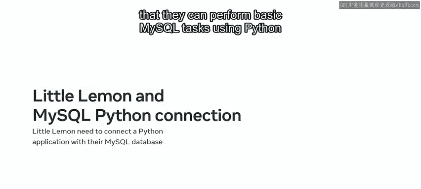

在本课程中，我们将重点介绍最常用的API：**`MySQL Connector/Python`**。

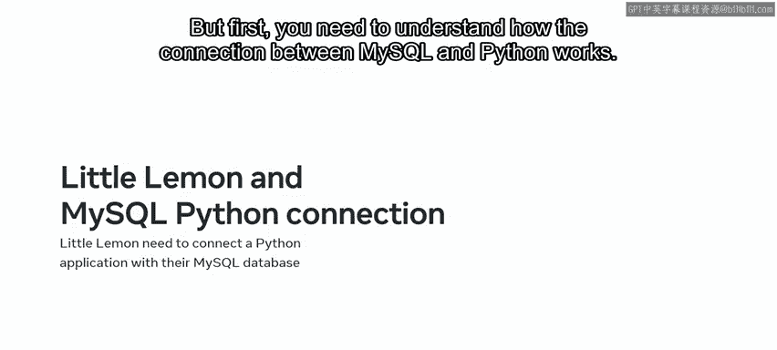

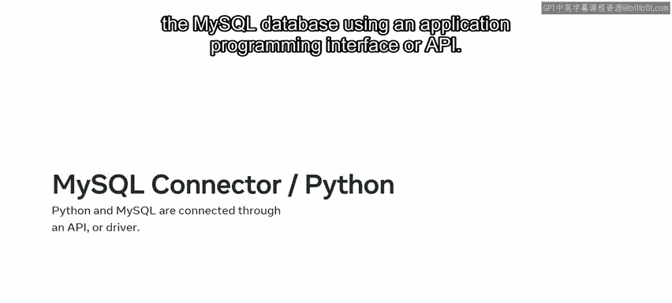

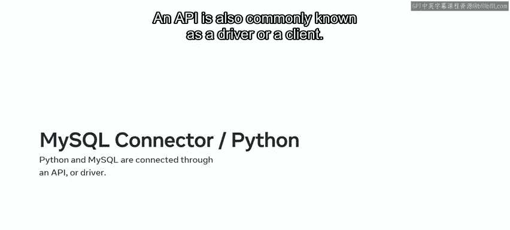

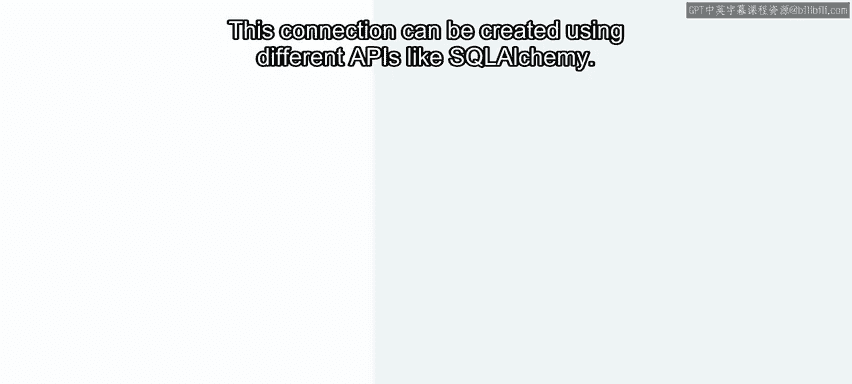

---

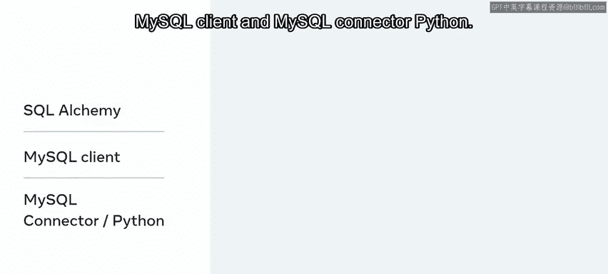

## 连接流程详解

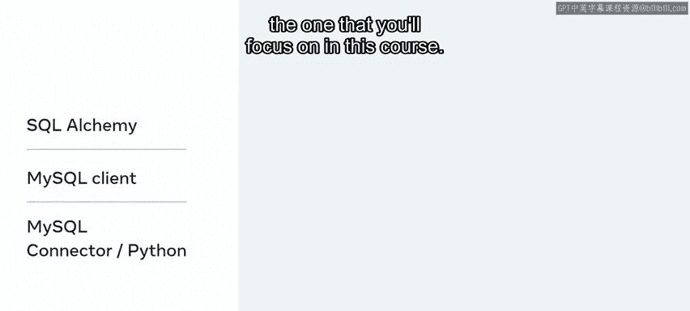

理解MySQL数据库与Python之间连接的一个有效方式是可视化。想象一个示意图：一边是Python应用程序，另一边是MySQL数据库，而连接这两者的中间元素就是`MySQL Connector/Python` API。

在一个典型的交互中，流程如下：

1.  前端Python应用程序向连接器API发送一个**连接请求**。这个请求是Python应用程序在请求访问数据库并使用Python检索信息的权限。
2.  API将这个请求转发给后端的MySQL数据库。
3.  数据库接受连接，并通过API向Python应用程序发回一条消息，确认连接已建立。换句话说，MySQL通过API授予Python应用程序访问数据库的权限。

连接建立后，你可以从连接器类实例化一个**游标**（cursor）实例。当创建了游标对象后，你就可以使用Python在MySQL数据库中执行SQL查询了。

---

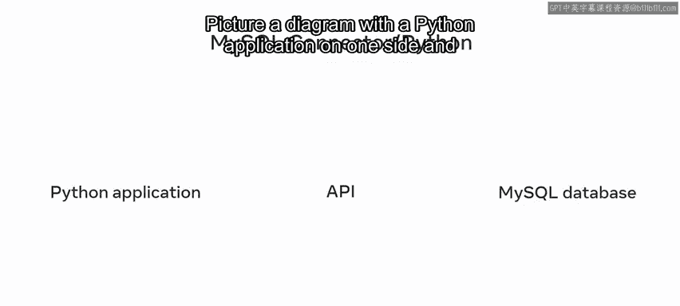

## 实战示例：Little Lemon餐厅

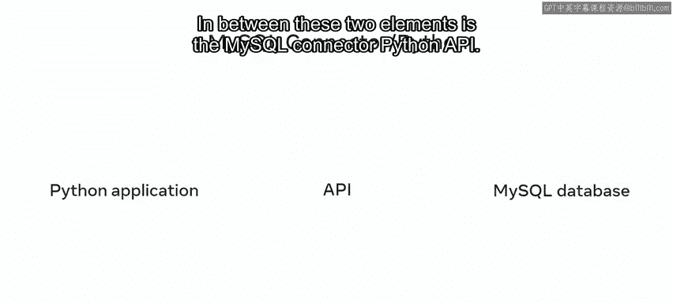

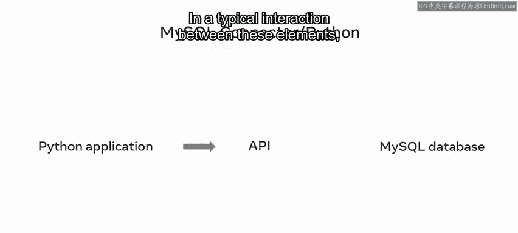

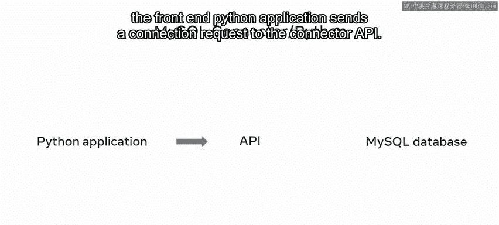

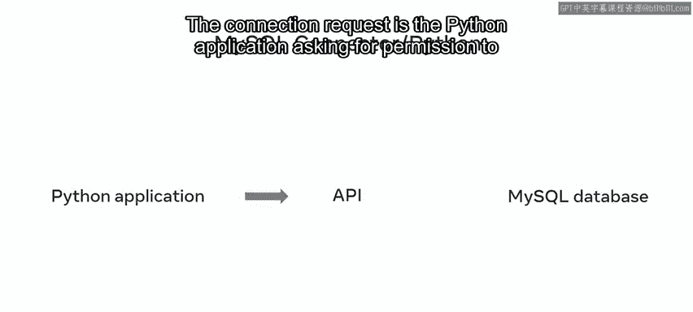

让我们以Little Lemon餐厅的数据库为例。Little Lemon需要通过他们的Python应用程序查询客人晚餐的到达时间。


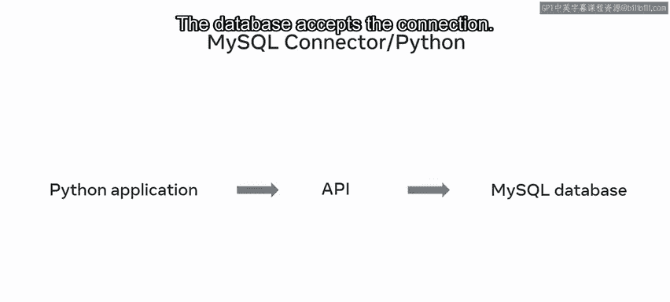

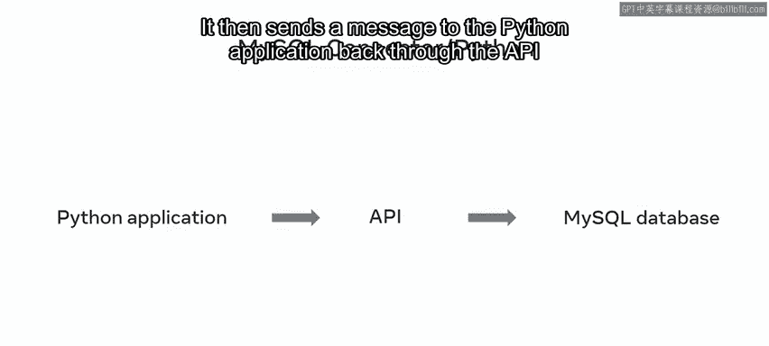

客人的预订日期和时间数据存储在后端数据库中。因此，Python应用程序使用游标对象的`execute`模块来执行客户的查询需求。

以下是执行查询的核心代码步骤：

```python
# 1. 建立数据库连接
connection = mysql.connector.connect(host='localhost', database='little_lemon', user='user', password='password')

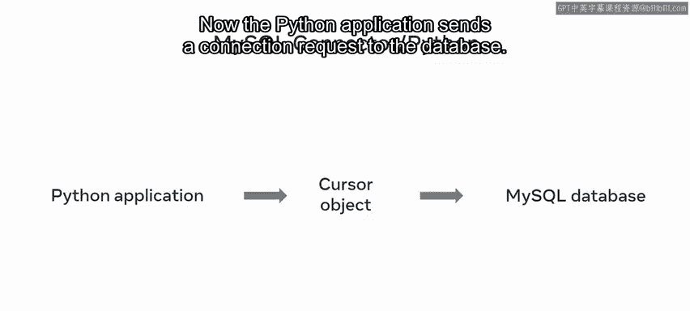

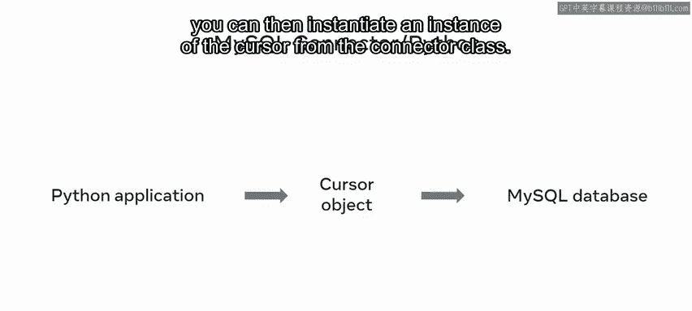

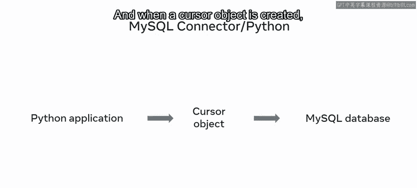

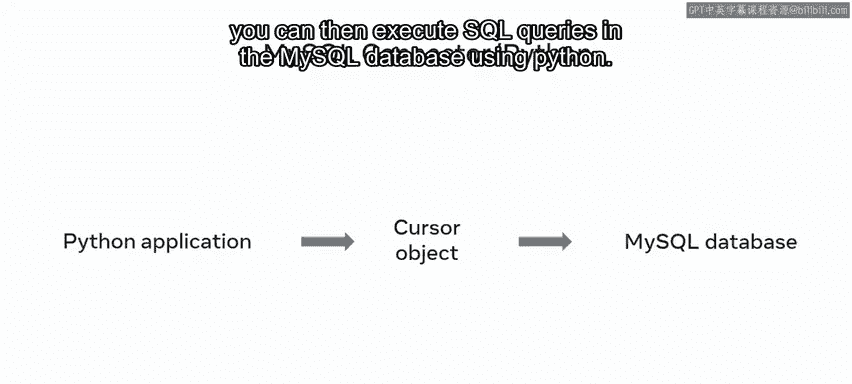

# 2. 创建游标对象
cursor = connection.cursor()

# 3. 使用游标执行SQL查询
cursor.execute("SELECT booking_time FROM bookings WHERE guest_name = 'John Doe'")

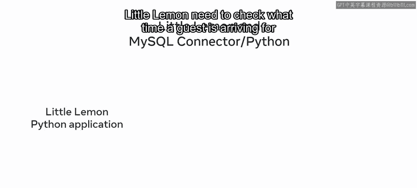

# 4. 获取查询结果
records = cursor.fetchall()
```

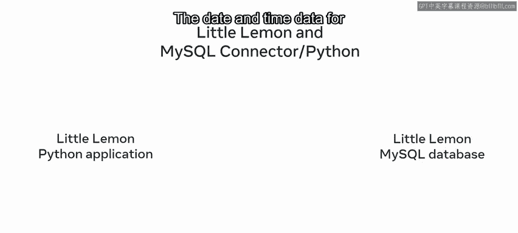

查询结果会通过游标对象以**元组**的形式返回，显示每位客人的预订时间槽。

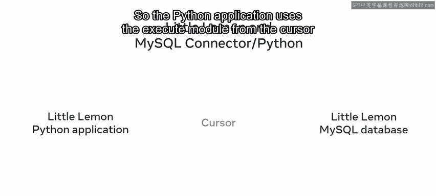

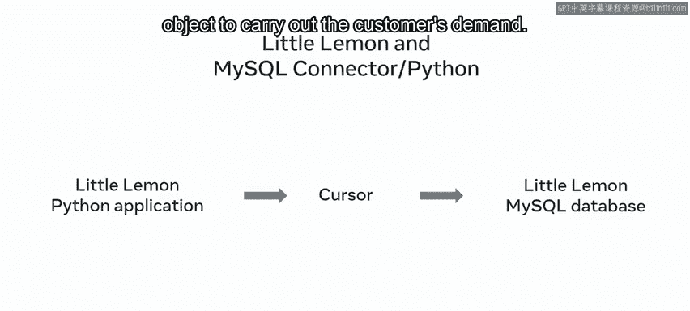

请求完成后，可以关闭游标对象和数据库连接。

---

## 总结

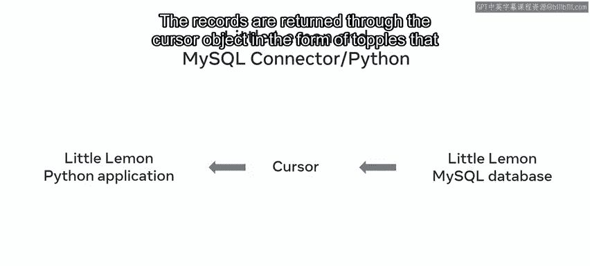

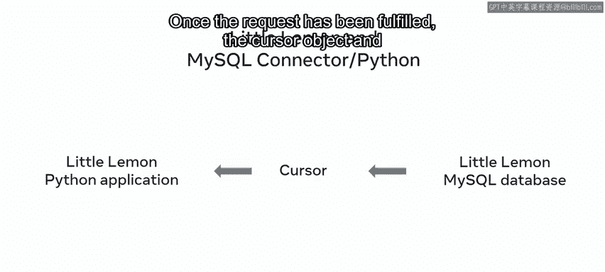

本节课中我们一起学习了Python应用程序与MySQL数据库之间连接的工作原理。我们了解到连接是通过`MySQL Connector/Python`这样的API建立的，它充当了应用程序和数据库之间的桥梁。连接建立后，通过创建游标对象，我们可以使用Python执行SQL查询并获取结果。掌握这一连接机制是进行后续数据库操作的基础。