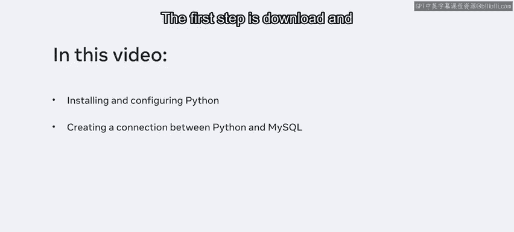
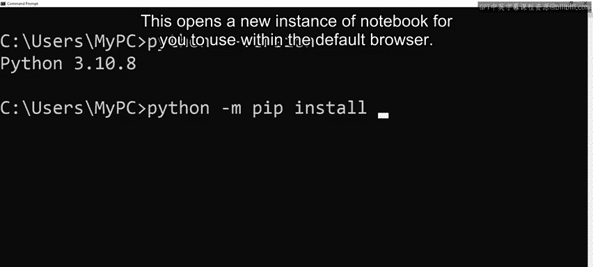
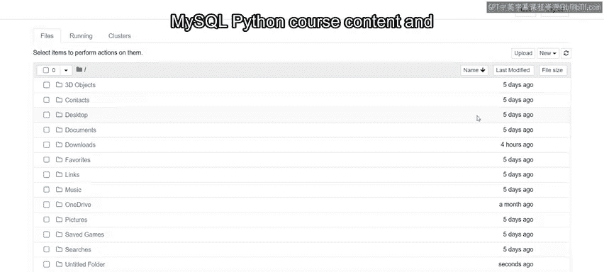
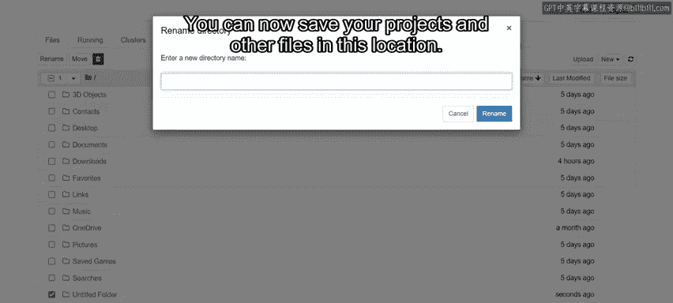
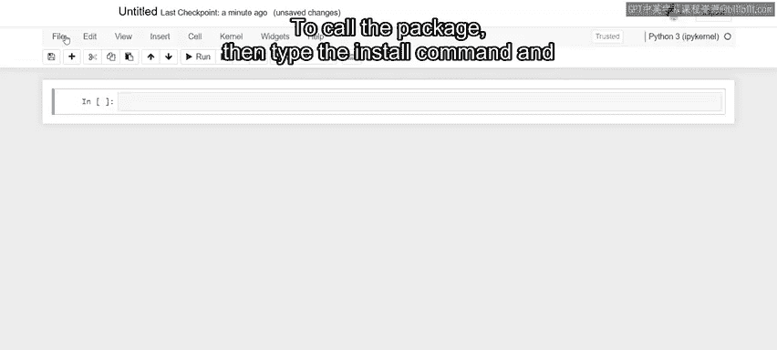
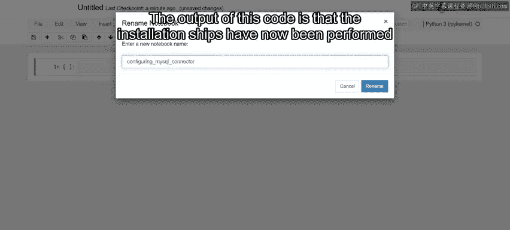
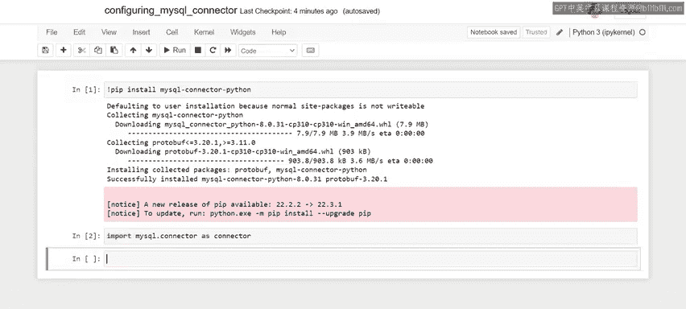
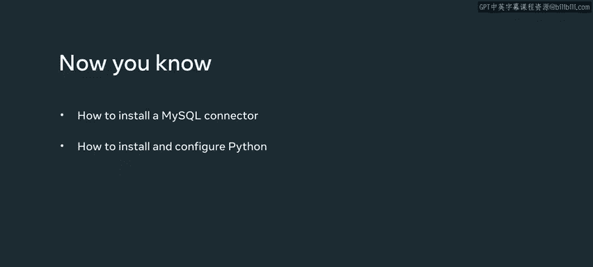

# Meta《数据库工程师（Python／数据库客户端／高阶数据建模／毕业项目／面试）｜Meta Database Engineer》中英字幕 - P71：3_安装和设置.zh_en - GPT中英字幕课程资源 - BV1pZ421a749

As a database engineer， you'll frequently work with Python to perform Cd operations in a Mysql database。

 But before you can work with Python， you first need to install and configure Python software on your system so that you can create a connection between Python and MysqL。

 Let's look at the installation and configuration process for creating this connection。

The first step is to download the most recent version of Python from the Python。 org website。

 Foow the site's installation instructions。 Once you've installed Python。

 you then need to open the application， Select the search icon and access the command prompt。

 type Python dash dash version to identify which version of Python is running on your machine。

If Python is correctly installed， then Python 3 should appear in your console。

 This means that you are running Python 3。 There should also be several numbers after the three to indicate which version of Python 3 you are running。

Make sure these numbers match the most recent version on the Python。 org website。

 If you see a message that states Python not found。

 then review your Python installation or relevant document on the Python website。

 Now that you've installed Python， you need to choose an IdeE or integrated development environment to run your code on。

This is software that you can use to display your code。

This course uses the Jupiter I DE to demonstrate Python。

 So it's probably best if you also use the Jupiter environment to install Jupiter type Python dash M。

 Pip， install Jupiter。

Once Jupiter is installed， type Python dash M Note。

This opens a new instance of the notebook for you to use within your default browser。Now。

 you can set up your working environment。 select the new button in Jupiter， then choose a new folder。

 This action generates an unnamed folder。 Rename the new folder to MysqL Python course content and then access it。

 You can now save your projects and other files in this location。

Now select new again and choose the Python 3 IPPY kernel option。

This opens a U tab in which you can enter your code。

You now need to connect Python to your MysQqL database You can create the installation using a purpose built Python library called Mysql connector Python。

 This library is an API that provides lots of useful features for working with MysqL。

The MysQL connector Python needs to be installed separately using a package installer called Pip。

The Pip package is included with the Python software you just installed。

Rename the notebook instance 2 configuring My SQL connector。

Now you need to use PIip to install a MysQL connector Python。

To install the connector， type an exclamation mark and then Pip to call the package。

Type the install command， then type the name of the library， which is MysQL dashash connector。

 dash Python。Finally， press shift and enter or select run to execute the code。

The output of this code is that the installation steps have now been performed as required。

 and a list of libraries have been installed。 Python can now access the functionalities of all these libraries。

 You can import libraries in Python by typing the import command。

 The name of the library and an alias。 For example。

 to import Mysql connector Python in a cell in your Jupiter notebook。

 Just type import Mysql dot connector as connector。

 The import syntax tells Python that there is a library you want to import and make use of。

 The Mysql syntax refers to a subfold that Pip has installed， which hosts the connector。

The dot before connector is known as an access operator。

 It tells Python that you want to access the connector subfold using the dot operator。 Finally。

 the use of as is a method of renaming the import using aliasing。

 This is like the aliasing that you encountered in previous database courses when working with joins。

😊，Aliasing is a common practice in Python development。 You can use custom names。

 but best practice is to make use of common aliases that other developers are familiar with。

Now that you've typed the code， it's time to run it。

 If there is no output in the console when you run the code。

 then this means that the connector has been successfully installed。

 You can now communicate with your database。 You should now be familiar with the process of installing MysQL connector Python to create a bridge between your Python and MysQqL environments。

 And you also know how to install and configure a Python environment。 Great work。😊。

