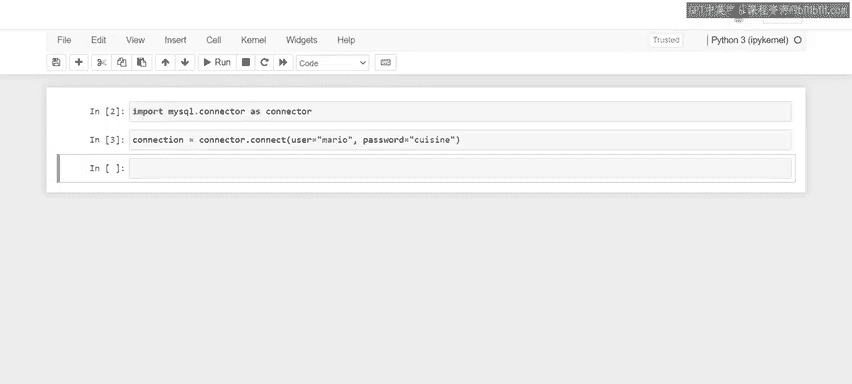

# Meta《数据库工程师（Python／数据库客户端／高阶数据建模／毕业项目／面试）｜Meta Database Engineer》中英字幕 - P72：4_使用Python客户端连接MySQL数据库.zh_en - GPT中英字幕课程资源 - BV1pZ421a749

A Python based application needs to be able to communicate with MysQqL databases to perform database operations。

 So this means that you need to create a connection between Python and Mysql。 For example。

 little lemon need to create a connection between their website。

 which relies on Python and their Mysql database so that customers can view data like menus and booking slots。

Let's take a few minutes to find out how a connection is established between Python and MysQL。

At this stage， you may be familiar with the Mysql Python Connector API softwareware package。

 This API facilitates the connection between Python and Mysql。 But first。

 you need to import it into your Python program。To import the connector API。

 type the import command followed by its name， MysqL dot connector， then select run。However。

 typing the Mysql dot connector each time you need to work with the API can be tedious。

 So let's create an alias instead， you can create an alias for the Mysql dot connector called connector。

 You can then make use of this shorthand to make your coding more efficient。 to create an alias。

 you can type import Mysql dot connector again or use the existing code But this time include as connector within your statement。

 The as keyword instructs Python to recognize import Mysql dot connector using the connector alias in all future code。

Now， each time you need to use the MysqL Python connector API， you just type its alias。

 which is connector， But make sure that you have installed the connector API first。 Otherwise。

 you'll encounter a module， not found error。You've now successfully imported the connector API also called the package or software。

 Now， you can begin to make use of its modules and functionality using the access operator or the dot。

 For example， you can help little lemon to make use of a connector to establish a connection between their Python based website and MysqL database。

 First， create a variable to access the connector from the connector module。

 call it connection and assign at the value of connector dot connect。 Next。

 pass the key arguments to the connect module within a pair of parenthses。

 These arguments are the database username and password。

 only an authorized user can access the database。 So in this instance。

 the user is Mariio and the password is quiisine。 By default。

 a connection is established between Python and the database installed locally on your machine。😊。

This database is called Local hosts。 It can also be accessed through its I P of 1，2，7 dot 0。

 dot 0 dot 1。You'll learn more about the local host and other arguments at a later stage in this course for now。

 you should be able to create a connection between Python and Mysql。 Nice work。😊。

