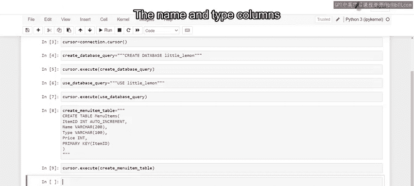
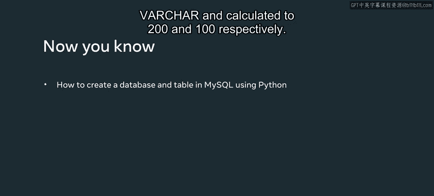

# Meta《数据库工程师（Python／数据库客户端／高阶数据建模／毕业项目／面试）｜Meta Database Engineer》中英字幕 - P73：5_使用Python在MySQL数据库中创建数据库和表.zh_en - GPT中英字幕课程资源 - BV1pZ421a749

You might be asking yourself， what actions can I take once I've established a connection between a Python client and a Mysql database？

 Well， some actions you can perform include creating databases and tables。 In this video。

 you will explore the process for creating databases and tables in a Mysql back end database using Python。

😊。

Little Lemon uses the Mysql connector Python client or API to communicate with their Mysql database。

 They need to communicate with the Mysql database to create a database and tables in which they can store data。

 Let's see if you can help them out。The connection between little Le's existing Mysql databases and their Python application has already been established within a connection object。

 So the first step is to create a cursor object that lets you communicate with the Mysql database。

 You'll learn more about cursors in a later lesson。 For now。

 you just need to know that a cursor object can be created by invoking the cursor module from the connection object。

A cursor object points the Python application to the location in the MysqL database where the required data is stored。

 Once you have a cursor object， you can run queries to the Mysql database。

 The cursor accesses an execute module that carries the SQL queries as Python strings to the MysqL database。

 You'll learn more about cursors at a later stage in this course。

 Now it's time to create a new database。Create a SQL statement as a Python string and pass it to a variable called Create database query。

The statement must create a database called Little Le。

 You can use triple quotes to change your statement to a Python string。

 You could also use single quotes to create a string。

 But the advantage of triple quotes is that you can use them to split a SQL query into multiple lines。

And it's much easier to read and manage a sQL query over multiple lines。

You now have a SQL query that you can run using the execute method from the cursor。Pass the variable。

 createate database query as an argument to the execute method on the cursor object。

Execute this code to create the little lemon database。 Next， you need to set the database for use。

 The first step is to create your SQL query as a Python string and pass it to a variable called use database query。

The query lets you make use of the little Le database through the use command and the name of the database。

 Then pass the variable as an argument to the execute method。

 You now have a new database ready to use The next step is to create tables for the database。

 Cate a variable called create menu item table for your SQL query。

 Then create your SQL query as a Python string so that you can pass it to the variable。😊。

Create the query using the Create table command to create a table called menu items。

The columns that little lemon need in this table include item I D， name， type and price。

 The item I D column must hold the I D for each item on the menu。

 It's assigned an integer data type and rendered as auto increment。

 This means that a new I D is assigned to each item in numeric order。

The name and type columns display the name of each item in the menu and the type of cuisine that it associated with。

Both the name and type columns are assigned a data type of varchar and character limits of 200 and 100 respectively。

The price column must display the price of each item in the menu。 It's assigned an integer data type。

The item ID column is assigned the table's primary key。

Then execute the Cate menu item table by invoking the execute module from the cursor object。

You can use this same method to create further tables within the database。

 just update your SQL query as needed。Little Lemon now have a new database and table in their Mysql database。

 and you should now be familiar with the process for creating a database and table in a Mysql back end database using Python while developing a Python based front end application。

