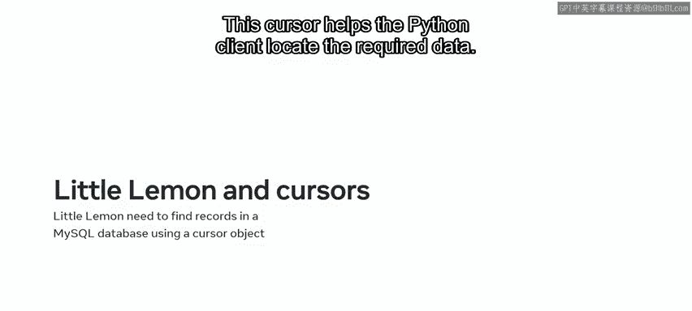
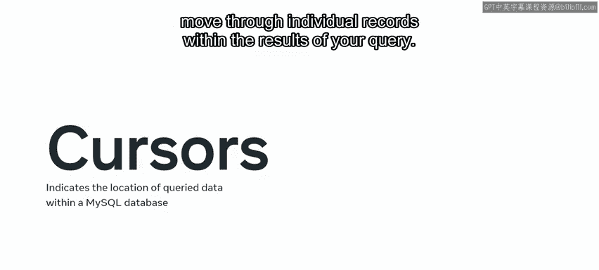
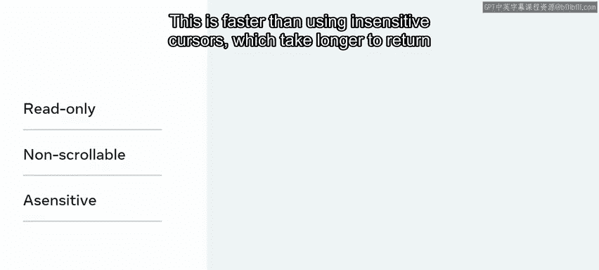
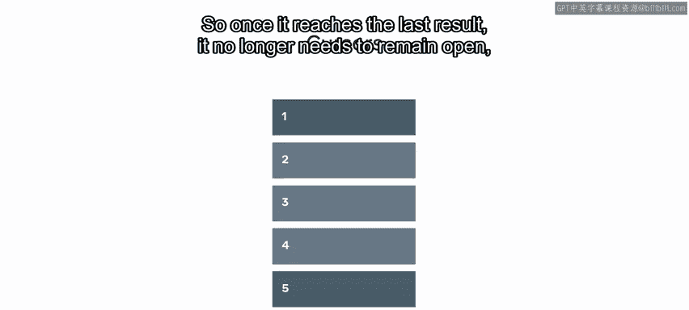
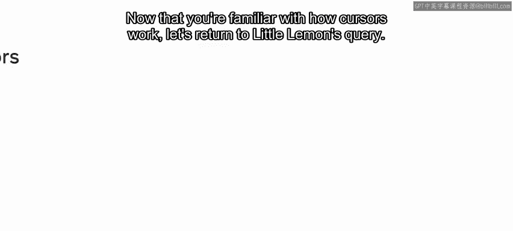
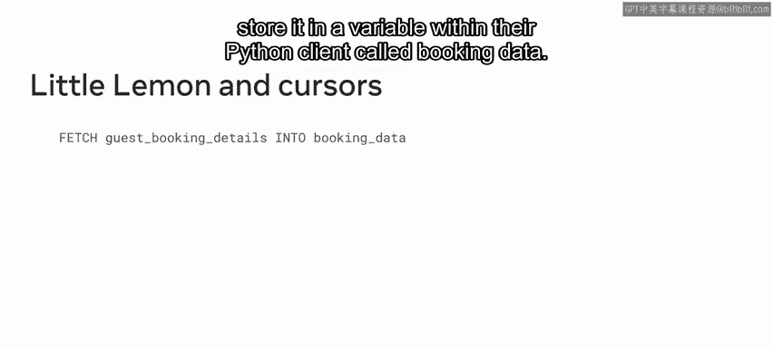

# 数据库工程师（Python／数据库客户端／高阶数据建模／毕业项目／面试）｜Meta Database Engineer：P74：游标和MySQL 🎯

在本节课中，我们将要学习在Python前端客户端访问MySQL后端数据库时，一个核心概念——游标。我们将了解游标是什么、它的关键特性以及它在数据库查询中是如何工作的。

## 什么是游标？📍

当使用Python前端客户端访问MySQL后端数据库时，你的Python应用程序需要知道完成查询所需的数据存储在何处。游标指示了这些数据在数据库中的位置。



让我们通过Little Lemon数据库的一个例子来理解游标。Little Lemon需要检索一位客人的预订详情。他们可以使用Python执行SQL `SELECT`查询来完成此任务。然而，Python前端客户端需要知道数据存储在MySQL后端数据库的哪个位置。MySQL数据库可以使用一个游标对象来指向Little Lemon所需的记录。这个游标帮助Python客户端定位所需的数据。

这个例子很好地解释了数据库工程师所说的“游标”一词。**游标是一个指针，它将Python客户端指向MySQL数据库中你的SQL查询结果**。游标通过识别特定的行或记录来指示查询数据的位置。你可以使用游标来读取、检索和遍历查询结果中的单个记录。

## 游标的关键特性 🔑

游标有几个对数据库工程师特别有用的关键特性或特征。

以下是游标的主要特性：



*   **只读性**：游标是只读的，因此你无法更新与其关联的数据。结果不能被修改，它们由游标保存。
*   **不可滚动性**：游标按顺序获取记录，这有助于在处理单个记录时跟踪你的位置。你不能在记录之间跳过或跳转，也不能以相反的顺序获取它们。
*   **敏感性**：游标是敏感的。这意味着它们指向MySQL数据库中的原始数据，而不是副本。这比使用不敏感游标更快，因为不敏感游标只能指向数据的副本，所以返回结果需要更长的时间。



上一节我们介绍了游标的基本概念和特性，本节中我们来看看如何在MySQL数据库查询中使用游标。

## 如何使用游标？⚙️

在MySQL数据库查询中使用游标需要遵循几个步骤。

以下是使用游标的标准流程：

1.  **声明游标**：使用 `DECLARE` 语句并为你的游标分配一个自定义名称，后跟 `CURSOR` 关键字。然后使用 `FOR` 关键字和一个相关的SQL `SELECT` 语句来确定游标的用途。
    ```sql
    DECLARE cursor_name CURSOR FOR SELECT_statement;
    ```
2.  **打开游标**：输入 `OPEN` 命令并调用你的游标名称以建立结果集。此时，游标正指向你的 `SELECT` 语句的结果集。
    ```sql
    OPEN cursor_name;
    ```
3.  **获取结果**：输入 `FETCH` 命令和你的游标名称。然后输入 `INTO` 关键字，后跟结果需要传输到的位置名称。例如，结果可以传输到一个局部变量中，以便在你的Python应用程序中使用。
    ```sql
    FETCH cursor_name INTO variable_name;
    ```
4.  **关闭游标**：输入 `CLOSE` 命令，后跟游标名称。
    ```sql
    CLOSE cursor_name;
    ```


关闭游标始终是一个好习惯，可以释放与其关联的内存。正如之前所学，游标是不可滚动的，它按顺序处理结果集。因此，一旦它到达最后一个结果，就不再需要保持打开状态。所以关闭游标以释放它使用的内存。



## 回到Little Lemon的示例 🍋



现在你已经熟悉了游标的工作原理，让我们回到Little Lemon的查询。

Little Lemon可以使用游标来检索客人的预订数据。首先，他们声明一个名为 `guest_booking_details` 的新游标。这后面跟着一个SQL `SELECT` 语句，该语句从Little Lemon的MySQL数据库中定位客人的数据。然后他们打开游标。接下来，他们获取数据并将其存储在其Python客户端中一个名为 `booking_data` 的变量里。

## 总结 📝



本节课中我们一起学习了MySQL数据库中的游标。你现在应该能够解释游标是什么、描述其关键特性并说明它们是如何工作的。随着课程的深入，你将更详细地探索游标，所以这是你MySQL Python之旅的一个良好开端。