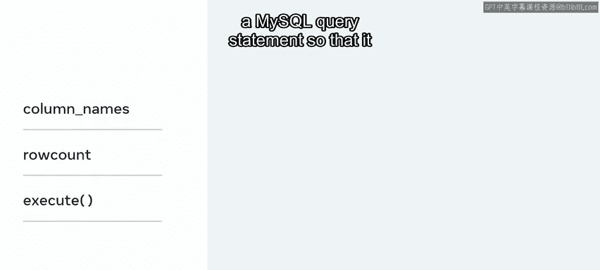
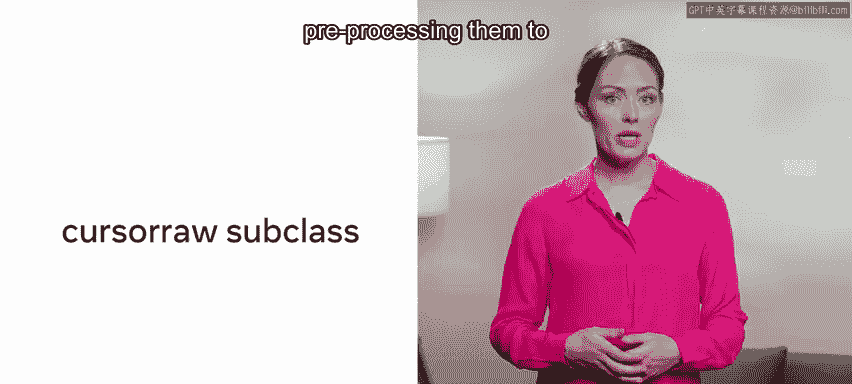
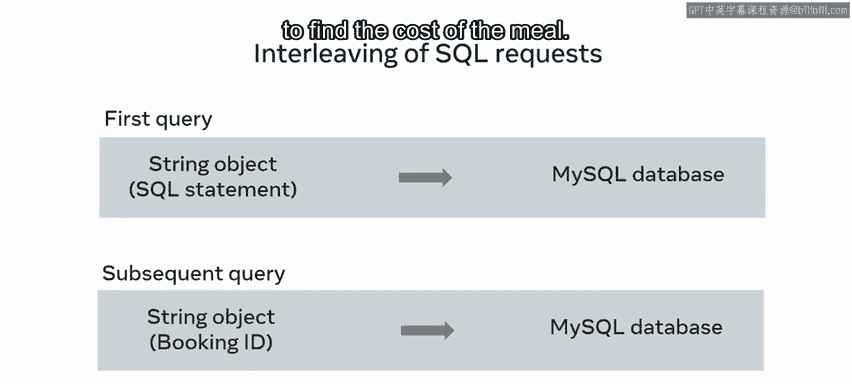
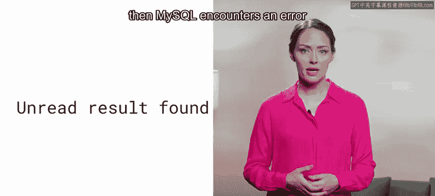
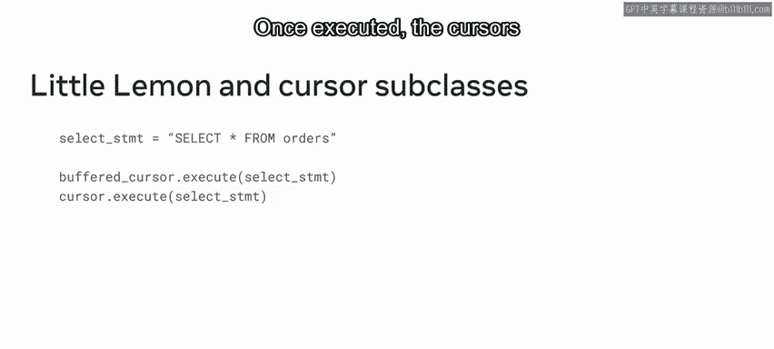

# Meta《数据库工程师（Python／数据库客户端／高阶数据建模／毕业项目／面试）｜Meta Database Engineer》中英字幕 - P75：7_游标子类.zh_en - GPT中英字幕课程资源 - BV1pZ421a749

At this stage of the course， you've explored how cursors can be used to point to the location of the data you require in a Mysql database。

 However， it's also important to understand how Python makes use of the cursor class。

 The cursor class converts MysQl records to more Python friendly code。 with Python。

 you can also change or alter the behavior of your cursors using cursor subclass。In this video。

 you'll explore the cursor class and subclass and develop an understanding of how they work。😊。

Little lemon need to find out how much one of their guests spent on their meal。

 They can query this data from their Mysql database in a more efficient manner by using cursor subclass to create their Python strings。

Let's take a few moments to find out more， starting with building an understanding of what database engineers mean by the term cursor classes。

Csor classes are a method of translating communications between Python and a backend MysQL database。

Python sends SQL statements to a MysqL database in the form of string objects。

 Cursor classes take these Python string objects and parse them into Mysql friendly commands and data types that can be understood by the database。

 Python then uses the cursor class when retrieving these results to parse them into Python friendly code。

The cursor class contains several subclass， which can be used to parse string objects in different ways。

 depending on your needs。At this stage of the course。

 you may have seen some examples of subclass in action in the form of attributes and methods。

For example， the column namess cursor attribute returns the column name of a result set from a SQL statement。

 rowow count returns an integer that represents the number of rows affected by a select。

 insert or update statement。 or there is the execute method。

 The execute method is the most common cursor function。

 It binds the parameters of a Python string argument to a Mysql query statement so that it can be executed on a MysqLl database。

 Cursor subclass inherit the properties of the parent cursor class。 In turn。

 the subclasses vary the parent class to improve the efficiency of the code。

Let's explore some examples of cursor subclasses。One example is the cursor raw subclass。

 This subclass returns the results of your variable without pre processing them to more Python friendly interpretations。

 So it uses less processing power， leaving you free to create custom conversions of the results。

 However， the disadvantage is that it requires more coding to process the targeted variable。

Little Le can use the cursor raw subclass to create their own custom data type conversion。

This could save time if the initial conversion type is not the one required。

Another example of a subclass is the MysQl cursor dictionary class。

 This returns each row as a dictionary， which helps with accessing variables。

 You can access variables by using direct variable names。

 Little lemon can make use of this subclass to return a result set in the form of a dictionary。😊。

This lets them use the actual column names of the database columns。

 Instead of working through a list of unnamed topples。 And finally。

 there's the buffered cursor class， which takes a subset of data and stores it in a buffered memory。

 The advantage to this subclass is that your code doesn't need to repeatedly request each row from the server。

 The disadvantage is that the data needs to be stored on local memory。

 So you can only use this subclass to return small data sets。😊。

Little lemon can use a buffered cursor class to retrieve data。

This lets them make interleaving SQL requests。 Interleaving of SQL requests is when you take part of a SQL query result and use it to make a subsequent request from a database。

 Let's take an example where little lemon need to find out how much a guest spent on a meal。

 They can interleave a SQL request to carry out this task for their first query。

 They create a MysQL query as a Python string that retrieves the guest's booking Id。

 Once they have the result of the first query， They then create a second or subsequent query that uses part of the first result。

 which is the booking Id to find the cost of the meal。 In other words。

 little Le can use part of their first query within their second query to make a subsequent request from the database。

A database can return multiple results from the first query。

 If you use the first result within your subsequent query before all other results are returned。

 then My SQL encounters an error called unread result found。

 So it's best practice to finish your loop and let all results print from the first query before you make any subsequent queries。

 However， you can avoid this if you first buffer the results using a buffered cursor。

The buffered cursor returns all rows， While a standard cursor requires you to send an individual query to each affected row。

Now that you're familiar with the different cursor subclasses。

 let's look at the syntax for instantiating them。The syntax is very similar across all subclasses。

 You just pass a keyword argument to the cursor that alters its behavior in a particular way。

To create a standard cursor， you create the cursor as an object。

 So to instantiate an instance of a cursor subclass。

 you add the subclass as a keyword argument that alters the behavior of the cursor。 For example。

 you can pass buffered as the keyword to create a buffered cursor or pass raw as the keyword to create a raw cursor or a dictionary to use a dictionary cursor。

 Little Le can use a cursor subclass to request all data from the orders table in the Mysql database。

 They can create two cursor instances。 One buffered and the other a standard implementation。

They pass their sequL select statement as an argument to both cursors。 Once executed。

 the cursors return all items from the orders table。

 You should now understand the concept of cursor subclass and how they can be used to alter or change the behaviour of a cursor。

Great work。