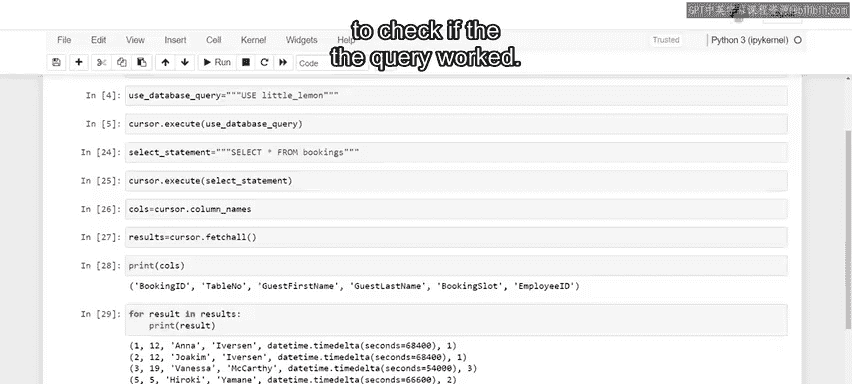
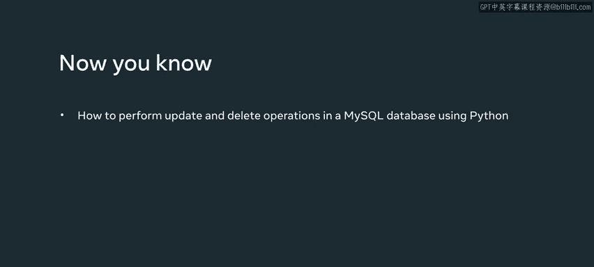

# 数据库工程师：P78：使用Python更新和删除MySQL数据库中的记录

在本节课中，我们将学习如何使用Python对MySQL数据库执行更新和删除操作。这些是数据库日常维护和应用程序交互中的核心CRUD操作。

## 概述

我们将通过一个餐厅预订管理的实际案例，演示如何编写Python代码来更新和删除MySQL数据库`bookings`表中的记录。课程将涵盖SQL `UPDATE`和`DELETE`语句的构建与执行，以及如何在Python中提交更改和验证结果。

---

## 了解数据表结构

在开始操作之前，我们先了解一下目标数据表。`bookings`表存储了餐厅客人的预订信息，包含以下字段：
*   `BookingID`：预订ID
*   `TableNumber`：桌号
*   `FirstName`：客人名
*   `LastName`：客人姓
*   `BookingSlot`：预订时间段
*   `WaiterID`：服务员ID

我们的任务就是帮助Little Lemon餐厅使用Python更新和删除这张表中的记录。

---

## 更新数据库记录

上一节我们了解了数据表的结构，本节中我们来看看如何更新已有的记录。在数据库中，更新数据需要使用`UPDATE`语句。

以下是更新记录的基本步骤：

1.  **构建SQL更新语句**：首先，需要编写一个包含`WHERE`子句的SQL `UPDATE`查询，以精确指定要更新哪条记录。例如，更新某位客人的桌号。
    ```sql
    UPDATE bookings SET TableNumber = %s WHERE BookingID = %s
    ```
    在Python中，我们将此查询语句保存为一个字符串对象，例如`update_bookings`。

2.  **执行更新操作**：使用数据库游标的`execute()`方法来运行这个查询，并传入需要更新的具体值（如新的桌号和目标预订ID）。

3.  **提交更改**：为了将更改永久保存到数据库，必须调用连接对象的`commit()`方法。

**实践示例**：假设我们需要将预订ID为6的客人Diana Pinto的桌号更新为10。
```python
# 假设 cursor 是数据库游标， connection 是数据库连接
update_query = "UPDATE bookings SET TableNumber = 10 WHERE BookingID = 6"
cursor.execute(update_query)
connection.commit()
```
执行后，可以查询验证数据是否已正确更新。

---

## 删除数据库记录

学会了更新记录后，接下来我们学习如何删除记录。当客人取消预订时，就需要从数据库中删除对应的记录。

以下是删除记录的核心步骤：

1.  **构建SQL删除语句**：编写一个使用`WHERE`子句的`DELETE`语句，以确保只删除特定的记录。通常使用`BookingID`作为条件。
    ```sql
    DELETE FROM bookings WHERE BookingID = %s
    ```
    同样，在Python中将其创建为字符串对象，例如`delete_booking`。

2.  **执行与提交**：使用`execute()`方法运行删除查询，然后使用`commit()`方法提交更改。

**实践示例**：删除预订ID为4的客人Marcos Romero的记录。
```python
delete_query = "DELETE FROM bookings WHERE BookingID = 4"
cursor.execute(delete_query)
connection.commit()
```
执行后，重新查询`bookings`表，可以确认Marcos Romero的记录已不存在，这表明删除操作成功。

**高级技巧**：你还可以修改`DELETE`语句中的`WHERE`子句，使用更复杂的条件。例如，删除那些`TableNumber`或`WaiterID`为`NULL`的无效预订记录。
```sql
DELETE FROM bookings WHERE TableNumber IS NULL OR WaiterID IS NULL
```

---



## 总结



本节课中，我们一起学习了使用Python进行MySQL数据库更新和删除操作的关键技能。我们掌握了如何构建并执行`UPDATE`和`DELETE` SQL语句，如何通过`commit()`方法确认更改，以及如何验证操作结果。这些是构建能够与数据库交互的Python应用程序的基础操作。