# Meta《数据库工程师（Python／数据库客户端／高阶数据建模／毕业项目／面试）｜Meta Database Engineer》中英字幕 - P81：13_模块小结 使用Python对MySQL数据库执行高级查询.zh_en - GPT中英字幕课程资源 - BV1pZ421a749

Congratulations， you've reached the end of the second module in this course。

 You should now be familiar with how to perform queries in a My equalql database， using Python。😊。

Let's take a few moments to recap some of the key skills that you've gained in this module's lessons。

In the first lesson， you learned how to perform， create， read， update， and delete。

 or Cd operations in a MysQL database using Python。

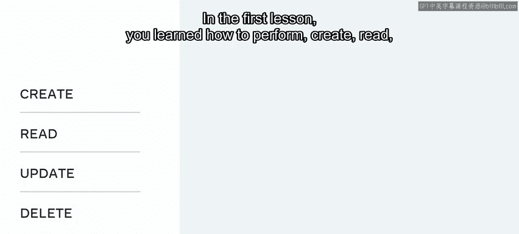

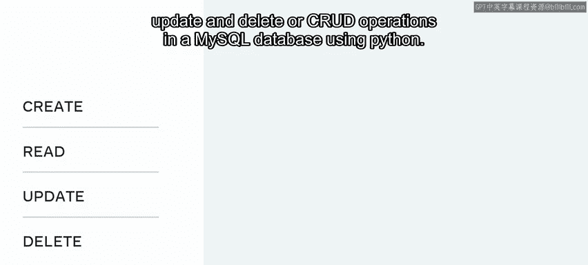

You started this lesson with a recap of how to create data in a MysQL database using an insert statement。

 you then learned how data is inserted into a MySQL database using Python。

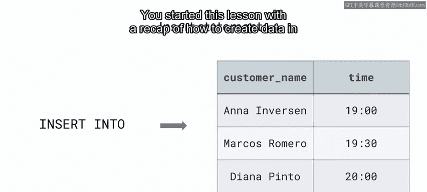

First， it's created as a Python string argument。 This argument is then passed to a Mysql database using a connector。

 The connector parses it into a format that Mysql can understand。

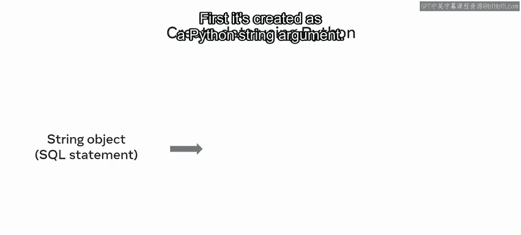

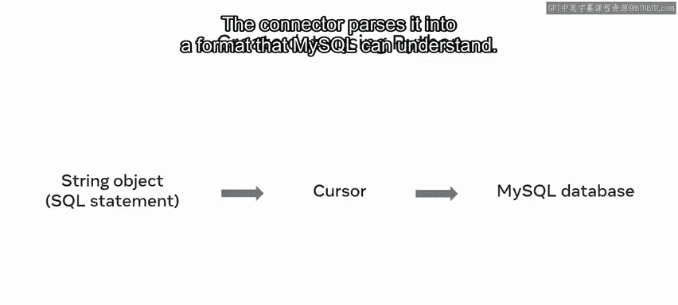

You then explored an example of the syntax used to render a MysQL database query as a Python string argument。

 and you explored an example of creating and reading data using Python from the little Lemon database。

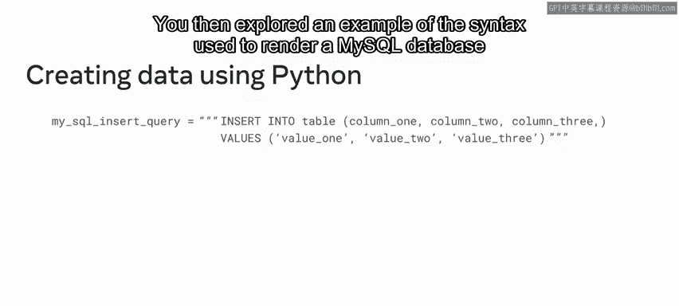

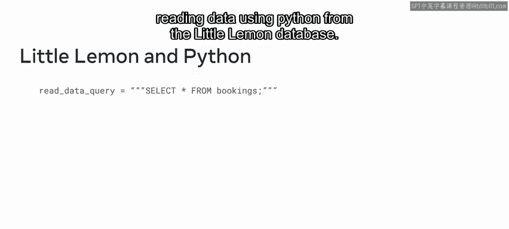

Next， you reapppped how to delete and update records in a MysQL database using update and delete operations。

 you learned how to create these queries as Python string arguments and explored some examples from the little Lemon database。

😊。

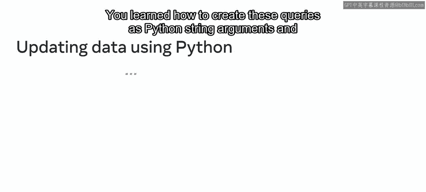

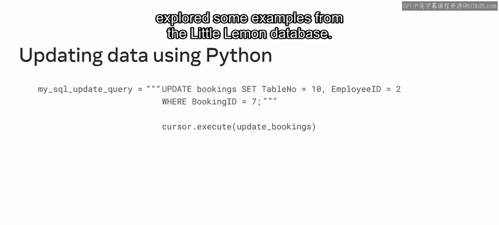

You then undertook a series of lab exercises in which you received the opportunity to perform Cd operations in your own Mysql database using Python。

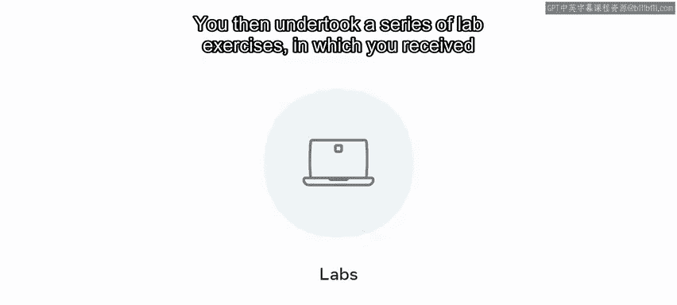

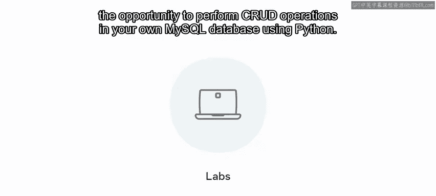

And you tested your knowledge of these topics by completing several quizzes。

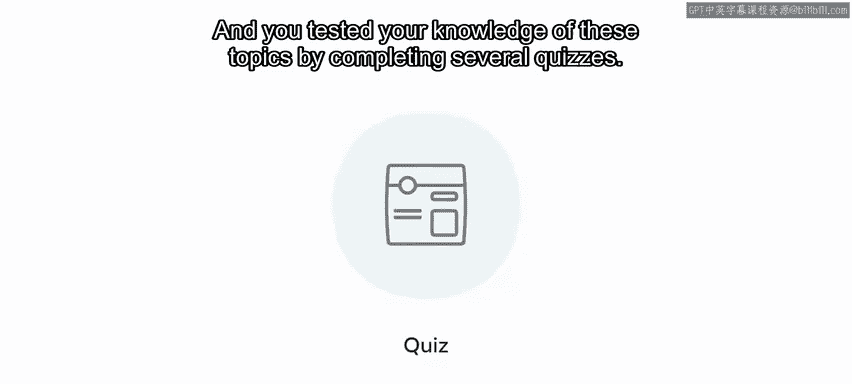

In the second lesson of this module， you learned how to perform advanced queries in a MysQL database using Python you began the lesson by learning how to filter and sort records in MysQL using Python。

You reapppped the basic filtering and sorting techniques that you learned in other courses。

These include the use of the where clause to satisfy one or more specific conditions。

 utilizing the order by clause to sort data in ascending or descending order and the inclusion of comparison operators to specify the exact data required。

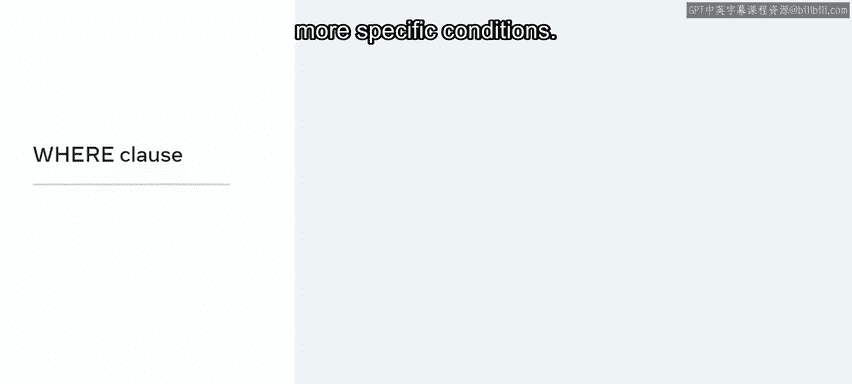

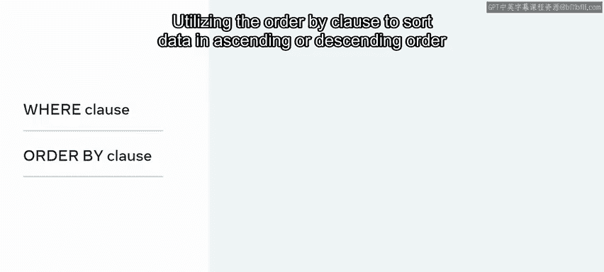

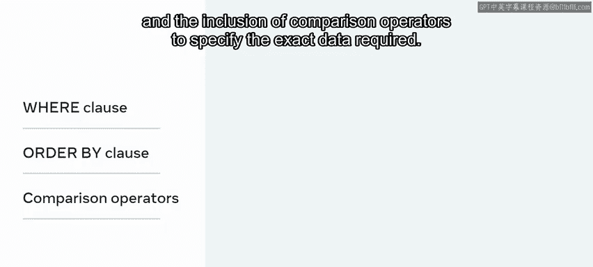

You then discovered how these techniques are used in Python by exploring several examples from the Little Lemon database。

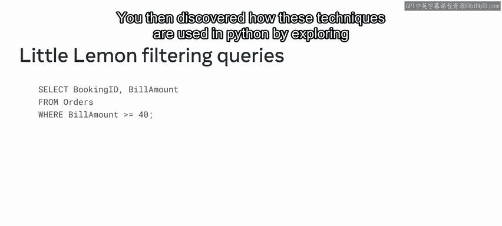

The next part of this lesson focused on joining data from different tables in a MysQL database using Python。

You recap the basics of the join clause and how it can be used to target a common column between two target tables。

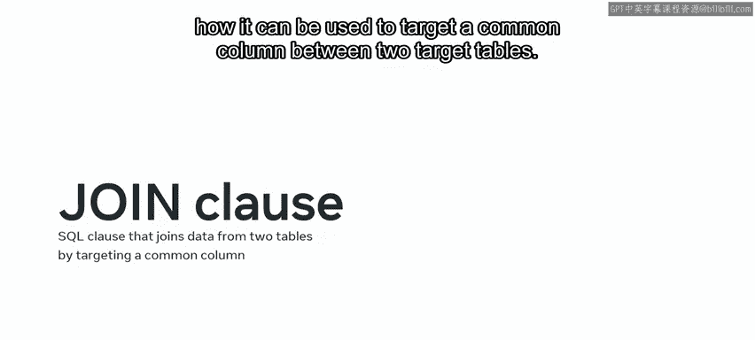

You then learned how join can be used with Python to extract data from a MysSQL database。

A SQL query is created using join as a Python string。

 The string is executed using the execute module on the cursor object。

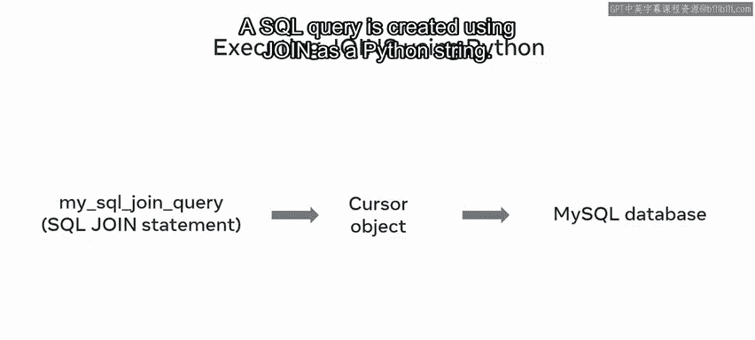

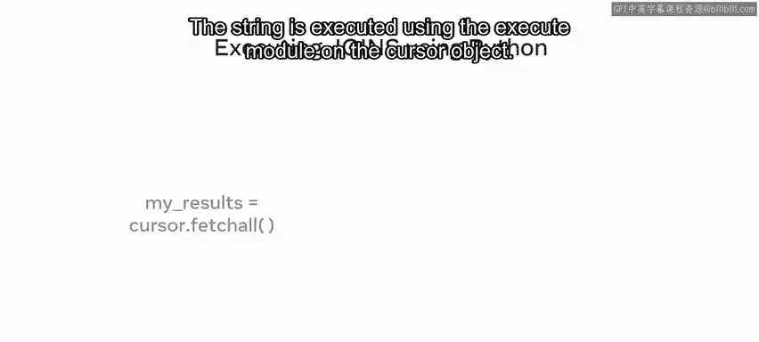

The results are then retrieved from the MySQL database using another variable that satisfies the query's conditions and the fetch all method。

😊。

You also explored an example of this process from the little Lemon database。

 and just like the first lesson， you also completed a lab exercise。

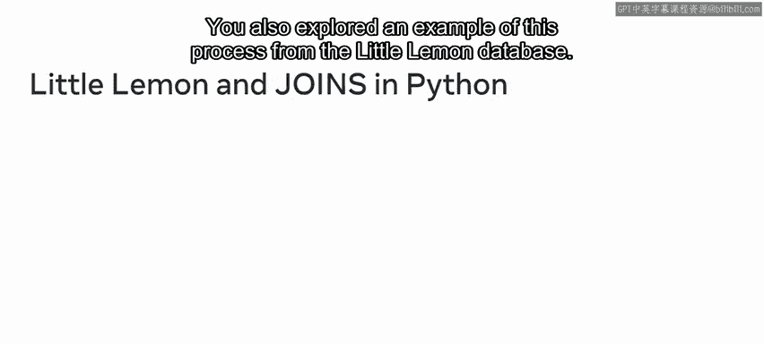

In this lab exercise， you performed a join operation using Python to extract data from a Mysql database。

 You then tested your knowledge of the process in a quiz。😊。

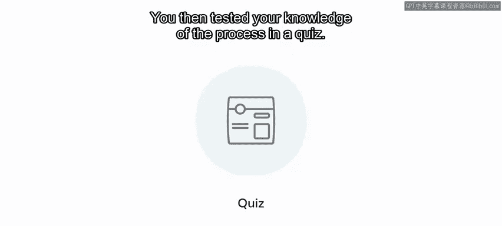

You should now be equipped with the skills and knowledge required to perform queries in a MysQL database using Python。

 well done。I look forward to guiding you through the next module in which you'll explore the topic of advanced database clients。

