# 数据库工程师：P82：MySQL函数快速回顾 📚

在本节课中，我们将要学习MySQL函数的基础知识。函数是存储在数据库中的可重用代码块，用于执行特定操作并返回结果。它们能帮助数据库工程师高效地处理数据，而无需重复编写代码。我们将回顾几种常见的MySQL函数类型，并了解如何在Python中使用它们。

---

## 什么是MySQL函数？🤔

上一节我们介绍了课程概述，本节中我们来看看MySQL函数的定义。

MySQL函数是一段执行特定操作并返回结果的代码。换句话说，它是一个将一组指令组合起来，并以输出形式产生结果的任务。

**公式**：`函数(输入) -> 输出`

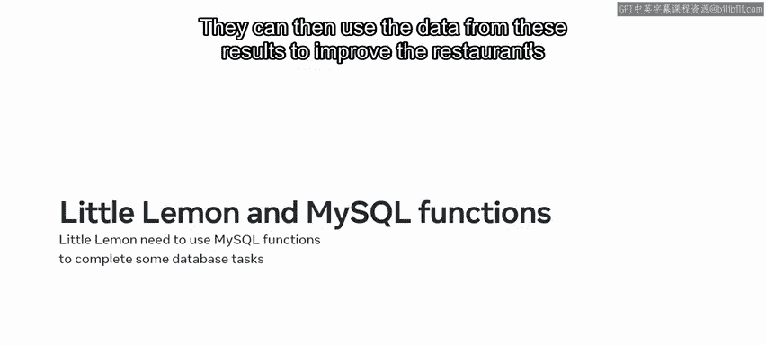

---

## MySQL函数的优势 💪

了解了函数的基本概念后，我们来看看使用MySQL函数有哪些好处。

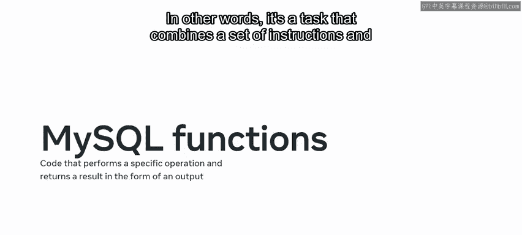

以下是MySQL函数的主要优势：

*   **数据操作**：非常适合对数据库中的数据进行操作。
*   **参数化**：部分函数可以接受参数或参数。
*   **自定义功能**：可以创建自定义函数，将多个任务组合在一个代码块中。
*   **存储与调用**：可以将函数存储在数据库中，并在需要时调用。
*   **可重用性**：可用于完成重复性任务，无需重写代码。

---

## 常见的MySQL函数类型 📊

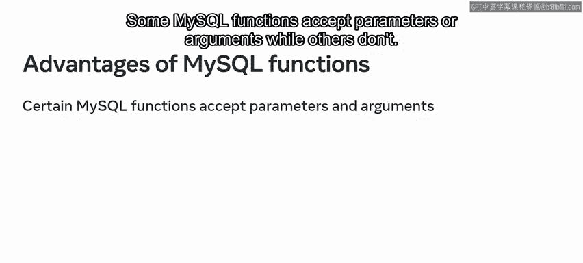

在数据库工程的学习过程中，你可能已经使用过多种类型的函数。MySQL中最常见的内置函数包括以下几类。

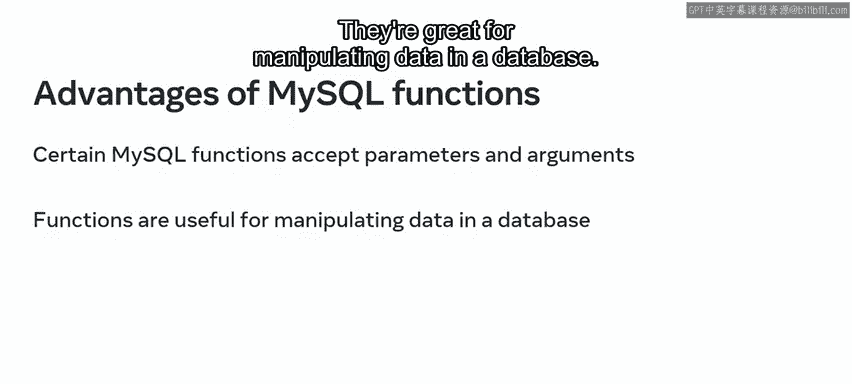

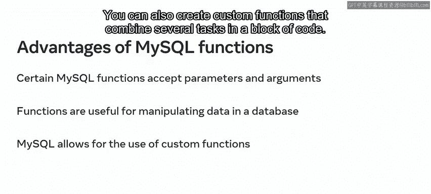

以下是主要的MySQL内置函数类型：

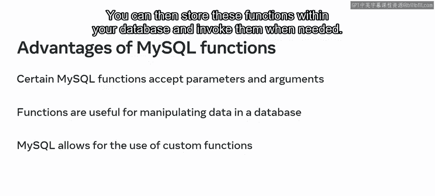

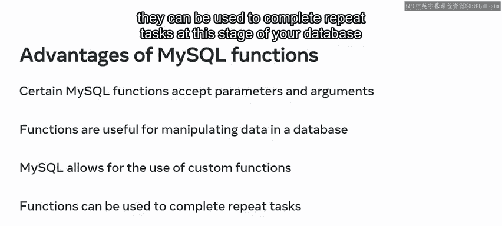

1.  **字符串函数**：用于操作字符串值。
2.  **数值函数**：包括聚合函数和数学函数。
3.  **日期与时间函数**：用于提取和格式化日期时间值。
4.  **比较函数**：用于比较数据库中的值。
5.  **控制流函数**：用于评估条件并决定查询的执行路径。

---

### 字符串函数 🔤

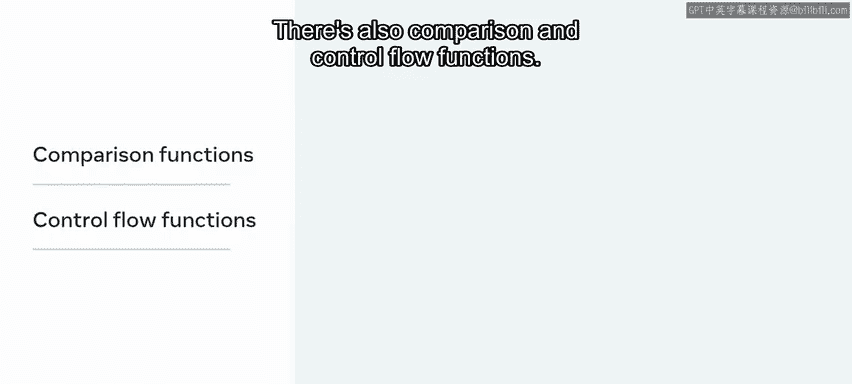

让我们花点时间回顾这些不同类型函数的基础知识，并看看Little Lemon餐厅如何利用它们。首先从字符串函数开始。

字符串函数用于操作字符串值，例如连接字符串或提取字符串的一部分。

**示例**：`CONCAT`函数。`CONCAT`将两个独立表中的数据合并成一个字符串。

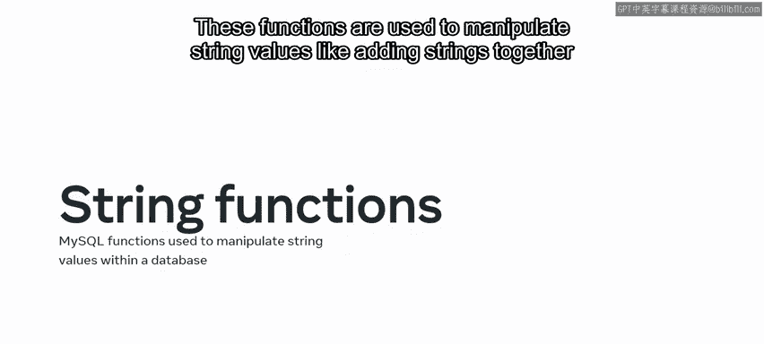

**代码示例**：
```sql
SELECT CONCAT(first_name, ' ', last_name) AS full_name FROM customers;
```

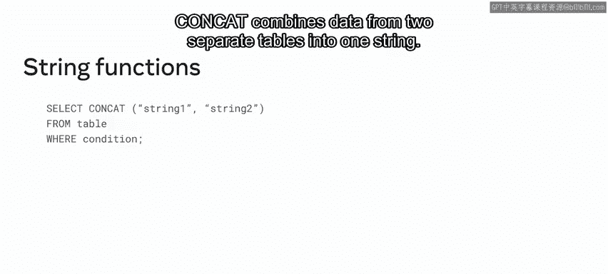

Little Lemon可以在其数据库记录上使用`CONCAT`字符串查询函数，来提取每位客户的信息，例如他们消费了多少钱。

---

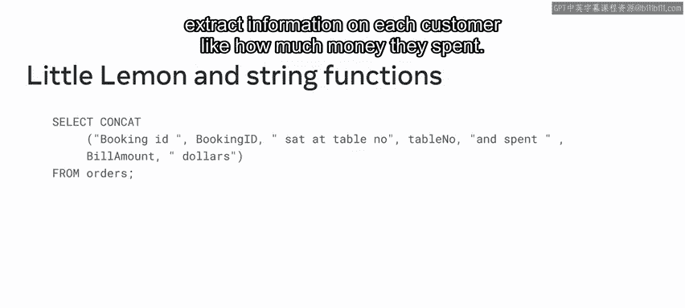

### 数值函数 🔢

接下来是数值函数。数值函数包括聚合函数和数学函数。这些函数用于对数值数据集执行常见任务。


**示例**：`AVG`函数。Little Lemon可以使用`AVG`数值函数来确定每位客户在餐厅消费的平均金额。

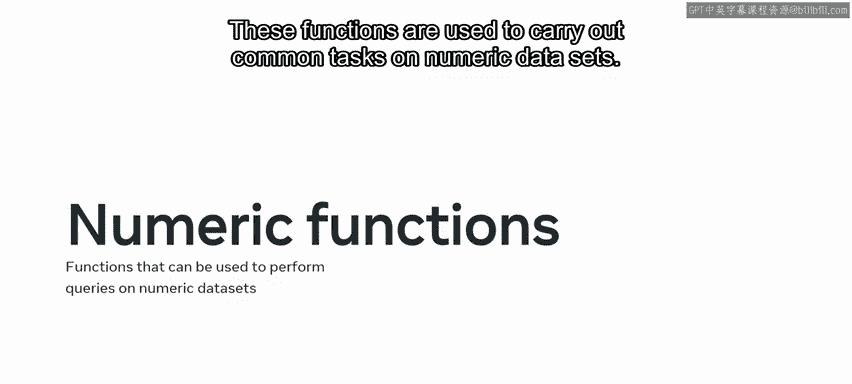

**代码示例**：
```sql
SELECT AVG(bill_amount) AS average_spent FROM orders;
```

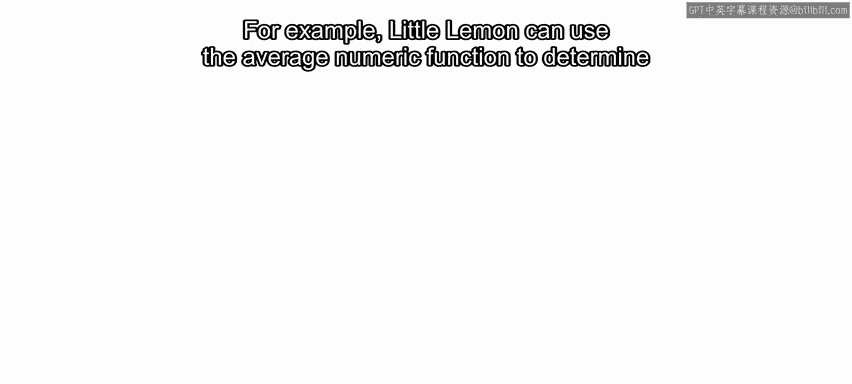

---

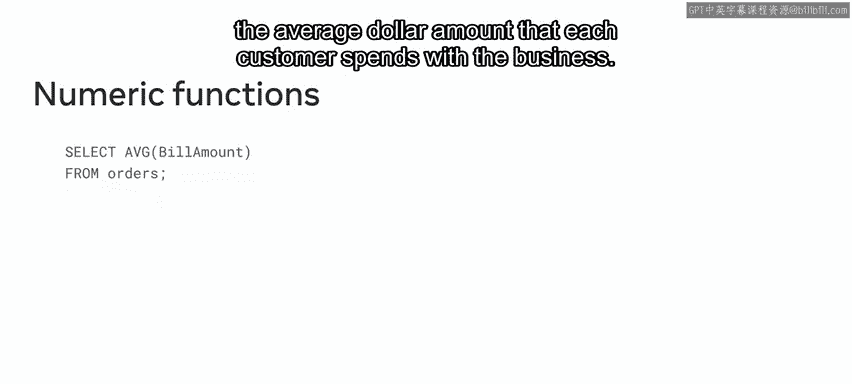

### 日期与时间函数 📅

MySQL函数的另一个例子是日期与时间函数。

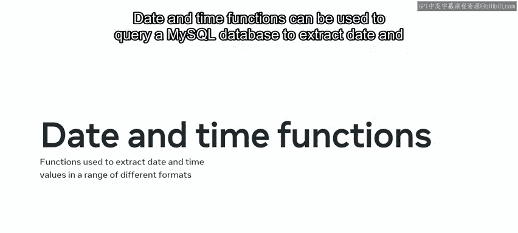

日期与时间函数可用于查询MySQL数据库，以根据查询需求提取各种不同格式的日期和时间值。

在Little Lemon，他们经常提取日期和时间数据来分析客户行为。他们可以利用这些数据找出客人在餐厅停留的时间以及哪些日子最繁忙。

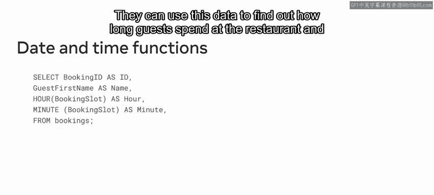

---

### 比较函数 ⚖️

接下来是比较函数。你可以使用这些函数来比较数据库中的值，它们可以用于许多不同类型的值，如数字、字符串和字符。

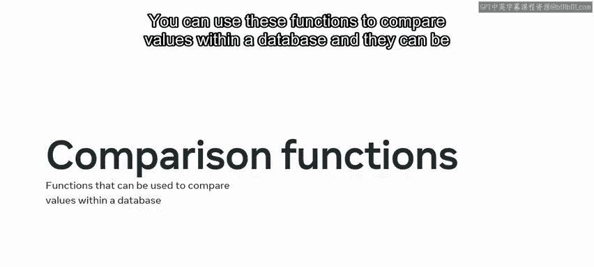

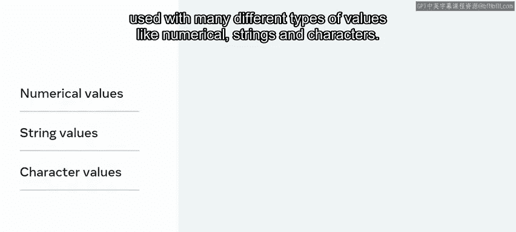

Little Lemon利用比较函数，通过对销售数据使用`GREATEST`和`LEAST`比较函数，来识别菜单上最畅销和销量最低的菜品。

---

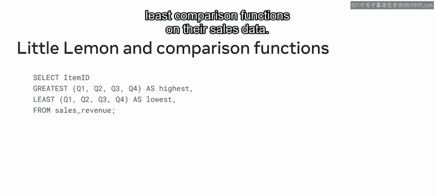

### 控制流函数 🧭

最后是控制流函数。控制流函数用于评估条件并决定查询的执行路径或流程。

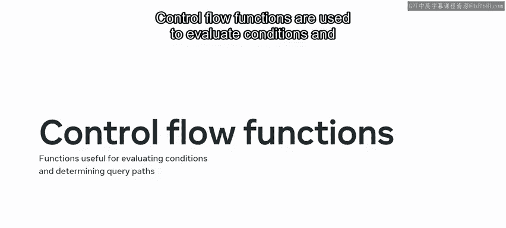

**示例**：`CASE`函数。`CASE`函数会遍历`CASE`块内的一组条件。一旦某个条件匹配，它就返回一个值；如果没有条件匹配，则返回`NULL`值。

**代码示例**：
```sql
SELECT menu_item_name,
       CASE
           WHEN cost_price > selling_price THEN 'Loss'
           ELSE 'Profit'
       END AS profit_status
FROM menu_items;
```

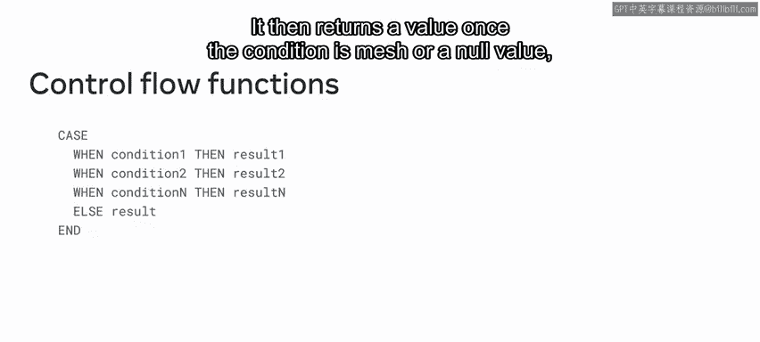

Little Lemon经常依赖控制流函数来确定其菜单上的哪些菜品是亏损的，哪些菜品已经转为盈利。

---

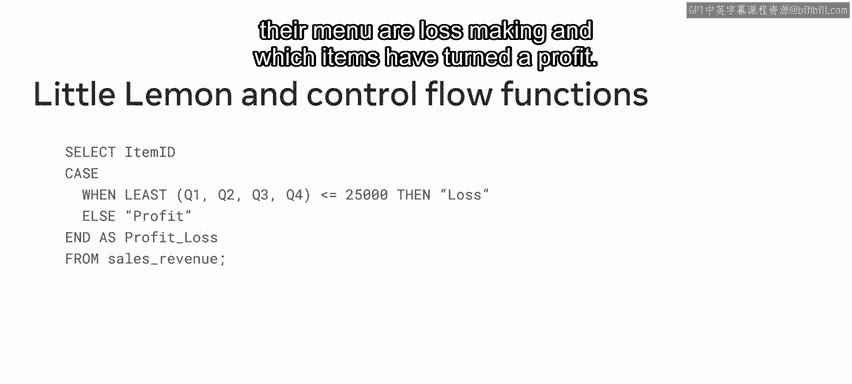

## 在Python中使用MySQL函数 🐍

现在你已经回顾了MySQL中可用的不同函数，让我们了解一下它们如何与Python协同工作。让我们以数值函数为例，看看Little Lemon如何计算每位客户的平均账单。

他们可以创建一个使用`AVG`函数来确定平均账单金额的`SELECT`查询。

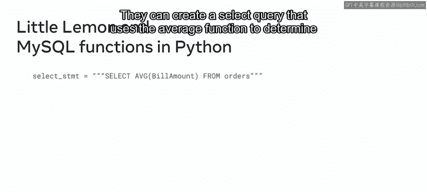

**代码示例**：
```python
# 假设使用mysql-connector-python
import mysql.connector

query = "SELECT AVG(bill_amount) AS average_bill FROM orders;"
# ... 执行查询并获取结果的代码
```

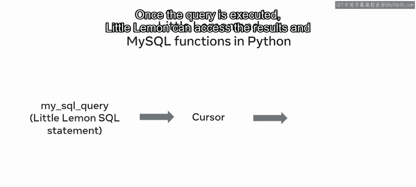

这个查询被传递给数据库执行。一旦查询执行完毕，Little Lemon就可以访问结果，查看每位客户在餐厅消费的平均金额。

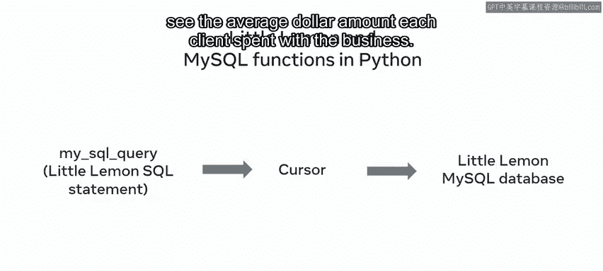

---

## 总结 ✨

本节课中我们一起学习了MySQL函数的基础知识。我们回顾了函数的定义、优势以及五种常见的函数类型：字符串函数、数值函数、日期与时间函数、比较函数和控制流函数，并通过Little Lemon餐厅的实例了解了它们的应用。最后，我们还简要演示了如何在Python中执行包含MySQL函数的查询。本课程的后续部分将更详细地探讨使用Python访问MySQL函数的方法。