# 数据库工程师（Python／数据库客户端／高阶数据建模／毕业项目／面试）：P84：使用Python处理日期时间函数 📅

在本节课中，我们将要学习Python中内置的`datetime`库，了解其核心功能，并学习如何运用这些函数来处理数据库中的日期和时间数据。我们将通过一个实际案例——为餐厅预订时间增加一小时——来演示其应用。

---

## 概述

作为数据库工程师，您可以使用日期和时间函数从数据库中提取时间与日期值。您也可以使用Python原生`datetime`库中提供的函数来完成类似任务。本节将介绍Python中可用的不同`datetime`函数及其使用方法。

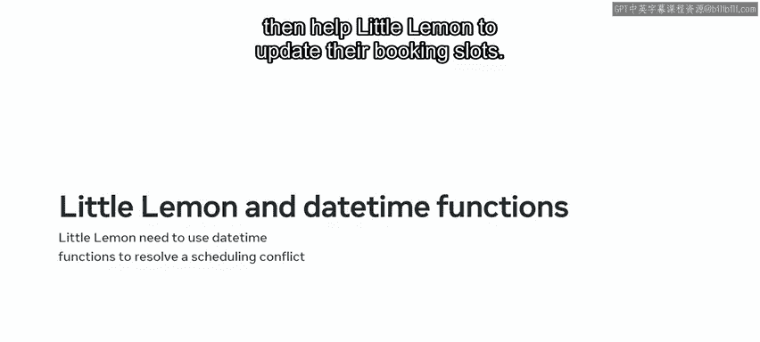

---

## Python的datetime类

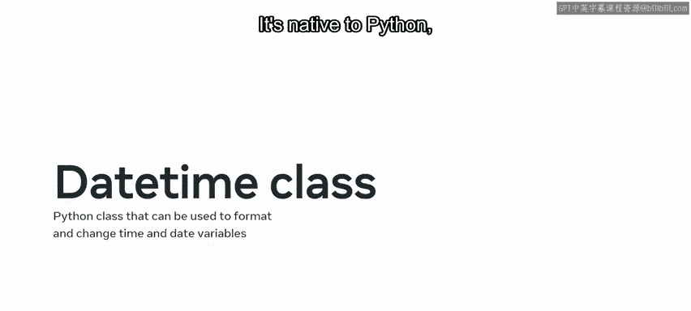

`datetime`是Python的一个类，内置了多个可用于格式化和更改时间、日期变量的函数。它是Python的原生库，无需使用Pip即可导入。

以下是Python `datetime`库提供的主要函数：

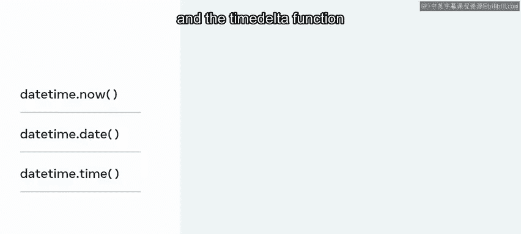

*   `datetime.now()`：用于获取当前日期和时间。
*   `datetime.date()`：用于仅获取当前日期。
*   `datetime.time()`：用于仅获取当前时间。
*   `timedelta()`：用于计算两个值之间的差值。

---

## 导入与基本语法


要使用`datetime`类，首先需要导入它。通常我们会为其创建一个别名以简化代码。

```python
import datetime as dt
```

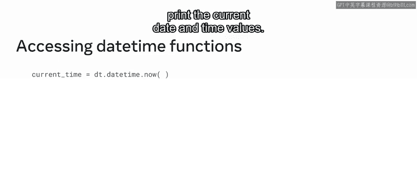

通过以上代码，我们导入了`datetime`库并为其创建了别名`dt`。现在，您可以使用`dt`来调用库中的函数，而无需每次都输入完整的`datetime`。

---

## 使用datetime.now()获取当前时间

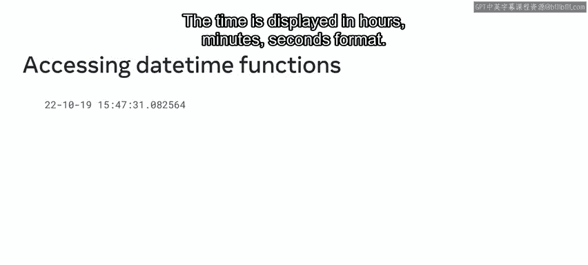

现在，您的Python环境中已创建了一个`datetime`对象。让我们看看如何使用`datetime.now()`函数。

首先，创建一个名为`current_time`的变量。然后，使用模块别名`dt`调用`datetime.now()`函数。最后，指示Python打印当前的日期和时间值。

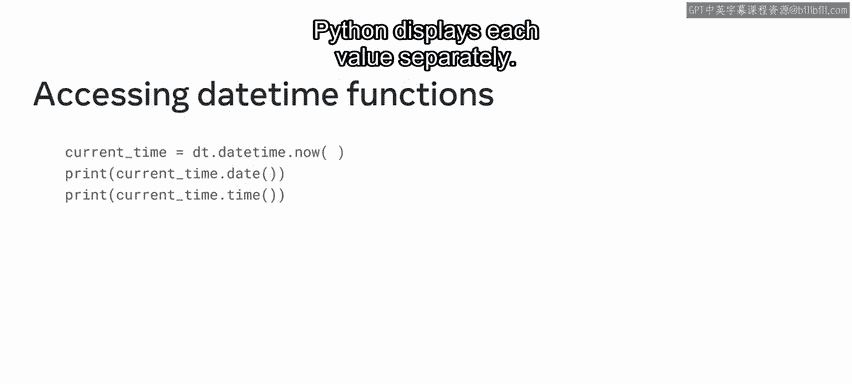

```python
current_time = dt.datetime.now()
print(current_time)
```

执行代码后，Python将返回您所在位置的日期和时间。日期以`年-月-日`的格式显示，时间则以`时:分:秒`的格式显示。

如果您只需要当前日期或当前时间，可以分别使用以下代码：

```python
print(dt.datetime.now().date())  # 仅打印日期
print(dt.datetime.now().time())  # 仅打印时间
```

---

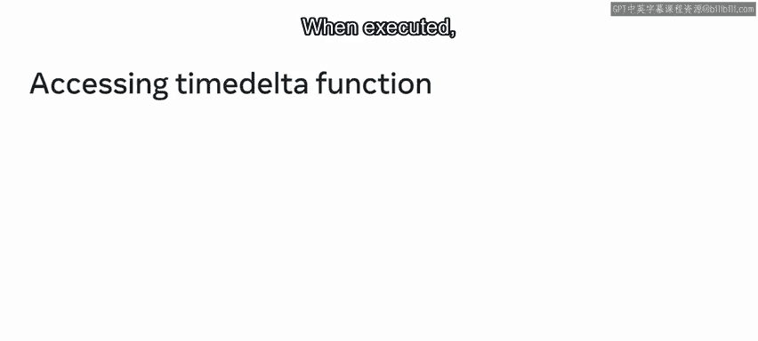

## 使用timedelta进行时间计算

接下来，我们看一个稍复杂的函数：`timedelta`。在制定计划时，推算未来日期很有用。例如，下周的今天是几号？您可以使用`timedelta`函数计算两个值之间的差值，并以Python友好的格式返回结果。

要计算七天后的日期，可以创建一个名为`week`的新变量。使用`dt`模块访问`timedelta`函数，并将`7天`作为参数传递给它。最后，指示Python打印该变量的结果。

```python
week = dt.timedelta(days=7)
future_date = dt.datetime.now() + week
print(future_date)
```

执行后，Python将返回一周后的日期。

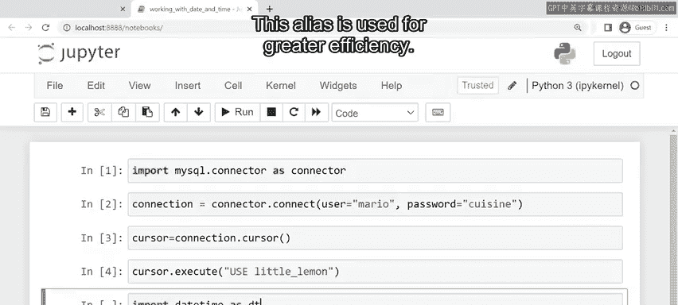

---

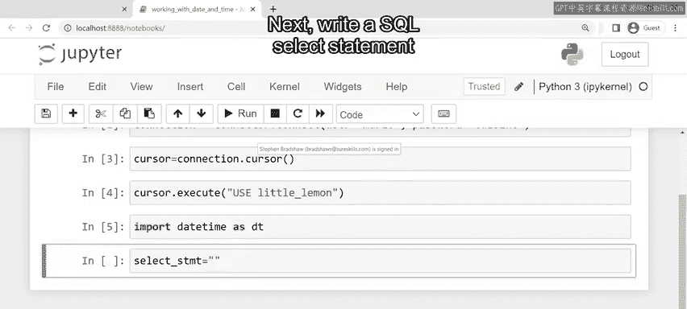

## 实战：为Little Lemon餐厅更新预订时间

现在您已经了解了`datetime`的基本工作原理，让我们来帮助Little Lemon餐厅解决实际问题。

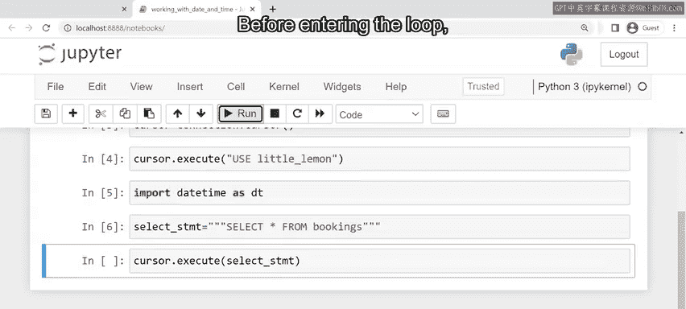

如前所述，Little Lemon餐厅遇到了日程冲突，需要将每个预订时段向后推迟一小时。您可以通过指示Python从`bookings`表中检索数据，然后为每个预订时间增加一小时来完成此任务。

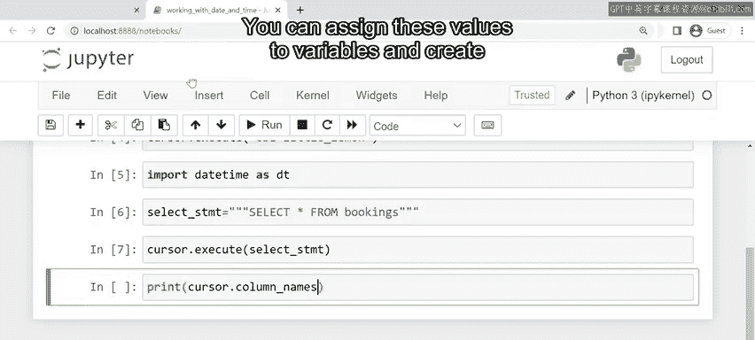

以下是实现步骤：

1.  **建立数据库连接**：首先，在前端Python客户端和后端数据库之间建立连接，并传递您的登录凭据。这将创建一个新的游标实例，并将游标指向Little Lemon数据库。
2.  **导入datetime库**：在开始处理日期时间之前，需要先导入`datetime`库。
    ```python
    import datetime as dt
    ```
3.  **执行SQL查询**：编写一个SQL `SELECT`语句以从`bookings`表中返回所有数据，并将该语句作为字符串参数传递给游标的`execute`模块。
4.  **处理并更新数据**：进入循环前，指示Python打印`bookings`表的列名，以便查看每一行的项目。然后，遍历查询结果，提取`bookingID`和`bookingSlot`列的行。要为每个时间段增加一小时，可以向`timedelta`函数传递`1小时`的参数，然后将该函数加到`bookingSlot`变量上。
5.  **输出结果**：最后，指示Python以文本字符串的形式打印新的预订时段值。该字符串详细说明了每个预订ID及其对应的旧、新预订时段。

通过以上步骤，您将成功帮助Little Lemon餐厅更新了所有预订时间。

---

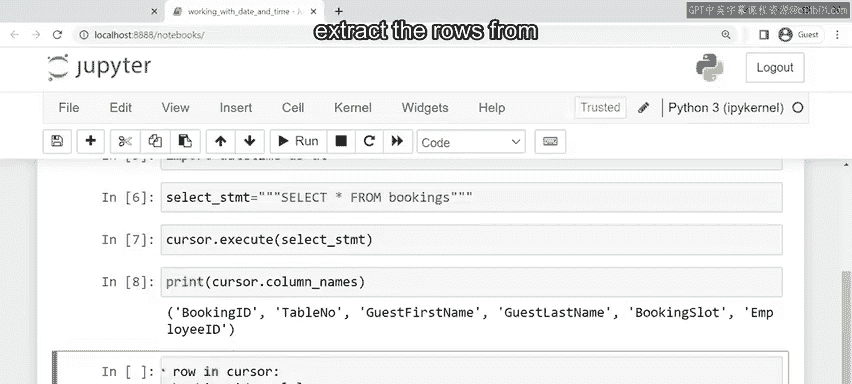

## 总结

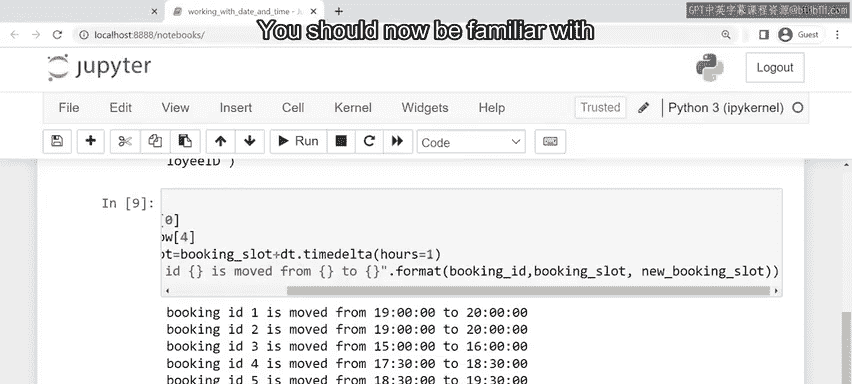

本节课中，我们一起学习了Python `datetime`库的核心功能。我们介绍了如何获取当前日期和时间、如何单独提取日期或时间，以及如何使用`timedelta`进行日期时间的加减计算。最后，我们通过一个为餐厅预订增加一小时的实战案例，综合应用了这些知识。

处理日期时间函数可能具有一定挑战性，但您已经为掌握这个主题打下了良好的基础。