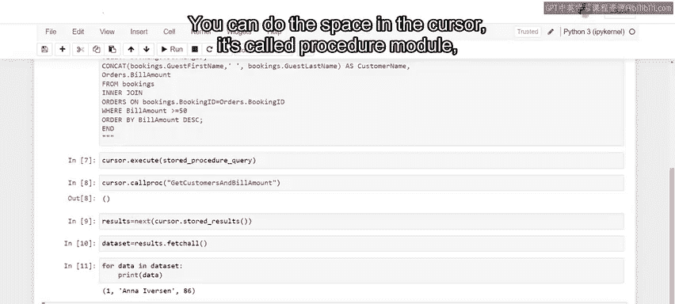
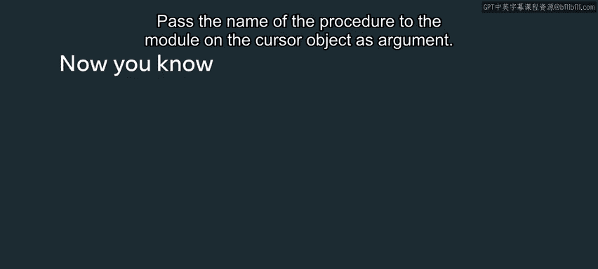
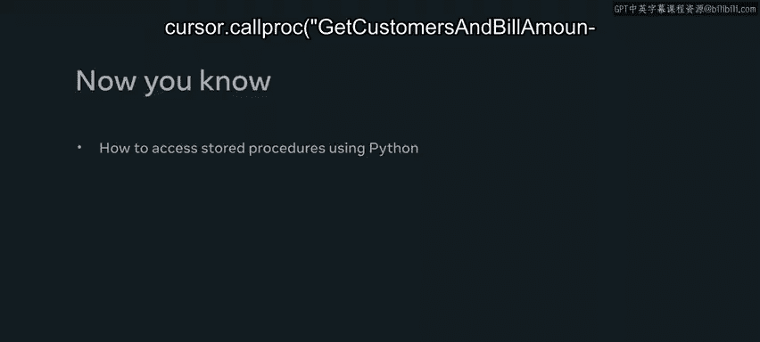

# Meta《数据库工程师（Python／数据库客户端／高阶数据建模／毕业项目／面试）｜Meta Database Engineer》中英字幕 - P86：18_使用Python访问存储过程.zh_en - GPT中英字幕课程资源 - BV1pZ421a749

You should be familiar with creating stored procedures in a MysQL database。

 but how can you make use of stored procedures using Python In this video。

 you'll learn how to access stored procedures using Python。

Little Le R have a new promotional campaign where they give vouchers to all guests who spend $50 or more on a meal to find out which guests qualify for vouchers。

 the team need to retrieve the guest names， booking Is and bill amount data from the bookings and orders tables in the database。

 You can complete this task using a join operation。

 But performing a separate join operation for each guest as time consuming。

 A better solution for little lemon is to create a stored procedure they can call using Python。

 Let's see if you can help little lemon to build a stored procedure using Python。😊。

The first step is to create the stored procedure as a Python string stored in a variable called stored procedure query。

 Next， type the create procedure command， and then the name of your procedure。

 which is get customers and bills。 Then create a begin end block。

 type the logic of your stored procedure within this block using a SQL select statement。

 The statement concatenates the required data from both tables with the use of an inner join for all customers who spend $50 or more。

😊，Don't worry about setting the delimiter before and after the procedure。

 The cursor executes the entire Python string as one Mysql statement。

 So unlike with a traditional Mysql query， there's no need for a delimiter。In Python。

 the stored procedure is passed as a single Python string。

 It can also include multiple SQL statements。 When executing my SQL statements through an API。

 the required closing semicolon is automatically appended to the end of the string。😊。

When executing a stored procedure， you need to store a block of code on the MySQL database that you can invoke when required。

You can trigger this block with the cursor call procedure or call proc method。

 The cursor carries the stored procedure as a string in its execute module and stores it in the Mysql database。

 You are now ready to execute the stored procedure statement and store it on the Mysql database using Python。

😊，Call the execute method from the cursor object and pass the procedure to it as an argument。

 If executed successfully， the procedure is stored in the Mysql database。 Now。

 you can call this procedure。First， you need to call or invoke the procedure。

You can do this using the cursor objects call proc method pass the name of the procedure to the module on the cursor object as an argument。

Next， you need to retrieve the procedure's results。

You can make use of Pythons built in next function to complete this task。

Invoke the stored results module as an argument to the next function and store them as a python variable called results。

 The next function is used to return the next item from the stored results iterator。

The entire result set from the MySQL server is then buffered in the results variable。

Now you can invoke the fetch all method on the results variable and save it as data set。

Once the code has been run successfully， the data set returns a Python list of topples。

 Each tuple is an individual record or row from the stored procedure。😊。

You can index the data set or run the for loop to print all records。

 The results of the procedure show that there is one guest who has spent $50 or more with little lemon and qualifies for vouchers。

You now know how to access stored procedures using Python， great work。

