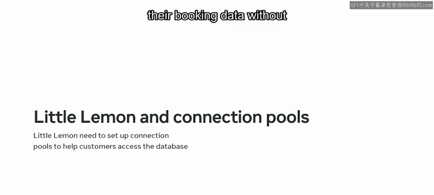
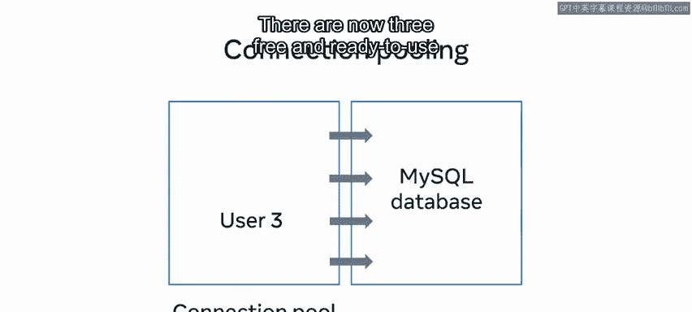
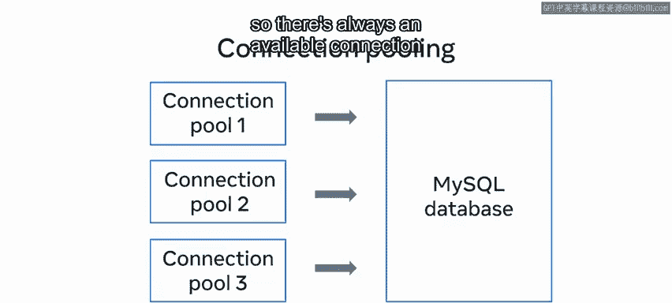
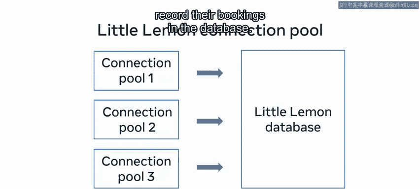

**数据库工程师：P87：数据库连接池** 🏊‍♂️

在本节课中，我们将要学习数据库连接池的概念。我们将探讨其工作原理，并了解它如何帮助应用程序高效、安全地管理大量数据库连接。

---

一个MySQL数据库需要同时为许多用户提供访问。每个连接都必须是安全且稳定的，以确保只有经过身份验证的用户才能访问，并且他们的连接没有失败的风险。但是，管理安全稳定的连接需要许多资源密集型的操作。那么，如何才能高效地执行这些操作呢？答案就在于数据库连接池。

---

### 什么是数据库连接池？🤔

上一节我们提到了管理连接的开销。本节中，我们来看看数据库连接池的具体定义。

数据库连接池涉及创建和管理一个连接池，以在客户端和MySQL数据库之间运行更快、更高效和更优化的连接。

为了更好地理解连接池的工作原理，让我们探索一个视觉示例。

---

### 连接池如何工作？🔧

想象一个包含四个开放连接到MySQL数据库的池。其中两个连接当前正被客户端用于访问数据库。另外两个连接是空闲的，可供任何新用户使用。

一个新用户可以到来并请求访问数据库。连接池随后会为这个新用户分配一个开放的连接。在新用户被分配连接后不久，前两个用户完成了他们的任务，结束了他们的会话并离开了连接池。

即使用户离开了连接池，连接也保持开放。从技术上讲，连接并没有被关闭。它们只是被放回连接池中，在那里它们仍然可供新用户使用。

现在，有三个空闲且随时可用的连接可以分配给新用户。

---

### 处理高并发场景 🚀

上一节我们看了连接池的基本工作流程。本节中，我们来看看当所有连接都被占用时会发生什么。

但如果所有四个连接都在使用中，而第五个用户想要加入呢？只有四个连接可用，那么如何满足第五个用户的访问请求？

为了避免这种情况，最佳方法是创建多个池，每个池分配特定数量的连接。这意味着不同的用户可以被分配到不同的池，因此至少在一个池中总是有一个可用的连接供新用户使用。

您还可以对系统进行编程，如果在其他池中没有合适的连接可用，则在一个池内创建新的连接。

---

### 连接池的优势 ✨

以下是使用连接池的几个关键优势：

*   **高效利用资源**：连接池使可用资源得到高效利用。
*   **减少连接开销**：它减少了建立连接所需的时间和精力。
*   **简化编程模型**：连接池简化了编程模型。
*   **提升应用性能**：当Python应用程序连接到MySQL数据库时，连接池提高了其性能。

---

### 总结 📝

本节课中，我们一起学习了数据库连接池的概念。你现在应该熟悉了数据库连接池，能够解释其工作原理并描述其优势。关于连接池，本课程还有更多内容可以学习，但你已经有了一个很好的开始。