# 数据库工程师（Python／数据库客户端／高阶数据建模／毕业项目／面试）｜Meta Database Engineer：P88：Python MySQL连接池教程 🛠️

在本节课中，我们将要学习如何使用Python的MySQL连接池模块，为数据库创建和管理一个安全、高效的连接池。连接池允许多个用户共享一组预先建立的数据库连接，从而提升应用程序的性能和资源利用率。

## 连接池概述

数据库连接池是一种为多用户提供安全、认证数据库连接的有效方式。MySQL Connector Python API通过`MySQLConnectionPool`模块，提供了开发连接池的实用方法。

上一节我们介绍了连接池的基本概念，本节中我们来看看如何具体构建一个连接池。

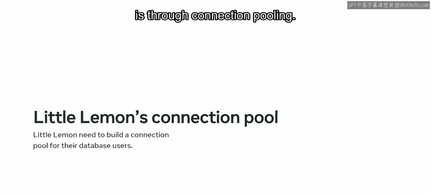

## 导入连接池模块

`MySQLConnectionPool`模块位于`mysql.connector.pooling`目录中。你可以使用`import`语法和`from`关键字将其导入工作环境，以访问其功能。

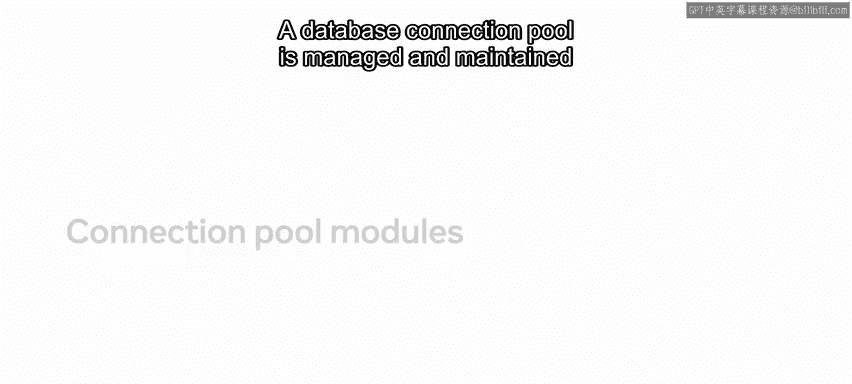

```python
from mysql.connector.pooling import MySQLConnectionPool
```

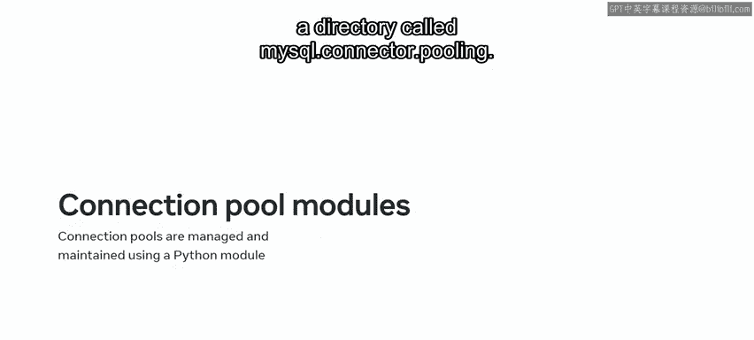

这段代码指示Python访问子目录并返回`MySQLConnectionPool`库。

## 连接池模块的功能与属性

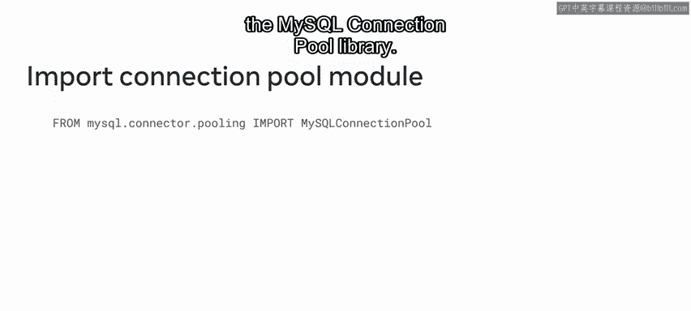

`MySQLConnectionPool`模块包含许多有用的函数和属性。以下是其中几个核心概念：

*   **`pool_name`**：用于标识连接池名称的类属性。如果不指定，则会自动生成一个。你可以根据需要创建任意数量的池。
*   **`pool_size`**：声明为池创建的连接数量的属性。默认连接数为5，但单个池最多可创建32个连接。
*   **`connection_id`**：分配给池中每个连接的唯一ID。

以下是该模块中可用的几个类方法：

*   **`get_connection()`**：用于请求一个连接。如果池中有可用连接，则分配一个空闲连接。如果没有可用连接，则会收到“池耗尽”错误。
*   **`is_connected()`**：一个布尔函数，根据是否已建立连接返回`True`或`False`值。这是避免错误的有效方法。
*   **`close()`**：通知连接池用户已完成会话。用户不再需要该连接，因此该连接可以放回池中，作为可供需要的新用户使用的可用连接。

## 为Little Lemon构建连接池

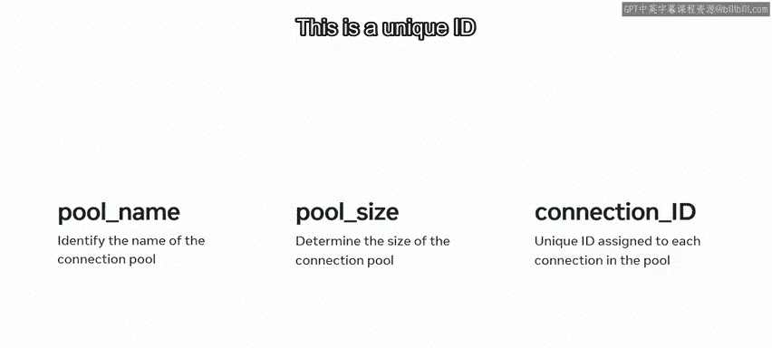

现在你已经熟悉了连接池模块，让我们来帮助Little Lemon公司构建一个连接池。

正如之前所学，Little Lemon希望创建一个连接池，为用户提供高效访问其数据库的途径。在创建连接池之前，首先需要使用MySQL Connector Python API导入`MySQLConnectionPool`库。

```python
from mysql.connector.pooling import MySQLConnectionPool
```

导入连接器后，下一步是建立与数据库的连接。将池命名为`little_lemon_pool`，然后使用`pool_size`属性指定4个连接。使用`localhost`作为主机，并将池放置在`little_lemon`数据库上。最后输入用户名和密码。

```python
pool = MySQLConnectionPool(
    pool_name="little_lemon_pool",
    pool_size=4,
    host="localhost",
    database="little_lemon",
    user="your_username",
    password="your_password"
)
```

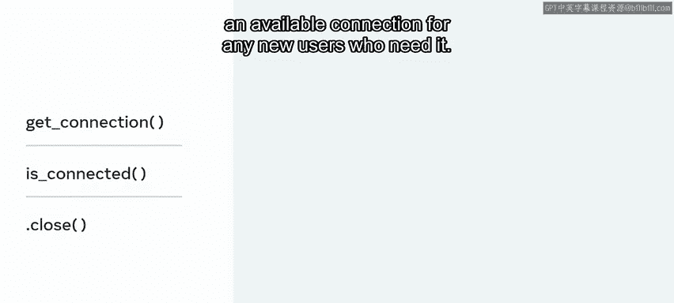

所有这些代码都作为参数传递给`MySQLConnectionPool`模块并赋值给`pool`变量。

接下来，你需要为连接池创建一个Python用户列表，可以将其命名为`users`。

```python
users = ["Anna", "Brian", "Clara", "David"]
```

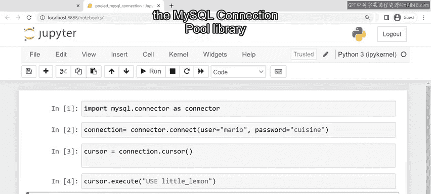

用Little Lemon宾客名单的成员填充此列表。

然后，你需要创建一个SQL `SELECT`语句。该语句必须接受一个整数参数。该整数对应于不同的ID请求，作为数据库用户访问不同的数据点。

```python
sql_select = "SELECT * FROM Bookings WHERE BookingID = %s"
```

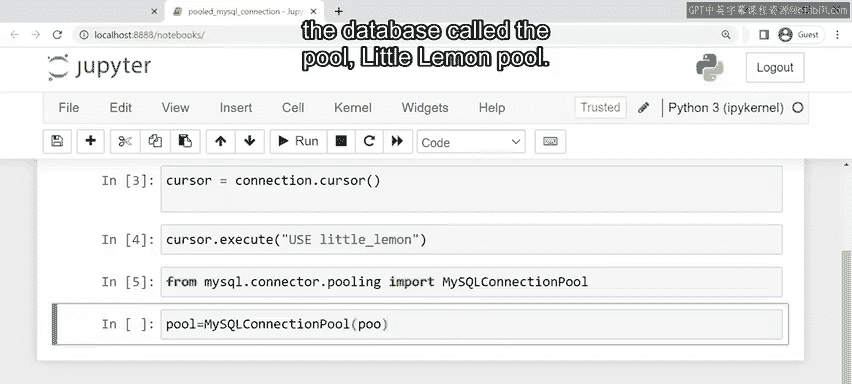

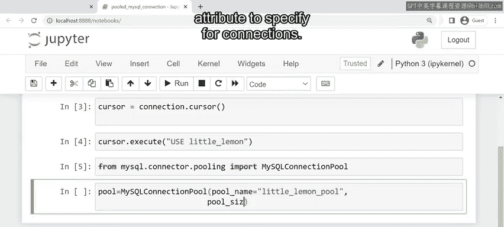

现在，你需要使用`for`循环。可以将其与`range`函数结合使用。`range`函数与`pool_size`属性一起使用。

```python
for i in range(pool.pool_size):
```

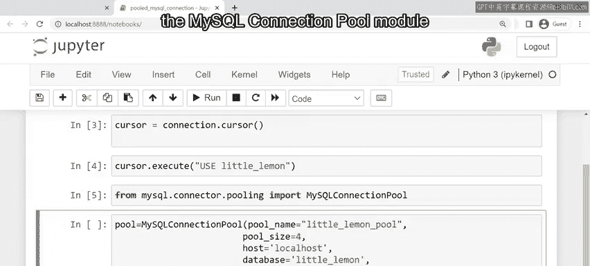

这意味着无论池有多大，循环总是会运行到结束。

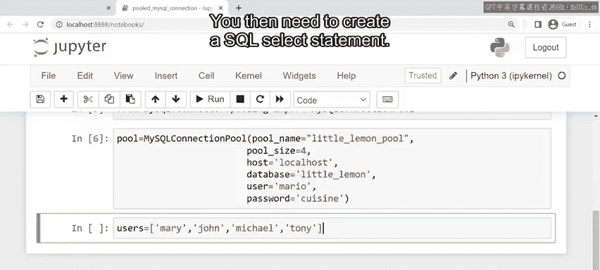

下一步是设置应用程序的连接。编写一个语句，检查池中是否成功建立了连接。此语句还可以避免代码中出现任何错误。

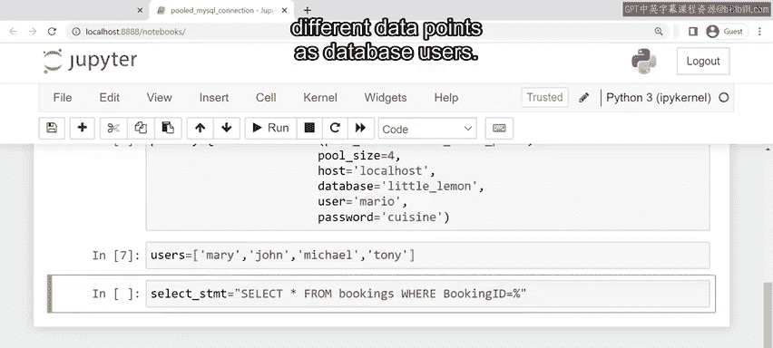

```python
    connection = pool.get_connection()
    if connection.is_connected():
```

然后，编写一个语句，从现有的活动池连接实例化一个新游标。此操作必须为与池成功建立的每个新活动连接执行。

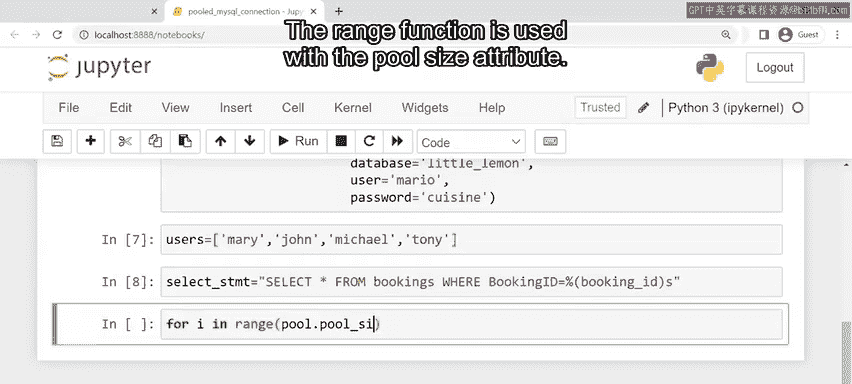

```python
        cursor = connection.cursor()
```

接下来，创建一个`print`语句，在屏幕上显示以下信息：请求数据库信息的用户、分配给此用户的唯一连接ID以及他们请求的唯一预订ID。该`print`语句使用花括号进行格式化。这些符号按照`format`函数中指定的顺序获取指定的变量。这意味着信息将按照你指定的顺序打印。

```python
        print("User: {} - Connection ID: {} - Booking ID: {}".format(users[i], connection.connection_id, i+1))
```

代码的下一行是一个参数化的`SELECT`语句。该语句使用之前的初始SQL `SELECT`语句，并将其与递增的`i`结合，为每个用户分配不同的预订ID。

```python
        cursor.execute(sql_select, (i+1,))
```

然后，你可以使用`fetchall`方法返回与此SQL `SELECT`语句对应的所有信息，并将信息打印在屏幕上。

```python
        results = cursor.fetchall()
        for row in results:
            print(row)
```

你还可以创建一个`else`语句，如果找不到活动连接，则在屏幕上生成错误消息。

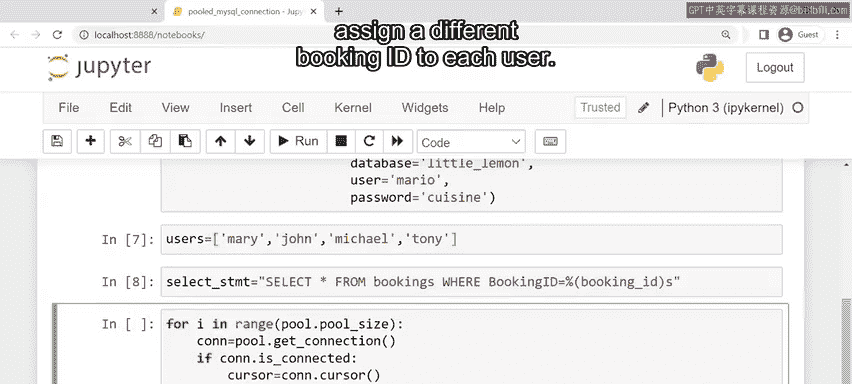

```python
    else:
        print("无法建立连接。")
```

最后，当用户结束会话时，使用`close`方法将用户的连接返回到池中。

```python
    connection.close()
```

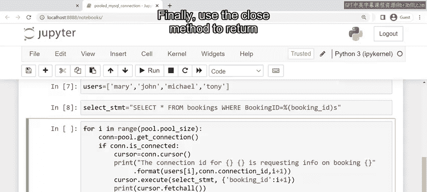

## 总结

本节课中我们一起学习了如何使用`MySQLConnectionPool`模块提供的函数和属性为数据库创建连接池。我们涵盖了从导入模块、配置连接池参数，到从池中获取连接、执行查询以及妥善关闭连接并释放回池中的完整流程。掌握连接池技术对于构建高效、可扩展的数据库应用程序至关重要。