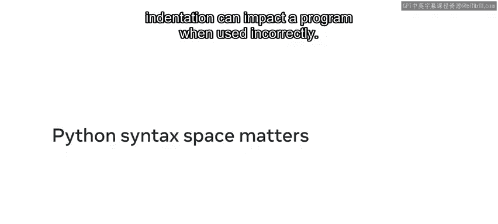
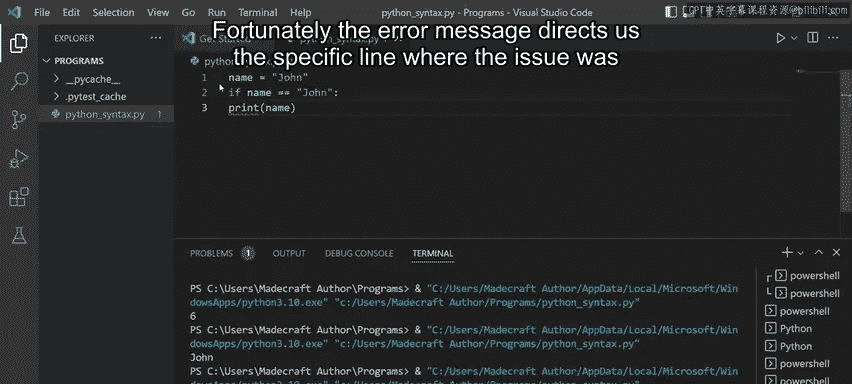
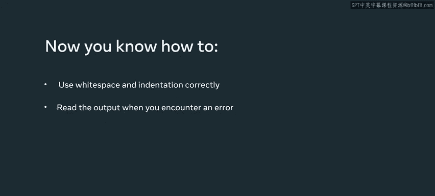

# Python语法与空格：P8：7_Python语法空格很重要

## 概述

在本节课中，我们将要学习Python语法中空格和缩进的重要性。你将了解空格如何影响代码的执行，以及如何正确使用缩进来构建代码块。这些知识是编写正确、可读Python代码的基础。



## 空格在语句中的作用

在Python中，空格用于分隔语句中的不同元素。然而，不当使用空格可能导致语法错误。

以下是一个简单的打印语句示例：

```python
print("hello")
```

在VS Code中运行此代码，终端会输出“hello”。

现在，假设我们想在同一行添加另一个打印语句来输出“world”。我们可能会这样写：

```python
print("hello") print("world")
```

但运行此代码会产生语法错误：“syntax error invalid syntax”。这是因为解释器无法识别新语句的开始位置。

有两种方法可以解决这个问题。

第一种方法是将第二个打印语句移到新的一行：

```python
print("hello")
print("world")
```

运行此代码，会分别在两行输出“hello”和“world”。

第二种方法是在两个语句之间使用分号和一个空格进行分隔：

```python
print("hello"); print("world")
```

运行此代码，同样会输出“hello”和“world”。

## 空格在表达式中的影响

上一节我们介绍了语句间的空格问题，本节中我们来看看空格在表达式中的影响。

首先，声明一个变量并赋值：

```python
x = 1 + 2
print(x)
```

运行此代码，会输出结果`3`。

现在，在加号周围添加一些空格：

```python
x = 1   +   2
print(x)
```

运行此代码，仍然会输出`3`。这说明表达式内部的空格通常不会影响计算结果。

但是，如果我们将表达式拆分成多行，情况就不同了。尝试以下代码：

```python
x = 1 + 2
+ 3
print(x)
```

运行此代码，只会输出`3`。解释器执行了第一行的`1 + 2`，但忽略了第二行的`+ 3`。

为了解决这个问题，我们可以使用反斜杠来强制换行：

```python
x = 1 + 2 \
+ 3
print(x)
```

运行此代码，会输出正确的结果`6`。

总结来说，一行内的任何空格或缩进都是可以的。但如果你将代码拆分成多行，就需要明确指示新行的开始位置。

## Python中的缩进

上一节我们探讨了空格在表达式中的作用，本节中我们来看看缩进在Python中的关键作用。

缩进在Python中用于定义代码块，例如在条件语句和循环中。

以下是一个使用`if`语句的示例：

```python
name = "John"
if name == "John":
    print(name)
```

运行此代码，会输出“John”。注意，`print`语句前面有四个空格的缩进，这是VS Code自动添加的。

现在，如果我们删除缩进：

```python
name = "John"
if name == "John":
print(name)
```

运行此代码，会产生缩进错误：“indentation error expected an indented block”。这个错误信息告诉我们，在应该缩进的地方没有找到缩进。

幸运的是，错误信息通常会指向检测到问题的具体行，这样我们就可以轻松地修复代码。

在编写Python程序时，养成阅读错误输出的习惯是很好的。错误信息通常会告诉你哪里出了问题以及具体是什么问题。



## 总结

本节课中我们一起学习了Python语法中空格和缩进的重要性。我们了解到：

*   语句之间需要正确的分隔，可以使用换行或分号。
*   表达式内部的空格通常不影响计算，但跨行表达式需要使用反斜杠来明确指示。
*   缩进是Python中定义代码块的关键，错误的缩进会导致程序无法运行。



掌握这些基本概念，将帮助你编写出正确且结构清晰的Python代码。