# 数据库工程师：P97：MySQL Workbench简介 🛠️

在本节课中，我们将学习MySQL Workbench这一数据库建模与管理工具。我们将了解其核心功能、安装步骤，并学习如何创建数据库连接和用户，为后续的数据库设计与管理工作打下基础。

## 概述

作为数据库工程师，您需要创建、实施和管理满足特定业务或组织需求的数据库系统。这些任务可能很复杂，但有一系列工具和技术可以支持您的工作。其中一个您将使用的工具就是MySQL Workbench。本节视频将探讨MySQL Workbench的基础知识，并学习如何使用该工具来帮助建模和管理数据库。

## MySQL Workbench简介

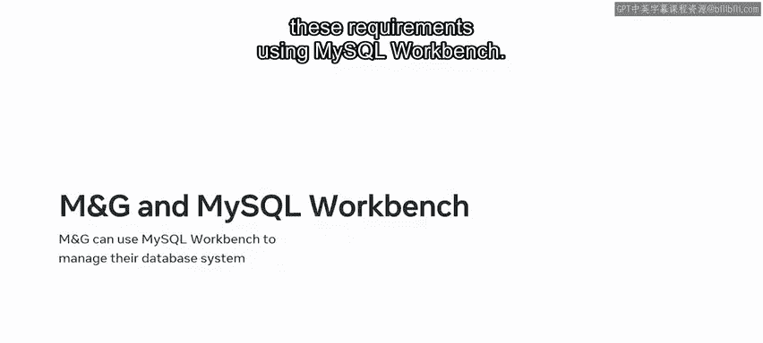

MySQL Workbench是由Oracle开发的一款统一的数据库建模与管理可视化工具。它包含多个对创建、编辑和管理数据库非常有用的关键功能。

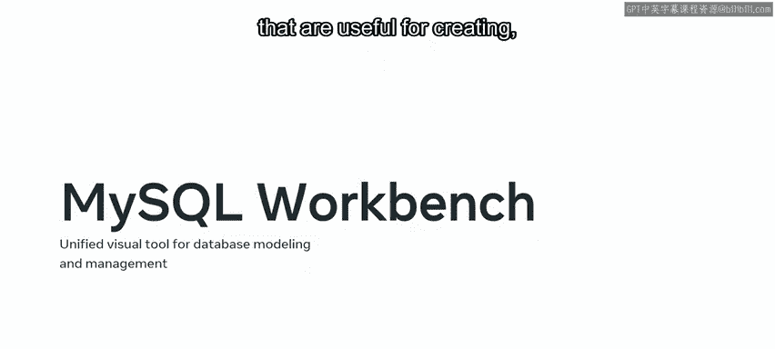

以下是MySQL Workbench的一些关键特性：

*   **开源与跨平台**：它可以在多种操作系统上使用。
*   **简化设计与维护**：它简化了数据库的设计和维护工作。
*   **可视化SQL编辑器**：它提供了可视化的SQL编辑器和其他支持开发者的工具。
*   **代码辅助功能**：它为编写SQL语句提供了自动完成和高亮显示功能。
*   **数据迁移支持**：它便于在不同版本的MySQL之间，以及MySQL与其他关系型数据库系统之间进行数据迁移。

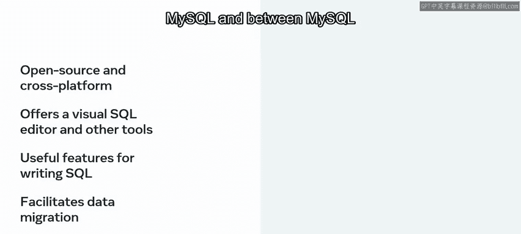

在本课程中，您将使用MySQL Workbench来建模和管理MySQL数据库中的数据。但首先，您需要在您的操作系统上下载、安装和设置MySQL Workbench。

## 安装MySQL Workbench

上一节我们介绍了MySQL Workbench的功能，本节中我们来看看如何安装它。安装过程主要分为下载和运行安装向导两个步骤。

以下是安装步骤：

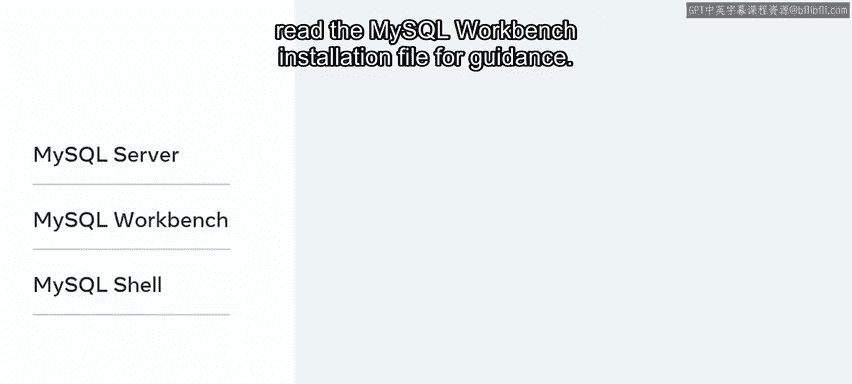

1.  **下载**：从 `dev.mysql.com/downloads` 下载一份MySQL Workbench。请确保为您特定的操作系统下载正确的版本。
2.  **安装**：下载完成后，双击文件在您的计算机上进行安装。
3.  **运行安装向导**：接下来，按照自定义设置跟随安装向导进行操作。运行向导时，请确保安装以下软件：**MySQL Server**、**MySQL Workbench** 和 **MySQL Shell**。
4.  **寻求帮助**：如果遇到任何困难，请阅读MySQL Workbench安装文件以获取指导。

## 建立连接与创建用户

成功安装MySQL Workbench后，下一步就是启动它并建立数据库连接。我们将从打开软件和了解主界面开始。

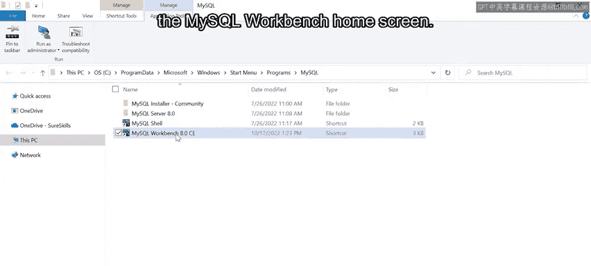

启动程序并查看MySQL Workbench主屏幕。主屏幕包含欢迎信息、文档、博客和讨论论坛的链接，并提供对各种工具和功能的访问。

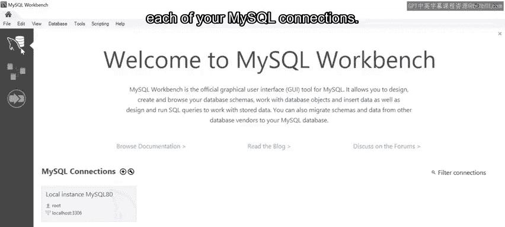

您可以使用主屏幕侧边栏访问MySQL连接、模型和MySQL Workbench迁移向导。选择“连接”选项可以查看连接到本地和远程MySQL实例的列表。

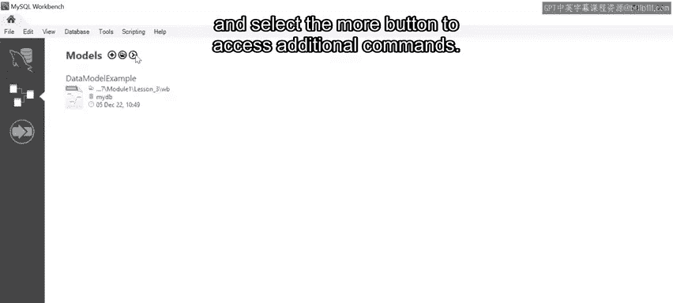

连接功能可用于加载、配置、分组和查看每个MySQL连接的信息。

“模型”部分显示最近使用的模型。每个条目列出了模型最后打开的日期和时间及其关联的数据库。您也可以选择加号来添加新模型，选择文件夹按钮来浏览和打开已保存的模型，或选择“更多”按钮来访问其他命令。

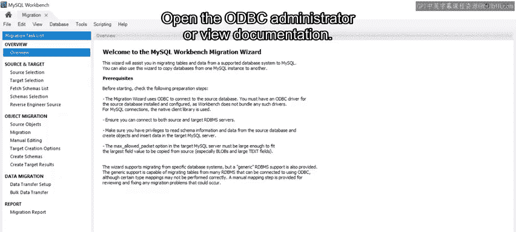

您还可以打开“迁移”选项卡，以显示使用向导的先决条件概述、启动迁移过程、打开ODBC管理器或查看文档。

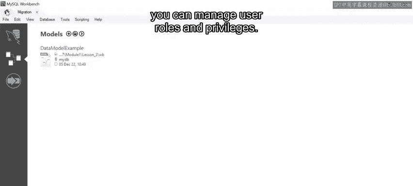

### 创建新用户

创建新用户是连接到MySQL数据库最安全的方式，因为您可以管理用户角色和权限。请确保已选择MySQL连接。

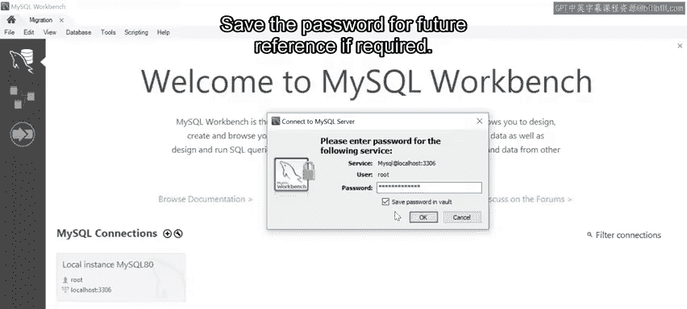

以下是创建新用户的步骤：

1.  **使用root用户登录**：首先，使用root用户登录MySQL服务器。输入您在安装MySQL时设置的root用户密码。如果需要，请保存该密码以备将来参考。
2.  **进入用户管理**：接下来，在管理菜单下选择“用户和权限”，以查看当前数据库用户的列表。
3.  **添加账户**：选择“添加账户”以添加新用户。这将打开一个新窗口，您可以在其中输入新用户的详细信息。
4.  **设置用户信息**：将新用户命名为 `admin1`。输入密码并确认密码。
5.  **配置权限**：您也可以使用此窗口控制用户权限。
    *   **账户限制**：用于限制用户的最大查询数、更新数和连接数。
    *   **管理角色**：此选项卡允许您为新用户分配角色或分配关联权限。在本例中，选择 **DBA**，该角色授予执行所有任务的权限。
    *   **架构权限**：允许您控制新用户的访问权限。
6.  **应用创建**：选择“应用”按钮以创建新用户。

### 创建新连接

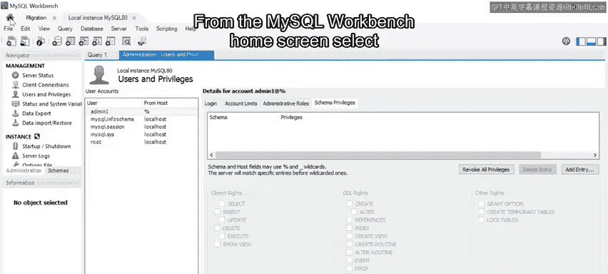

创建用户后，下一步是从MySQL Workbench主屏幕创建新的MySQL连接。

以下是创建新连接的步骤：

1.  **打开连接表单**：选择加号图标以打开“设置新连接”表单。
2.  **填写连接信息**：填写表单以创建新的服务器实例。您现在可以使用以下值：
    *   在连接名称中，使用 `Test Server` 作为服务器实例名称。
    *   在用户名文本字段中，键入 `admin1`。
    *   对于表单的所有其他部分，您可以使用默认设置。
3.  **检查主机与端口**：最后，确保您的主机名是 `127.0.0.1`，端口号是 `3306`。
4.  **测试连接**：单击“测试连接”按钮以检查设置是否有效。系统会提示您输入为 `admin1` 用户设置的密码。
5.  **保存连接**：如果设置正确，MySQL Workbench应确认连接成功。如果没有，请返回表单并检查您输入的信息是否正确。选择“确定”以保存连接。

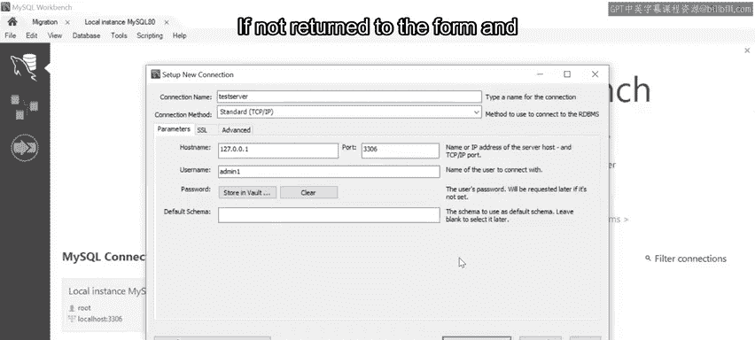

您的新MySQL连接已添加到主屏幕。现在，您可以使用此连接开始处理数据库模式和SQL查询。

## 总结

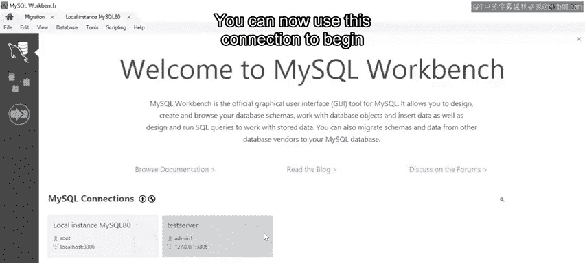

本节课中，我们一起学习了MySQL Workbench工具的基本功能，并掌握了如何使用它来帮助建模和管理数据库。您现在应该熟悉了MySQL Workbench的基本特性，并知道如何用它来创建连接和管理用户。这为您理解高级数据建模奠定了良好的基础。