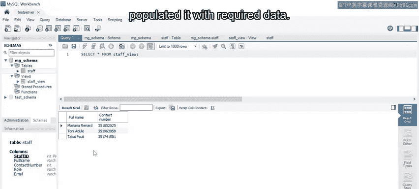
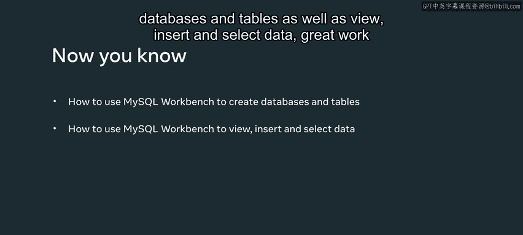

# 数据库工程师课程：P98：MySQL Workbench中的数据管理 🗄️

在本节课中，我们将学习如何使用MySQL Workbench这一图形化工具来高效地创建和管理数据库系统。我们将涵盖创建数据库、设计表、建立视图、插入数据以及查询数据等核心操作。

---

## 创建数据库模式

首先，我们需要为项目创建一个新的数据库模式。在MySQL Workbench中，这被称为“Schema”。

1.  连接到你的MySQL服务器实例。
2.  在左侧的导航栏中，找到并点击“Schema”菜单。
3.  在Schema工具栏中，选择“Create Schema”选项。

执行此操作将打开一个新窗口。在新窗口中，在“Database Name”文本框中输入 `MG_schema`，然后点击“Apply”按钮。

系统会生成一个名为 `CREATE SCHEMA `MG_schema`` 的SQL脚本。在出现的审核窗口中检查脚本，确认无误后，再次点击“Apply”按钮。随后会出现一个确认窗口，询问是否执行创建模式语句，点击“Finish”按钮即可完成创建。

现在，`MG_schema` 已成功创建并会显示在Schema列表中。你可能需要点击刷新图标来查看新创建的模式。

---

## 在模式中创建表

上一节我们创建了数据库模式，本节中我们来看看如何在其中创建数据表。M&G公司需要一个名为 `staff` 的表来存储员工信息。

以下是创建 `staff` 表的步骤：

1.  在 `MG_schema` 的子菜单中，右键点击“Tables”选项。
2.  从出现的列表中选择“Create Table”。
3.  这会打开一个新的表格设计窗口。在“Table Name”文本框中输入 `staff`。
4.  在中间窗口的列详情部分，按以下要求填充列信息：
    *   **staff_id**：数据类型设为 `INT`，并勾选 `PK` (主键)、`NN` (非空)、`AI` (自增) 复选框。
    *   **full_name**：数据类型设为 `VARCHAR(100)`，并勾选 `NN`。
    *   **contact_number**：数据类型设为 `VARCHAR(20)`。
    *   **role**：数据类型设为 `VARCHAR(50)`。
    *   **email**：数据类型设为 `VARCHAR(100)`。
5.  完成后，点击“Apply”按钮生成创建表的SQL语句。
6.  在审核窗口中检查生成的SQL语句，确认无误后再次点击“Apply”执行，最后点击“Finish”保存更改。

现在，你可以在 `MG_schema` 中看到新创建的 `staff` 表。右键点击表名并选择“Table Inspector”或点击信息图标，可以查看表的结构，包括列、索引等信息。另一种快速查看表结构的方法是使用SQL编辑器执行 `DESCRIBE staff;` 命令。

---

## 创建视图

视图是一种虚拟表，基于SQL查询结果。接下来，我们为员工信息创建一个简化视图。

1.  在 `MG_schema` 的子菜单中，右键点击“Views”选项。
2.  选择“Create View...”以打开SQL编辑器。
3.  在编辑器中输入创建视图的SQL语句。例如，创建一个只显示员工全名和联系方式的视图：

    ```sql
    CREATE VIEW Staff_View AS
    SELECT full_name AS ‘姓名‘, contact_number AS ‘联系电话‘
    FROM staff;
    ```
4.  点击“Apply”按钮，在审核窗口中你可以看到生成的SQL代码。这里我们为列创建了别名（`AS ‘姓名‘`），以便查询时更易读。
5.  确认无误后，点击“Apply”执行，然后点击“Finish”。

现在，`Staff_View` 视图会出现在 `MG_schema` 的视图列表中。

---

## 向表中插入数据

有了表结构之后，我们需要向其中填充数据。虽然通常使用 `INSERT INTO` SQL语句，但MySQL Workbench允许你直接在表格网格中输入数据。

以下是插入数据的步骤：

1.  在 `MG_schema` 的 `staff` 表上右键点击。
2.  选择“Select Rows – Limit 1000”。这会打开一个类似电子表格的界面。
3.  直接在网格中输入员工记录数据。`staff_id` 列如果是自增的，可以留空或填0。
4.  输入完数据后，点击“Apply”按钮。
5.  系统会自动生成相应的 `INSERT INTO` 语句。在审核窗口中检查该语句，然后再次点击“Apply”执行。
6.  最后，点击“Finish”完成数据插入。

现在，员工记录已经成功存储到 `staff` 表中。

---

## 从数据库查询数据

最后一步是从我们创建的数据库和视图中查询数据。这需要使用MySQL Workbench的SQL编辑器。

1.  点击工具栏上的按钮打开一个新的SQL编辑器标签页。
2.  编写一个 `SELECT` 查询语句来提取数据。例如，要查看视图中的所有数据：

    ```sql
    SELECT * FROM Staff_View;
    ```
3.  点击闪电图标或“Execute”按钮来运行查询。
4.  查询结果将以表格网格的形式显示在编辑器下方。

---





本节课中我们一起学习了使用MySQL Workbench进行数据管理的完整流程：从创建数据库模式（Schema）和表（Table），到建立视图（View），再到插入（Insert）和查询（Select）数据。通过这些图形化操作，可以更直观、高效地完成数据库的构建与管理工作。