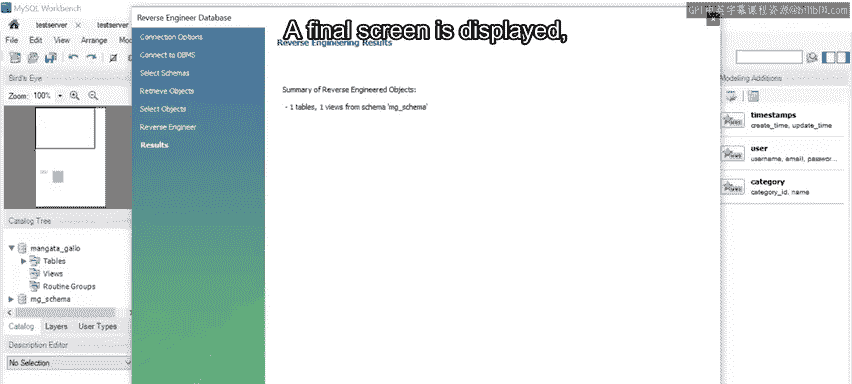
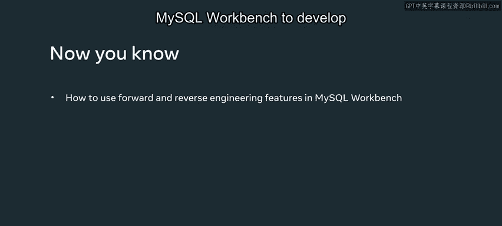

# 数据库建模：P99：MySQL Workbench中的数据库建模 🛠️

在本节课中，我们将学习如何使用MySQL Workbench这一专业工具来创建和管理数据库模型。我们将重点掌握正向工程和反向工程两大核心功能，它们能帮助我们将设计图转化为实际的数据库，或将现有数据库结构逆向为可视化的模型图。

## 概述

课程进行至此，你已经理解了数据库模型的重要性。那么，如何创建这些模型呢？你可以使用诸如MySQL Workbench这样的专业数据建模工具。本视频将指导你如何使用MySQL Workbench，并利用其正向工程与反向工程功能。

假设M和G需要开发一个基础数据库来维护他们的客户和订单信息。他们可以使用MySQL Workbench创建模型，然后利用正向工程功能将数据模型转化为SQL架构，并自动在MySQL中实现。

## 创建新的数据模型

上一节我们介绍了课程目标，本节中我们来看看如何从零开始创建一个新的数据模型。

在MySQL Workbench的主屏幕，点击左侧边栏的“Models”视图，然后点击“Models”旁边的加号图标。这个操作会打开一个新窗口，并创建一个名为`myDb`的新架构。

双击架构名称，将其修改为`mengeta_store_gallo`。

## 设计ER图

接下来是创建数据模型图。这张图对于使用正向工程功能至关重要。你可以在MySQL Workbench中创建数据模型，然后将其转化为可在MySQL中自动实现的SQL架构。

首先，双击“Add Diagram”来创建ER图。这个操作会打开ER图设计器页面。

现在你需要创建表。点击“Add Table”图标，然后在视图区域内点击一个方格。这个操作会创建一个表实体。

双击该实体以加载表编辑器。将默认的`table1`名称改为`customers`。

## 定义表结构

以下是向`customers`表添加列的步骤：

1.  双击一个单元格，这会创建一个默认的`idcustomers`列。将其名称改为`customer_id`。
2.  保持数据类型为`INT`（整数）。
3.  勾选`PK`（主键）、`NN`（非空）和`AI`（自增）复选框。
4.  再添加三个列：`full_name`、`contact_number`和`email`。
5.  根据需要设置数据类型（例如`VARCHAR`），并将这三列都标记为`NN`（非空）。

请遵循相同的步骤创建`orders`表，并根据需要设置其列的数据类型。

## 建立外键关系

你还需要为`orders`表创建外键。在窗口底部的“Foreign Keys”选项卡中，将表的`customer_id`列定义为外键。

1.  在“Foreign Key”文本字段中输入`CustomID_FK`。
2.  双击“Referenced Table”对应的字段，然后选择`customers`表。
3.  勾选`customer_id`作为被引用的列。
4.  将其标记为`ON UPDATE CASCADE`和`ON DELETE CASCADE`。

至此，你已经拥有了一个包含`customers`和`orders`表的MG架构ER图可视化表示。

通过点击 **File -> Save As** 保存你的工作，并将其命名为`Mangeta_Gallo_Model`。

## 正向工程：将模型同步到数据库

现在你已经创建了数据模型，接下来可以使用正向工程功能将其同步到MySQL服务器。

选择 **Database** 选项卡，然后从菜单中选择 **Forward Engineer** 选项。这将打开“Forward Engineer to Database”向导。

选择你之前创建的用于连接MySQL服务器的连接。保持默认设置不变，点击 **Next**。

向导会列出一些高级选项，目前可以忽略，直接点击 **Next**。

一个新窗口“Select Objects to Forward Engineer”会出现，并带有一系列选项。勾选“Export MySQL Table Objects”框，然后点击 **Next**。

下一步将显示将在MySQL服务器上执行以创建内部架构的SQL脚本。请审阅该脚本，确保它能按需创建架构。

点击 **Next** 来正向执行SQL脚本。会出现一条消息，显示“Forward engineer finished successfully”。点击 **Close** 关闭向导。

现在，M和G的数据库已在MySQL中创建成功。你可以在导航器部分的架构列表中查看，或在Workbench的SQL编辑器中执行`SHOW DATABASES;`语句来确认。

## 反向工程：从数据库生成模型

M和G还需要使用MySQL Workbench进行反向工程来构建数据模型。这意味着从现有数据库生成数据模型ER图。

上一节我们实践了正向工程，本节中我们来看看反向工程的操作流程。

第一步是进入 **Database** 选项卡，然后选择 **Reverse Engineer** 选项。确认连接详情无误后，点击 **Next**。每个连接都必须正确配置才能与MySQL服务器通信。如果对现有连接不满意，可以选择另一个，然后点击 **Next**。

出现“Execution completed successfully”消息后，点击 **Next**。此时会显示服务器上可用的架构列表。

选择你想要进行反向工程的数据库架构，然后点击 **Next**。

屏幕上出现“Retrieval completed successfully”消息，点击 **Next**。

一个新屏幕出现，你可以在其中选择“Select All Objects”。屏幕确认所有对象都已检索，点击 **Execute**。

一旦检索过程成功执行，会显示一条“Operation completed successfully”的消息。选定的对象现已成功反向工程。再次点击 **Next**。

最后一个屏幕会显示导入摘要。点击 **Finish** 完成整个过程。

MySQL Workbench会从内部的MySQL架构创建新的ER图。你可以将数据模型打印为PNG图像，与他人分享，或者应用更改并通过正向工程功能将其推送到数据库。

## 总结

本节课中，我们一起学习了如何使用MySQL Workbench的强大功能。M和G现已使用MySQL Workbench在其数据库中开发了一个基础架构。你现在也应该掌握了如何利用MySQL Workbench中的反向工程功能来开发数据模型图。

做得好！

