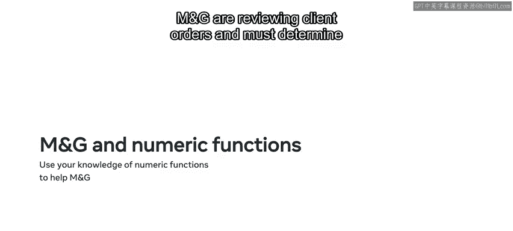
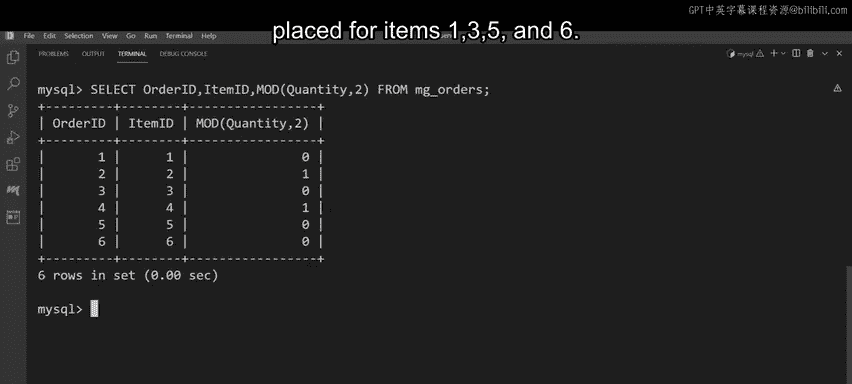

# Meta《数据库工程师（数据库简介／Git／MySQL）｜Meta Database Engineer》中英字幕 - P100：23_数值函数.zh_en - GPT中英字幕课程资源 - BV1Vw4m1Z7tb

The jewelry store， magenta and gallo， also known as M& G are reviewing client orders in their database。

 They must determine the average amount of money that each client has spent with the business。

 M and G can use numeric functions to extract this information。

In this video you'll explore numeric functions and learn how to identify common MysQql numeric functions and explain how these functions are used to process and manipulate data in a MysQl database At this stage of the course you've encountered some basic functions so here's a quick reminder of what database engineers mean by the term functions in the context of MySQL。

As you've learned in earlier lessons， a function is a piece of code that performs an operation and returns a result。

Some functions accept parameters or arguments， while other functions do not。

Functions are very useful for manipulating data in a database table broadly speaking。

 MySQL functions can be grouped into five different categories as follows， numeric functions。

 string functions， date functions， comparison and control flow functions。

You'll review each of these functions in more detail over the course of this lesson。

The focus of this video is MySQL numeric functions， which can be divided into two categories。

Aggricgate functions which can be used on a set of values and math functions。

 which perform basic mathematical tasks on data。You should already be familiar with aggregate functions。

 having used these previously in the course with select statements to calculate aggregated values。

So let's just recap them briefly。Commonly used aggregate functions include sum， average and max。

 There's also the minimum aggregate function and count。Now that you've reappped aggregate functions。

 let's look at some common MA functions。A number can be rounded to a specific decimal place using the round function。

And the mod function can be used to return the remainder of one number divided by another。

These functions are a great way for M&G to perform additional tasks while also determining the average dollar amount that each client has spent with the business。

But how can you and MNG make use of these functions in a MySQL database？

You can build them into your SQL select statements。Let's review this intax。

The round syntax begins with a select command followed by the name of the column to be queried。

 you then call the round function followed by a pair of parenthses。Within these parenthses。

 write the required arguments。The first argument can be a column name or any numeric value。

The second argument must be the number of decimal places。Finally， write the Fr keyword。

 followed by the required table name。The mod syntax is very similar。

 just call the mod function instead of round。And within parenthsesis。

 identify the column or value and instruct my SQL what number to divide the value by。Finally。

 identify the table that holds the data when working with the mod function。

 bear in mind that the first argument can be a table column or any numeric value。

 while the second argument must be the value by which the first will be divided。For example。

 MG can use the round syntax and average numeric function to determine the average dollar amount each client spent rounded down to two decimal places。

Let's take a few moments to explore MG's database and find out more about how they make use of numeric functions。

As you learned earlier， MG are reviewing client orders and must determine the average dollar amount that each client has spent with the business。

The company has a table called Client Orders that shows the average amount each client has spent。

 the table has two columns， client ID， which shows the ID of each client an average cost which displays the average amount each client has spent。

However， even though this table shows the average amount。

 MG need to round down these values to two decimal places。

 you can help them using the round function， right select， followed by the column names。

Then call the round function on the average cost column。In parenthesis。

 put the average cost column as the first argument。

Then pass the number two as the second argumentro the value to two decimal places。Next。

 use the Fr keyword to target the client orders table， finally， group by clientient ID。

Execute the query to create the output and display all decimal places reduce the two。

In the next task， MG are restocking their inventory and need to identify which items they've placed and even number of orders for。

The data they need is in the table MG orders。The table contains several columns。

 but the ones you need to complete this task are order ID， item ID， and quantity。

To determine if a given quantity is odd or even， you can divide the quantity by two。

 the remainder is your answer。This can be done using the mod function。First， write select。

 followed by the column names。Then call the mod function。

Pass the quantity column as the first argument and the number two as the second argument。

Execute the query。The query returns the following values。

 a value of zero if there is no remainder when all data is divided by2。

 or it returns just the remainder value。The output shows that an even number of orders have been placed for items1。

3，5， and6。

M andG have now completed their database tasks using common MysQL functions。

And you should now be able to identify frequently used MysQL numeric functions and explain how these functions contribute to data processing and manipulation in a MysQL database well done。

