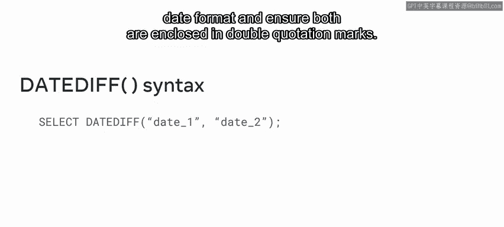
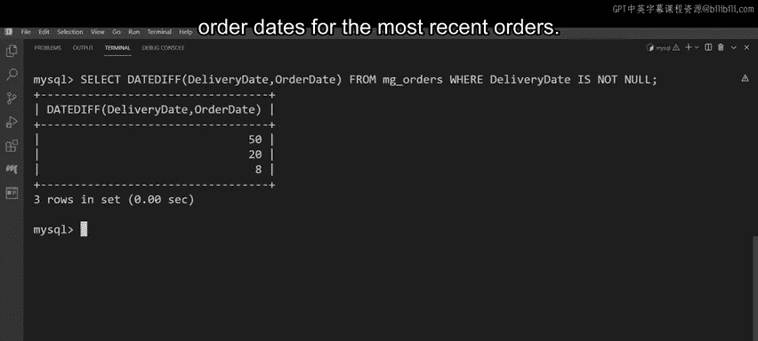

# 数据库工程师：P102：日期函数 📅

在本节课中，我们将学习MySQL中的日期函数。我们将了解什么是日期函数，探索几个常用的日期函数及其语法，并通过一个实际案例来演示如何使用这些函数处理和操作数据库中的日期数据。

## 什么是日期函数？

上一节我们介绍了课程目标，本节中我们来看看什么是日期函数。

日期函数用于在MySQL数据库中提取和处理时间与日期值，并能以多种不同的格式返回结果。例如，M&G公司的员工经常使用日期函数来获取客户订单的关键时间和日期信息。

## 常见的日期函数

了解了日期函数的基本概念后，本节中我们来看看几个在MySQL中常用的日期函数。

以下是几个M&G公司常用的日期函数：
*   **CURRENT_DATE**：此函数以“年-月-日”的格式返回当前日期。
*   **CURRENT_TIME**：此函数以“时:分:秒”的格式返回当前时间。
*   **DATE_FORMAT**：此函数用于根据给定的、在MySQL中有效的格式来格式化一个日期。
*   **DATEDIFF**：此函数用于计算两个日期值之间相隔的天数。

## 日期函数的语法

我们已经认识了几个核心的日期函数，本节中我们来学习如何正确地书写它们的语法。

在大多数情况下，日期函数通过`SELECT`语句来调用。

要提取当前日期，语法如下：
```sql
SELECT CURRENT_DATE();
```

要提取当前时间，语法如下：
```sql
SELECT CURRENT_TIME();
```

然而，`DATE_FORMAT`和`DATEDIFF`函数的语法则稍微复杂一些。

要更改日期的显示格式，需要使用`DATE_FORMAT`函数。其基本语法结构是：
```sql
SELECT DATE_FORMAT(date, format);
```
其中，`date`是待格式化的日期，`format`是指定的格式字符串。例如，`‘%M’`代表完整的月份名称。



要计算两个日期之间的天数差，需要使用`DATEDIFF`函数。其基本语法结构是：
```sql
SELECT DATEDIFF(date1, date2);
```
此函数返回`date1`减去`date2`的天数结果。

## 实践应用：帮助M&G公司

现在我们已经掌握了日期函数的语法，本节中我们来看看如何运用这些知识来解决M&G公司的实际问题。

M&G公司需要完成一系列与时间和日期相关的任务。

**任务一：提取当前日期和时间**

要获取当前日期和时间，只需分别执行以下两个查询：
```sql
SELECT CURRENT_DATE();
SELECT CURRENT_TIME();
```

**任务二：格式化日期，显示给定日期的月份名称**

你可以使用`DATE_FORMAT`函数来完成此任务。以下是具体查询：
```sql
SELECT DATE_FORMAT(order_date, ‘%M’)
FROM mg_orders;
```
执行此查询将返回订单日期的完整月份名称。

**任务三：计算最近订单的交付日期与订单日期之间的天数差**

正如之前所了解的，`DATEDIFF`函数可以用于完成此任务。相关数据存储在`mg_orders`表中，该表包含`delivery_date`和`order_date`等列。

以下是完成该任务的查询语句：
```sql
SELECT DATEDIFF(delivery_date, order_date)
FROM mg_orders
WHERE delivery_date IS NOT NULL;
```
此查询首先计算交付日期与订单日期之间的天数差，然后通过`WHERE`子句过滤掉那些交付日期为`NULL`（即尚未交付）的记录。

执行查询后，就能得到最近订单从下单到交付所经历的天数。



## 总结


本节课中我们一起学习了MySQL的日期函数。我们首先了解了日期函数的定义和作用，然后学习了`CURRENT_DATE`、`CURRENT_TIME`、`DATE_FORMAT`和`DATEDIFF`这几个核心函数的语法。最后，我们通过帮助M&G公司解决三个实际任务，练习了如何运用这些函数来提取、格式化和计算数据库中的日期数据。现在，你应该能够使用常见的MySQL日期函数来有效地处理和操作数据了。