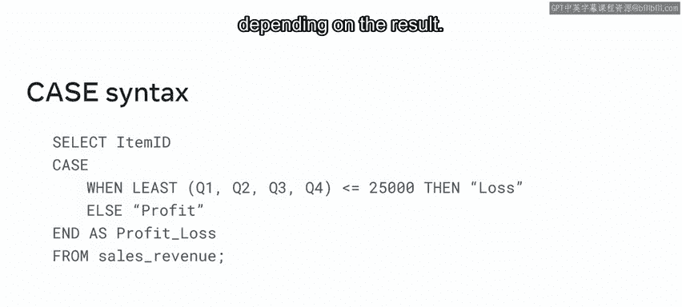
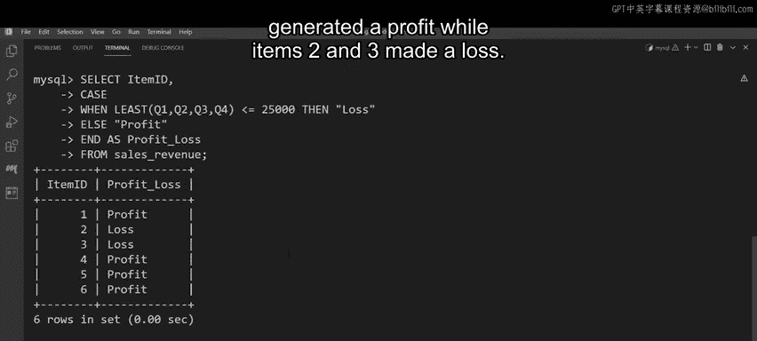

# 数据库工程师：P104：控制流函数 📊

在本节课中，我们将学习MySQL中的控制流函数。控制流函数允许你根据条件评估结果，决定查询的执行路径。我们将重点介绍最常见的控制流函数——`CASE`函数，并通过一个实际案例演示如何使用它来区分盈利和亏损的商品。

## 什么是控制流函数？

控制流函数用于评估条件并决定查询的执行流程。在MySQL数据库中，最常用的控制流函数是`CASE`函数。`CASE`函数会遍历一组条件，并在满足第一个条件时返回相应的值。

## `CASE`函数的工作原理

`CASE`函数包含在一个`CASE`块中，其运作方式类似于`IF-THEN-ELSE`语句。一旦找到为真的条件，它就返回结果。如果没有条件为真，则返回`ELSE`子句中指定的值。如果没有`ELSE`子句且没有条件为真，则返回`NULL`。

以下是`CASE`函数语句的完整语法：

```sql
SELECT column_name,
       CASE
           WHEN condition1 THEN result1
           WHEN condition2 THEN result2
           ...
           ELSE result
       END AS alias_name
FROM table_name;
```



## 实际案例：区分盈利与亏损商品

M和G需要确定库存中哪些商品盈利，哪些商品亏损。他们可以使用控制流函数来完成这项任务。所需数据存储在`sales_revenue`表中，该表包含五列：`item_id`列用于标识库存中的每个商品，以及四个业务季度的单独列。

通过检查最低季度的值是否小于或等于25,000美元，M和G可以确定哪些商品盈利，哪些商品亏损。执行此任务的最简单方法是使用`CASE`控制流函数。

以下是执行此任务的步骤：

1.  编写`SELECT`语句并指定`item_id`列。
2.  使用`CASE`关键字开始`CASE`块。
3.  在`CASE`块中，使用`WHEN`和`LEAST`函数给出条件。
4.  列出括号中的季度销售列。
5.  使用小于或等于运算符。
6.  使用`THEN`指定条件为真时要显示的信息（例如“loss”）。
7.  使用`ELSE`关键字指定条件为假时要显示的信息（例如“profit”）。
8.  使用`END`关键字结束`CASE`块。
9.  使用`AS`关键字创建别名（例如`profit_loss`）。
10. 使用`FROM`关键字指定目标表（例如`sales_revenue`）。

执行查询后，结果显示商品1、4、5和6盈利，而商品2和3亏损。

## 总结



本节课我们一起学习了MySQL中的控制流函数，特别是`CASE`函数的使用。通过实际案例，我们了解了如何利用`CASE`函数根据条件评估结果，区分盈利和亏损的商品。掌握控制流函数将帮助你在编写SQL查询时更灵活地处理数据。