# Meta《数据库工程师（数据库简介／Git／MySQL）｜Meta Database Engineer》中英字幕 - P107：30_课程回顾.zh_en - GPT中英字幕课程资源 - BV1Vw4m1Z7tb

In this course， you learned about database structures and management with MySQL Let's take a few moments to recap the key topics that you learned about。

In the opening lesson， you received an introduction to MySQL During this introduction you learned about databases。

 discovered how meta makes use of MySQL databases on a day to day basis。

 and you learned how to make the most of the content in this course to ensure that you succeed in your goals。

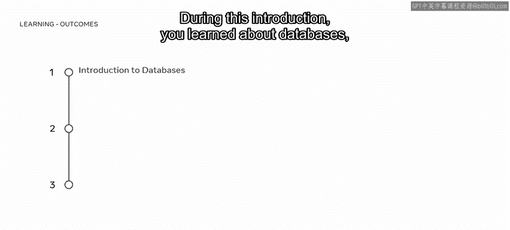

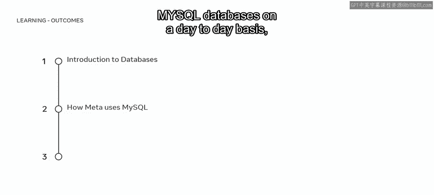

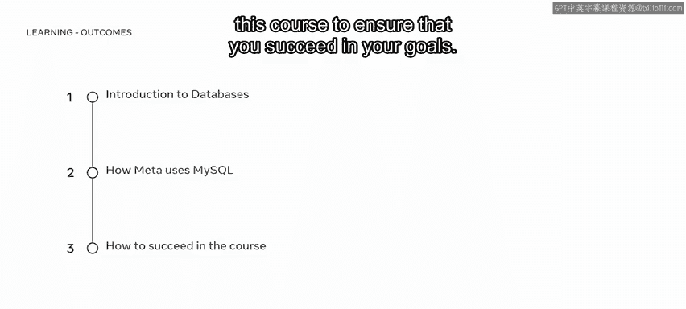

You then moved on to the next lesson in which you learned how to filter data。In this lesson。

 you learned how to filter data using the and or not in between and like logical operators。

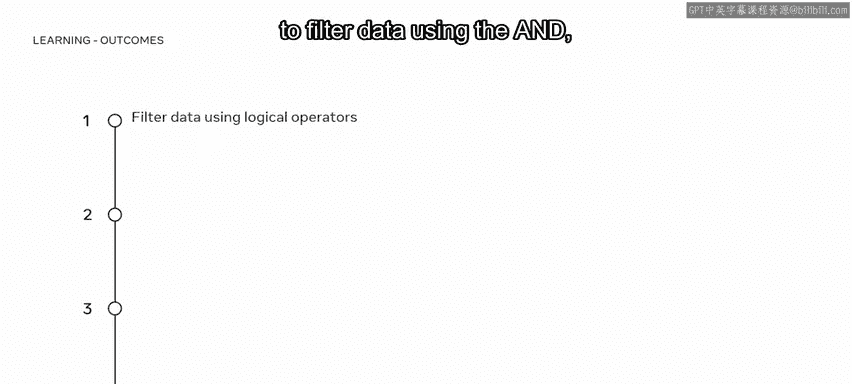

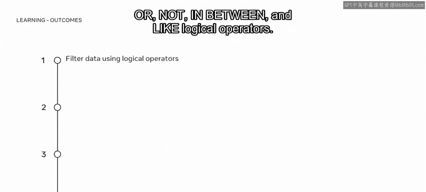

Combinine conditions with the use of logical operators。

 You learned how to identify wild card characters and explain how they're used to filter data。

 And you then demonstrated your knowledge of data filtering in a series of knowledge checks。

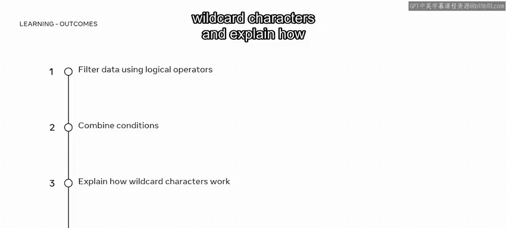

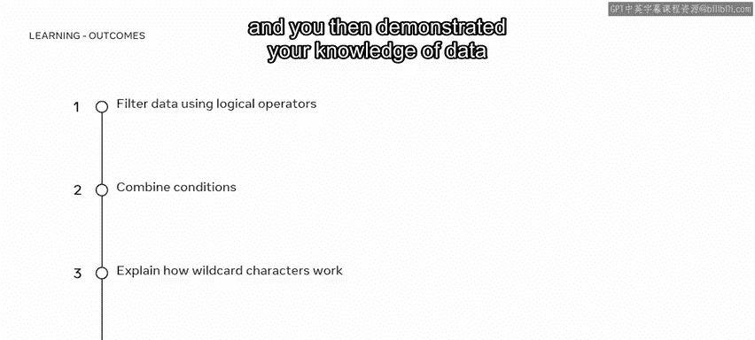

In the next lesson， you explore the concepts of aliases and table joints。

You can now explain the concept of an alias and demonstrate how they're used in a lab environment。

 outline what a table join is and explain different types such as inner， left， right， and self joins。

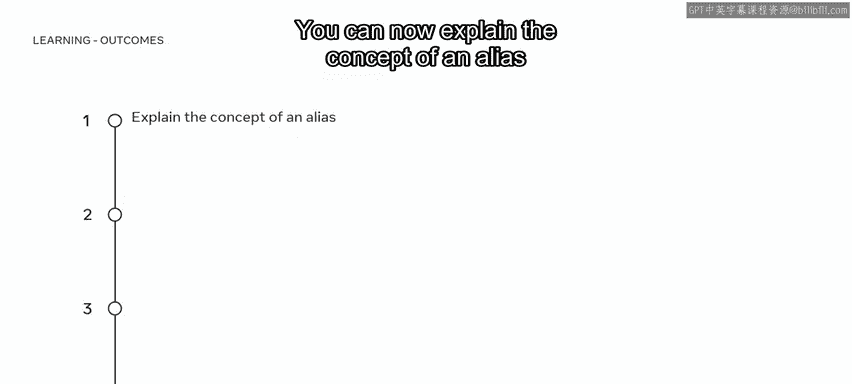

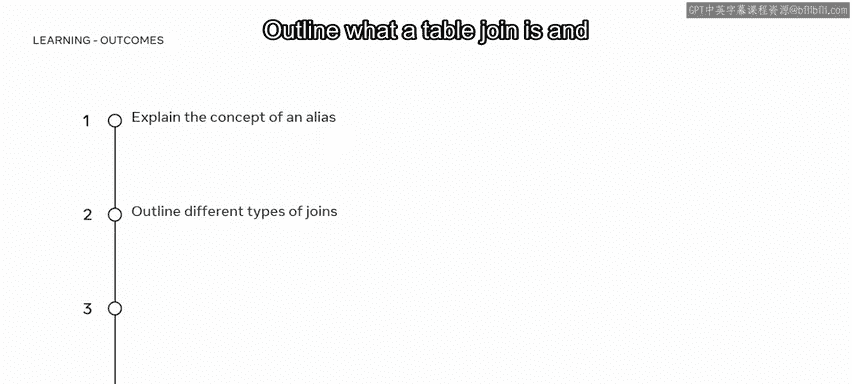

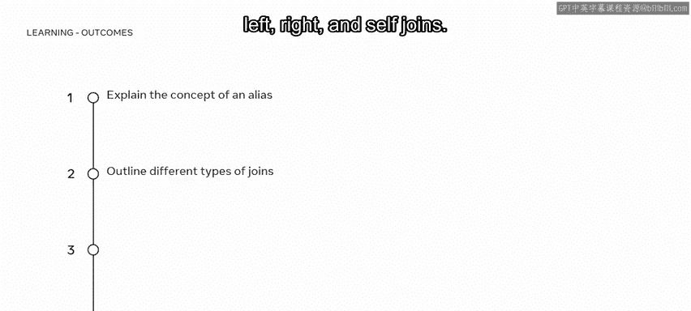

Demonstrate how to join tables and make use of the union operator in a MySQL database。

 having completed the video and demonstrated your skills in a knowledge check。

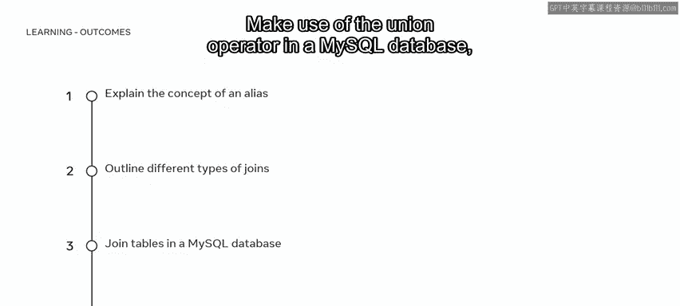

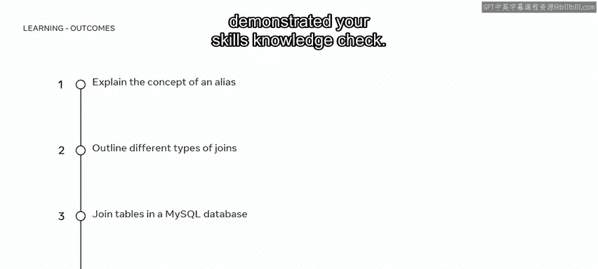

You then learned about grouping data， use the MysQL group by clause to group rows and deploy it with aggregate functions。

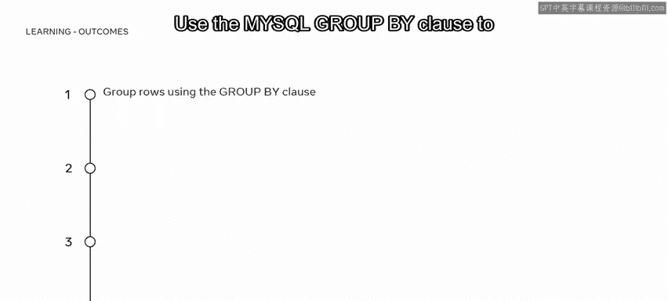

Demonstrate the use of the MySQL having clause to apply filter conditions。

 make use of the any and all operators， and you demonstrated your ability to group data in a lab environment。

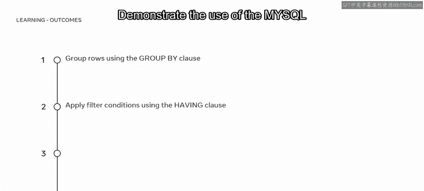

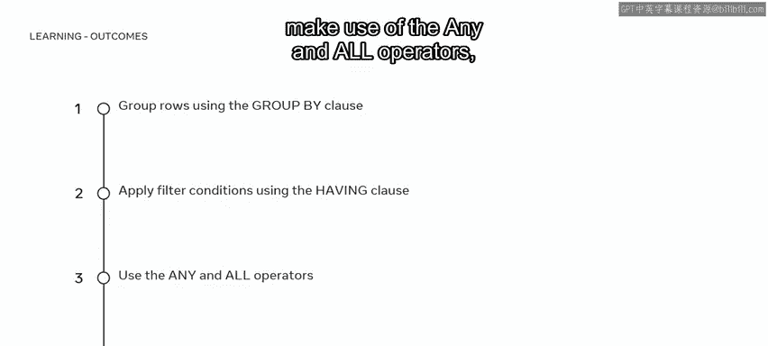

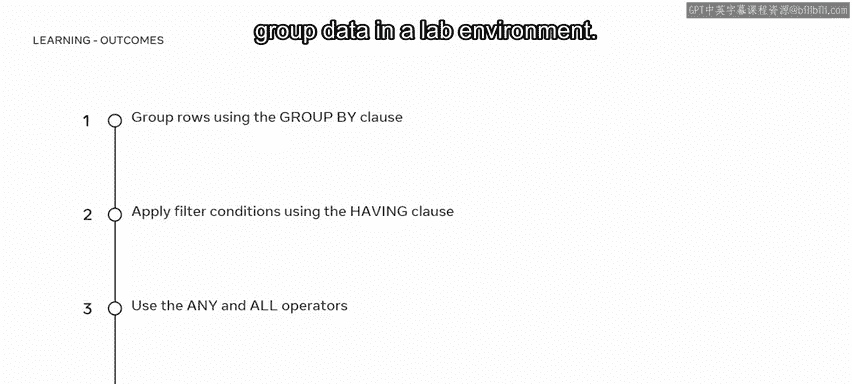

Next， you began the second module in which you explored different techniques for updating databases and working with views。

In the first lesson of this module， you learned how to insert and update data。

You can now update and insert data using the replace command。

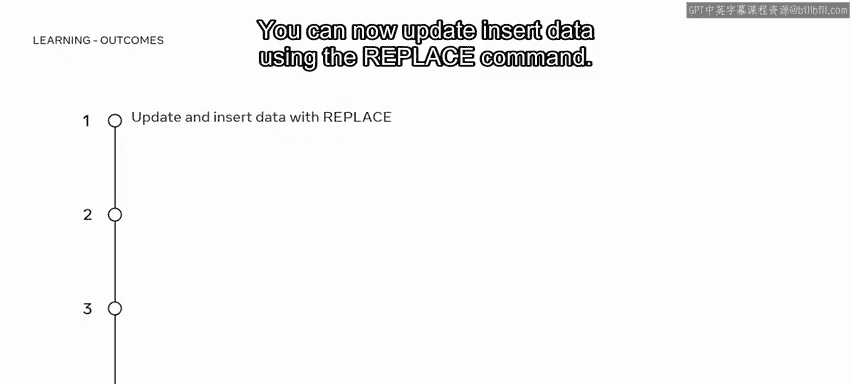

Identify the main types of constraints like key， domain and referential。

And explain how they function。

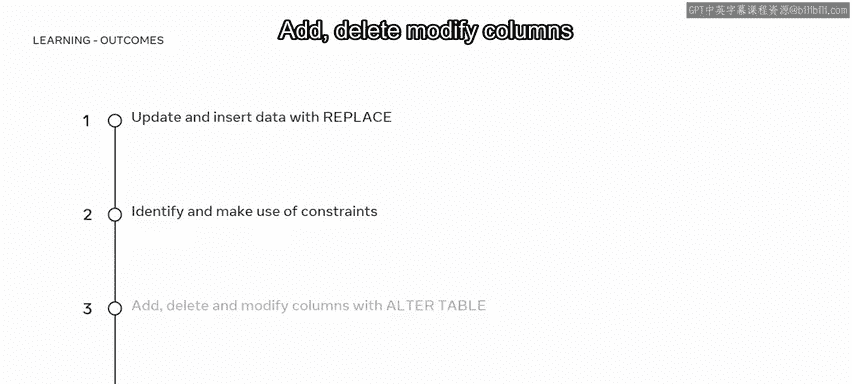

Add， delete and modify columns with the use of the Alt table command and make use of subqueries。

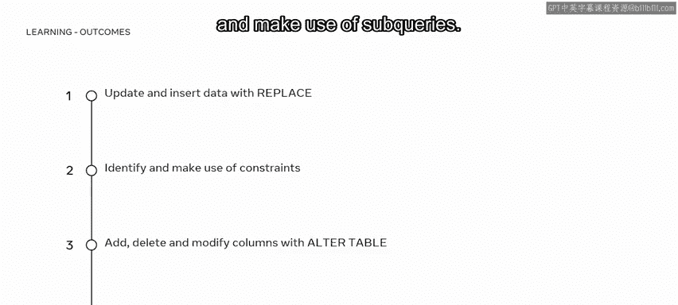

You then learned about views in MySQL databases。

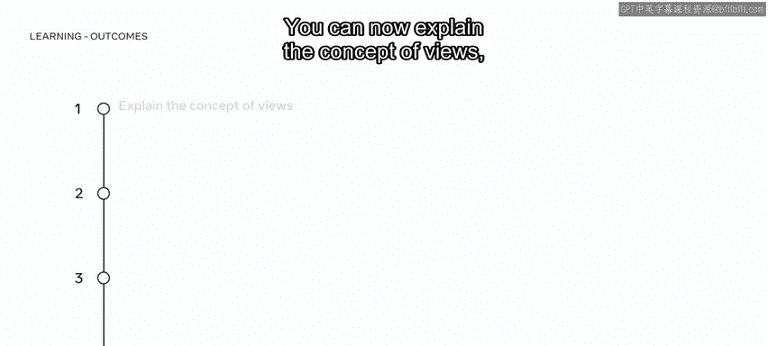

You can now explain the concept of views， create， rename， and drop views in a MysQL database。

 identify the advantages of using views， and you demonstrated your knowledge and skills with views in a series of knowledge checks and ungraded labs。

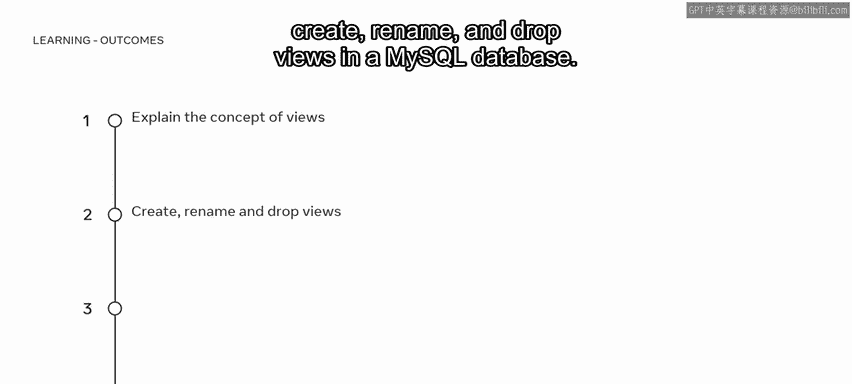

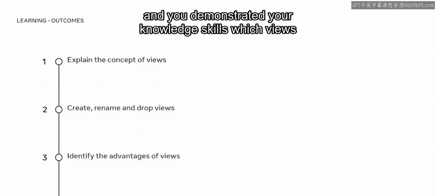

In the third module， you were introduced to functions and MySQL stored procedures。

You can now explain what a function is and identify different types of functions。

You can use numeric functions to aggregate data or perform mathematical operations。

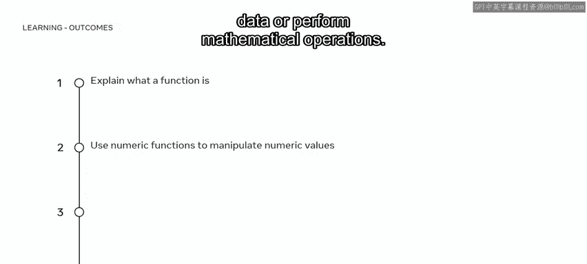

You can manipulate string values using string functions。

 extract data on time and date values with the use of date functions。

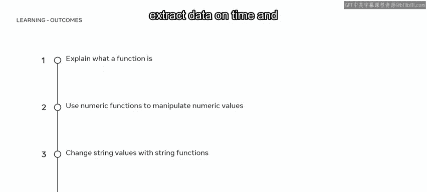

Compare values using comparison functions。

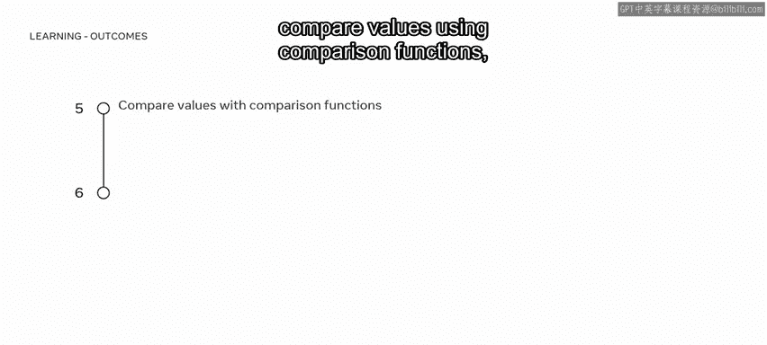

And you can deploy control flow functions to evaluate conditions and determine their execution path。

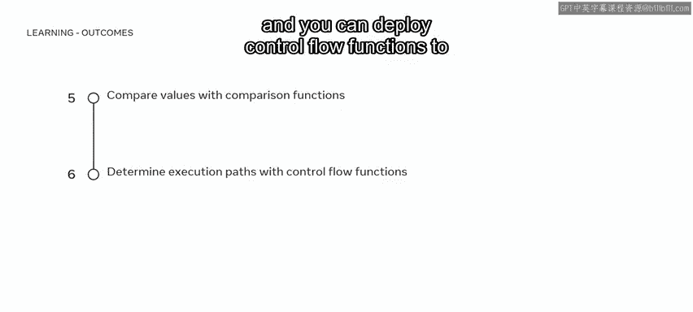

In the final lesson of this module， you explore the concept of stored procedures。

You can now explain what stored procedures are in a MySQL database and create and drop simple stored procedures in MySQL。

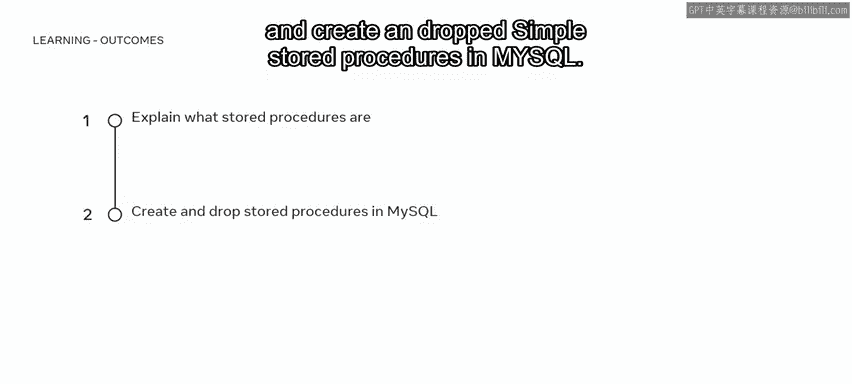

You've reached the end of this course recap。 It's now time to try out what you've learned in the graded assessment。

 Good luck。