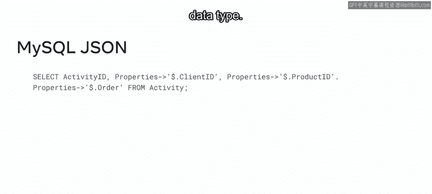
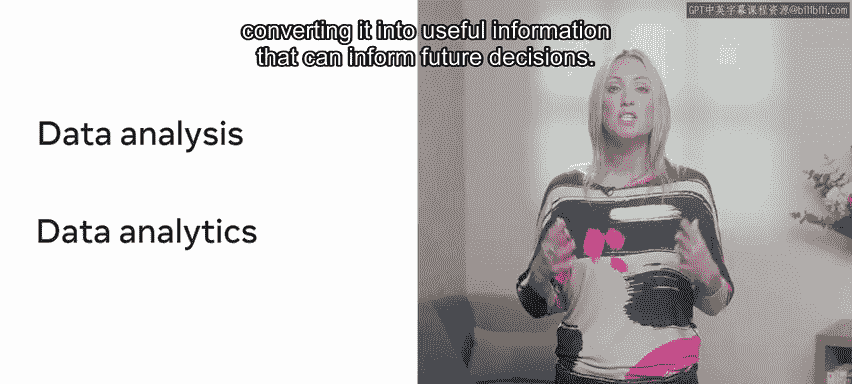
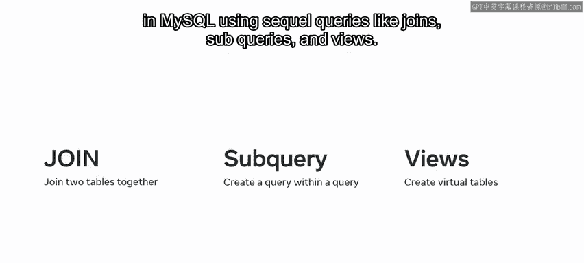

# Meta《数据库工程师（数据库简介／Git／MySQL）｜Meta Database Engineer》中英字幕 - P109：0_高级MySQL主题简介.zh_en - GPT中英字幕课程资源 - BV1Vw4m1Z7tb

Welcome to the next course in database engineering。

 The focus of this course is on advanced MysQL topics。

 Let's take a moment to review some of the new skills that you'll develop in these modules In the first module of this course。

 you'll learn how to create and work with functions along with both basic and complex stored procedures in MysQL。

 This is so you can reuse or invoke code blocks to perform specific operations。

 You'll then learn how to make use of variables and parameters to create more complex stored functions and procedures in MysQL。

 You'll also learn how to develop user definedfined functions for when MysQLs built in functions。

 don't meet the needs of your project In the next lesson。

 you'll make use of MysQqL triggers to automate database tasks。

 You'll explore different types of MysQL triggers like insert update and delete and you'll learn how to make use of each type You'll also develop an understanding of how you can make use of scheduled events to ensure that your database。

😊，Tasks and events are completed at specific times。

 The next module focuses on core rules and guidelines for database optimization In this module。

 you'll develop an understanding of the concept of database optimization and the advantages it brings to a MysQL database。

 You'll review techniques for optimizing database select statements so that they executed quickly and efficiently。

 For example， targeting required columns or avoiding the use of complex functions。

 You'll also learn how to work with indexes in MysQL to speed up the performance of data retrieval queries。

 In the next lesson， you'll be exploring further optimization techniques。

 You'll start by learning how to use MysQL transaction statements to manage database transactions。

 You'll discover how you can use common table expressions to manage complex SQL queries by compiling them into single blocks of code。

 You'll learn how to make use of prepared statements to limit the number of times MysQL must compile and parse code。

😊，And you'll discover how to interact with a MyCQL database using the JSRN data type。😊。

In the third module， you'll explore the concept of data analytics in Mysql。 First。

 you'll develop an understanding of the relationship between database analytics and Mysql。

 You'll discover how to make use of data collected during data analysis by converting it into useful information that can inform future decisions。

 You'll also explore the different types of data analysis that can be performed within a database。

 You'll then move on to learn about the relationship between Mysql and data analysis。

 including the benefits and limitations of Mysql as a data analysis tool。😊。

In the second lesson of this module， you'll learn how to perform data analysis in MysQL using SQL queries like joins。

 subqueries and views。 You'll then explore how to emulate a full outer join in MysQL to extract all records from two tables。

 including those that don't match。 And finally， you'll learn how to extract data from multiple tables using the join method。

 During these modules， you'll encounter numerous activities designed to test your skills and knowledge。

 These include lab exercises， knowledge checks and module quizzes。 And in the final module。

 you'll receive the opportunity to demonstrate some of this learning along with your practical database skill set in the lab project。

 and you'll also demonstrate your knowledge of these topics in a graded assessment。

 So let's get started。😊。

