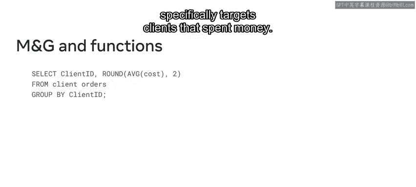
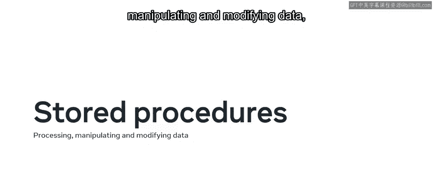

# Meta《数据库工程师（数据库简介／Git／MySQL）｜Meta Database Engineer》中英字幕 - P110：1_MySQL中的函数和存储过程.zh_en - GPT中英字幕课程资源 - BV1Vw4m1Z7tb

Yeah。In the previous courses， you learned that you could reuse code within your database projects with the use of functions and stored procedures。

 These methods save you from having to repeatedly type the same code。 over the next few minutes。

 you'll recap the basics of functions and stored procedures。

 and you'll also learn about their benefits and key differences。 As you might recall。

 Luc shrub frequently make use of these methods to query stock data in the products table of their database。

 This means that they don't have to repeatedly type the same code each time they check their stock。

 Over the next few minutes， you'll take a closer look at how they achieve this。

 So as you've just learned， the main purpose of creating stored procedures and functions is to wrap or encapsulate code together in the body of a function or procedure。

 This means that instead of typing the same code repeatedly。

 you can call a code block to perform a specific operation by invoking the identifier name。

 but there are other benefits to functions and stored procedures。😊。

They make code more consistent and more organized and introduce reusability to make the code easier to use and maintain。

 Let's look at a few examples of these concepts， to find out more。As you just saw a moment ago。

 luckyky shrugrub make use of procedures when checking their stock。 First。

 they create the query as a stored procedure using the create procedure command。

 followed by the name of the procedure and the required logic。

 They then invoke this procedure using the call command to extract the required data from the database。

 If there's no data in the table， then function returns at null value。

 Let's look at an example of a function。 The mod function can be used to find the remainder of the division of two numeric values。

 X and Y。 For example，7 divided by 5。 to find the result。

 Invoke the function by using the identifier name within a select statement。 In this instance。

 the result is2。😊，Remember that unlike stored procedures， a function always returns a value。

For example， you might recall the scenario from the last course in which M and G used a function to determine the average dollar amount each client spent with their business。

 This function always returns value because it specifically targets clients that spent money。

Let's take a few moments to explore a key difference between functions and stored procedures。

 parameters。 Funs can only have input parameters， while stored procedures can have both input and output parameters。

 Both functions and procedures can accept values within their respective code。 In other words。

 they both accept an input。 but only procedures can pass values back out again with the use of output parameters。

 Don't worry if you find this concept confusing。 You'll learn more about parameters in later videos。

😊。

You can create as many functions and procedures as you need。

 Just make sure you know when to use one over the other。 For example。

 functions are best when you need to return one specific value。

 like in a SQL statement or within another function。 stored procedures are mostly for processing。

 manipulating and modifying data。 So as you've just learned。

 functions and procedures are an effective way of reusing code to complete repetitive tasks。

 And even though they may bring many benefits， it's important to know when to use one over the other。

😊。

In this course， you'll explore these concepts in more depth。

