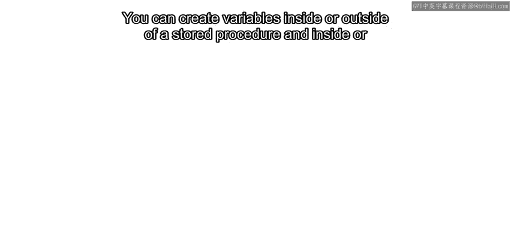
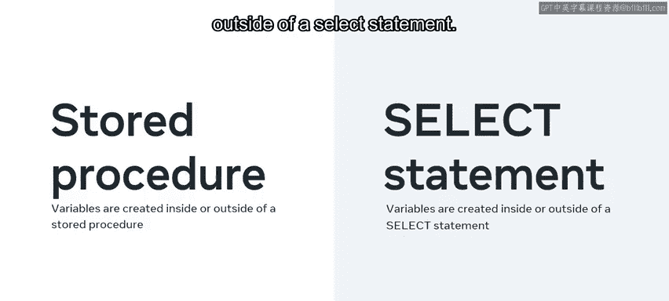
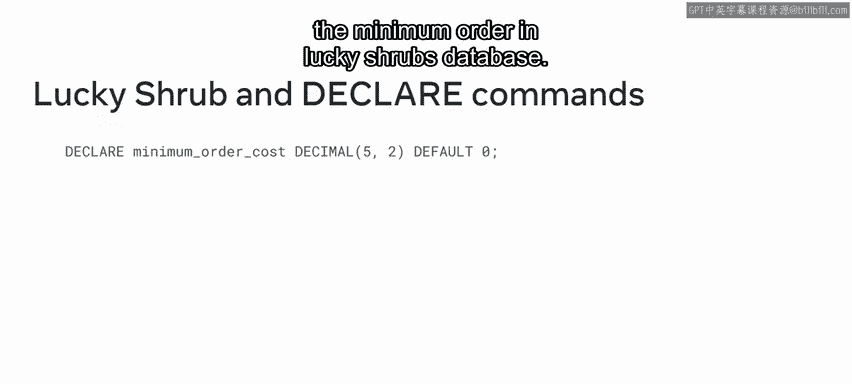
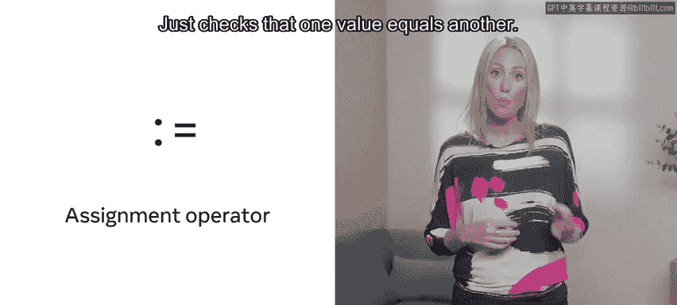
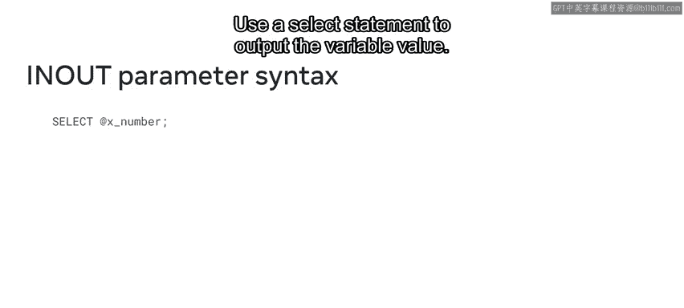

# Meta《数据库工程师（数据库简介／Git／MySQL）｜Meta Database Engineer》中英字幕 - P111：2_变量和参数.zh_en - GPT中英字幕课程资源 - BV1Vw4m1Z7tb

You might already be familiar with basic stored procedures and functions from earlier courses。

 However， My SQL also offers more complex stored procedures and functions。

 which rely on variables and parameters。 Over the next few minutes。

 you'll learn how to use variables and parameters to build sophisticated functions and procedures。😊。

Lucky shhrub Gardening center have several repetitive but complex queries they need to create for their database。

 They can create these queries using variables and parameters。

 Let's follow their process and find out how it works。First。

 you need to know what the term variable means in the context of My SQL。

A variable represents a placeholder that stores a value。 This value may change at times。

 depending on the needs of the query。 Basically， variables are used to pass values between SQL statements or between a procedure and a SQL statement。

There are two different ways in which variables can be used in my SQel。

 You can create variables inside or outside of a stored procedure and inside or outside of a select statement。

 So what does a variable look like In my SQL。 A user defined variable is created from alphanumeric characters You just type the at symbol followed by the name that you want to call your variable。

 Then assign sign of value to your variable using an equal to operator。

 Make sure that you end your syntax with a semicolon。😊。

But how do you create a variable inside or outside of a stored procedure to do this。

 you need to use the set command within your syntax。

 The set command is used to assign a value to a variable within a stored procedure。

 Let's take a moment to see what the set command looks like in practice。

 When creating a variable inside or outside of a stored procedure。

 type the set command followed by the name of the variable。😊，Then assign a value to the variable。

 For example， Lucky Shrub have an orders table in their database that records orders placed with the business。

 They can create and use a variable called order I D to target the record with the order I D number of  three。

 They can now use this variable to delete update or query the record。

 or you can create a variable inside a stored procedure using the declare command。 In this instance。

 you type the variable name without an at sign。 Then you assign the variable a relevant data type and default value。

 Lucy Shrub can use this method to create a variable called minimum order cost。

 The expectation is that this variable stores a value equal to the cost of the minimum order in Lucky Shrubb's database。

😊。

As you learned earlier， you could also create a variable inside a select statement。 However。

 when assigning a value to a variable in a select statement。

 you need to use the assignment operator syntax。 This instructs my sQel to assign a value to the variable。

 A standard equals operator just checks that one value equals another。 So type a select command。

 and then the name of your variable。 Then assign a value to your variable using the assignment operator。

 For example， Luc shrub can create a max order variable that retrieves the most expensive order from their orders table。

😊。

They can then access the value by typing select max order。 The output shows the most expensive order。

 It's also possible to create a variable inside of a select statement and assign it a value returned from a function。

 You just type the select command followed by the function。

 Then the into keyword and the variable name。 Finally。

 type the from keyword and the name of the table。 The value must be extracted from。😊。

Lucky shhrub can use this method to create a variable called average cost。

 which returns the average cost of items from their orders table。😊。

Now that you are familiar with variables， let's move on and explore the topic of parameters。

 A parameter is used to pass arguments or values to a function or procedure from the outside。

 In my SQL， a function only takes input parameters。

 But there are three different types of parameters that can be declared in stored procedures in out and in out parameter。

 Let's take a few moments to explore how each of these works。

 The in parameter is the default parameter。 It's used to pass an argument or value to a stored procedure to use this parameter type that create procedure command and your procedure name。

 type the in keyword in a pair of parentheses。 If you don't specify a keyword。

 then my SQl uses in by default。 Then within your parentheses。

 add another pair of parentheses with your parameter names。

 Then add a select statement that outlines the logic of your query。 For example。

 Luc shrub can create a procedure that calculates 20%。😊，Each employee's salary for tax purposes。

 they can then call the procedure against a specific salary value。

 This passes the salary to the procedure and returns the amount due in tax。Next。

 let's investigate the out parameter。 The out parameter is used to pass a value to a variable outside of the procedure。

 Here's an example where lucky shrub used a procedure called get lowest cost to identify the order with the lowest cost in their orders table。

 They use the out keyword to pass the value outside the parameter。😊。

So the next step is to call the procedure。 The value of the procedure can then be stored in the form of a variable within a pair of parentheses to display the variable stored value。

 Just use a select statement to return the output。Finally， there's the in out parameter。

 This is a combination of both parameters。 It's used to pass an argument to the procedure and then pass the new value back to the outside。

 So it's effectively an in and an out parameter。 For example。

 you could create a procedure called square a number that returns the squared value of a specific number using the in out keyword and a number variable。

😊，The procedure expects an input number through the a number parameter。

 It multiplies this number by itself， then returns the result to the same a number parameter again。

Then you can set a variable called x number with a value of 5 called the procedure using the x number variable value。

 The procedure passes the value through the parameter。

 It then performs the calculation and returns the result back through the parameter。😊。

Use a select statement to output the variable value you should now be familiar with how to create more complex store procedures and functions using variables and parameters great work。

😊。