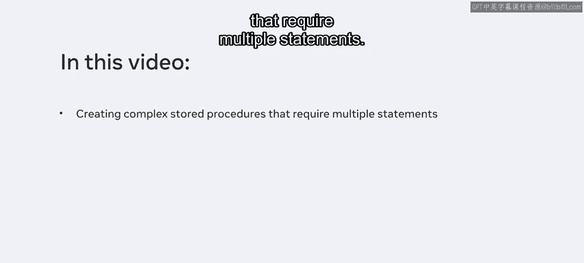
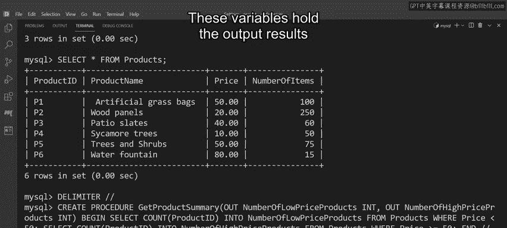
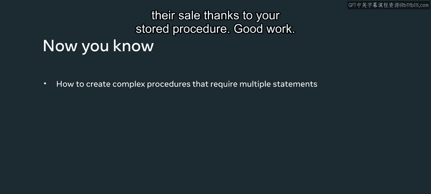

# Meta《数据库工程师（数据库简介／Git／MySQL）｜Meta Database Engineer》中英字幕 - P113：4_创建复杂存储过程.zh_en - GPT中英字幕课程资源 - BV1Vw4m1Z7tb

You should already be familiar with the process for creating basic stored procedures。

 So in this video， you'll learn how to create more complex stored procedures that require multiple statements。

 You can learn how these procedures work by helping Luc shrub。

 Lucky shrub need to determine the current cost of each of their products ahead of their upcoming sale。

 They must identify all products that cost less than $50 so they can add an appropriate discount。

 and they need to identify all products that cost more than $50 for further discounts。

 The required data is stored in the products table in their database。

 You can help them to complete this task using a complex stored procedure。 First。

 you need to use a delimiter command so that My SQL can compile the code in a begin end block as one compound statement。

 type the delimiter command to change the delimiter from the default semicolon to a double forward slash。

 Click enter to apply the changes。 Next， type the create procedure command。 They type the。😊。

Your name， get a product summary。 Add a pair of parentheses and include two out parameters。

 along with relevant variables。 These parameters output the low price products and high price products outside of the procedure。

 They also store the output values in the variables。😊，Next。

 you need to create the body of the procedure。 Implement the logic within the begin and end keywords。

 The logic consists of two select statements followed by a count command that targets the product I D column within the products table。

 The first statement returns the I D of all products that cost less than $50。

 The second statement returns all products that cost more than 50。

 A double forward slash indicates the end of the query。 Click enter to create the procedure。 Finally。

 change the delimiter to the default semicolon again so that you can keep using My SQL as usual。😊。

Now it's time to execute the procedure。 type the call command followed by the name of the procedure。

 Then in a pair of parentheses， create the two required variables。

 You can call the first variable total number of low price products。 and the second variable。

 total number of high price products。 These variables hold the output results from the out parameters。

 Click enter to execute the call statement。 The procedure retrieves data from the table and passes it to each variable。

 Now， you just need to access the data using a select statement。

 type the select command followed by the two variable names。

 Make sure the names are separated by a comma。 Click enter to execute the statements。

 The output results shows the total number of low and high priced products。

 Lucky Srub now have all the data they require for their sale。 thanks to your stored procedure。

 Good work。😊。

