# 数据库工程师：6：MySQL触发器类型 🚀

在本节课中，我们将要学习MySQL触发器的不同类型。触发器是一组在特定事件发生时自动执行的动作。我们将探讨如何通过不同类型的触发器来控制其执行时机和行为，并了解每种触发器的适用场景。

## 触发器的主要分类：行级与语句级

上一节我们介绍了触发器的基本概念，本节中我们来看看触发器的两种主要分类：行级触发器和语句级触发器。


以下是这两种触发器的核心区别：

*   **行级触发器**：对表中**每一行**被插入、更新或删除的数据都会调用一次。例如，如果向表中插入100行数据，行级触发器会被调用100次。
*   **语句级触发器**：对每个**操作语句**只调用一次，无论该语句影响了多少行数据。例如，一个INSERT语句可能插入100行数据，但触发器只激活一次。

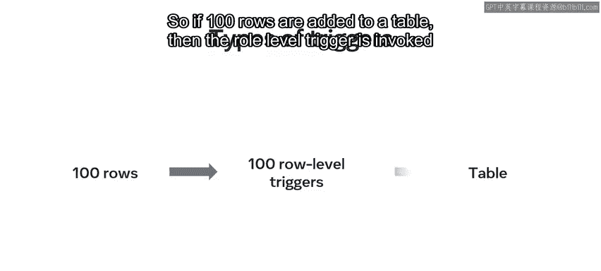

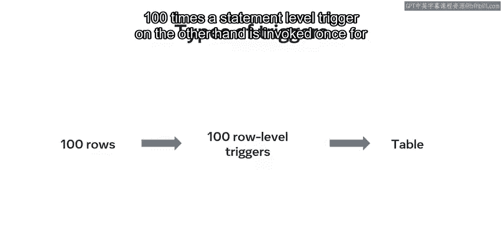


了解这两种类型很重要。然而，**MySQL只支持行级触发器**，因此本节课我们将重点讨论行级触发器。

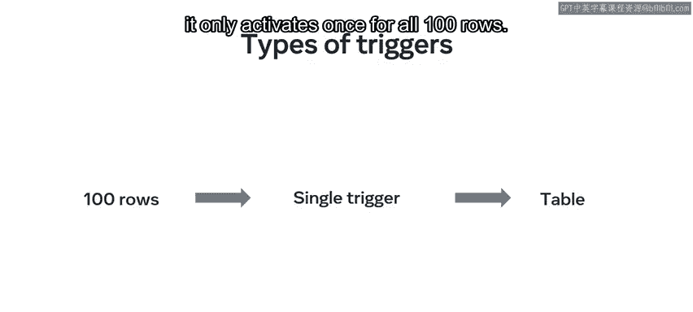

## 触发时机：BEFORE 与 AFTER 触发器

我们已经知道触发器通常用于执行插入、更新和删除这三种操作。那么，如何确定触发器是在操作之前还是之后执行呢？这取决于触发器的触发时机，可以分为BEFORE触发器和AFTER触发器。

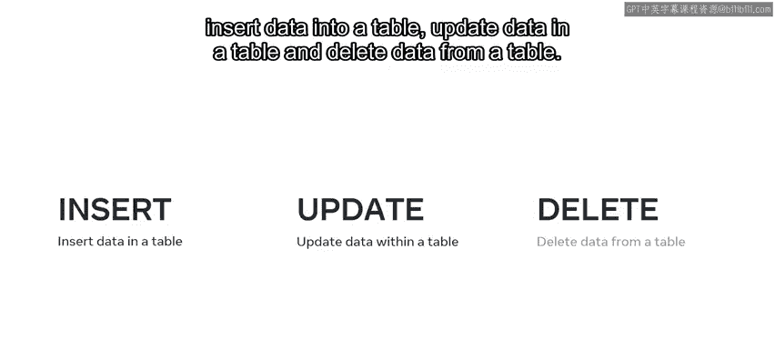
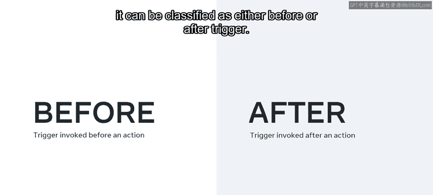


以下是这两个关键字的含义：

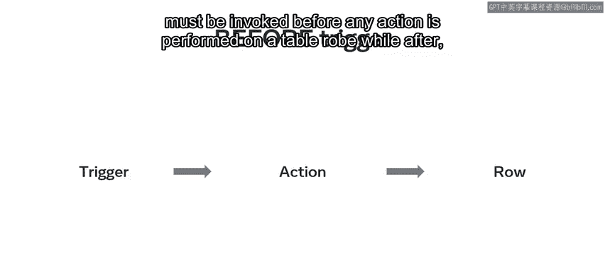

*   **`BEFORE`**：表示触发器必须在**对表行执行任何操作之前**被调用。
*   **`AFTER`**：表示触发器在**对每一行执行操作之后**被调用。

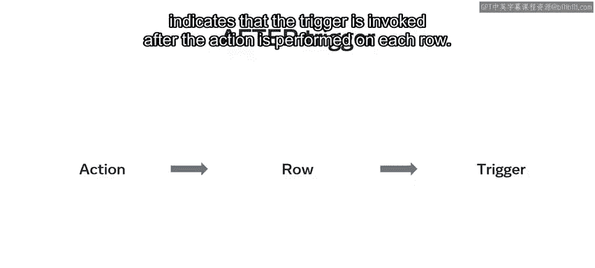

## MySQL触发器的组合类型与语法

通过将 `BEFORE`/`AFTER` 修饰符与 `INSERT`、`UPDATE`、`DELETE` 关键字组合，可以创建不同类型的触发器。


以下是可创建的触发器类型示例：

*   `BEFORE INSERT`：在表的插入事件**发生前**自动调用。
*   `AFTER INSERT`：在插入事件**发生后**调用。
*   `BEFORE UPDATE`：在更新事件**发生前**调用。
*   `AFTER UPDATE`：在更新事件**发生后**调用。
*   `BEFORE DELETE`：在表中数据被删除**前**调用。
*   `AFTER DELETE`：在数据被删除**后**调用。

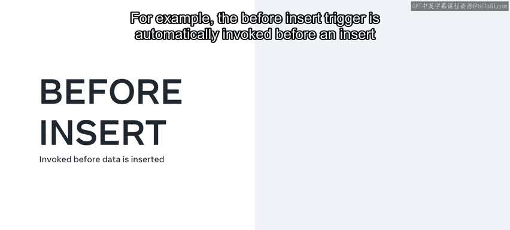

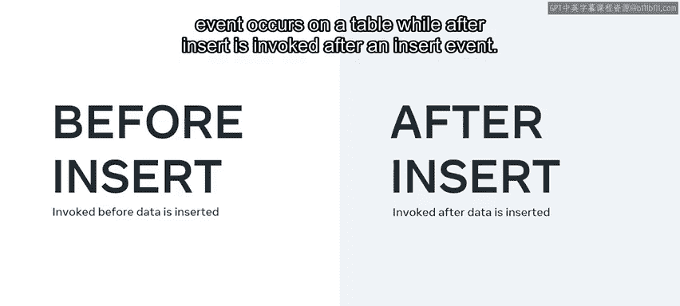

每种触发器的语法大体相同。以下是创建触发器的基本结构：

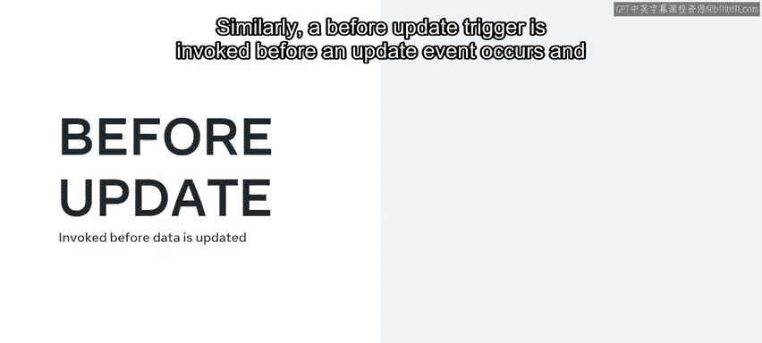


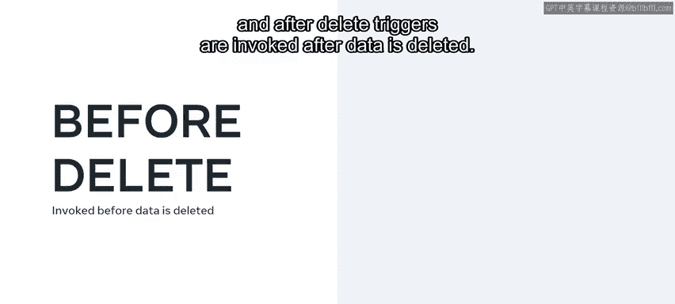

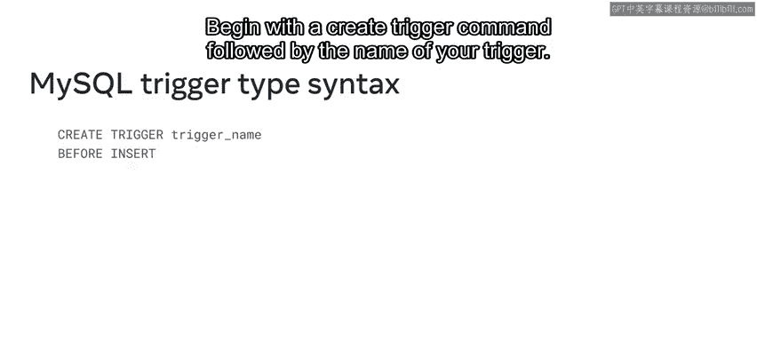

```sql
CREATE TRIGGER trigger_name
[BEFORE | AFTER] [INSERT | UPDATE | DELETE]
ON table_name
FOR EACH ROW
BEGIN
    -- 触发器逻辑（一个或多个SQL语句）
END;
```

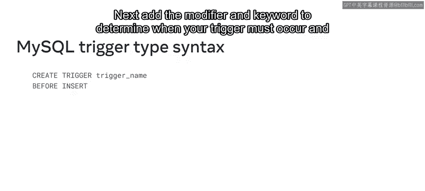

让我们通过Lucky Shrub公司的案例来具体理解。他们需要为订单表（`orders`）添加一条新约束：`OrderQuantity`（订单数量）字段不能插入负值。

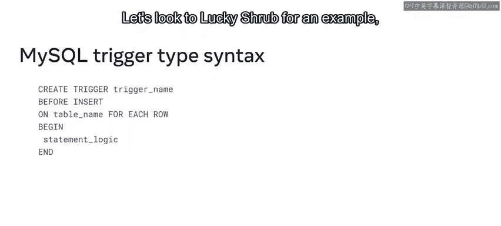
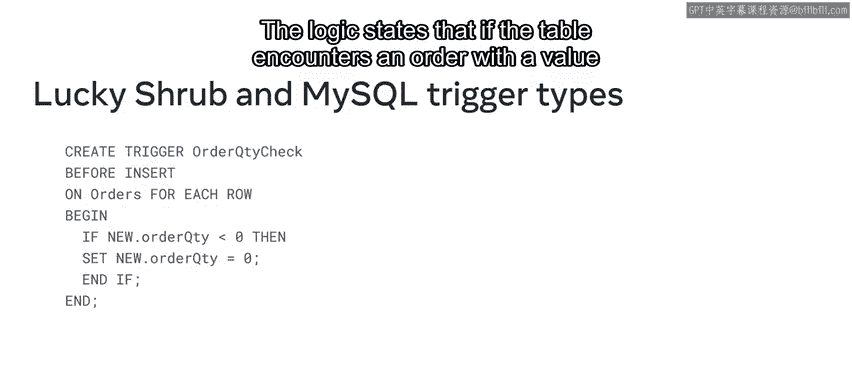

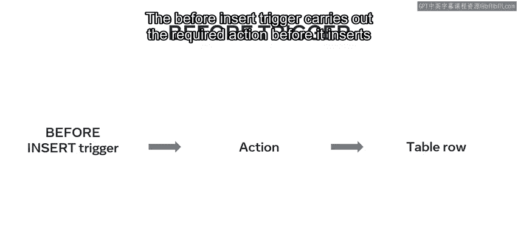

他们可以使用一个 `BEFORE INSERT` 触发器来实现：

```sql
CREATE TRIGGER OrderQuantityCheck
BEFORE INSERT
ON Orders
FOR EACH ROW
BEGIN
    IF NEW.OrderQuantity < 0 THEN
        SET NEW.OrderQuantity = 0;
    END IF;
END;
```

现在，每次向表中插入新行时，`BEFORE INSERT` 触发器都会在插入新值之前执行所需的检查与修正操作。


## 更多触发器应用示例


接下来，我们看看Lucky Shrub公司可以使用的其他几种触发器类型。

他们希望维护一个对订单表所有更新的审计追踪。使用 `AFTER INSERT` 触发器，他们可以在每次插入新订单时，将一条日志信息从订单表发送到审计表（`audits`）。

此外，公司还需要创建一个日志，记录从订单表中删除订单记录的日期和时间。他们可以使用 `AFTER DELETE` 触发器来完成此任务。在记录被删除后，该触发器会在日志表中插入一条包含日期和时间的记录。

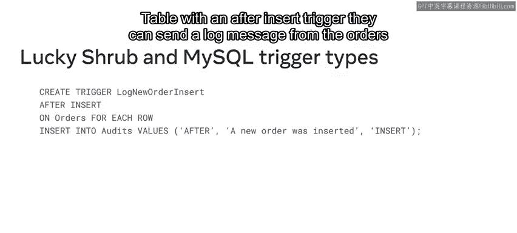


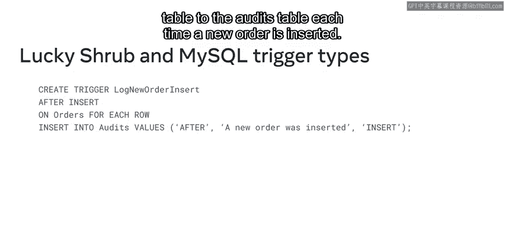


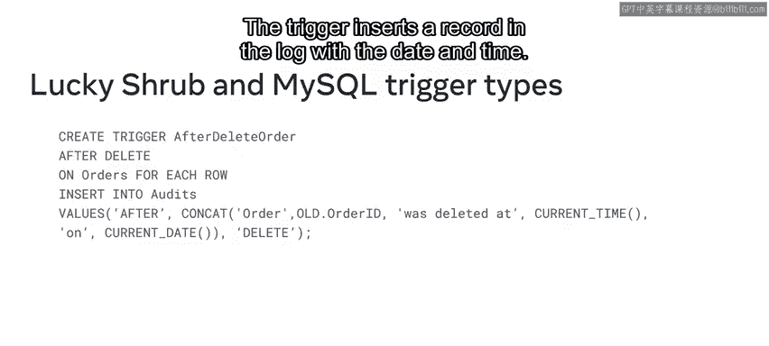

## 总结 📝

本节课中我们一起学习了MySQL触发器的不同类型。我们了解到，虽然SQL理论上存在行级和语句级触发器，但MySQL仅支持行级触发器。我们重点探讨了通过组合 `BEFORE`/`AFTER` 与 `INSERT`/`UPDATE`/`DELETE` 关键字来定义触发器执行时机的方法，并通过Lucky Shrub的实例学习了创建 `BEFORE INSERT` 触发器的基本语法及其应用场景。我们还简要了解了 `AFTER INSERT` 和 `AFTER DELETE` 触发器的潜在用途。掌握这些触发器类型是构建自动化、健壮数据库规则的基础。