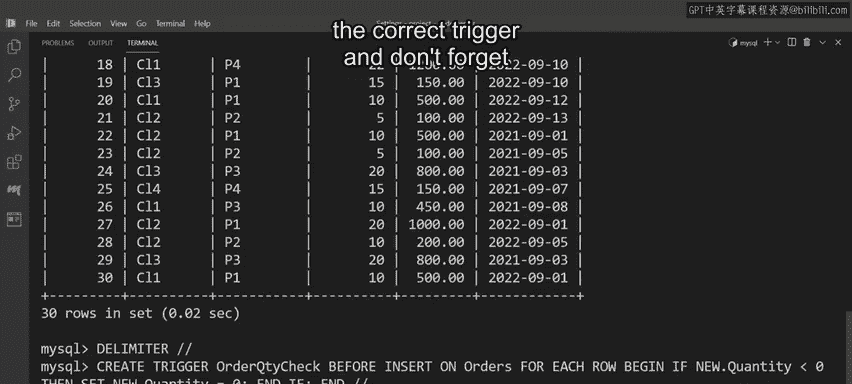
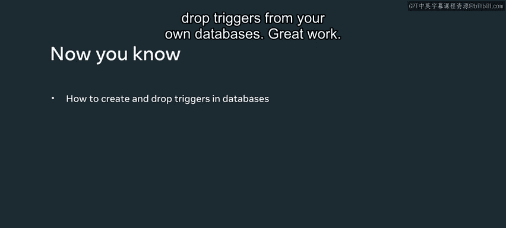

# 数据库工程师：P116：在MySQL中创建和删除触发器 🛠️

在本节课中，我们将学习如何在MySQL数据库中创建和删除触发器。触发器是一种特殊的存储过程，它会在指定的数据库事件（如插入、更新或删除）发生时自动执行。通过本教程，你将掌握创建`BEFORE INSERT`触发器来验证数据，以及如何安全地移除不再需要的触发器。

---


## 触发器应用场景示例

上一节我们介绍了MySQL触发器的基本概念和类型，本节中我们来看看如何在具体业务场景中应用触发器。

以Lucky Shrub公司的数据库为例。该公司的数据库中包含一个`orders`表，该表有多个列，用于记录每笔订单的信息。Lucky Shrub希望确保在记录新订单时，`quantity`（数量）列不会被插入负值。任何遇到的负值都必须被设置为默认值`0`。他们可以通过创建一个`BEFORE INSERT`触发器来完成此任务。


---

## 创建触发器语法解析

以下是创建一个触发器的基本语法结构。

```sql
CREATE TRIGGER trigger_name
trigger_time trigger_event
ON table_name FOR EACH ROW
BEGIN
    -- 触发器逻辑（一个或多个SQL语句）
END;
```

让我们分解这个语法，并应用到Lucky Shrub的例子中。

1.  **`CREATE TRIGGER`命令**：这是定义新触发器的起始关键字。
2.  **触发器名称**：在此例中，触发器被命名为`order_quantity_check`。**确保触发器名称在数据库中是唯一的**。
3.  **触发器类型与时机**：接下来，指定触发器的类型和调用时机。本例中是`BEFORE INSERT`，意味着它将在`INSERT`命令执行**之前**被调用。
4.  **目标表**：使用`ON`关键字后接表名（例如`orders`），以告知MySQL触发器作用于哪个表。
5.  **行级触发**：添加`FOR EACH ROW`，确保触发器针对表中的**每一行**受影响的数据进行操作。
6.  **触发器逻辑**：最后，编写触发器的主体逻辑。这是一系列在触发器激活时执行的SQL语句。如果有多条语句，需要用`BEGIN ... END`块包裹起来。

---

## 编写触发器逻辑

触发器的逻辑需要检查是否即将向`quantity`列插入负值。这需要一个`IF`语句来访问`quantity`列的值。

要创建这个`IF`语句，你需要使用`NEW`或`OLD`修饰符之一。`NEW`修饰符用于访问操作**后**的列值（即即将插入的新值），这符合我们当前的需求。如果你需要访问操作**前**的列值，则应使用`OLD`修饰符。

因此，编写的逻辑语句是：**如果新的订单数量值小于0，则将其设置为0**。

对应的代码逻辑如下：

```sql
IF NEW.quantity < 0 THEN
    SET NEW.quantity = 0;
END IF;
```

如果你现在对这些修饰符的理解还不够透彻，不必担心，本课程后续会进行更详细的讲解。

---

## 执行与删除触发器

在运行此触发器之前，有一个重要的步骤。

1.  **重定义分隔符**：由于触发器主体包含分号(`;`)，需要先将MySQL的语句分隔符临时从分号重定义为其他符号（例如`//`），以防止MySQL提前结束解析。
2.  **执行创建语句**：使用新的分隔符执行完整的`CREATE TRIGGER`语句。
3.  **恢复分隔符**：创建完成后，将分隔符改回分号。

至此，Lucky Shrub的`orders`表中已经成功添加了所需的触发器。

当需要从表中删除这个触发器时，可以使用`DROP TRIGGER`语句。

以下是删除触发器的推荐语法：

```sql
DROP TRIGGER IF EXISTS database_name.trigger_name;
```

-   `IF EXISTS`条件可以防止因触发器不存在而导致的错误。
-   使用点符号(`.`)同时提供**数据库名（模式名）**和**触发器名**。指定数据库名是可选的，但强烈建议使用，它有助于MySQL定位正确的触发器。

**重要提示**：如果你删除了`orders`表，那么与该表相关的所有触发器也会被自动删除。




---

## 课程总结

本节课中，我们一起学习了如何在MySQL中创建和删除触发器。我们通过Lucky Shrub的案例，逐步解析了创建`BEFORE INSERT`触发器的完整语法，包括命名、定义时机、指定目标表、编写行级逻辑，并使用了`NEW`修饰符来验证和修正数据。最后，我们介绍了如何安全地使用`DROP TRIGGER`语句移除触发器。现在，你应该能够在你自己的数据库中应用这些知识来创建和管理触发器了。


做得好！ 🎉