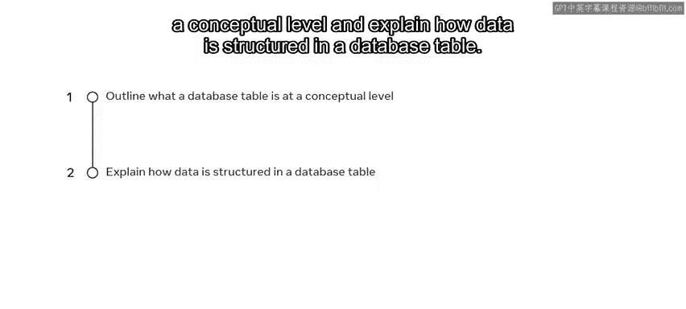
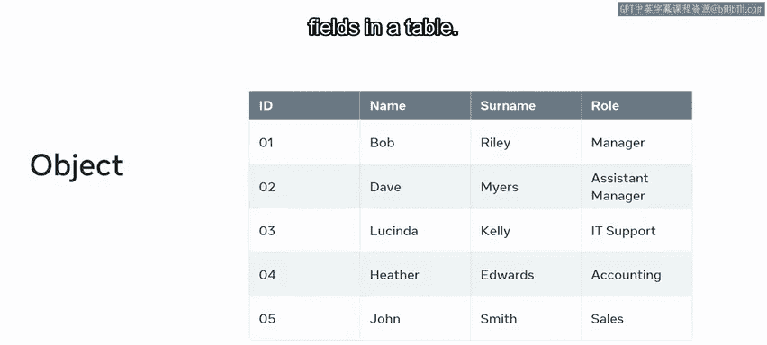
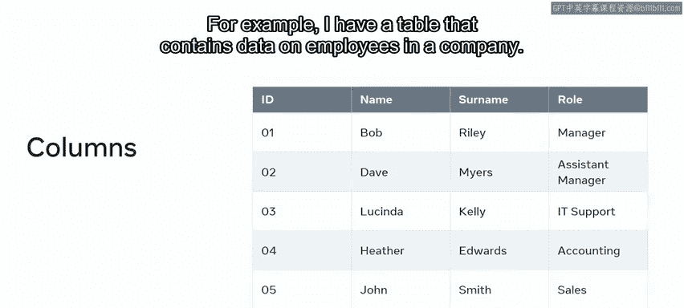
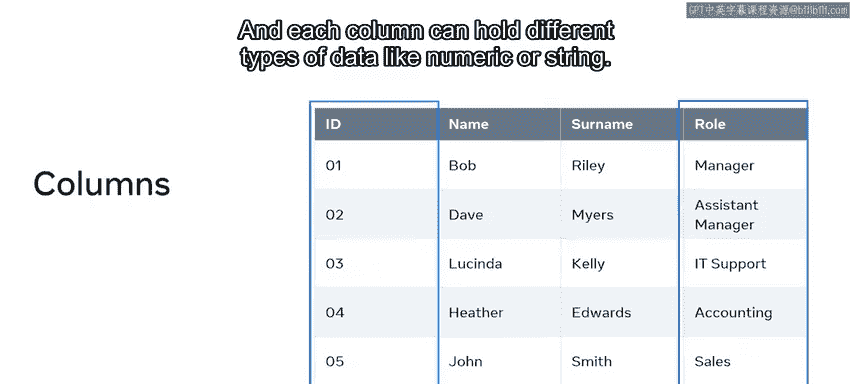
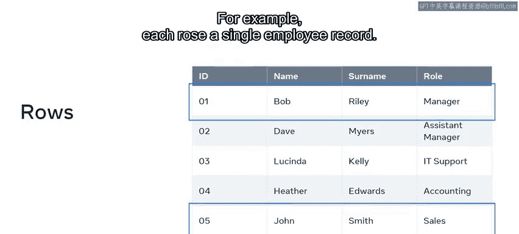
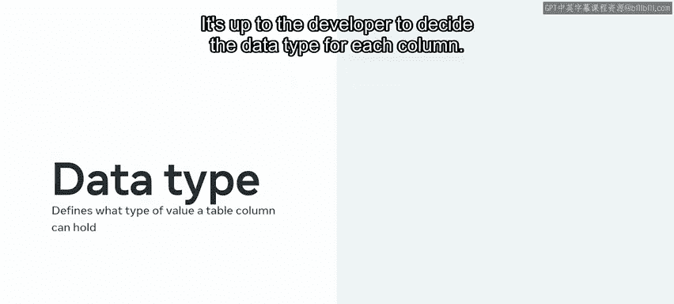
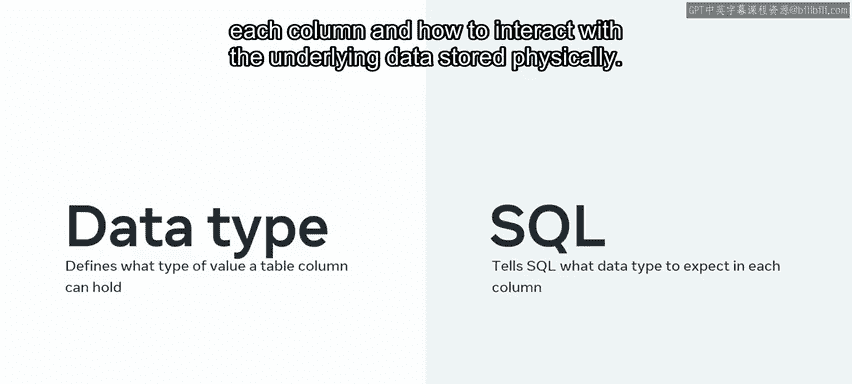
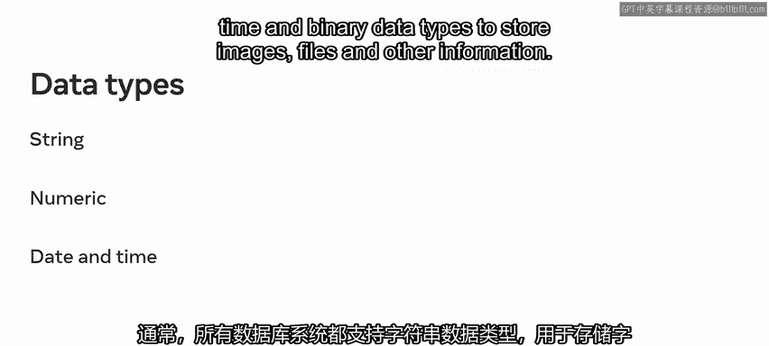
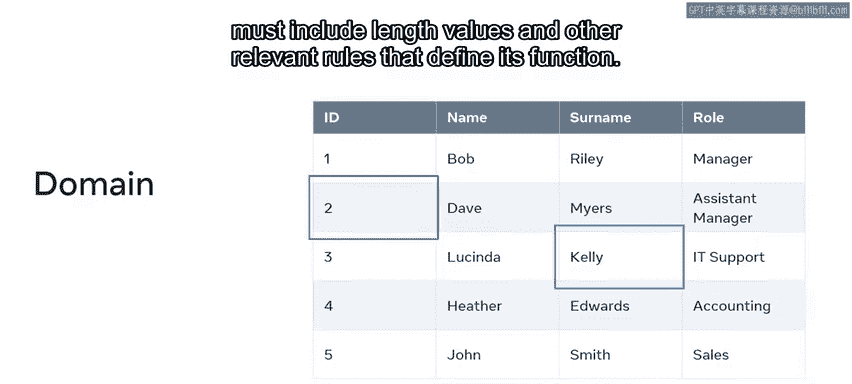
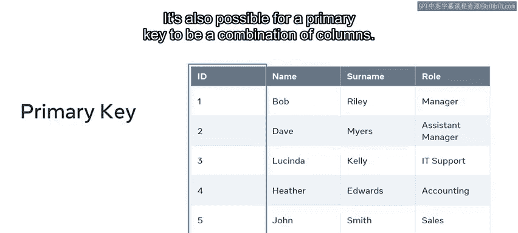

# Meta《数据库工程师（数据库简介／Git／MySQL）｜Meta Database Engineer》中英字幕 - P11：10_数据库中的表是什么.zh_en - GPT中英字幕课程资源 - BV1Vw4m1Z7tb

At this stage of the course， you're probably familiar with the basics of how databases store and interact with data。

But how do they store all this data and present it in the logical way？In the form of tables。

By the end of this video， you'll be able to outline what a database table is at a conceptual level and explain how data is structured in a database table。

😊。

As you probably already know， the table is made up of rows and columns which hold data。😊。

And a table is stored in a database。😊，In a database that holds multiple tables。

 these tables are known as relations， as they all relate to one another。😊。

In a more conceptual or logical sense， a table is also known as an entity。

And in object oriented databases or OODB， an entity is an object that is attributes that are like columns or fields in a table。

So in essence， a table， entity， and object all refer to the same concept。

Within every table are columns， also sometimes called fields or attributes。

Each column or field has a unique name and data type。For example。

 I have a table that contains data on employees in a company。😊。

The table organizes the data in the columns such as ID and role。

And each column can hold different types of data like numeric or string。

A set of columns or fields form a row。In relational database terminology， a row is known as a record。

So a record is a combination of columns or fields that contain data。In my employee table。

 for example， each row a single employee record。

Let's return to columnums for a moment。As you now know， every column has a data type。😊。

The data type of a column defines what type of value a column can hold， like integer， character。

 date and time， and so on。It's up to the developer to decide the data type for each column。

And it's also a guideline for SQL around what data type to expect in each column and how to interact with the underlying data stored physically。

However， data types can vary depending on the database system。For example。

 you might have different types from MySQL， SQL server or access。

 always referred to the documentation of the relevant database system to check what data types it supports。

Generally， all database systems support string data types for storing characters and strings of characters。

 numeric data types to store exact or whole numbers and approximate numbers。

Date and time data types to store information on date and time and binary data types to store images。

 files and other information。

Another important concept related to tables is domains。

A domain is the set of legal values that can be assigned to an attribute； Basically。

 this means making sure that the values a field can hold are well defined。

 for example you can only place numbers in a numerical domain。

And you can only place characters or strings of characters in a string domain。

And each of these domains must include length， values and other relevant rules that define its function。

Each rower record in a table is also uniquely identified by what's known as a primary key。

A column in the table that has unique values will become the primary key of the table。

In the employee table， for example， the ID column is the primary key as each ID is unique。

This is because the other columns could contain repeating values。For example。

 two employees may share the same name or role。It's also possible for a primary key to be a combination of columns if a single column alone doesn't possess unique values。

You should now be familiar with what a database is and be able to explain how it's structured。😊。

You should also be able to explain key concepts such as columns， rows and keys。Great work。

