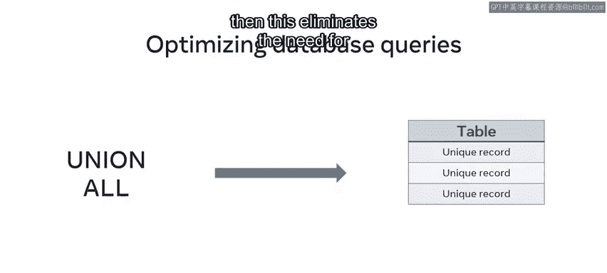

# 数据库工程师课程：P120：优化数据库选择语句 📊

在本节课中，我们将学习如何优化SQL中的`SELECT`语句，以确保数据库能够快速、高效地编译和执行查询。这对于处理大量数据、提升系统性能至关重要。

## 优化的重要性

当操作数据库时，确保SQL查询能被数据库快速高效地编译和执行非常重要。但这只有在查询本身被优化的情况下才能实现。在接下来的内容中，我们将探讨优化`SELECT`语句的技术。

Luc Shrub公司收到了大量客户订单，这导致其数据库中的数据量激增。他们需要使用`SELECT`语句来查询这些数据。为了提高查询性能，他们必须确保这些语句是经过优化的。

## 优化指南与核心技术

正如你可能已经知道的，`SELECT`语句属于SQL语句中的数据检索类别。这类语句旨在从数据库中返回数据。但如果它们没有被正确优化，就会给数据库增加额外负载，拖慢其性能。这意味着数据库执行你的SQL`SELECT`语句或查询所需的时间会更长，并返回你需要的数据。

然而，你可以遵循一些基本的指南或最佳实践来优化你的`SELECT`语句。你可能已经熟悉其中的一些方法。

以下是优化`SELECT`语句的核心指南列表：

*   **在`SELECT`子句中仅指定所需列**：避免使用`SELECT *`。
*   **避免在谓词中使用函数**：尤其是在涉及未索引列或会阻止索引使用的场景。
*   **避免在谓词中使用前导通配符**：例如在`LIKE`操作符的模式开头使用`%`。
*   **尽可能使用`INNER JOIN`**：它比`OUTER JOIN`更高效。
*   **仅在必要时使用`DISTINCT`和`UNION`**：考虑使用`UNION ALL`来提升速度。

## 优化技巧详解


上一节我们介绍了优化的核心指南，本节中我们来详细看看每个技巧的具体应用和原因。

### 1. 指定具体列而非使用通配符

查询表时，你可能经常在`SELECT`语句中使用星号（`*`）来提取所有可用数据。然而，指示MySQL查询表中的所有数据会给数据库增加额外负载并降低其性能，特别是当你只需要特定列的数据时。

一个更优的方法是，在语句中仅列出你所需数据所在的列，而不是使用星号。

```sql
-- 不推荐
SELECT * FROM orders;

-- 推荐
SELECT order_id, customer_name, order_date FROM orders;
```

Luc Shrub公司可以使用此方法，精准定位其订单表中的所需数据，从而更快地返回数据。

### 2. 避免在谓词中对列使用函数

数据库工程师常犯的另一个错误是在谓词中使用引用未索引列的MySQL函数。谓词是返回真或假值的表达式，`WHERE`子句条件就是其典型例子。你也应避免在`WHERE`子句中对已索引的列使用函数，因为这会导致数据库无法使用该索引。

```sql
-- 不推荐（假设`order_date`列有索引）
SELECT * FROM orders WHERE YEAR(order_date) = 2023;

-- 推荐
SELECT * FROM orders WHERE order_date >= '2023-01-01' AND order_date < '2024-01-01';
```

我们将在本课后面更详细地探讨索引。

### 3. 谨慎使用通配符

在谓词中使用前导通配符也会导致数据库速度下降。一个例子是在`WHERE`子句中结合`LIKE`操作符使用以通配符开头的模式。

```sql
-- 不推荐（前导通配符阻止索引使用）
SELECT * FROM products WHERE product_name LIKE '%shrub';

-- 推荐（如果可能）
SELECT * FROM products WHERE product_name LIKE 'lucky%';
```

当搜索匹配带有前导通配符的模式时，MySQL无法在搜索过程中使用该列的索引。

### 4. 优先使用INNER JOIN

另一种优化数据库的方法是在可能的情况下使用`INNER JOIN`代替`OUTER JOIN`。`OUTER JOIN`会检索两个表中的所有记录，包括那些不包含匹配值的行。这需要MySQL花费更长时间来处理。

`INNER JOIN`则更高效，因为它只从两个表中检索必要的数据或匹配的记录。这有助于优化你的查询。

```sql
-- 假设我们只需要有订单的客户信息
-- 使用INNER JOIN
SELECT c.customer_id, c.name, o.order_id
FROM customers c
INNER JOIN orders o ON c.customer_id = o.customer_id;
```

### 5. 明智使用DISTINCT和UNION

在创建SQL查询时，你经常会使用`DISTINCT`子句来消除重复值，或使用`UNION`子句来合并多个查询结果。这会减慢查询速度，因为它必须执行排序操作并消除重复记录。

但是，如果你使用`UNION ALL`代替，则可以省去排序操作，从而加快执行过程。

```sql
-- UNION 会去重和排序
SELECT city FROM suppliers
UNION
SELECT city FROM customers;

-- UNION ALL 更快，但可能包含重复项
SELECT city FROM suppliers
UNION ALL
SELECT city FROM customers;
```



## 总结

本节课中，我们一起学习了如何优化MySQL的`SELECT`查询，并熟悉了基本的优化指南。关键要点包括：精确指定查询列、避免在`WHERE`子句中滥用函数和通配符、优先选择`INNER JOIN`以及审慎使用`DISTINCT`和`UNION`。遵循这些最佳实践，将显著提升你的数据库查询效率。