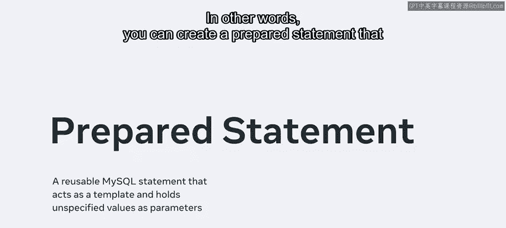
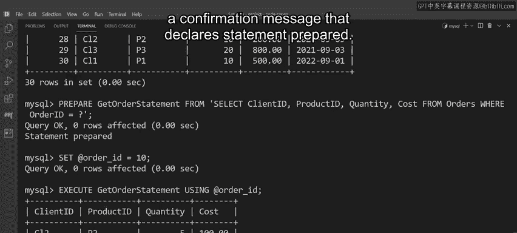
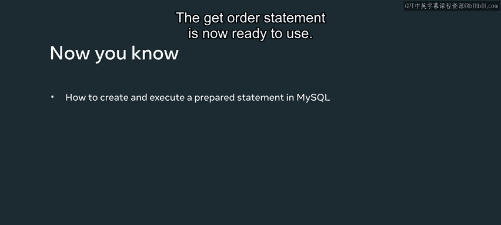

# Meta《数据库工程师（数据库简介／Git／MySQL）｜Meta Database Engineer》中英字幕 - P125：16_MySQL预处理语句.zh_en - GPT中英字幕课程资源 - BV1Vw4m1Z7tb

Each time you create a statement， it must be compiled and parsed by MysQql before it can be executed。

 This process uses a lot of resources。 A more efficient method is to create a prepared statement that can be used repeatedly without requiring clearance each time。

 In other words， you can create a prepared statement that MysqL compiles and pares just once before it's executed。

 The statement functions as a template that holds unspecified values as parameters。

 These values can then be added as required。 Each time the statement is invoked。

 MysQql knows it's safe to execute。 This is a much more efficient and optimal way of executing statement without using valuable Mysql resources。

 Let's look at an example of how to create an execute a prepared statement from the Lucky Srub database。

 Lucky shrub need to extract data on customer orders from their orders table。

 Let's help them carry out this task using an optd prepared statement。

 The prepared statement must return the following information from the orders table in the database for。

😊。

Each specified record， client I， product I， quantity and cost。

 The first step is to prepare the statement using the prepare command。 Then type the statement name。

 This can be a custom name。 In this instance， you can call the statement。 Get order statement。

 Then type the from keyword。 Foow this syntax with a select statement in single quotation marks。

 This select statement extracts the required data from the order table against a specified value。

 However， you might have noticed that the value is currently unspecified because it requires an input value。

 Later， you can enter any value you like to process the statement with a new argument。

 You don't have to wait for my SQL to compile and parse the statement。

 Click enter to execute the statement。 The database returns the output result。

 A confirmation message that declares statement prepared。

 The get order statement is now ready to use。 Next。

 you need to declare a variable named order I and assign it a specific order I。

 Let's use an I D of 10。 Now you can use。this variable with the prepared statement first。

 type the execute command followed by the statement name。

 This command is used to execute prepared statements。 Next。

 type the using keyword followed by the variable name。

 The using keyword specifies the variable value to be passed to the parameter in the prepared statement。

 So this prepared statement is basically instructing My SQL to extract the client I product I quantity and cost data associated with the order I 10 in the order table。

 click enter to execute the query and return the results。

 Although this prepared statement targeted the order I 10。

 you could also target any other order I from the order table。

 The statement can extract the related data and it doesn't have to wait until it is compiled by MySQL。

 you should now be able to create and execute a prepared statement in My SQL。 Well done。😊。

