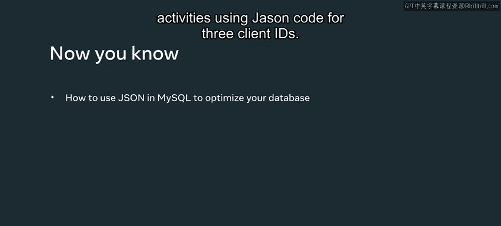

# Meta《数据库工程师（数据库简介／Git／MySQL）｜Meta Database Engineer》中英字幕 - P126：17_MySQL JSON.zh_en - GPT中英字幕课程资源 - BV1Vw4m1Z7tb

As a database engineer， you need to work with many different types of data。

 This can place a lot of pressure on MysQql's resources as it compiles and pars through these different data types。

 One method of optimizing My SQl's use of resources is to store data using the Json or jascript object notation data type。

 JOson is an easy method of communicating data between different database systems。

 and it stores data in a simple text format that doesn't require any special parsing。

 Here is an example of a line of Json code from the Luc shrugr database。

 Lucky shrub use this line of code to store properties and assign them specific values。

 This line of code is placed within a pair of single quotation marks and curly braces within the insert intostate。

😊。

Each property and value are typed in double quotation marks and separated by a colon。

These are known as key value pairs。 Each pairing is separated by a comma。

 Let's explore how Lucky Srub makes use of this Mysql Json code in their database。

 Lucky Shrub need to track the actions of clients who use the online store as they browse lucky shrub products and place orders。

😊，Lishrub can capture this information and store it in Json format in My SQL。

 My SQL can then quickly and efficiently process this data。 First。

 create a table called activity that stores client activity。 Then create two columns。

 The first column is called activity I D and provides a unique identifier for each client activity using an integer data type。

 The second column is called properties。 This is a Json data type column。

 It stores the properties of each client activity like client I D and product I D。

 It also records if the client has placed an order by placing either a true or false value next to the order property。

😊，The next step is to populate the table with data。

 createate three activity Is and then log client activities using Json code for three client Ids。

 Two of these clients have ordered products。 One client has not ordered a product。 Now。

 you need to retrieve data from the properties column Since you're working with the Json data type。

 you need to retrieve or access this data using a column path operator。

 type a select statement that selects the activity Id and properties columns for the properties columns。

 use the dollar sign symbol and dot notation to denote each element inside the Json property。

 Place the column path operator between the columns and their elements。 Finally。

 execute the statement to return the output results from the activity table。

 You've now helped Luc shrugr to create an optimal method of storing an accessing data from the activity table in their database。

 You should now be familiar with how to use Json in MysQL to optimize the database。 Great work。😊。

