# Meta《数据库工程师（数据库简介／Git／MySQL）｜Meta Database Engineer》中英字幕 - P127：18_模块小结 数据库优化.zh_en - GPT中英字幕课程资源 - BV1Vw4m1Z7tb

Congratulations， you've reached the end of the second module in this course。

 Let's take a moment to recap some of the key skills you've gained in this module's lessons。😊。

In the first lesson， you learned how to optimize database queries。

 and you now understand that database optimization is the process of maximizing the speed and efficiency of the database's performance when executing queries。

 You know that optimization focuses on two different kinds of statements。

 data retrieval or select statements which return data from the database and data change statements。

 Use to alter data within the database。 You learned that by optimizing a database。

 you can process data much more quickly and efficiently。 During this lesson。

 you also learned how to implement different optimization techniques on select queries。

 including targeting only required columns in your select clause。

 avoiding the use of functions in predicates and avoiding the use of a leading wildcard in predicates。

 You also learned to use inner join where possible。

 and make use of distinct and union clauses only when necessary。

 and you also explored the use of indexes to help maintain。😊。

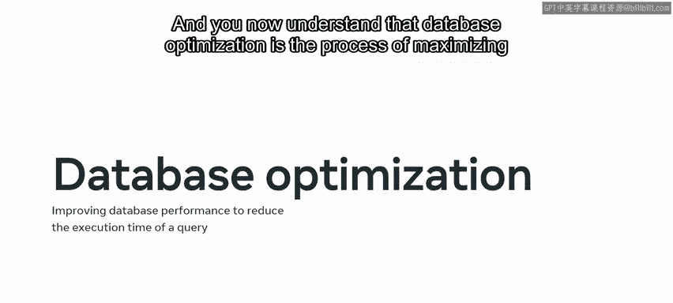

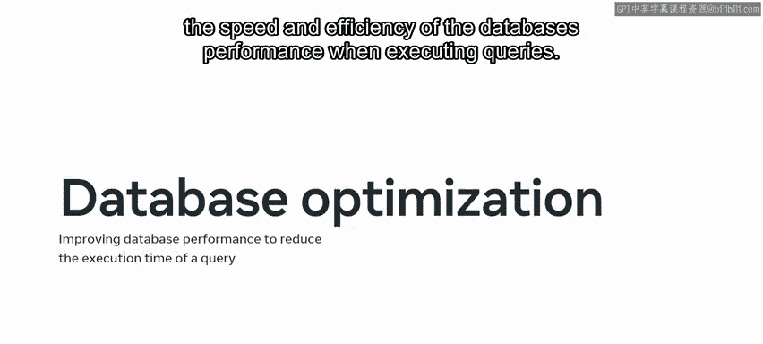

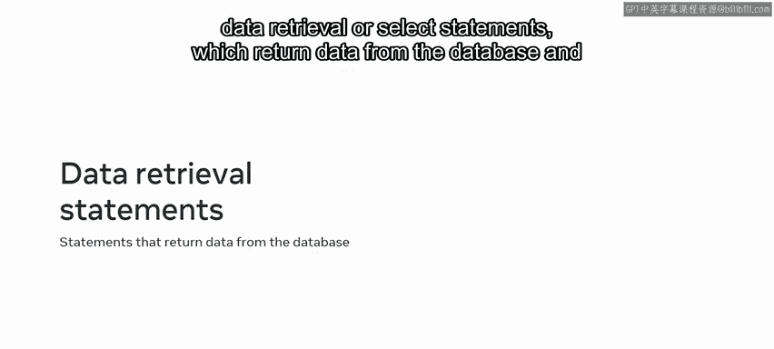

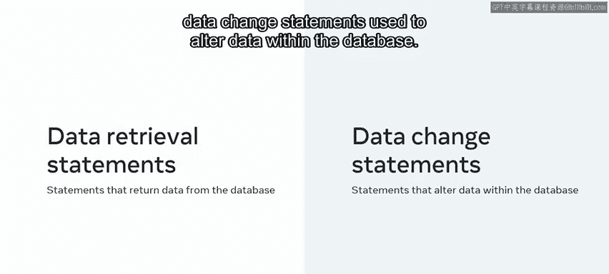

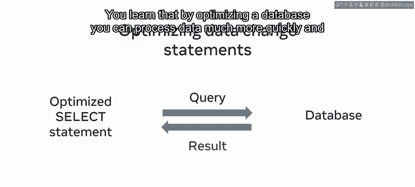

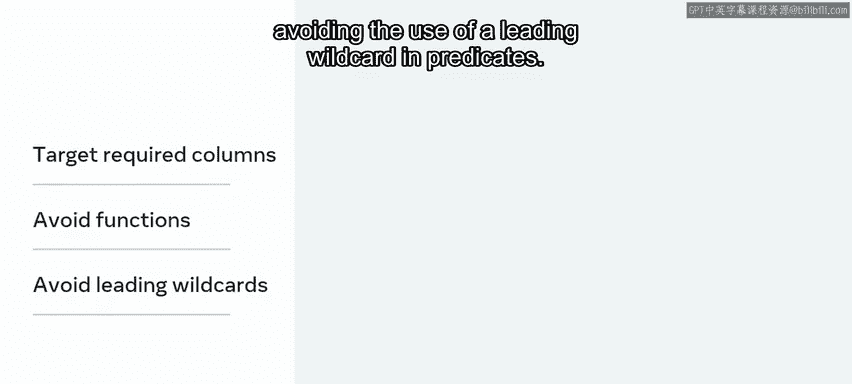

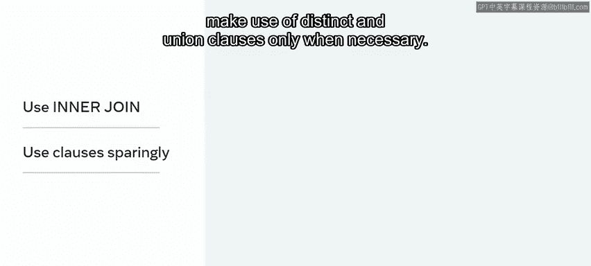

Pointers that lead to sorted data during your study of indexes。

 you learned that there are two types of indexes。 The first is a primary index also called a clustered index。

 The second is a secondary or noncled index。 And you then review the syntax for creating a secondary index。

 This involves using a create index statement， a custom index name。

 and the on keyword to target the required table and columns。

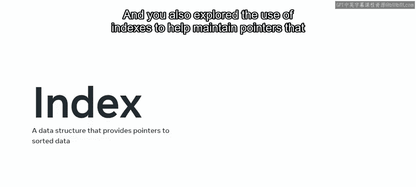

In lesson 2， you explored further optimization techniques。 Now that you've completed this lesson。

 you're able to make use of MysQL transaction statements to manage queries and roll the database back to its original state if any of the queries fail to execute as required。

 you can manage database transaction using statements like start transaction， begin or begin work。

 commitit and roll back。 you can start your transaction using start transaction。

 And you know that if you encounter an error with your queries。

 you can add the rollback statement to the end of your SQL statements to return to your start transaction point。

😊。

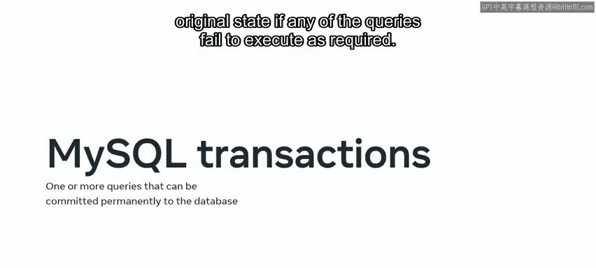

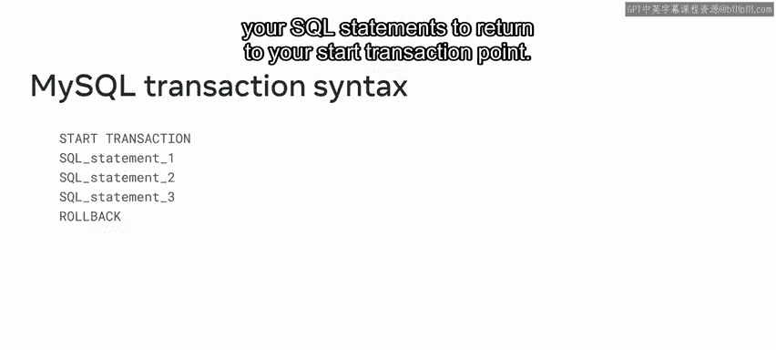

As you worked through this lesson， you also learned how to optimize select queries using MysQL common table expressions。

 You can now use S CT TE to compile complex queries into simple blocks of code。

 These blocks can then be used to rewrite the query by calling the C T E when required。

 This simplifies the query and makes it much easier to read and maintain。😊。

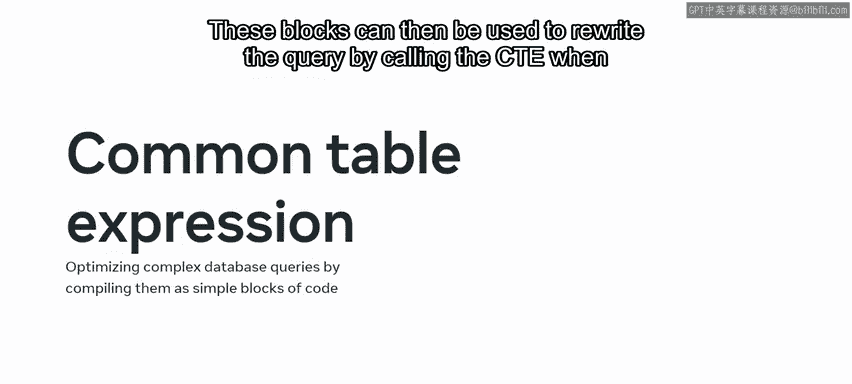

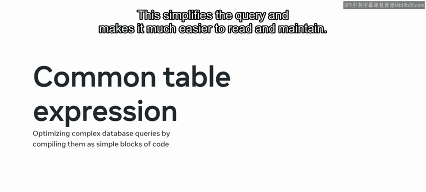

Start your code block using the width clause， then list the queries underneath。

 finally type your select statement followed by the query name。😊。

You can also execute multiple CteE at once using the union operator between statements。

 You then explored MysqL prepared statements。 You could now make use of prepared statements to limit the number of times Mysql must compile and parse code。

 and you discovered how to interact with a Mysql database using the JO data type As you worked through these lessons。

 you also enhanced your understanding of the topics through reading items。

 tested your knowledge of optimization techniques in quiz environments and demonstrated your ability to make use of Mysql optimization techniques in a lab environment。

 Having completed this module， you should now be able to make use of a wide range of database optimization techniques。

 you can deploy these techniques to make sure that your statements are compiled。

 parsed and executed quickly and efficiently in Mysql。 Great work。😊。

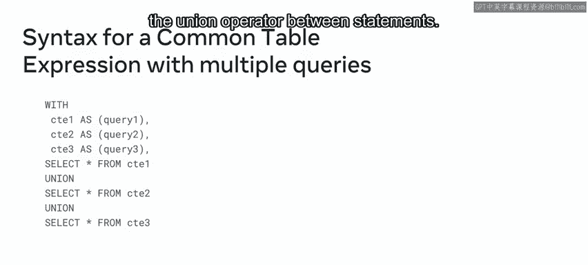

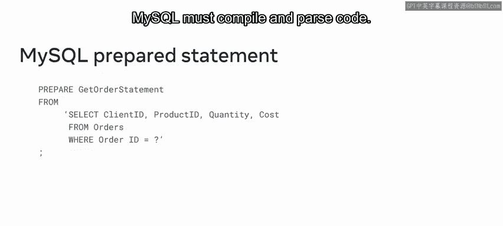

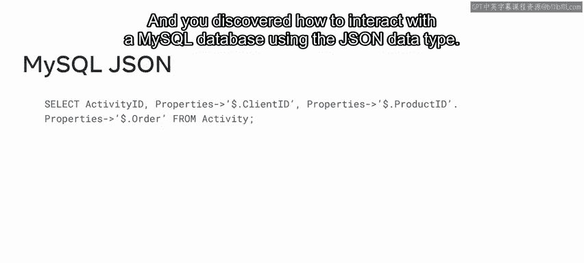

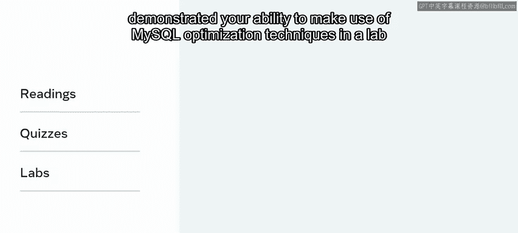