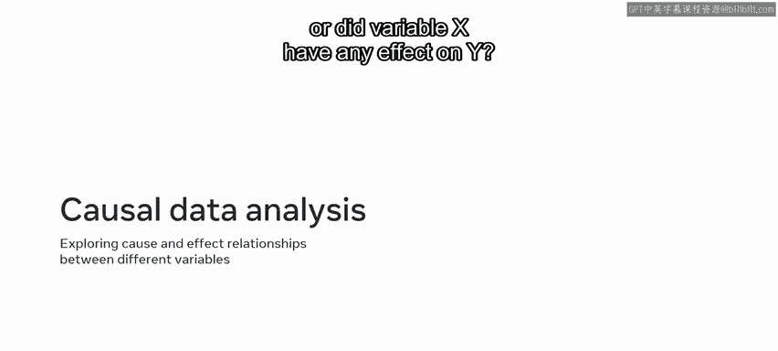
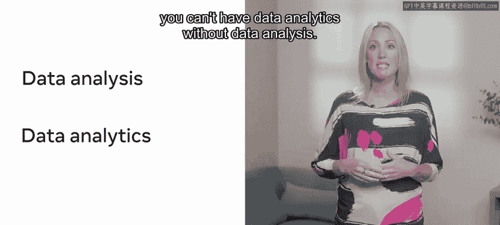

# Meta《数据库工程师（数据库简介／Git／MySQL）｜Meta Database Engineer》中英字幕 - P128：19_数据库分析概述.zh_en - GPT中英字幕课程资源 - BV1Vw4m1Z7tb

At this stage of the course， you should be familiar with the role that data analysis plays in databases。

 but it's also important to understand the close relationship between data analysis and data analytics with data analytics。

 You can take the data collected during data analysis and convert it into useful information that can inform future business decisions。

 Over the next few minutes， you'll explore how this works and learn about different types of data analysis。

 Lucy Shrub have had a great holiday sales season。 They've collected a lot of data around their sales。

 They now need to use this data to help plan for their next sales period。

 Lucy Shrub can use data analytics and related variables to make sense of this data and plan effectively for the future。

 So Lucy Shrubb's use of data provides a good base for understanding what the term data analytics means。

 Data analytics involves taking data analysis a step further by converting and processing the collected data into useful and meaningful information information。

😊，I then used to inform and make predictions about future events。

Data analytics also involves the use of special tools。

 which you'll explore briefly later in this lesson。

 So your next question is most likely how do organizations make use of data analytics。

 Over at lucky shrub， they can make use of their data with data analysis tools to predict what products sell best and should be kept in stock。

 What kind of special offers attract the most customers and how best to manage their online sales。

 However， before you can perform data analytics you first need to analyze and generate insights into the data you've collected。

 This data is collected through data analysis and SQL queries。

 There are different types of data analysis that can be performed within a database。

 Let's take a few moments to explore these different types of data analysis and learn how they inform data analytics。

 Descriptive data analysis presents data in a descriptive format。 In other words。

 it describes what happened。 You can use the data extracted from a database to explain a particular event。

 for example。😊，Lucky shhrub can analyze their sales over a specific period。

 They can then describe the period using this data by referring to top sellingel products and profits that they made。

 Exploratory data analysis is the attempt to establish a relationship between different variables in a database。

 In other words， is there a relationship between variables A and B。

 or can you establish a link between variables X and Y。 Over Lucky shhrub。

 they use exploratory data analysis to determine if there's any correlation between an increase in sales for specific product。

 and the season in which it's sold。 Like an increase in the sale of trees during the holiday season。

 Inferential data analysis focuses on a small sample of data to make inferences about a larger data population and draw general conclusions。

 Lucky shhrub often make use of inferential data analysis。

 Their data shows an increase in the sale of barbecue products over the summer months。

 So they can infer that this is the best period in which to sell these goods。😊。

Predictive data analysis uses existing or legacy data to identify paradigms and patterns。

 These patterns can then be used to make predictions about future performance。 For example。

 Lucky Shru's data show that the sale of gardening tools increases when these items are discounted。

 They can use this data to predict that further discounts will lead to more sales。

 And this also causal data analysis， which explores the cause and effect of relationships between different variables。

 Did variable A cause B， or did variable X have any effect on Y Lucy shhru's data show that many customers who bought gardening tools also bought outdoor lighting products。

 causal data analysis is a great way for lucky shrub to try and identify the relationship between these purchases。

 Finally， know that data engineers often use the terms data analysis and data analysis interchangeably。

 Although separate concepts， they are closely linked。

 you can't have data analytics without data analysis。 So be aware。😊。

Of this fact， when working with data analytics， you should now understand the concept of data analytics and be able to recognize different types of data analysis。

 Well done。