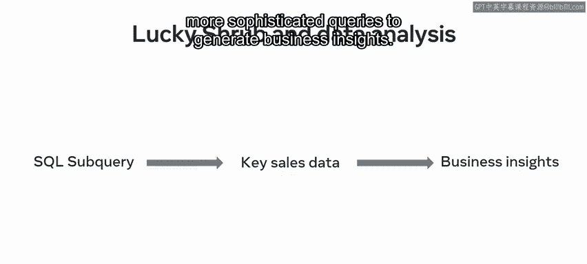
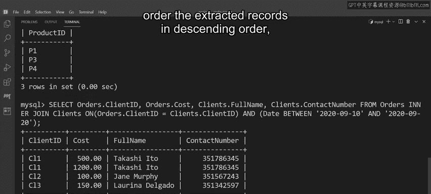

# Meta《数据库工程师（数据库简介／Git／MySQL）｜Meta Database Engineer》中英字幕 - P130：21_使用SQL查询在MySQL中进行数据分析.zh_en - GPT中英字幕课程资源 - BV1Vw4m1Z7tb

Analyzing data in a MysQL database requires a good understanding of how to access data and extract relevant information using SQL queries。

 You should already be familiar with many of these like subqueries， joins and views。

 Over the next few minutes， youll learn about the role that these SQL queries play in the data analysis process。

 Over at Luc shhrub， they need to perform data analysis on the client orders within their database。

 However， the types of data analysis they need to perform are very different。

 They include simple data extraction tasks using basic SQL queries and tasks that involve advanced subqueries。

 joining tables and creating virtual ones。 Once these tasks are completed and the required data is extracted。

 they can analyze it and prepare it for data analytics。😊。

Let's explore the relationship between SQL queries and the data analysis process to find out more about how they support Lucky Shrubb's business。

 As you should already know， data analysis involves collecting and presenting the data in your database。

 The data can then be used to gather further insights to support the data analytics process in My SQL。

Data can be collected from a database using a wide range of SQL queries at this stage of the course。

 you should be familiar with many of these SQL queries。 For example。

 you can extract or collect data using joins to join two tables together subqueries to create a query within a query and views to create virtual tables。

 You can also use functions to perform sophisticated operations and return different results and filter required data using operators。

 So the basic process for performing data analysis in MySQL using SQL queries works as follows。😊。

You can extract the required data from your database using a wide range of one or more SQL queries。

 You can then use further SQL queries to present a description of the results of your data analysis。

 and you can then gain further insight from these initial results using data analytics。

 Let's explore an example of this process。 Lucky shhrub need a list of all products that sell in quantities of 100 items or more。

 They can extract this data using a subquery that targets the tables that hold the data and filters the required results。

 Once they execute the subquery。 My SQL returns the records that they need a list of the topselling products。

 Once luckyky shrub identify their topsel products。

 They can then use different types of SQL queries and data analytics tools to generate further insights and plan for the business's future。

 All these insights and potential strategies are made possible by the data collected through SQL queries。

 For example， now that they know what their bestselling products are。

 they can continue to buy more of them。 and they can buy less of。😊，Products that don't sell as well。

 They could even offer discounts on certain items to try and increase sales。

 So to recap this process， Lucky Srub create a SQL subquery to target the data they require。

 They then extract this data from the database through data analysis。

 and this data can then be explored further using more sophisticated queries to generate business insights。

 Now that you're familiar with this process， it's time to put it into action。

 As you discovered a few moments ago。 Lucky Srub need to perform data analysis on their client orders。

 Let's see if you can help them out。 The data that Lucky Shr require is in the orders table in their database。

 They've extracted the data from the table， but they now need to target specific data that provides insight into the performance of the business。

 For example， Lucky Srub need a list of all products that sold 10 items or more。

 You can extract this data with a select statement that targets the order tables product I column。

 Then add a where clause that targets any product I D that has sales data。😊。

Next， add a sub queryry that selects product Ids from the orders table that's sold in a quantity equal to or greater than 10。

 Ex the statement to extract the data。 MysQqL outputs a table that displays the required records。

 Joins are also a useful method of performing data analysis in MysQqL。

 You can use different kinds of joins to explore the relationships that exist between data。

 Lucy Shrub， you to analyze and extract data on their clients and the orders they placed over the last 10 days。

 However， the data exists in two separate tables。 You can help them analyze the data in these tables using joins。

 Write a select statement to join the required columns from the orders and products tables using an inner join。

😊，Then use the between keyword to filter the client IDs and related orders from the required dates。

 Ex the statement to show the required data。Views are also helpful for analyzing data。

 They can be used to create virtual tables that focus on specific types of data。

 Lucky shhrub need to analyze their sales data and extract the top five bestselling products。

 You can use a select statement and a virtual table or view to help Lucky shrub analyze their data for this information。

 Write create view statement Call the new virtual table top products。

 Then write a select statement that uses an inner join to combine the required columns from the products and orders tables。

 These tables hold all the sales data you need to help Luc shrub carry out their analysis。 Finally。

 use an order by clause to order the extracted records in descending order。

 Then execute the statement。 The statement creates a new virtual table called top products that shows the name。

 quantity and cost of the top five bestselling products。

 You can use a select statement to extract all data in this virtual table to perform further data analysis。

😊。

All these insights and potential strategies are made possible by the data collected through SQL queries and what SQL queries you use all depends on what data you need to extract and analyze and what you want to achieve from this analysis。

 You should now be familiar with performing data analysis in My SQL using SQL queries。 Great work。😊。

